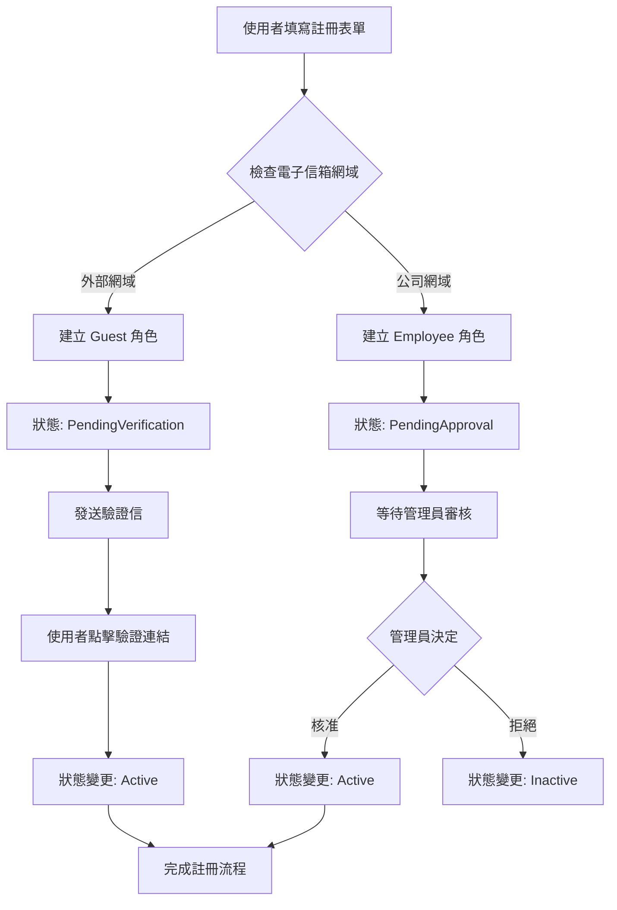
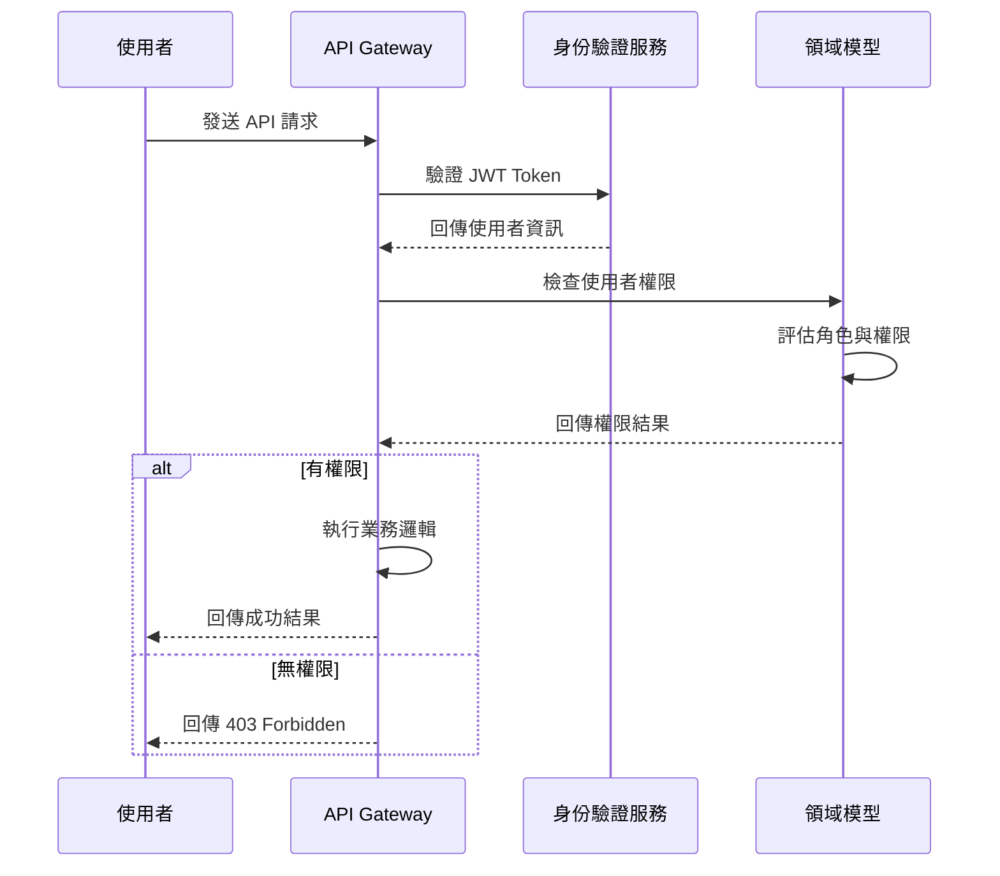

# DevAuth 專案分析文件

## 專案概述

### 專案定位

**DevAuth** 是一個專為軟體開發環境設計的全方位身份驗證與授權系統。系統採用 Domain-Driven Design (DDD) 架構，使用 .NET Core 8 和 PostgreSQL 構建，旨在為軟體開發團隊提供統一、安全、可擴展的身份管理解決方案。

### 核心價值主張

1. **統一身份管理**: 為開發團隊提供單一登入點，整合各種開發工具和平台
2. **細粒度權限控制**: 支援複雜的角色權限體系，適應不同開發情境需求
3. **開發者友好**: 提供完整的 API 和 SDK，方便與現有開發工具整合
4. **企業級安全**: 實作現代身份驗證標準，確保系統安全性

### 技術架構

```
┌─────────────────────────────────────────────────────────┐
│                    Presentation Layer                   │
│  ┌─────────────┐  ┌─────────────┐  ┌─────────────────┐ │
│  │   Web API   │  │   MVC UI    │  │   Mobile API    │ │
│  │ Controllers │  │ Controllers │  │   Endpoints     │ │
│  └─────────────┘  └─────────────┘  └─────────────────┘ │
└─────────────────────────────────────────────────────────┘
                            │
┌─────────────────────────────────────────────────────────┐
│                   Application Layer                      │
│  ┌─────────────┐  ┌─────────────┐  ┌─────────────────┐ │
│  │   Commands  │  │   Queries   │  │   Validators    │ │
│  │  Handlers   │  │  Handlers   │  │                 │ │
│  └─────────────┘  └─────────────┘  └─────────────────┘ │
└─────────────────────────────────────────────────────────┘
                            │
┌─────────────────────────────────────────────────────────┐
│                     Domain Layer                         │
│  ┌─────────────┐  ┌─────────────┐  ┌─────────────────┐ │
│  │   Entities  │  │ Value       │  │   Domain        │ │
│  │ Aggregates  │  │ Objects     │  │   Events        │ │
│  └─────────────┘  └─────────────┘  └─────────────────┘ │
└─────────────────────────────────────────────────────────┘
                            │
┌─────────────────────────────────────────────────────────┐
│                 Infrastructure Layer                     │
│  ┌─────────────┐  ┌─────────────┐  ┌─────────────────┐ │
│  │ Data Access │  │  External   │  │   Cross-cutting │ │
│  │ Repository  │  │  Services   │  │    Concerns     │ │
│  └─────────────┘  └─────────────┘  └─────────────────┘ │
└─────────────────────────────────────────────────────────┘
```

## 業務需求分析

### 核心業務領域

#### 1. 使用者身份管理

**業務目標**: 提供安全、高效的使用者身份驗證與管理機制

**功能需求**:
- 使用者註冊與電子信箱驗證
- 多因子身份驗證 (MFA)
- 密碼策略管理與重置
- 使用者資料維護與更新
- 帳戶安全監控與異常偵測

**非功能需求**:
- 註冊流程在 3 秒內完成
- 支援每秒 1000 次並發登入請求
- 99.9% 的系統可用性
- 符合 GDPR 資料保護規範

#### 2. 角色權限體系

**業務目標**: 建立靈活且安全的權限控制機制

**角色定義與權限對應**:

| 角色類型 | 英文名稱 | 權限範圍 | 使用情境 |
|---------|----------|----------|----------|
| **訪客** | Guest | 基礎瀏覽權限 | 外部合作夥伴、潛在客戶、試用使用者 |
| **員工** | Employee | 開發相關權限 | 一般開發人員、QA 工程師、設計師 |
| **主管** | Manager | 團隊管理權限 | 專案經理、技術主管、部門主管 |
| **系統管理員** | SystemAdmin | 完整系統權限 | IT 管理員、系統運維人員 |

**權限細分**:

1. **基礎權限 (Guest Level)**
   - `ViewPublicProjects`: 檢視公開專案
   - `ViewPublicDocuments`: 檢視公開文件
   - `SubmitFeedback`: 提交意見反馈
   - `UpdateOwnProfile`: 更新個人資料

2. **員工權限 (Employee Level)**
   - 包含所有基礎權限，額外包括：
   - `ViewPrivateProjects`: 檢視內部專案
   - `CreateProjects`: 建立新專案
   - `EditAssignedProjects`: 編輯指派專案
   - `JoinTeams`: 加入開發團隊
   - `InviteToTeam`: 邀請其他人加入團隊
   - `ViewTeamMembers`: 檢視團隊成員
   - `AccessDevelopmentTools`: 存取開發工具

3. **主管權限 (Manager Level)**
   - 包含所有員工權限，額外包括：
   - `CreateTeams`: 建立開發團隊
   - `ManageTeamMembers`: 管理團隊成員
   - `ApproveProjectCreation`: 核准專案建立
   - `DeleteProjects`: 刪除專案
   - `ViewAllProjects`: 檢視所有專案
   - `ManageDirectReports`: 管理直屬下級
   - `ApproveTimeOff`: 核准請假申請
   - `ViewTeamReports`: 檢視團隊報表

4. **系統管理員權限 (SystemAdmin Level)**
   - 包含所有上述權限，額外包括：
   - `ManageAllUsers`: 管理所有使用者
   - `ManageAllTeams`: 管理所有團隊
   - `ManageAllProjects`: 管理所有專案
   - `SystemConfiguration`: 系統設定管理
   - `ViewAuditLogs`: 檢視稽核日誌
   - `ManageRolesAndPermissions`: 管理角色與權限

#### 3. 團隊與專案管理

**業務目標**: 支援敏捷開發團隊的組織結構管理

**團隊角色體系**:
- **Member**: 一般團隊成員
- **Senior**: 資深團隊成員
- **Junior**: 初級團隊成員
- **Lead**: 團隊領導者

**專案角色體系**:
- **Developer**: 開發工程師
- **TechLead**: 技術負責人
- **ProjectManager**: 專案經理
- **Tester**: 測試工程師
- **Designer**: 設計師

### 業務流程分析

#### 使用者註冊與認證流程



#### 權限檢查流程



## 系統架構設計

### DDD 架構層次

#### 1. Presentation Layer (展示層)
- **責任**: 處理使用者介面和外部介面
- **元件**: Controllers, DTOs, API Endpoints
- **技術**: ASP.NET Core Web API, Swagger/OpenAPI

#### 2. Application Layer (應用層)
- **責任**: 協調領域物件執行業務用例
- **元件**: Command/Query Handlers, Validators, Services
- **技術**: MediatR, FluentValidation

#### 3. Domain Layer (領域層)
- **責任**: 核心業務邏輯和規則
- **元件**: Entities, Value Objects, Domain Events, Repositories
- **原則**: 無外部依賴，純粹的業務邏輯

#### 4. Infrastructure Layer (基礎設施層)
- **責任**: 技術實作和外部整合
- **元件**: Database Access, External APIs, Logging, Caching
- **技術**: Entity Framework Core, PostgreSQL

### 領域模型設計

#### 核心聚合根 (Aggregate Root)

**User 聚合**:
```csharp
public sealed class User : AggregateRoot<UserId>
{
    // 核心屬性
    public Username Username { get; private set; }
    public Email Email { get; private set; }
    public string FirstName { get; private set; }
    public string LastName { get; private set; }
    public UserRole Role { get; private set; }
    public UserStatus Status { get; private set; }

    // 關聯集合
    public IReadOnlyCollection<TeamMembership> TeamMemberships { get; }
    public IReadOnlyCollection<ProjectMembership> ProjectMemberships { get; }

    // 業務方法
    public void VerifyEmail() { ... }
    public void Approve(UserId approvedBy) { ... }
    public void ChangeRole(UserRole newRole, UserId changedBy) { ... }
    public bool HasPermission(Permission permission) { ... }
}
```

#### 值物件 (Value Objects)

**UserRole 值物件**:
```csharp
public sealed class UserRole : ValueObject
{
    public UserRoleType Type { get; }
    public DateTime AssignedAt { get; }
    public UserId? AssignedBy { get; }

    public bool HasPermission(Permission permission) { ... }
}
```

#### 領域事件 (Domain Events)

系統定義了以下關鍵領域事件：

1. **UserCreatedEvent**: 使用者建立時觸發
2. **UserEmailVerifiedEvent**: 電子信箱驗證完成
3. **UserApprovedEvent**: 使用者審核通過
4. **UserRejectedEvent**: 使用者審核拒絕
5. **UserRoleChangedEvent**: 使用者角色變更
6. **UserLoggedInEvent**: 使用者登入記錄
7. **UserActivatedEvent** / **UserDeactivatedEvent**: 帳戶狀態變更

## 現有功能分析

### 已實現功能

#### 1. 使用者註冊功能

**技術實作**:
- `RegisterUserCommand`: 註冊命令定義
- `RegisterUserCommandHandler`: 命令處理器
- `RegisterUserCommandValidator`: 輸入驗證器
- `RegisterUserResponse`: 回應模型

**業務邏輯**:
- 自動判斷使用者角色（基於電子信箱網域）
- 密碼雜湊處理
- 重複帳戶檢查
- 領域事件發布

**API 端點**:
```http
POST /api/users/register
Content-Type: application/json

{
    "username": "string",
    "email": "string",
    "firstName": "string",
    "lastName": "string",
    "password": "string",
    "confirmPassword": "string"
}
```

#### 2. 資料持久化

**Entity Framework Core 配置**:
- `UserConfiguration`: 使用者實體配置
- `ApplicationDbContext`: 資料庫上下文
- `UserRepository`: 資料存取層

**資料庫 Migration**:
- 初始資料表結構已建立
- 索引和約束正確配置
- 支援多對多關係管理

### 需要完善的功能

#### 1. 使用者登入功能

**需求規格**:
- JWT Token 身份驗證
- 支援使用者名稱/信箱登入
- 密碼驗證與安全檢查
- 登入失敗次數限制
- 多裝置會話管理

**建議實作**:
```csharp
public sealed record LoginCommand(
    string UsernameOrEmail,
    string Password,
    bool RememberMe = false) : ICommand<Result<LoginResponse>>;

public sealed record LoginResponse(
    string AccessToken,
    string RefreshToken,
    DateTime ExpiresAt,
    UserDto User);
```

#### 2. 電子信箱驗證

**需求規格**:
- 註冊後自動發送驗證信
- 驗證連結有效期管理
- 重新發送驗證信功能
- 驗證成功後狀態更新

#### 3. 密碼管理

**需求規格**:
- 密碼重置功能
- 密碼強度策略
- 密碼歷史記錄
- 定期密碼更新提醒

#### 4. 使用者管理介面

**管理員功能**:
- 使用者列表與搜尋
- 批次操作（核准/拒絕/停用）
- 角色指派與變更
- 稽核日誌檢視

## 技術債務與改善建議

### 程式碼品質

#### 1. 測試覆蓋率
**現狀**: 缺乏單元測試和整合測試
**建議**:
- 建立完整的測試套件
- 設定 80% 以上的程式碼覆蓋率目標
- 實作 API 自動化測試

#### 2. 錯誤處理
**現狀**: 基礎的錯誤處理機制
**建議**:
- 統一例外處理策略
- 結構化錯誤回應格式
- 詳細的錯誤日誌記錄

#### 3. 效能監控
**現狀**: 缺乏效能監控機制
**建議**:
- 整合 Application Insights
- 資料庫查詢效能監控
- API 回應時間追蹤

### 安全性加強

#### 1. 身份驗證增強
- 實作 JWT Refresh Token 機制
- 多因子身份驗證 (MFA)
- OAuth 2.0/OpenID Connect 支援
- API Rate Limiting

#### 2. 資料保護
- 敏感資料加密
- 個人資訊去識別化
- GDPR 合規性檢查
- 資料稽核追蹤

## 未來發展規劃

### 第一階段: 核心功能完善 (1-3個月)

#### 優先級 1 (P0)
1. **使用者登入系統**
   - JWT 身份驗證
   - 密碼驗證
   - 會話管理

2. **電子信箱驗證**
   - 驗證信發送
   - 連結驗證處理
   - 重新發送機制

3. **密碼管理**
   - 密碼重置
   - 安全策略實施
   - 密碼強度檢查

#### 優先級 2 (P1)
1. **管理介面開發**
   - 使用者管理頁面
   - 角色權限設定
   - 系統設定介面

2. **API 文件與測試**
   - Swagger 文件完善
   - Postman 測試集合
   - API 版本控制

### 第二階段: 企業級功能 (3-6個月)

#### 團隊與專案管理
1. **團隊管理系統**
   - 團隊建立與維護
   - 成員邀請與管理
   - 團隊權限設定

2. **專案權限整合**
   - 專案存取控制
   - 細粒度權限管理
   - 專案成員分配

#### 整合與擴展
1. **第三方整合**
   - Active Directory 整合
   - LDAP 支援
   - Single Sign-On (SSO)

2. **API Gateway 整合**
   - 微服務架構準備
   - 服務發現機制
   - 負載平衡支援

### 第三階段: 進階功能與優化 (6-12個月)

#### 安全性提升
1. **進階身份驗證**
   - 多因子驗證 (MFA)
   - 生物識別支援
   - 風險評估引擎

2. **合規性支援**
   - SOC 2 準備
   - ISO 27001 對應
   - 稽核報告自動化

#### 分析與智慧化
1. **使用者行為分析**
   - 存取模式分析
   - 異常行為偵測
   - 個人化體驗

2. **營運儀表板**
   - 即時監控面板
   - 效能指標追蹤
   - 商業智慧報表

## 部署與運維規劃

### 環境規劃

#### 開發環境 (Development)
- **用途**: 開發人員日常開發與測試
- **配置**: 本地 PostgreSQL、基礎功能
- **資料**: 模擬測試資料

#### 測試環境 (Staging)
- **用途**: 功能測試、整合測試、效能測試
- **配置**: 生產級配置的縮小版
- **資料**: 去識別化的生產資料複本

#### 生產環境 (Production)
- **用途**: 正式服務提供
- **配置**: 高可用性、負載平衡、備份機制
- **監控**: 完整的監控和警報系統

### CI/CD 流水線

```yaml
# 建議的 GitHub Actions 工作流程
name: DevAuth CI/CD Pipeline

on:
  push:
    branches: [main, develop]
  pull_request:
    branches: [main]

jobs:
  test:
    runs-on: ubuntu-latest
    steps:
      - uses: actions/checkout@v3
      - name: Setup .NET
        uses: actions/setup-dotnet@v3
        with:
          dotnet-version: '8.0.x'
      - name: Restore dependencies
        run: dotnet restore
      - name: Run tests
        run: dotnet test --collect:"XPlat Code Coverage"
      - name: Code coverage report
        uses: codecov/codecov-action@v3

  build:
    needs: test
    runs-on: ubuntu-latest
    steps:
      - name: Build Docker image
        run: docker build -t devauth:latest .
      - name: Push to registry
        run: docker push devauth:latest
```

### 監控策略

#### 應用程式監控
- **健康檢查端點**: `/health`
- **指標收集**: Prometheus + Grafana
- **日誌聚合**: ELK Stack (Elasticsearch, Logstash, Kibana)
- **分散式追蹤**: Jaeger 或 Application Insights

#### 基礎設施監控
- **伺服器監控**: CPU、記憶體、磁碟使用率
- **資料庫監控**: 連線數、查詢效能、儲存使用量
- **網路監控**: 延遲、頻寬使用、錯誤率

## 結論與建議

### 專案現況評估

**優勢**:
1. ✅ 採用現代化 DDD 架構，程式碼結構清晰
2. ✅ PostgreSQL 資料庫設計良好，支援未來擴展
3. ✅ 基礎的使用者註冊功能已實作
4. ✅ 完整的角色權限體系設計

**需要改善**:
1. ⚠️ 缺乏完整的身份驗證機制
2. ⚠️ 測試覆蓋率不足
3. ⚠️ 缺乏生產級的安全性配置
4. ⚠️ 監控和日誌機制有待建立

### 下一步行動建議

#### 立即執行 (本週內)
1. 實作使用者登入 API 端點
2. 建立基礎的單元測試框架
3. 設定開發環境的資料庫 Seeding

#### 短期目標 (1個月內)
1. 完成電子信箱驗證功能
2. 建立 JWT 身份驗證中介軟體
3. 開發基礎的使用者管理介面

#### 中期目標 (3個月內)
1. 整合第三方身份提供者
2. 實作管理員審核工作流程
3. 建立完整的 API 文件

### 成功指標

#### 技術指標
- API 回應時間 < 200ms (P95)
- 系統可用性 > 99.9%
- 程式碼覆蓋率 > 80%
- 零安全性漏洞

#### 業務指標
- 使用者註冊轉換率 > 85%
- 平均登入時間 < 3 秒
- 客戶滿意度 > 4.5/5
- 支援團隊回應時間 < 2 小時

DevAuth 專案具有良好的技術基礎和清晰的業務目標，通過系統性的開發和持續改善，將能成為軟體開發團隊不可或缺的身份管理解決方案。