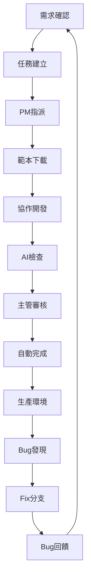

# 軟體開發專案管理平台 - 完整需求分析

## 🎯 專案概述

### 核心概念
創建一個整合式軟體開發專案管理平台，簡化 Asana 複雜架構，專為軟體開發團隊設計的一站式解決方案。

### 專案定位轉變
- **原始範疇**: DevAuth - 身份驗證系統
- **擴展範疇**: SoftwareDevelopment - 完整專案管理平台
- **當前階段**: 使用者身份管理模組（平台基礎）

## 🔄 核心工作流程 (Core Workflow)

### 主流程設計

### 詳細流程步驟

#### 步驟 1: 系統分析師需求確認 📋
**參與角色**: 系統分析師 (SA)
**當前狀態**: ⏳ 規劃中

**主要功能**:
- 需求收集與分析介面
- 需求規格書模板
- 利害關係人確認機制
- 需求變更追蹤
- 驗收標準定義

**系統需求**:
- [ ] **需求管理模組**
  - 需求編號自動生成 (REQ-YYYY-XXXX)
  - 需求分類 (功能性/非功能性)
  - 優先級設定 (Critical/High/Medium/Low)
  - 複雜度評估 (Story Point)
  - 相依性分析
  - 驗收條件編輯器

- [ ] **需求確認工作流**
  - SA 建立需求規格
  - 利害關係人線上審閱
  - 意見回饋與討論區
  - 需求變更申請流程
  - 最終確認簽核

#### 步驟 2: 任務清單建立 📝
**觸發條件**: 需求確認完成
**當前狀態**: ⏳ 規劃中

**自動化動作**:
- 需求自動轉換為開發任務
- 任務編號生成 (TASK-YYYY-XXXX)
- 預估工時計算 (基於歷史數據)
- 技術標籤自動分類

**系統需求**:
- [ ] **智能任務建立**
  - 需求拆解建議 (AI 輔助)
  - 任務範圍界定
  - 相依性自動分析
  - 前置任務識別
  - 風險等級評估

#### 步驟 3: PM 任務指派 👥
**參與角色**: Project Manager
**當前狀態**: ⏳ 規劃中

**核心功能**:
- 智能人員推薦
- 工作負載平衡
- 技能匹配分析
- 時程排程優化

**系統需求**:
- [ ] **智能指派系統**
  - 團隊成員技能矩陣
  - 當前工作負載顯示
  - 可用時間計算
  - 技能匹配評分
  - 過往績效參考
  - 一鍵批次指派

#### 步驟 4: 範本檔建立與下載 📦
**參與角色**: 指派員工 (Tech Lead)
**當前狀態**: ⏳ 規劃中

**系統需求**:
- [ ] **範本選擇介面**
  - 範本分類瀏覽 (DDD/CQRS/Clean Architecture)
  - 預覽功能 (檔案結構樹狀圖)
  - 技術棧選擇器
  - 相依套件預覽
  - 範本評分與評論

- [ ] **範本生成引擎**
  - 根據任務需求自動選配範本
  - 變數替換 (專案名稱、命名空間等)
  - 檔案結構自動生成
  - Git Repository 自動建立
  - 初始 Commit 推送

#### 步驟 5: 協作開發流程 👨‍💻
**參與角色**: 開發團隊成員
**當前狀態**: ⏳ 規劃中

**系統需求**:
- [ ] **協作邀請機制**
  - 團隊成員邀請連結
  - 權限等級設定 (Read/Write/Admin)
  - Git Repository 權限同步
  - 開發環境共享設定

- [ ] **開發進度追蹤**
  - 即時代碼變更通知
  - Commit 自動關聯任務
  - 開發時間自動記錄
  - 進度百分比顯示
  - 里程碑檢查點

#### 步驟 6: 功能分支管理 🌿
**Git 工作流程**: GitFlow 模式
**當前狀態**: ⏳ 規劃中

**系統需求**:
- [ ] **分支管理自動化**
  - 功能分支自動建立 (feature/TASK-YYYY-XXXX)
  - 分支命名規範檢查
  - 分支生命週期管理
  - 過期分支自動清理
  - 分支合併策略配置

#### 步驟 7: Merge Request 流程 🔄
**觸發條件**: 開發完成，準備提交
**當前狀態**: ⏳ 規劃中

**系統需求**:
- [ ] **MR 建立輔助**
  - MR 模板自動套用
  - 變更摘要自動生成
  - 相關任務自動關聯
  - 檢查清單自動產生
  - 測試報告附加

#### 步驟 8: AI 程式碼檢查 🤖
**自動觸發**: MR 建立後
**當前狀態**: ⏳ 規劃中

**系統需求**:
- [ ] **AI 程式碼審查引擎**
  - 程式碼風格檢查
  - 設計模式遵循度
  - SOLID 原則檢查
  - 效能瓶頸識別
  - 安全漏洞掃描
  - 技術債務評估

#### 步驟 9: 主管審核流程 👨‍💼
**參與角色**: Tech Lead / Senior Developer
**當前狀態**: ⏳ 規劃中

**系統需求**:
- [ ] **智能審核輔助**
  - AI 審查報告摘要
  - 關鍵變更重點標示
  - 潛在風險警示
  - 歷史類似案例參考
  - 審核時間預估

#### 步驟 10: 自動任務完成 ✅
**觸發條件**: MR 合併成功
**當前狀態**: ⏳ 規劃中

## 📚 模組化需求分析

### 1. 身份驗證與權限管理 👤
**當前狀態**: ✅ 開發中 (第一階段)

#### 登入方式
- **傳統登入**: ✅ 已實作 (帳號、密碼、信箱)
- **QR Code登入**: ⏳ 規劃中 (類似 LINE 的手機掃碼驗證)
- **多因子驗證**: ⏳ 規劃中 (增強安全性)

#### 使用者角色
- **訪客**: ✅ 已實作 (查看權限，解決客戶溝通問題)
- **員工**: ✅ 已實作 (基本開發權限)
- **主管**: ✅ 已實作 (管理與審核權限)
- **系統管理員**: ✅ 已實作 (完整系統權限)

#### 目前實作狀況
- ✅ 使用者註冊與登入 API
- ✅ 基於角色的權限系統
- ✅ JWT 身份驗證基礎架構
- ✅ 密碼雜湊與驗證
- ✅ 使用者狀態管理 (待驗證、待審核、已啟用等)
- ✅ 公司域名自動角色分配

### 2. 專案與任務管理 📋
**當前狀態**: ⏳ 規劃中

#### 任務管理功能
- [ ] 創建任務與子任務
- [ ] 人員/團隊指派
- [ ] 優先級設定
- [ ] 狀態追蹤（待辦、進行中、完成）
- [ ] 截止日期管理

#### GitLab 整合
- [ ] **自動同步**: 任務 ↔ GitLab Issues
- [ ] **Bug 追蹤**: 自動創建 Bug Fix Issues
- [ ] **MR 管理**: 合併請求流程整合
- [ ] **代碼審查**: 整合 Code Review 流程

### 3. 專案模板系統 📦
**當前狀態**: ⏳ 規劃中

#### 預設模板
- [ ] **DDD 模板**: 領域驅動設計架構
- [ ] **CQRS 模板**: 命令查詢責任分離
- [ ] **Clean Architecture**: 整潔架構
- [ ] **Microservices**: 微服務架構

#### 模板功能
- [ ] **CRUD 範例**: 自動生成增刪改查功能
- [ ] **資料庫整合**: 預設資料存取層
- [ ] **技術選擇**: 可選擇 CQRS、中介者模式等
- [ ] **套件管理**: 自動安裝 NuGet 套件

#### AI 輔助功能
- [ ] **智能模板生成**: AI 分析需求生成模板
- [ ] **模組提取**: 自動識別可重用模組
- [ ] **套件打包**: 生成 .nupkg 檔案
- [ ] **準確率評估**: 管理者審核 AI 生成內容

### 4. 開發工具整合 🛠️
**當前狀態**: ⏳ 規劃中

#### 工具管理
- [ ] **工具上傳**: 開發者上傳自定義工具
- [ ] **自動安裝**: 根據模板需求自動配置
- [ ] **版本管理**: 工具版本控制
- [ ] **依賴解析**: 自動處理相依性

#### Git 整合
- [ ] **Push 監聽**: 自動記錄程式碼變更
- [ ] **工時記錄**: AI 分析提交內容計算工時
- [ ] **系統同步**: 串接公司工時系統

### 5. 協作與溝通 💬
**當前狀態**: ⏳ 規劃中

#### 線上會議
- [ ] **視訊會議**: 內建會議功能
- [ ] **AI 聆聽**: 自動語音轉文字
- [ ] **會議摘要**: AI 整理會議重點
- [ ] **行動項目**: 自動提取待辦事項

#### 聊天系統
- [ ] **員工聊天室**: 團隊內部溝通
- [ ] **客戶溝通**: 解決 LINE 加好友問題
- [ ] **專案討論**: 專案相關討論區
- [ ] **文件分享**: 即時檔案共享

### 6. 文件管理 📄
**當前狀態**: ⏳ 規劃中

#### 專案文件
- [ ] **系統分析書**: 需求分析文件
- [ ] **設計書**: 系統設計規格
- [ ] **架構書**: 技術架構文件
- [ ] **API 文件**: 自動生成 API 說明

#### 圖表工具
- [ ] **流程圖**: 業務流程設計
- [ ] **架構圖**: 系統架構視覺化
- [ ] **UI/UX 設計**: 介面設計工具
- [ ] **資料庫設計**: ER 圖工具

### 7. 報表與分析 📊
**當前狀態**: ⏳ 規劃中

#### 團隊績效
- [ ] **貢獻度計算**: 程式碼提交、任務完成率
- [ ] **工時分析**: 開發時間統計
- [ ] **品質指標**: Bug 率、Code Review 通過率
- [ ] **年度報告**: 個人/團隊績效評定

#### 客戶報表
- [ ] **專業報表**: 提供給客戶的專案報告
- [ ] **進度追蹤**: 專案完成度可視化
- [ ] **成本分析**: 開發成本統計
- [ ] **交付物清單**: 專案成果總覽

### 8. 技術架構建議 🏗️

#### 後端架構
- ✅ **DDD 架構**: 已實作 4層架構
- ✅ **微服務準備**: 模組化設計
- [ ] **API Gateway**: 統一入口
- [ ] **訊息佇列**: 非同步處理
- [ ] **容器化部署**: Docker + K8s

#### 前端技術
- [ ] **響應式設計**: 支援多裝置
- [ ] **即時更新**: WebSocket 通知
- [ ] **離線支援**: PWA 功能
- [ ] **多語系支援**: 國際化設計

#### 資料庫設計
- ✅ **主資料庫**: PostgreSQL (已配置)
- [ ] **快取層**: Redis
- [ ] **搜尋引擎**: Elasticsearch
- [ ] **檔案儲存**: 雲端儲存服務

#### AI/ML 功能
- [ ] **自然語言處理**: 會議摘要、程式碼分析
- [ ] **機器學習**: 模板生成、工時預測
- [ ] **語音識別**: 會議轉錄
- [ ] **圖像識別**: UI 設計分析

### 9. 整合需求 🔌

#### 外部系統整合
- [ ] **GitLab/GitHub**: 版本控制
- [ ] **Slack/Teams**: 通訊軟體
- [ ] **JIRA**: 專案管理（遷移）
- [ ] **公司 ERP**: 工時、人事系統

#### API 設計
- ✅ **RESTful API**: 標準化介面 (已實作基礎)
- [ ] **GraphQL**: 靈活查詢
- [ ] **Webhook**: 事件通知
- [ ] **SDK 提供**: 第三方整合

### 10. 安全與合規 🔒

#### 資料安全
- ✅ **密碼雜湊**: BCrypt 實作
- ✅ **JWT 驗證**: 基礎實作
- [ ] **資料加密**: 傳輸與存儲加密
- [ ] **權限控制**: 細粒度權限管理
- [ ] **稽核日誌**: 操作記錄追蹤
- [ ] **備份策略**: 多重備份機制

#### 合規要求
- [ ] **GDPR 合規**: 個資保護
- [ ] **SOC2 認證**: 安全標準
- [ ] **ISO 27001**: 資訊安全管理
- [ ] **企業級 SLA**: 服務品質保證

## 🚀 實施建議

### 階段性開發規劃

#### Phase 1: 基礎平台 (進行中)
**時程**: 1-3個月
**狀態**: ✅ 進行中
- ✅ 使用者身份管理系統
- ✅ 基礎 DDD 架構
- ✅ PostgreSQL 資料庫設計
- [ ] 基礎任務管理功能
- [ ] 簡單的 GitLab 整合

#### Phase 2: 核心功能 (規劃中)
**時程**: 4-6個月
**狀態**: ⏳ 規劃中
- [ ] 專案模板系統
- [ ] AI 程式碼檢查基礎
- [ ] 工作流程引擎
- [ ] 基礎報表功能

#### Phase 3: 進階功能 (規劃中)
**時程**: 7-9個月
**狀態**: ⏳ 規劃中
- [ ] 會議系統整合
- [ ] 進階 AI 功能
- [ ] 完整報表分析
- [ ] 行動版應用

#### Phase 4: 企業級功能 (規劃中)
**時程**: 10-12個月
**狀態**: ⏳ 規劃中
- [ ] 完整 AI/ML 管線
- [ ] 企業系統整合
- [ ] 高可用性部署
- [ ] 合規認證

### 技術選型考量
- ✅ 選擇成熟穩定的技術棧 (.NET Core 8, PostgreSQL)
- ✅ 考慮團隊技術能力 (DDD 架構)
- [ ] 評估維護成本
- [ ] 規劃擴展性需求

## 📈 當前進度總結

### ✅ 已完成
- 使用者註冊、登入 API
- 基於角色的權限系統
- PostgreSQL 資料庫架構
- DDD 四層架構實作
- 專案重新命名為 SoftwareDevelopment

### 🚧 進行中
- 使用者管理功能完善
- API 文件完整化
- 測試覆蓋率提升

### 📋 下一步重點
1. 實作使用者登入 API 端點
2. 完成電子信箱驗證機制
3. 建立基礎任務管理模組
4. 設計專案模板系統架構

---

*此文檔將持續更新，反映專案開發進度與需求變更*