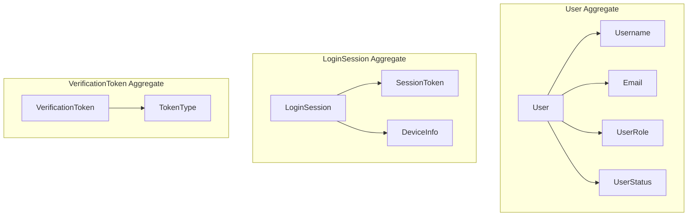
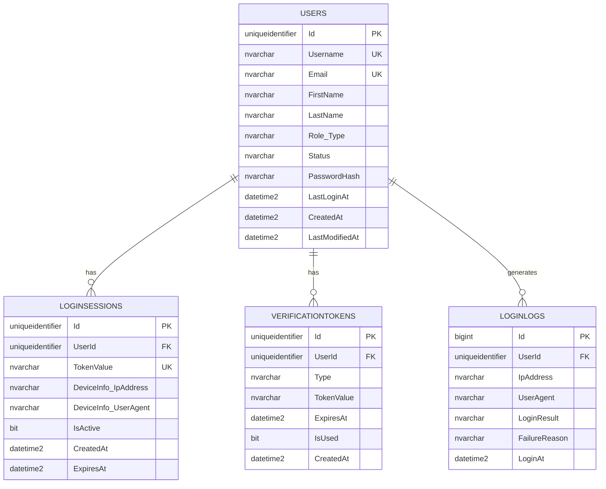
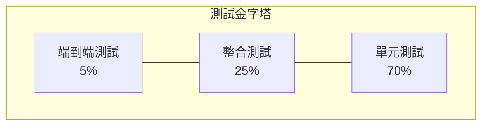

# 系統設計規格書：使用者註冊與登入功能 (階段1.1)

## 版本資訊
- **文檔版本**：1.0
- **建立日期**：2025-09-26
- **負責人**：系統設計師
- **審核狀態**：待審核
- **相關專案**：SoftwareDevelopment.API

---

## 1. 系統架構設計

### 1.1 整體架構概覽

本系統採用 Domain-Driven Design (DDD) 四層架構設計，遵循 Clean Architecture 原則，確保業務邏輯與技術實作的分離。

```
┌─────────────────────────────────────────┐
│           1-Presentation Layer          │
│     (SoftwareDevelopment.Api)           │
│     - Controllers                       │
│     - DTOs                             │
│     - Middleware                       │
└─────────────┬───────────────────────────┘
              │ depends on
              ▼
┌─────────────────────────────────────────┐
│          2-Application Layer            │
│    (SoftwareDevelopment.Application)    │
│     - Command/Query Handlers            │
│     - Application Services              │
│     - Validators                        │
└─────────────┬───────────────────────────┘
              │ depends on
              ▼
┌─────────────────────────────────────────┐
│            3-Domain Layer               │
│     (SoftwareDevelopment.Domain)        │
│     - Aggregates                        │
│     - Entities & Value Objects          │
│     - Domain Services                   │
│     - Repository Interfaces             │
└─────────────▲───────────────────────────┘
              │ implements
              │
┌─────────────────────────────────────────┐
│         4-Infrastructure Layer          │
│   (SoftwareDevelopment.Infrastructure)  │
│     - Repository Implementations        │
│     - External Service Adapters         │
│     - Data Access                       │
└─────────────────────────────────────────┘
```

### 1.2 DDD 四層架構設計

#### 1.2.1 層級職責定義

| 層級 | 主要職責 | 核心元件 | 依賴關係 |
|------|----------|----------|----------|
| Presentation | HTTP 請求處理、輸入驗證、回應格式化 | Controllers, DTOs, Middleware | 僅依賴 Application Layer |
| Application | 用例協調、事務管理、應用邏輯 | Handlers, Services, Validators | 依賴 Domain Layer 介面 |
| Domain | 業務邏輯、領域規則、不變量維護 | Aggregates, Services, Events | 無外部依賴 |
| Infrastructure | 資料存取、外部服務整合 | Repositories, Adapters | 實作 Domain 介面 |

#### 1.2.2 依賴注入配置

```csharp
// Program.cs 中的服務註冊
builder.Services.AddApplication();     // Application Layer 服務
builder.Services.AddInfrastructure(builder.Configuration); // Infrastructure Layer 服務
builder.Services.AddPresentation();   // Presentation Layer 服務
```

### 1.3 模組劃分與依賴關係

#### 1.3.1 核心模組劃分

```
SoftwareDevelopment.API/
├── src/
│   ├── 1-Presentation/
│   │   └── SoftwareDevelopment.Api/        # Web API 專案
│   ├── 2-Application/
│   │   └── SoftwareDevelopment.Application/ # 應用邏輯
│   ├── 3-Domain/
│   │   └── SoftwareDevelopment.Domain/     # 領域模型
│   └── 4-Infrastructure/
│       └── SoftwareDevelopment.Infrastructure/ # 基礎設施
```

#### 1.3.2 專案間依賴關係

```csharp
// SoftwareDevelopment.Api.csproj
<ProjectReference Include="..\..\2-Application\SoftwareDevelopment.Application\SoftwareDevelopment.Application.csproj" />
<ProjectReference Include="..\..\4-Infrastructure\SoftwareDevelopment.Infrastructure\SoftwareDevelopment.Infrastructure.csproj" />

// SoftwareDevelopment.Application.csproj
<ProjectReference Include="..\..\3-Domain\SoftwareDevelopment.Domain\SoftwareDevelopment.Domain.csproj" />

// SoftwareDevelopment.Infrastructure.csproj
<ProjectReference Include="..\..\2-Application\SoftwareDevelopment.Application\SoftwareDevelopment.Application.csproj" />
<ProjectReference Include="..\..\3-Domain\SoftwareDevelopment.Domain\SoftwareDevelopment.Domain.csproj" />
```

---

## 2. 領域層設計 (Domain Layer)

### 2.1 領域實體設計

#### 2.1.1 User 聚合根

```csharp
namespace SoftwareDevelopment.Domain.Users;

/// <summary>
/// 使用者聚合根 - 管理使用者的基本資訊、角色和狀態
/// </summary>
public sealed class User : AggregateRoot<UserId>, IAggregateRoot
{
    // 現有實作已包含核心屬性和方法
    public Username Username { get; private set; }
    public Email Email { get; private set; }
    public string FirstName { get; private set; }
    public string LastName { get; private set; }
    public UserRole Role { get; private set; }
    public UserStatus Status { get; private set; }
    public string? PasswordHash { get; private set; }
    public DateTime? LastLoginAt { get; private set; }

    // 核心業務方法
    public static User Create(Username username, Email email, string firstName, string lastName, IEnumerable<string> companyDomains);
    public void SetPassword(string passwordHash);
    public void VerifyEmail();
    public void Approve(UserId approvedBy);
    public void Reject(UserId rejectedBy, string reason);
    public void RecordLogin();
    public bool HasPermission(Permission permission);
}
```

#### 2.1.2 LoginSession 聚合根 (需新增)

```csharp
namespace SoftwareDevelopment.Domain.Authentication;

/// <summary>
/// 登入會話聚合根 - 管理使用者登入會話和認證狀態
/// </summary>
public sealed class LoginSession : AggregateRoot<SessionId>
{
    public UserId UserId { get; private set; }
    public SessionToken Token { get; private set; }
    public DeviceInfo DeviceInfo { get; private set; }
    public DateTime CreatedAt { get; private set; }
    public DateTime ExpiresAt { get; private set; }
    public bool IsActive { get; private set; }

    public static LoginSession Create(UserId userId, DeviceInfo deviceInfo, TimeSpan duration);
    public void Extend(TimeSpan additionalTime);
    public void Terminate();
    public bool IsExpired();
}
```

#### 2.1.3 VerificationToken 聚合根 (需新增)

```csharp
namespace SoftwareDevelopment.Domain.Authentication;

/// <summary>
/// 驗證令牌聚合根 - 管理電子信箱驗證和密碼重設令牌
/// </summary>
public sealed class VerificationToken : AggregateRoot<TokenId>
{
    public UserId UserId { get; private set; }
    public TokenType Type { get; private set; }
    public string TokenValue { get; private set; }
    public DateTime ExpiresAt { get; private set; }
    public bool IsUsed { get; private set; }

    public static VerificationToken CreateEmailVerification(UserId userId, TimeSpan validFor);
    public static VerificationToken CreatePasswordReset(UserId userId, TimeSpan validFor);
    public void MarkAsUsed();
    public bool IsValid();
}
```

### 2.2 值物件設計

#### 2.2.1 現有值物件

```csharp
// Email 值物件 (已存在)
public sealed record Email
{
    public string Value { get; init; }
    public static Email Create(string value);
    public bool IsCompanyEmail(IEnumerable<string> companyDomains);
}

// Username 值物件 (已存在)
public sealed record Username
{
    public string Value { get; init; }
    public static Username Create(string value);
}
```

#### 2.2.2 新增值物件設計

```csharp
// SessionToken 值物件
namespace SoftwareDevelopment.Domain.Authentication;

public sealed record SessionToken
{
    public string Value { get; init; }
    public DateTime CreatedAt { get; init; }

    public static SessionToken Create();
    private static string GenerateSecureToken();
}

// DeviceInfo 值物件
public sealed record DeviceInfo
{
    public string IpAddress { get; init; }
    public string UserAgent { get; init; }
    public string? DeviceName { get; init; }

    public static DeviceInfo Create(string ipAddress, string userAgent, string? deviceName = null);
}

// Password 值物件 (用於密碼驗證)
public sealed record Password
{
    public string HashedValue { get; init; }
    public DateTime CreatedAt { get; init; }

    public static Password Create(string plainPassword, IPasswordHasher hasher);
    public bool Verify(string plainPassword, IPasswordHasher hasher);
    public bool RequiresRehashing(IPasswordHasher hasher);
}
```

### 2.3 領域服務設計

#### 2.3.1 AuthenticationService (需新增)

```csharp
namespace SoftwareDevelopment.Domain.Services;

/// <summary>
/// 身份驗證領域服務 - 協調跨聚合的認證邏輯
/// </summary>
public sealed class AuthenticationService : IDomainService
{
    private readonly IUserRepository _userRepository;
    private readonly IPasswordHasher _passwordHasher;

    public async Task<AuthenticationResult> AuthenticateAsync(
        string identifier,  // 使用者名稱或信箱
        string password,
        DeviceInfo deviceInfo,
        CancellationToken cancellationToken = default);

    public async Task<bool> ValidateTokenAsync(
        SessionToken token,
        CancellationToken cancellationToken = default);

    public async Task InvalidateSessionAsync(
        SessionId sessionId,
        CancellationToken cancellationToken = default);
}

// AuthenticationResult 值物件
public sealed record AuthenticationResult
{
    public bool IsSuccess { get; init; }
    public User? User { get; init; }
    public LoginSession? Session { get; init; }
    public string? ErrorCode { get; init; }
    public string? ErrorMessage { get; init; }

    public static AuthenticationResult Success(User user, LoginSession session);
    public static AuthenticationResult Failure(string errorCode, string errorMessage);
}
```

#### 2.3.2 EmailVerificationService (需新增)

```csharp
namespace SoftwareDevelopment.Domain.Services;

/// <summary>
/// 電子信箱驗證領域服務
/// </summary>
public sealed class EmailVerificationService : IDomainService
{
    public async Task<VerificationToken> GenerateEmailVerificationTokenAsync(
        UserId userId,
        CancellationToken cancellationToken = default);

    public async Task<bool> VerifyEmailTokenAsync(
        string tokenValue,
        CancellationToken cancellationToken = default);
}
```

### 2.4 領域事件設計

#### 2.4.1 現有領域事件 (已實作)

```csharp
// 使用者相關事件
public sealed record UserCreatedEvent(UserId UserId, Email Email, UserRoleType RoleType, DateTime CreatedAt) : IDomainEvent;
public sealed record UserEmailVerifiedEvent(UserId UserId, Email Email, DateTime VerifiedAt) : IDomainEvent;
public sealed record UserApprovedEvent(UserId UserId, UserId ApprovedBy, DateTime ApprovedAt) : IDomainEvent;
public sealed record UserLoggedInEvent(UserId UserId, DateTime LoggedInAt) : IDomainEvent;
```

#### 2.4.2 新增領域事件設計

```csharp
// 認證相關事件
namespace SoftwareDevelopment.Domain.Authentication.Events;

public sealed record LoginAttemptedEvent(
    UserId UserId,
    string IpAddress,
    string UserAgent,
    bool IsSuccess,
    string? FailureReason,
    DateTime AttemptedAt) : IDomainEvent;

public sealed record SessionCreatedEvent(
    SessionId SessionId,
    UserId UserId,
    DateTime CreatedAt,
    DateTime ExpiresAt) : IDomainEvent;

public sealed record SessionTerminatedEvent(
    SessionId SessionId,
    UserId UserId,
    string Reason,
    DateTime TerminatedAt) : IDomainEvent;

public sealed record EmailVerificationRequestedEvent(
    UserId UserId,
    Email Email,
    TokenId TokenId,
    DateTime RequestedAt) : IDomainEvent;

public sealed record PasswordResetRequestedEvent(
    UserId UserId,
    Email Email,
    TokenId TokenId,
    string IpAddress,
    DateTime RequestedAt) : IDomainEvent;
```

### 2.5 聚合根設計

#### 2.5.1 聚合邊界劃分



#### 2.5.2 聚合間通訊策略

- **同步通訊**：透過領域服務協調跨聚合操作
- **非同步通訊**：使用領域事件實現最終一致性
- **參考方式**：使用 ID 引用而非直接物件引用

---

## 3. 應用層設計 (Application Layer)

### 3.1 命令與查詢設計 (CQRS)

#### 3.1.1 命令設計 (Commands)

```csharp
namespace SoftwareDevelopment.Application.Users.Register;

/// <summary>
/// 註冊使用者命令
/// </summary>
public sealed record RegisterUserCommand(
    string Username,
    string Email,
    string FirstName,
    string LastName,
    string Password,
    string ConfirmPassword) : ICommand<Result<RegisterUserResponse>>;

/// <summary>
/// 註冊使用者回應
/// </summary>
public sealed record RegisterUserResponse(
    Guid UserId,
    string Username,
    string Email,
    string Role,
    string Status,
    bool RequiresApproval);
```

```csharp
namespace SoftwareDevelopment.Application.Authentication.Login;

/// <summary>
/// 登入命令
/// </summary>
public sealed record LoginCommand(
    string UsernameOrEmail,
    string Password,
    string IpAddress,
    string UserAgent,
    bool RememberMe = false) : ICommand<Result<LoginResponse>>;

/// <summary>
/// 登入回應
/// </summary>
public sealed record LoginResponse(
    string AccessToken,
    string RefreshToken,
    DateTime ExpiresAt,
    UserDto User);
```

#### 3.1.2 查詢設計 (Queries)

```csharp
namespace SoftwareDevelopment.Application.Users.GetUser;

/// <summary>
/// 根據 ID 取得使用者查詢
/// </summary>
public sealed record GetUserByIdQuery(Guid UserId) : IQuery<Result<UserDto>>;

/// <summary>
/// 使用者 DTO
/// </summary>
public sealed record UserDto(
    Guid Id,
    string Username,
    string Email,
    string FirstName,
    string LastName,
    string FullName,
    string Role,
    string Status,
    DateTime? LastLoginAt,
    DateTime CreatedAt);
```

### 3.2 應用服務設計

#### 3.2.1 命令處理器

```csharp
namespace SoftwareDevelopment.Application.Users.Register;

/// <summary>
/// 註冊使用者命令處理器 (已存在，需要擴展)
/// </summary>
public sealed class RegisterUserCommandHandler : ICommandHandler<RegisterUserCommand, Result<RegisterUserResponse>>
{
    // 現有實作基礎上，需要新增：
    // 1. 電子信箱驗證 Token 生成
    // 2. 歡迎信件發送
    // 3. 管理員通知 (員工註冊時)

    public async Task<Result<RegisterUserResponse>> Handle(
        RegisterUserCommand request,
        CancellationToken cancellationToken)
    {
        // 現有邏輯 + 新增電子信箱驗證流程
    }
}
```

```csharp
namespace SoftwareDevelopment.Application.Authentication.Login;

/// <summary>
/// 登入命令處理器 (需新增)
/// </summary>
public sealed class LoginCommandHandler : ICommandHandler<LoginCommand, Result<LoginResponse>>
{
    private readonly IUserRepository _userRepository;
    private readonly AuthenticationService _authenticationService;
    private readonly IJwtTokenGenerator _jwtTokenGenerator;
    private readonly ILogger<LoginCommandHandler> _logger;

    public async Task<Result<LoginResponse>> Handle(
        LoginCommand request,
        CancellationToken cancellationToken)
    {
        // 1. 身份驗證
        var authResult = await _authenticationService.AuthenticateAsync(
            request.UsernameOrEmail,
            request.Password,
            DeviceInfo.Create(request.IpAddress, request.UserAgent),
            cancellationToken);

        if (!authResult.IsSuccess)
        {
            return Result<LoginResponse>.Failure(new Error("AUTH.LOGIN_FAILED", authResult.ErrorMessage));
        }

        // 2. 生成 JWT Token
        var tokenDuration = request.RememberMe ? TimeSpan.FromDays(7) : TimeSpan.FromHours(1);
        var accessToken = _jwtTokenGenerator.GenerateAccessToken(authResult.User!, tokenDuration);
        var refreshToken = _jwtTokenGenerator.GenerateRefreshToken();

        // 3. 記錄登入
        authResult.User!.RecordLogin();
        await _userRepository.UpdateAsync(authResult.User, cancellationToken);

        // 4. 建立回應
        var response = new LoginResponse(
            accessToken,
            refreshToken,
            DateTime.UtcNow.Add(tokenDuration),
            MapToUserDto(authResult.User));

        return Result<LoginResponse>.Success(response);
    }
}
```

### 3.3 DTO 設計

#### 3.3.1 請求 DTOs

```csharp
namespace SoftwareDevelopment.Application.Common.DTOs;

/// <summary>
/// 註冊請求 DTO
/// </summary>
public sealed class RegisterRequestDto
{
    public required string Username { get; init; }
    public required string Email { get; init; }
    public required string FirstName { get; init; }
    public required string LastName { get; init; }
    public required string Password { get; init; }
    public required string ConfirmPassword { get; init; }
}

/// <summary>
/// 登入請求 DTO
/// </summary>
public sealed class LoginRequestDto
{
    public required string UsernameOrEmail { get; init; }
    public required string Password { get; init; }
    public bool RememberMe { get; init; }
}
```

#### 3.3.2 回應 DTOs

```csharp
/// <summary>
/// API 標準回應格式
/// </summary>
public sealed class ApiResponse<T>
{
    public bool Success { get; init; }
    public T? Data { get; init; }
    public string? Message { get; init; }
    public string? ErrorCode { get; init; }
    public DateTime Timestamp { get; init; } = DateTime.UtcNow;

    public static ApiResponse<T> SuccessResponse(T data, string? message = null) =>
        new() { Success = true, Data = data, Message = message };

    public static ApiResponse<T> ErrorResponse(string errorCode, string message) =>
        new() { Success = false, ErrorCode = errorCode, Message = message };
}
```

### 3.4 驗證器設計

#### 3.4.1 註冊命令驗證器

```csharp
namespace SoftwareDevelopment.Application.Users.Register;

/// <summary>
/// 註冊使用者命令驗證器
/// </summary>
public sealed class RegisterUserCommandValidator : AbstractValidator<RegisterUserCommand>
{
    public RegisterUserCommandValidator()
    {
        RuleFor(x => x.Username)
            .NotEmpty().WithMessage("使用者名稱不可為空")
            .Length(3, 50).WithMessage("使用者名稱長度必須在 3-50 字元之間")
            .Matches(@"^[a-zA-Z0-9_]+$").WithMessage("使用者名稱只能包含英數字和底線");

        RuleFor(x => x.Email)
            .NotEmpty().WithMessage("電子信箱不可為空")
            .EmailAddress().WithMessage("電子信箱格式不正確")
            .MaximumLength(254).WithMessage("電子信箱長度不可超過 254 字元");

        RuleFor(x => x.FirstName)
            .NotEmpty().WithMessage("名字不可為空")
            .Length(1, 100).WithMessage("名字長度必須在 1-100 字元之間");

        RuleFor(x => x.LastName)
            .NotEmpty().WithMessage("姓氏不可為空")
            .Length(1, 100).WithMessage("姓氏長度必須在 1-100 字元之間");

        RuleFor(x => x.Password)
            .NotEmpty().WithMessage("密碼不可為空")
            .MinimumLength(8).WithMessage("密碼長度至少 8 字元")
            .Matches(@"^(?=.*[a-z])(?=.*[A-Z])(?=.*\d)(?=.*[^\da-zA-Z]).{8,}$")
            .WithMessage("密碼必須包含大小寫字母、數字和特殊字元");

        RuleFor(x => x.ConfirmPassword)
            .Equal(x => x.Password).WithMessage("確認密碼必須與密碼相符");
    }
}
```

### 3.5 處理器設計

#### 3.5.1 查詢處理器

```csharp
namespace SoftwareDevelopment.Application.Users.GetUser;

/// <summary>
/// 根據 ID 取得使用者查詢處理器
/// </summary>
public sealed class GetUserByIdQueryHandler : IQueryHandler<GetUserByIdQuery, Result<UserDto>>
{
    private readonly IUserRepository _userRepository;

    public async Task<Result<UserDto>> Handle(
        GetUserByIdQuery request,
        CancellationToken cancellationToken)
    {
        var userId = UserId.From(request.UserId);
        var user = await _userRepository.GetByIdAsync(userId, cancellationToken);

        if (user is null)
        {
            return Result<UserDto>.Failure(new Error("USER.NOT_FOUND", "使用者不存在"));
        }

        var userDto = new UserDto(
            user.Id.Value,
            user.Username.Value,
            user.Email.Value,
            user.FirstName,
            user.LastName,
            user.FullName,
            user.Role.Type.ToString(),
            user.Status.ToString(),
            user.LastLoginAt,
            user.CreatedAt);

        return Result<UserDto>.Success(userDto);
    }
}
```

---

## 4. 基礎設施層設計 (Infrastructure Layer)

### 4.1 資料存取設計

#### 4.1.1 資料庫內容 (DbContext)

```csharp
namespace SoftwareDevelopment.Infrastructure.Persistence;

/// <summary>
/// 應用程式資料庫內容
/// </summary>
public sealed class ApplicationDbContext : DbContext, IApplicationDbContext
{
    public ApplicationDbContext(DbContextOptions<ApplicationDbContext> options) : base(options) { }

    public DbSet<User> Users { get; set; } = null!;
    public DbSet<LoginSession> LoginSessions { get; set; } = null!;
    public DbSet<VerificationToken> VerificationTokens { get; set; } = null!;

    protected override void OnModelCreating(ModelBuilder modelBuilder)
    {
        // 套用所有配置
        modelBuilder.ApplyConfigurationsFromAssembly(Assembly.GetExecutingAssembly());

        base.OnModelCreating(modelBuilder);
    }

    public override async Task<int> SaveChangesAsync(CancellationToken cancellationToken = default)
    {
        // 發佈領域事件
        await PublishDomainEventsAsync();
        return await base.SaveChangesAsync(cancellationToken);
    }

    private async Task PublishDomainEventsAsync()
    {
        var domainEvents = ChangeTracker
            .Entries<IAggregateRoot>()
            .SelectMany(entry => entry.Entity.DomainEvents)
            .ToList();

        foreach (var domainEvent in domainEvents)
        {
            await _mediator.Publish(domainEvent);
        }

        // 清除已發佈的事件
        ChangeTracker
            .Entries<IAggregateRoot>()
            .ToList()
            .ForEach(entry => entry.Entity.ClearDomainEvents());
    }
}
```

#### 4.1.2 實體配置 (Entity Configurations)

```csharp
namespace SoftwareDevelopment.Infrastructure.Persistence.Configurations;

/// <summary>
/// User 實體配置
/// </summary>
public sealed class UserConfiguration : IEntityTypeConfiguration<User>
{
    public void Configure(EntityTypeBuilder<User> builder)
    {
        builder.ToTable("Users");

        builder.HasKey(u => u.Id);

        builder.Property(u => u.Id)
            .HasConversion(id => id.Value, value => UserId.From(value));

        builder.ComplexProperty(u => u.Username, username =>
        {
            username.Property(u => u.Value)
                .HasColumnName("Username")
                .HasMaxLength(50)
                .IsRequired();
        });

        builder.ComplexProperty(u => u.Email, email =>
        {
            email.Property(e => e.Value)
                .HasColumnName("Email")
                .HasMaxLength(254)
                .IsRequired();
        });

        builder.Property(u => u.FirstName)
            .HasMaxLength(100)
            .IsRequired();

        builder.Property(u => u.LastName)
            .HasMaxLength(100)
            .IsRequired();

        builder.ComplexProperty(u => u.Role);

        builder.Property(u => u.Status)
            .HasConversion<string>()
            .HasMaxLength(50);

        builder.Property(u => u.PasswordHash)
            .HasMaxLength(255);

        // 索引
        builder.HasIndex(u => u.Username.Value).IsUnique();
        builder.HasIndex(u => u.Email.Value).IsUnique();
        builder.HasIndex(u => u.Status);
        builder.HasIndex(u => u.CreatedAt);
    }
}

/// <summary>
/// LoginSession 實體配置
/// </summary>
public sealed class LoginSessionConfiguration : IEntityTypeConfiguration<LoginSession>
{
    public void Configure(EntityTypeBuilder<LoginSession> builder)
    {
        builder.ToTable("LoginSessions");

        builder.HasKey(s => s.Id);

        builder.Property(s => s.Id)
            .HasConversion(id => id.Value, value => SessionId.From(value));

        builder.Property(s => s.UserId)
            .HasConversion(id => id.Value, value => UserId.From(value));

        builder.ComplexProperty(s => s.Token, token =>
        {
            token.Property(t => t.Value)
                .HasColumnName("TokenValue")
                .HasMaxLength(500)
                .IsRequired();
        });

        builder.ComplexProperty(s => s.DeviceInfo);

        // 索引
        builder.HasIndex(s => s.UserId);
        builder.HasIndex(s => s.Token.Value).IsUnique();
        builder.HasIndex(s => s.ExpiresAt);
    }
}
```

### 4.2 儲存庫實作設計

#### 4.2.1 使用者儲存庫實作

```csharp
namespace SoftwareDevelopment.Infrastructure.Persistence.Repositories;

/// <summary>
/// 使用者儲存庫實作
/// </summary>
public sealed class UserRepository : IUserRepository
{
    private readonly ApplicationDbContext _context;

    public UserRepository(ApplicationDbContext context)
    {
        _context = context ?? throw new ArgumentNullException(nameof(context));
    }

    public async Task<User?> GetByIdAsync(UserId id, CancellationToken cancellationToken = default)
    {
        return await _context.Users
            .FirstOrDefaultAsync(u => u.Id == id, cancellationToken);
    }

    public async Task<User?> GetByUsernameAsync(Username username, CancellationToken cancellationToken = default)
    {
        return await _context.Users
            .FirstOrDefaultAsync(u => u.Username == username, cancellationToken);
    }

    public async Task<User?> GetByEmailAsync(Email email, CancellationToken cancellationToken = default)
    {
        return await _context.Users
            .FirstOrDefaultAsync(u => u.Email == email, cancellationToken);
    }

    public async Task<User?> GetByUsernameOrEmailAsync(string identifier, CancellationToken cancellationToken = default)
    {
        return await _context.Users
            .FirstOrDefaultAsync(u => u.Username.Value == identifier || u.Email.Value == identifier, cancellationToken);
    }

    public async Task<bool> IsUsernameExistsAsync(Username username, CancellationToken cancellationToken = default)
    {
        return await _context.Users
            .AnyAsync(u => u.Username == username, cancellationToken);
    }

    public async Task<bool> IsEmailExistsAsync(Email email, CancellationToken cancellationToken = default)
    {
        return await _context.Users
            .AnyAsync(u => u.Email == email, cancellationToken);
    }

    public async Task AddAsync(User user, CancellationToken cancellationToken = default)
    {
        await _context.Users.AddAsync(user, cancellationToken);
    }

    public Task UpdateAsync(User user, CancellationToken cancellationToken = default)
    {
        _context.Users.Update(user);
        return Task.CompletedTask;
    }

    public Task DeleteAsync(User user, CancellationToken cancellationToken = default)
    {
        _context.Users.Remove(user);
        return Task.CompletedTask;
    }
}
```

### 4.3 外部服務整合設計

#### 4.3.1 電子信箱服務

```csharp
namespace SoftwareDevelopment.Infrastructure.Services;

/// <summary>
/// 電子信箱服務實作
/// </summary>
public sealed class EmailService : IEmailService
{
    private readonly SmtpClient _smtpClient;
    private readonly EmailSettings _settings;
    private readonly ILogger<EmailService> _logger;

    public async Task SendEmailVerificationAsync(string email, string verificationToken)
    {
        var subject = "電子信箱驗證 - SoftwareDevelopment 平台";
        var verificationLink = $"{_settings.BaseUrl}/verify-email?token={verificationToken}";

        var body = $@"
            <h2>歡迎註冊 SoftwareDevelopment 平台！</h2>
            <p>請點擊以下連結完成電子信箱驗證：</p>
            <p><a href='{verificationLink}'>驗證電子信箱</a></p>
            <p>此連結將在 24 小時後失效。</p>";

        await SendEmailAsync(email, subject, body);
    }

    public async Task SendWelcomeEmailAsync(string email, string firstName)
    {
        var subject = "歡迎加入 SoftwareDevelopment 平台！";
        var body = $@"
            <h2>歡迎 {firstName}！</h2>
            <p>您的帳號已成功啟用，現在可以開始使用平台的各項功能。</p>";

        await SendEmailAsync(email, subject, body);
    }

    private async Task SendEmailAsync(string to, string subject, string body)
    {
        try
        {
            var message = new MailMessage(_settings.FromAddress, to, subject, body)
            {
                IsBodyHtml = true
            };

            await _smtpClient.SendMailAsync(message);
            _logger.LogInformation("Email sent successfully to {Email}", to);
        }
        catch (Exception ex)
        {
            _logger.LogError(ex, "Failed to send email to {Email}", to);
            throw;
        }
    }
}
```

#### 4.3.2 JWT Token 生成器

```csharp
namespace SoftwareDevelopment.Infrastructure.Services;

/// <summary>
/// JWT Token 生成器實作
/// </summary>
public sealed class JwtTokenGenerator : IJwtTokenGenerator
{
    private readonly JwtSettings _jwtSettings;
    private readonly ILogger<JwtTokenGenerator> _logger;

    public string GenerateAccessToken(User user, TimeSpan duration)
    {
        var claims = new List<Claim>
        {
            new(ClaimTypes.NameIdentifier, user.Id.Value.ToString()),
            new(ClaimTypes.Name, user.Username.Value),
            new(ClaimTypes.Email, user.Email.Value),
            new(ClaimTypes.GivenName, user.FirstName),
            new(ClaimTypes.Surname, user.LastName),
            new("role", user.Role.Type.ToString()),
            new("status", user.Status.ToString()),
            new(JwtRegisteredClaimNames.Jti, Guid.NewGuid().ToString()),
            new(JwtRegisteredClaimNames.Iat, DateTimeOffset.UtcNow.ToUnixTimeSeconds().ToString(), ClaimValueTypes.Integer64)
        };

        // 新增權限聲明
        foreach (var permission in user.Role.Permissions)
        {
            claims.Add(new Claim("permission", permission.ToString()));
        }

        var key = new SymmetricSecurityKey(Encoding.UTF8.GetBytes(_jwtSettings.SecretKey));
        var credentials = new SigningCredentials(key, SecurityAlgorithms.HmacSha256);

        var token = new JwtSecurityToken(
            issuer: _jwtSettings.Issuer,
            audience: _jwtSettings.Audience,
            claims: claims,
            expires: DateTime.UtcNow.Add(duration),
            signingCredentials: credentials);

        return new JwtSecurityTokenHandler().WriteToken(token);
    }

    public string GenerateRefreshToken()
    {
        var randomBytes = new byte[64];
        using var rng = RandomNumberGenerator.Create();
        rng.GetBytes(randomBytes);
        return Convert.ToBase64String(randomBytes);
    }
}
```

### 4.4 配置管理設計

#### 4.4.1 設定類別

```csharp
namespace SoftwareDevelopment.Infrastructure.Options;

/// <summary>
/// JWT 設定
/// </summary>
public sealed class JwtSettings
{
    public const string SectionName = "JwtSettings";

    public required string Issuer { get; init; }
    public required string Audience { get; init; }
    public required string SecretKey { get; init; }
    public int AccessTokenExpiryMinutes { get; init; } = 15;
    public int RefreshTokenExpiryDays { get; init; } = 7;
}

/// <summary>
/// 電子信箱設定
/// </summary>
public sealed class EmailSettings
{
    public const string SectionName = "EmailSettings";

    public required string SmtpHost { get; init; }
    public int SmtpPort { get; init; } = 587;
    public required string Username { get; init; }
    public required string Password { get; init; }
    public bool EnableSsl { get; init; } = true;
    public required string FromAddress { get; init; }
    public required string BaseUrl { get; init; }
}
```

---

## 5. 展示層設計 (Presentation Layer)

### 5.1 控制器設計

#### 5.1.1 使用者控制器

```csharp
namespace SoftwareDevelopment.Api.Controllers;

/// <summary>
/// 使用者管理控制器
/// </summary>
[ApiController]
[Route("api/[controller]")]
public sealed class UsersController : ControllerBase
{
    private readonly IMediator _mediator;

    public UsersController(IMediator mediator)
    {
        _mediator = mediator ?? throw new ArgumentNullException(nameof(mediator));
    }

    /// <summary>
    /// 註冊新使用者
    /// </summary>
    /// <param name="request">註冊請求</param>
    /// <param name="cancellationToken">取消權杖</param>
    /// <returns>註冊結果</returns>
    [HttpPost("register")]
    [ProducesResponseType(typeof(ApiResponse<RegisterUserResponse>), StatusCodes.Status201Created)]
    [ProducesResponseType(typeof(ApiResponse<object>), StatusCodes.Status400BadRequest)]
    public async Task<IActionResult> Register(
        [FromBody] RegisterRequestDto request,
        CancellationToken cancellationToken)
    {
        var command = new RegisterUserCommand(
            request.Username,
            request.Email,
            request.FirstName,
            request.LastName,
            request.Password,
            request.ConfirmPassword);

        var result = await _mediator.Send(command, cancellationToken);

        if (result.IsFailure)
        {
            return BadRequest(ApiResponse<object>.ErrorResponse(result.Error.Code, result.Error.Message));
        }

        return CreatedAtAction(
            nameof(GetById),
            new { id = result.Value.UserId },
            ApiResponse<RegisterUserResponse>.SuccessResponse(result.Value, "使用者註冊成功"));
    }

    /// <summary>
    /// 根據 ID 取得使用者
    /// </summary>
    /// <param name="id">使用者識別碼</param>
    /// <param name="cancellationToken">取消權杖</param>
    /// <returns>使用者資訊</returns>
    [HttpGet("{id:guid}")]
    [Authorize]
    [ProducesResponseType(typeof(ApiResponse<UserDto>), StatusCodes.Status200OK)]
    [ProducesResponseType(typeof(ApiResponse<object>), StatusCodes.Status404NotFound)]
    public async Task<IActionResult> GetById(
        Guid id,
        CancellationToken cancellationToken)
    {
        var query = new GetUserByIdQuery(id);
        var result = await _mediator.Send(query, cancellationToken);

        if (result.IsFailure)
        {
            return NotFound(ApiResponse<object>.ErrorResponse(result.Error.Code, result.Error.Message));
        }

        return Ok(ApiResponse<UserDto>.SuccessResponse(result.Value));
    }
}
```

#### 5.1.2 認證控制器

```csharp
namespace SoftwareDevelopment.Api.Controllers;

/// <summary>
/// 身份驗證控制器
/// </summary>
[ApiController]
[Route("api/[controller]")]
public sealed class AuthController : ControllerBase
{
    private readonly IMediator _mediator;

    /// <summary>
    /// 使用者登入
    /// </summary>
    /// <param name="request">登入請求</param>
    /// <param name="cancellationToken">取消權杖</param>
    /// <returns>登入結果</returns>
    [HttpPost("login")]
    [ProducesResponseType(typeof(ApiResponse<LoginResponse>), StatusCodes.Status200OK)]
    [ProducesResponseType(typeof(ApiResponse<object>), StatusCodes.Status401Unauthorized)]
    public async Task<IActionResult> Login(
        [FromBody] LoginRequestDto request,
        CancellationToken cancellationToken)
    {
        var ipAddress = HttpContext.Connection.RemoteIpAddress?.ToString() ?? "unknown";
        var userAgent = HttpContext.Request.Headers["User-Agent"].ToString();

        var command = new LoginCommand(
            request.UsernameOrEmail,
            request.Password,
            ipAddress,
            userAgent,
            request.RememberMe);

        var result = await _mediator.Send(command, cancellationToken);

        if (result.IsFailure)
        {
            return Unauthorized(ApiResponse<object>.ErrorResponse(result.Error.Code, result.Error.Message));
        }

        return Ok(ApiResponse<LoginResponse>.SuccessResponse(result.Value, "登入成功"));
    }

    /// <summary>
    /// 驗證電子信箱
    /// </summary>
    /// <param name="token">驗證權杖</param>
    /// <param name="cancellationToken">取消權杖</param>
    /// <returns>驗證結果</returns>
    [HttpGet("verify-email")]
    [ProducesResponseType(typeof(ApiResponse<object>), StatusCodes.Status200OK)]
    [ProducesResponseType(typeof(ApiResponse<object>), StatusCodes.Status400BadRequest)]
    public async Task<IActionResult> VerifyEmail(
        [FromQuery] string token,
        CancellationToken cancellationToken)
    {
        var command = new VerifyEmailCommand(token);
        var result = await _mediator.Send(command, cancellationToken);

        if (result.IsFailure)
        {
            return BadRequest(ApiResponse<object>.ErrorResponse(result.Error.Code, result.Error.Message));
        }

        return Ok(ApiResponse<object>.SuccessResponse(null, "電子信箱驗證成功"));
    }

    /// <summary>
    /// 申請密碼重設
    /// </summary>
    /// <param name="request">重設請求</param>
    /// <param name="cancellationToken">取消權杖</param>
    /// <returns>重設結果</returns>
    [HttpPost("forgot-password")]
    [ProducesResponseType(typeof(ApiResponse<object>), StatusCodes.Status200OK)]
    [ProducesResponseType(typeof(ApiResponse<object>), StatusCodes.Status400BadRequest)]
    public async Task<IActionResult> ForgotPassword(
        [FromBody] ForgotPasswordRequestDto request,
        CancellationToken cancellationToken)
    {
        var command = new ForgotPasswordCommand(request.Email);
        var result = await _mediator.Send(command, cancellationToken);

        // 基於安全考量，無論信箱是否存在都回傳成功
        return Ok(ApiResponse<object>.SuccessResponse(null, "如果信箱存在，重設連結已發送"));
    }
}
```

### 5.2 API 路由設計

#### 5.2.1 RESTful API 路由規劃

| HTTP 方法 | 路由 | 控制器方法 | 描述 |
|-----------|------|------------|------|
| POST | `/api/users/register` | UsersController.Register | 註冊新使用者 |
| GET | `/api/users/{id}` | UsersController.GetById | 根據 ID 取得使用者 |
| GET | `/api/users` | UsersController.GetUsers | 取得使用者清單 (管理員) |
| POST | `/api/auth/login` | AuthController.Login | 使用者登入 |
| POST | `/api/auth/logout` | AuthController.Logout | 使用者登出 |
| GET | `/api/auth/verify-email` | AuthController.VerifyEmail | 驗證電子信箱 |
| POST | `/api/auth/forgot-password` | AuthController.ForgotPassword | 申請密碼重設 |
| POST | `/api/auth/reset-password` | AuthController.ResetPassword | 重設密碼 |
| POST | `/api/auth/refresh` | AuthController.RefreshToken | 刷新 Token |

### 5.3 中介軟體設計

#### 5.3.1 全域異常處理中介軟體

```csharp
namespace SoftwareDevelopment.Api.Middleware;

/// <summary>
/// 全域異常處理中介軟體
/// </summary>
public sealed class GlobalExceptionHandlingMiddleware
{
    private readonly RequestDelegate _next;
    private readonly ILogger<GlobalExceptionHandlingMiddleware> _logger;

    public async Task InvokeAsync(HttpContext context)
    {
        try
        {
            await _next(context);
        }
        catch (Exception ex)
        {
            _logger.LogError(ex, "An unhandled exception occurred");
            await HandleExceptionAsync(context, ex);
        }
    }

    private static async Task HandleExceptionAsync(HttpContext context, Exception exception)
    {
        var response = context.Response;
        response.ContentType = "application/json";

        var apiResponse = exception switch
        {
            ValidationException validationEx => new ApiResponse<object>
            {
                Success = false,
                ErrorCode = "VALIDATION_ERROR",
                Message = validationEx.Message,
                Timestamp = DateTime.UtcNow
            },
            UnauthorizedAccessException => new ApiResponse<object>
            {
                Success = false,
                ErrorCode = "UNAUTHORIZED",
                Message = "未授權的存取",
                Timestamp = DateTime.UtcNow
            },
            _ => new ApiResponse<object>
            {
                Success = false,
                ErrorCode = "INTERNAL_SERVER_ERROR",
                Message = "伺服器內部錯誤",
                Timestamp = DateTime.UtcNow
            }
        };

        response.StatusCode = exception switch
        {
            ValidationException => StatusCodes.Status400BadRequest,
            UnauthorizedAccessException => StatusCodes.Status401Unauthorized,
            _ => StatusCodes.Status500InternalServerError
        };

        var jsonResponse = JsonSerializer.Serialize(apiResponse);
        await response.WriteAsync(jsonResponse);
    }
}
```

#### 5.3.2 請求日誌中介軟體

```csharp
namespace SoftwareDevelopment.Api.Middleware;

/// <summary>
/// 請求日誌中介軟體
/// </summary>
public sealed class RequestLoggingMiddleware
{
    private readonly RequestDelegate _next;
    private readonly ILogger<RequestLoggingMiddleware> _logger;

    public async Task InvokeAsync(HttpContext context)
    {
        var stopwatch = Stopwatch.StartNew();
        var requestId = Guid.NewGuid().ToString();

        // 記錄請求開始
        _logger.LogInformation(
            "Request started: {RequestId} {Method} {Path} from {IpAddress}",
            requestId,
            context.Request.Method,
            context.Request.Path,
            context.Connection.RemoteIpAddress);

        // 新增請求 ID 到回應標頭
        context.Response.Headers.Add("X-Request-Id", requestId);

        await _next(context);

        stopwatch.Stop();

        // 記錄請求完成
        _logger.LogInformation(
            "Request completed: {RequestId} {StatusCode} in {ElapsedMs}ms",
            requestId,
            context.Response.StatusCode,
            stopwatch.ElapsedMilliseconds);
    }
}
```

### 5.4 異常處理設計

#### 5.4.1 異常類別階層

```csharp
namespace SoftwareDevelopment.Api.Exceptions;

/// <summary>
/// 基礎 API 異常
/// </summary>
public abstract class ApiException : Exception
{
    public string ErrorCode { get; }
    public int StatusCode { get; }

    protected ApiException(string errorCode, string message, int statusCode) : base(message)
    {
        ErrorCode = errorCode;
        StatusCode = statusCode;
    }
}

/// <summary>
/// 驗證異常
/// </summary>
public sealed class ValidationException : ApiException
{
    public ValidationException(string message)
        : base("VALIDATION_ERROR", message, StatusCodes.Status400BadRequest)
    {
    }
}

/// <summary>
/// 業務規則異常
/// </summary>
public sealed class BusinessRuleException : ApiException
{
    public BusinessRuleException(string errorCode, string message)
        : base(errorCode, message, StatusCodes.Status400BadRequest)
    {
    }
}
```

---

## 6. 資料庫設計

### 6.1 資料表結構設計

#### 6.1.1 使用者主檔表 (Users)

```sql
CREATE TABLE Users (
    Id                  UNIQUEIDENTIFIER    PRIMARY KEY DEFAULT NEWSEQUENTIALID(),
    Username            NVARCHAR(50)        NOT NULL UNIQUE,
    Email               NVARCHAR(254)       NOT NULL UNIQUE,
    FirstName           NVARCHAR(100)       NOT NULL,
    LastName            NVARCHAR(100)       NOT NULL,
    Role_Type           NVARCHAR(50)        NOT NULL,
    Role_TeamId         UNIQUEIDENTIFIER    NULL,
    Status              NVARCHAR(50)        NOT NULL DEFAULT 'PendingVerification',
    PasswordHash        NVARCHAR(255)       NULL,
    LastLoginAt         DATETIME2           NULL,
    CreatedAt           DATETIME2           NOT NULL DEFAULT SYSDATETIME(),
    LastModifiedAt      DATETIME2           NOT NULL DEFAULT SYSDATETIME(),

    CONSTRAINT CK_Users_Status
        CHECK (Status IN ('PendingVerification', 'PendingApproval', 'Active', 'Inactive', 'Blocked')),
    CONSTRAINT CK_Users_Role_Type
        CHECK (Role_Type IN ('Guest', 'Employee', 'Manager', 'SystemAdmin'))
);

-- 索引
CREATE INDEX IX_Users_Status ON Users (Status);
CREATE INDEX IX_Users_Role_Type ON Users (Role_Type);
CREATE INDEX IX_Users_CreatedAt ON Users (CreatedAt);
CREATE INDEX IX_Users_LastLoginAt ON Users (LastLoginAt);
```

#### 6.1.2 登入會話表 (LoginSessions)

```sql
CREATE TABLE LoginSessions (
    Id                      UNIQUEIDENTIFIER    PRIMARY KEY DEFAULT NEWSEQUENTIALID(),
    UserId                  UNIQUEIDENTIFIER    NOT NULL,
    TokenValue              NVARCHAR(500)       NOT NULL UNIQUE,
    DeviceInfo_IpAddress    NVARCHAR(45)        NOT NULL,
    DeviceInfo_UserAgent    NVARCHAR(500)       NULL,
    DeviceInfo_DeviceName   NVARCHAR(100)       NULL,
    IsActive                BIT                 NOT NULL DEFAULT 1,
    CreatedAt               DATETIME2           NOT NULL DEFAULT SYSDATETIME(),
    ExpiresAt               DATETIME2           NOT NULL,

    CONSTRAINT FK_LoginSessions_UserId
        FOREIGN KEY (UserId) REFERENCES Users(Id) ON DELETE CASCADE
);

-- 索引
CREATE INDEX IX_LoginSessions_UserId ON LoginSessions (UserId);
CREATE INDEX IX_LoginSessions_ExpiresAt ON LoginSessions (ExpiresAt);
CREATE INDEX IX_LoginSessions_IsActive ON LoginSessions (IsActive);
```

#### 6.1.3 驗證令牌表 (VerificationTokens)

```sql
CREATE TABLE VerificationTokens (
    Id              UNIQUEIDENTIFIER    PRIMARY KEY DEFAULT NEWSEQUENTIALID(),
    UserId          UNIQUEIDENTIFIER    NOT NULL,
    Type            NVARCHAR(50)        NOT NULL,
    TokenValue      NVARCHAR(500)       NOT NULL,
    ExpiresAt       DATETIME2           NOT NULL,
    IsUsed          BIT                 NOT NULL DEFAULT 0,
    CreatedAt       DATETIME2           NOT NULL DEFAULT SYSDATETIME(),

    CONSTRAINT FK_VerificationTokens_UserId
        FOREIGN KEY (UserId) REFERENCES Users(Id) ON DELETE CASCADE,
    CONSTRAINT CK_VerificationTokens_Type
        CHECK (Type IN ('EmailVerification', 'PasswordReset'))
);

-- 索引
CREATE INDEX IX_VerificationTokens_UserId ON VerificationTokens (UserId);
CREATE INDEX IX_VerificationTokens_TokenValue ON VerificationTokens (TokenValue);
CREATE INDEX IX_VerificationTokens_ExpiresAt ON VerificationTokens (ExpiresAt);
CREATE INDEX IX_VerificationTokens_Type ON VerificationTokens (Type);
```

#### 6.1.4 登入記錄表 (LoginLogs)

```sql
CREATE TABLE LoginLogs (
    Id              BIGINT IDENTITY(1,1)    PRIMARY KEY,
    UserId          UNIQUEIDENTIFIER        NULL,
    IpAddress       NVARCHAR(45)            NOT NULL,
    UserAgent       NVARCHAR(500)           NULL,
    LoginResult     NVARCHAR(50)            NOT NULL,
    FailureReason   NVARCHAR(200)           NULL,
    LoginAt         DATETIME2               NOT NULL DEFAULT SYSDATETIME(),

    CONSTRAINT FK_LoginLogs_UserId
        FOREIGN KEY (UserId) REFERENCES Users(Id) ON DELETE SET NULL,
    CONSTRAINT CK_LoginLogs_LoginResult
        CHECK (LoginResult IN ('Success', 'InvalidCredentials', 'UserNotFound', 'UserInactive', 'AccountLocked'))
);

-- 索引
CREATE INDEX IX_LoginLogs_UserId ON LoginLogs (UserId);
CREATE INDEX IX_LoginLogs_LoginAt ON LoginLogs (LoginAt);
CREATE INDEX IX_LoginLogs_LoginResult ON LoginLogs (LoginResult);
```

### 6.2 索引設計

#### 6.2.1 主要索引策略

```sql
-- 使用者查詢最佳化
CREATE INDEX IX_Users_Username_Email ON Users (Username, Email);
CREATE INDEX IX_Users_Email_Status ON Users (Email, Status);

-- 會話管理最佳化
CREATE INDEX IX_LoginSessions_UserId_IsActive ON LoginSessions (UserId, IsActive);
CREATE INDEX IX_LoginSessions_ExpiresAt_IsActive ON LoginSessions (ExpiresAt, IsActive);

-- 安全稽核最佳化
CREATE INDEX IX_LoginLogs_IpAddress_LoginAt ON LoginLogs (IpAddress, LoginAt);
CREATE INDEX IX_LoginLogs_LoginResult_LoginAt ON LoginLogs (LoginResult, LoginAt);
```

### 6.3 關聯設計

#### 6.3.1 實體關聯圖 (ERD)



### 6.4 資料遷移設計

#### 6.4.1 Entity Framework 遷移檔

```csharp
namespace SoftwareDevelopment.Infrastructure.Persistence.Migrations;

/// <summary>
/// 初始資料庫遷移
/// </summary>
public partial class InitialCreate : Migration
{
    protected override void Up(MigrationBuilder migrationBuilder)
    {
        // 建立 Users 表
        migrationBuilder.CreateTable(
            name: "Users",
            columns: table => new
            {
                Id = table.Column<Guid>(type: "uniqueidentifier", nullable: false, defaultValueSql: "NEWSEQUENTIALID()"),
                Username = table.Column<string>(type: "nvarchar(50)", maxLength: 50, nullable: false),
                Email = table.Column<string>(type: "nvarchar(254)", maxLength: 254, nullable: false),
                FirstName = table.Column<string>(type: "nvarchar(100)", maxLength: 100, nullable: false),
                LastName = table.Column<string>(type: "nvarchar(100)", maxLength: 100, nullable: false),
                Role_Type = table.Column<string>(type: "nvarchar(50)", maxLength: 50, nullable: false),
                Status = table.Column<string>(type: "nvarchar(50)", maxLength: 50, nullable: false, defaultValue: "PendingVerification"),
                PasswordHash = table.Column<string>(type: "nvarchar(255)", maxLength: 255, nullable: true),
                LastLoginAt = table.Column<DateTime>(type: "datetime2", nullable: true),
                CreatedAt = table.Column<DateTime>(type: "datetime2", nullable: false, defaultValueSql: "SYSDATETIME()"),
                LastModifiedAt = table.Column<DateTime>(type: "datetime2", nullable: false, defaultValueSql: "SYSDATETIME()")
            },
            constraints: table =>
            {
                table.PrimaryKey("PK_Users", x => x.Id);
                table.CheckConstraint("CK_Users_Status", "Status IN ('PendingVerification', 'PendingApproval', 'Active', 'Inactive', 'Blocked')");
                table.CheckConstraint("CK_Users_Role_Type", "Role_Type IN ('Guest', 'Employee', 'Manager', 'SystemAdmin')");
            });

        // 其他表格建立...

        // 建立索引
        migrationBuilder.CreateIndex(
            name: "IX_Users_Username",
            table: "Users",
            column: "Username",
            unique: true);

        migrationBuilder.CreateIndex(
            name: "IX_Users_Email",
            table: "Users",
            column: "Email",
            unique: true);
    }

    protected override void Down(MigrationBuilder migrationBuilder)
    {
        migrationBuilder.DropTable(name: "LoginLogs");
        migrationBuilder.DropTable(name: "VerificationTokens");
        migrationBuilder.DropTable(name: "LoginSessions");
        migrationBuilder.DropTable(name: "Users");
    }
}
```

---

## 7. 安全性設計

### 7.1 身份驗證設計

#### 7.1.1 JWT 身份驗證配置

```csharp
namespace SoftwareDevelopment.Api.Extensions;

/// <summary>
/// 身份驗證服務擴展方法
/// </summary>
public static class AuthenticationExtensions
{
    public static IServiceCollection AddJwtAuthentication(
        this IServiceCollection services,
        IConfiguration configuration)
    {
        var jwtSettings = configuration.GetSection(JwtSettings.SectionName).Get<JwtSettings>()
            ?? throw new InvalidOperationException("JWT settings not found");

        services.Configure<JwtSettings>(configuration.GetSection(JwtSettings.SectionName));

        services.AddAuthentication(options =>
        {
            options.DefaultAuthenticateScheme = JwtBearerDefaults.AuthenticationScheme;
            options.DefaultChallengeScheme = JwtBearerDefaults.AuthenticationScheme;
        })
        .AddJwtBearer(options =>
        {
            options.RequireHttpsMetadata = true;
            options.SaveToken = true;
            options.TokenValidationParameters = new TokenValidationParameters
            {
                ValidateIssuer = true,
                ValidateAudience = true,
                ValidateLifetime = true,
                ValidateIssuerSigningKey = true,
                ValidIssuer = jwtSettings.Issuer,
                ValidAudience = jwtSettings.Audience,
                IssuerSigningKey = new SymmetricSecurityKey(Encoding.UTF8.GetBytes(jwtSettings.SecretKey)),
                ClockSkew = TimeSpan.FromMinutes(1)
            };

            options.Events = new JwtBearerEvents
            {
                OnTokenValidated = async context =>
                {
                    // 檢查使用者狀態和會話有效性
                    var userService = context.HttpContext.RequestServices.GetRequiredService<IUserService>();
                    var userId = context.Principal?.FindFirst(ClaimTypes.NameIdentifier)?.Value;

                    if (userId != null && Guid.TryParse(userId, out var userGuid))
                    {
                        var isValidUser = await userService.IsUserActiveAsync(UserId.From(userGuid));
                        if (!isValidUser)
                        {
                            context.Fail("User is no longer active");
                        }
                    }
                },
                OnChallenge = context =>
                {
                    context.HandleResponse();
                    context.Response.StatusCode = 401;
                    context.Response.ContentType = "application/json";

                    var response = new ApiResponse<object>
                    {
                        Success = false,
                        ErrorCode = "UNAUTHORIZED",
                        Message = "未授權的存取",
                        Timestamp = DateTime.UtcNow
                    };

                    return context.Response.WriteAsync(JsonSerializer.Serialize(response));
                }
            };
        });

        return services;
    }
}
```

### 7.2 授權機制設計

#### 7.2.1 基於角色的授權

```csharp
namespace SoftwareDevelopment.Api.Authorization;

/// <summary>
/// 角色授權需求
/// </summary>
public sealed class RoleAuthorizationRequirement : IAuthorizationRequirement
{
    public UserRoleType[] AllowedRoles { get; }

    public RoleAuthorizationRequirement(params UserRoleType[] allowedRoles)
    {
        AllowedRoles = allowedRoles ?? throw new ArgumentNullException(nameof(allowedRoles));
    }
}

/// <summary>
/// 角色授權處理器
/// </summary>
public sealed class RoleAuthorizationHandler : AuthorizationHandler<RoleAuthorizationRequirement>
{
    protected override Task HandleRequirementAsync(
        AuthorizationHandlerContext context,
        RoleAuthorizationRequirement requirement)
    {
        var roleClaim = context.User.FindFirst("role");
        if (roleClaim == null)
        {
            context.Fail();
            return Task.CompletedTask;
        }

        if (Enum.TryParse<UserRoleType>(roleClaim.Value, out var userRole) &&
            requirement.AllowedRoles.Contains(userRole))
        {
            context.Succeed(requirement);
        }
        else
        {
            context.Fail();
        }

        return Task.CompletedTask;
    }
}
```

#### 7.2.2 權限授權屬性

```csharp
namespace SoftwareDevelopment.Api.Authorization;

/// <summary>
/// 需要角色授權屬性
/// </summary>
public sealed class RequireRoleAttribute : AuthorizeAttribute
{
    public RequireRoleAttribute(params UserRoleType[] roles)
    {
        Policy = string.Join(",", roles.Select(r => r.ToString()));
    }
}

/// <summary>
/// 需要權限授權屬性
/// </summary>
public sealed class RequirePermissionAttribute : AuthorizeAttribute
{
    public RequirePermissionAttribute(params Permission[] permissions)
    {
        Policy = $"Permission:{string.Join(",", permissions)}";
    }
}
```

### 7.3 JWT Token 設計

#### 7.3.1 Token 結構與聲明

```csharp
namespace SoftwareDevelopment.Infrastructure.Services;

/// <summary>
/// JWT Token 聲明常數
/// </summary>
public static class CustomClaimTypes
{
    public const string Permission = "permission";
    public const string Role = "role";
    public const string Status = "status";
    public const string TeamId = "team_id";
    public const string SessionId = "session_id";
}

/// <summary>
/// Token 生成設定
/// </summary>
public sealed class TokenGenerationOptions
{
    public TimeSpan AccessTokenLifetime { get; init; } = TimeSpan.FromMinutes(15);
    public TimeSpan RefreshTokenLifetime { get; init; } = TimeSpan.FromDays(7);
    public bool IncludeUserPermissions { get; init; } = true;
    public bool IncludeTeamInformation { get; init; } = false;
}
```

#### 7.3.2 Token 撤銷機制

```csharp
namespace SoftwareDevelopment.Infrastructure.Services;

/// <summary>
/// Token 撤銷服務
/// </summary>
public sealed class TokenRevocationService : ITokenRevocationService
{
    private readonly IDistributedCache _cache;
    private readonly ILogger<TokenRevocationService> _logger;

    public async Task RevokeTokenAsync(string tokenId, TimeSpan? expiry = null)
    {
        var cacheKey = $"revoked_token:{tokenId}";
        var expiryTime = expiry ?? TimeSpan.FromHours(24);

        await _cache.SetStringAsync(
            cacheKey,
            DateTime.UtcNow.ToString("O"),
            new DistributedCacheEntryOptions
            {
                AbsoluteExpirationRelativeToNow = expiryTime
            });

        _logger.LogInformation("Token {TokenId} has been revoked", tokenId);
    }

    public async Task<bool> IsTokenRevokedAsync(string tokenId)
    {
        var cacheKey = $"revoked_token:{tokenId}";
        var result = await _cache.GetStringAsync(cacheKey);
        return result != null;
    }

    public async Task RevokeAllUserTokensAsync(UserId userId)
    {
        var cacheKey = $"revoked_user:{userId.Value}";
        await _cache.SetStringAsync(
            cacheKey,
            DateTime.UtcNow.ToString("O"),
            new DistributedCacheEntryOptions
            {
                AbsoluteExpirationRelativeToNow = TimeSpan.FromDays(30)
            });

        _logger.LogInformation("All tokens for user {UserId} have been revoked", userId.Value);
    }
}
```

### 7.4 密碼安全設計

#### 7.4.1 密碼雜湊服務

```csharp
namespace SoftwareDevelopment.Infrastructure.Services;

/// <summary>
/// BCrypt 密碼雜湊服務
/// </summary>
public sealed class BCryptPasswordHasher : IPasswordHasher
{
    private const int DefaultWorkFactor = 12;
    private readonly ILogger<BCryptPasswordHasher> _logger;

    public string HashPassword(string password)
    {
        ArgumentException.ThrowIfNullOrWhiteSpace(password);

        var salt = BCrypt.Net.BCrypt.GenerateSalt(DefaultWorkFactor);
        var hash = BCrypt.Net.BCrypt.HashPassword(password, salt);

        _logger.LogDebug("Password hashed with work factor {WorkFactor}", DefaultWorkFactor);
        return hash;
    }

    public bool VerifyPassword(string password, string hashedPassword)
    {
        ArgumentException.ThrowIfNullOrWhiteSpace(password);
        ArgumentException.ThrowIfNullOrWhiteSpace(hashedPassword);

        try
        {
            return BCrypt.Net.BCrypt.Verify(password, hashedPassword);
        }
        catch (Exception ex)
        {
            _logger.LogWarning(ex, "Password verification failed due to exception");
            return false;
        }
    }

    public bool NeedsRehash(string hashedPassword)
    {
        try
        {
            // 檢查是否需要重新雜湊（工作因子是否過舊）
            var currentWorkFactor = BCrypt.Net.BCrypt.GetSalt(hashedPassword);
            return !currentWorkFactor.Contains($"${DefaultWorkFactor:D2}$");
        }
        catch
        {
            return true; // 無法解析則建議重新雜湊
        }
    }
}
```

#### 7.4.2 密碼政策驗證

```csharp
namespace SoftwareDevelopment.Domain.Services;

/// <summary>
/// 密碼政策驗證服務
/// </summary>
public sealed class PasswordPolicyService : IDomainService
{
    public ValidationResult ValidatePassword(string password)
    {
        var errors = new List<string>();

        if (string.IsNullOrWhiteSpace(password))
        {
            errors.Add("密碼不可為空");
            return ValidationResult.Failure(errors);
        }

        if (password.Length < 8)
            errors.Add("密碼長度至少 8 字元");

        if (password.Length > 100)
            errors.Add("密碼長度不可超過 100 字元");

        if (!password.Any(char.IsLower))
            errors.Add("密碼必須包含小寫字母");

        if (!password.Any(char.IsUpper))
            errors.Add("密碼必須包含大寫字母");

        if (!password.Any(char.IsDigit))
            errors.Add("密碼必須包含數字");

        if (!password.Any(ch => !char.IsLetterOrDigit(ch)))
            errors.Add("密碼必須包含特殊字元");

        // 檢查常見弱密碼
        if (IsCommonPassword(password))
            errors.Add("不可使用常見弱密碼");

        return errors.Count == 0
            ? ValidationResult.Success()
            : ValidationResult.Failure(errors);
    }

    private static bool IsCommonPassword(string password)
    {
        var commonPasswords = new[]
        {
            "password", "123456", "password123", "admin", "qwerty",
            "abc123", "Password1", "12345678", "welcome", "login"
        };

        return commonPasswords.Contains(password, StringComparer.OrdinalIgnoreCase);
    }
}

/// <summary>
/// 驗證結果
/// </summary>
public sealed class ValidationResult
{
    public bool IsValid { get; init; }
    public IReadOnlyList<string> Errors { get; init; } = [];

    public static ValidationResult Success() => new() { IsValid = true };
    public static ValidationResult Failure(IEnumerable<string> errors) =>
        new() { IsValid = false, Errors = errors.ToList().AsReadOnly() };
}
```

---

## 8. API 介面設計

### 8.1 RESTful API 設計

#### 8.1.1 API 設計原則

```csharp
namespace SoftwareDevelopment.Api.Standards;

/// <summary>
/// API 回應標準化
/// </summary>
public static class ApiResponseStandards
{
    /// <summary>
    /// 標準成功回應格式
    /// </summary>
    public static ApiResponse<T> Success<T>(T data, string? message = null, Dictionary<string, object>? metadata = null) =>
        new()
        {
            Success = true,
            Data = data,
            Message = message,
            Metadata = metadata,
            Timestamp = DateTime.UtcNow
        };

    /// <summary>
    /// 標準錯誤回應格式
    /// </summary>
    public static ApiResponse<object> Error(string errorCode, string message, Dictionary<string, object>? details = null) =>
        new()
        {
            Success = false,
            ErrorCode = errorCode,
            Message = message,
            Details = details,
            Timestamp = DateTime.UtcNow
        };
}
```

#### 8.1.2 HTTP 狀態碼規範

| 狀態碼 | 使用場景 | 說明 |
|--------|----------|------|
| 200 OK | 成功查詢/更新 | 請求成功處理 |
| 201 Created | 成功建立資源 | 資源建立成功 |
| 204 No Content | 成功刪除 | 刪除成功，無回應內容 |
| 400 Bad Request | 輸入驗證失敗 | 請求格式或內容錯誤 |
| 401 Unauthorized | 身份驗證失敗 | 需要有效的身份驗證 |
| 403 Forbidden | 權限不足 | 已驗證但權限不足 |
| 404 Not Found | 資源不存在 | 請求的資源不存在 |
| 409 Conflict | 資源衝突 | 資源狀態衝突 |
| 422 Unprocessable Entity | 語義錯誤 | 請求格式正確但語義錯誤 |
| 429 Too Many Requests | 限流觸發 | 請求頻率過高 |
| 500 Internal Server Error | 系統錯誤 | 伺服器內部錯誤 |

### 8.2 請求/回應格式設計

#### 8.2.1 請求格式標準

```json
// 註冊請求範例
POST /api/users/register
Content-Type: application/json

{
    "username": "johndoe",
    "email": "john@company.com",
    "firstName": "John",
    "lastName": "Doe",
    "password": "SecurePassword123!",
    "confirmPassword": "SecurePassword123!"
}
```

```json
// 登入請求範例
POST /api/auth/login
Content-Type: application/json

{
    "usernameOrEmail": "johndoe",
    "password": "SecurePassword123!",
    "rememberMe": false
}
```

#### 8.2.2 回應格式標準

```json
// 成功回應範例
{
    "success": true,
    "data": {
        "userId": "123e4567-e89b-12d3-a456-426614174000",
        "username": "johndoe",
        "email": "john@company.com",
        "role": "Employee",
        "status": "PendingApproval"
    },
    "message": "使用者註冊成功",
    "timestamp": "2024-01-15T10:30:00Z"
}
```

```json
// 錯誤回應範例
{
    "success": false,
    "errorCode": "USER.DUPLICATE_EMAIL",
    "message": "電子信箱已被註冊",
    "details": {
        "field": "email",
        "rejectedValue": "john@company.com"
    },
    "timestamp": "2024-01-15T10:30:00Z"
}
```

### 8.3 錯誤處理設計

#### 8.3.1 錯誤代碼標準化

```csharp
namespace SoftwareDevelopment.Api.Constants;

/// <summary>
/// API 錯誤代碼常數
/// </summary>
public static class ApiErrorCodes
{
    // 使用者相關錯誤
    public const string UserNotFound = "USER.NOT_FOUND";
    public const string UserInactive = "USER.INACTIVE";
    public const string DuplicateUsername = "USER.DUPLICATE_USERNAME";
    public const string DuplicateEmail = "USER.DUPLICATE_EMAIL";
    public const string InvalidUserData = "USER.INVALID_DATA";

    // 身份驗證錯誤
    public const string InvalidCredentials = "AUTH.INVALID_CREDENTIALS";
    public const string TokenExpired = "AUTH.TOKEN_EXPIRED";
    public const string TokenInvalid = "AUTH.TOKEN_INVALID";
    public const string LoginFailed = "AUTH.LOGIN_FAILED";
    public const string Unauthorized = "AUTH.UNAUTHORIZED";

    // 驗證錯誤
    public const string ValidationFailed = "VALIDATION.FAILED";
    public const string PasswordMismatch = "VALIDATION.PASSWORD_MISMATCH";
    public const string WeakPassword = "VALIDATION.WEAK_PASSWORD";
    public const string InvalidEmail = "VALIDATION.INVALID_EMAIL";

    // 系統錯誤
    public const string InternalServerError = "SYSTEM.INTERNAL_ERROR";
    public const string ServiceUnavailable = "SYSTEM.SERVICE_UNAVAILABLE";
    public const string DatabaseError = "SYSTEM.DATABASE_ERROR";
    public const string ExternalServiceError = "SYSTEM.EXTERNAL_SERVICE_ERROR";
}
```

### 8.4 API 版本管理設計

#### 8.4.1 版本管理策略

```csharp
namespace SoftwareDevelopment.Api.Versioning;

/// <summary>
/// API 版本管理配置
/// </summary>
public static class ApiVersioningExtensions
{
    public static IServiceCollection AddApiVersioningSupport(this IServiceCollection services)
    {
        services.AddApiVersioning(options =>
        {
            options.AssumeDefaultVersionWhenUnspecified = true;
            options.DefaultApiVersion = new ApiVersion(1, 0);
            options.ApiVersionReader = ApiVersionReader.Combine(
                new HeaderApiVersionReader("X-Api-Version"),
                new QueryStringApiVersionReader("version"),
                new UrlSegmentApiVersionReader());
        });

        services.AddVersionedApiExplorer(options =>
        {
            options.GroupNameFormat = "'v'VVV";
            options.SubstituteApiVersionInUrl = true;
        });

        return services;
    }
}
```

#### 8.4.2 版本化控制器範例

```csharp
namespace SoftwareDevelopment.Api.V1.Controllers;

/// <summary>
/// 使用者控制器 V1
/// </summary>
[ApiController]
[ApiVersion("1.0")]
[Route("api/v{version:apiVersion}/[controller]")]
public sealed class UsersController : ControllerBase
{
    // V1 實作
}

/// <summary>
/// 使用者控制器 V2 (未來擴展)
/// </summary>
[ApiController]
[ApiVersion("2.0")]
[Route("api/v{version:apiVersion}/[controller]")]
public sealed class UsersV2Controller : ControllerBase
{
    // V2 實作，支援向後相容
}
```

---

## 9. 非功能設計

### 9.1 效能設計

#### 9.1.1 快取策略

```csharp
namespace SoftwareDevelopment.Infrastructure.Caching;

/// <summary>
/// 使用者快取服務
/// </summary>
public sealed class UserCacheService
{
    private readonly IDistributedCache _distributedCache;
    private readonly IMemoryCache _memoryCache;
    private readonly ILogger<UserCacheService> _logger;

    private const int MemoryCacheExpiryMinutes = 5;
    private const int DistributedCacheExpiryMinutes = 30;

    public async Task<User?> GetUserAsync(UserId userId, CancellationToken cancellationToken = default)
    {
        // 1. 檢查記憶體快取
        var memoryCacheKey = $"user:{userId.Value}";
        if (_memoryCache.TryGetValue(memoryCacheKey, out User? cachedUser))
        {
            return cachedUser;
        }

        // 2. 檢查分散式快取
        var distributedCacheKey = $"user:detailed:{userId.Value}";
        var cachedUserJson = await _distributedCache.GetStringAsync(distributedCacheKey, cancellationToken);

        if (!string.IsNullOrEmpty(cachedUserJson))
        {
            var user = JsonSerializer.Deserialize<User>(cachedUserJson);

            // 放入記憶體快取
            _memoryCache.Set(memoryCacheKey, user, TimeSpan.FromMinutes(MemoryCacheExpiryMinutes));

            return user;
        }

        return null;
    }

    public async Task SetUserAsync(User user, CancellationToken cancellationToken = default)
    {
        var memoryCacheKey = $"user:{user.Id.Value}";
        var distributedCacheKey = $"user:detailed:{user.Id.Value}";

        // 設定記憶體快取
        _memoryCache.Set(memoryCacheKey, user, TimeSpan.FromMinutes(MemoryCacheExpiryMinutes));

        // 設定分散式快取
        var userJson = JsonSerializer.Serialize(user);
        await _distributedCache.SetStringAsync(
            distributedCacheKey,
            userJson,
            new DistributedCacheEntryOptions
            {
                AbsoluteExpirationRelativeToNow = TimeSpan.FromMinutes(DistributedCacheExpiryMinutes)
            },
            cancellationToken);
    }

    public async Task InvalidateUserAsync(UserId userId, CancellationToken cancellationToken = default)
    {
        var memoryCacheKey = $"user:{userId.Value}";
        var distributedCacheKey = $"user:detailed:{userId.Value}";

        _memoryCache.Remove(memoryCacheKey);
        await _distributedCache.RemoveAsync(distributedCacheKey, cancellationToken);
    }
}
```

#### 9.1.2 資料庫效能最佳化

```csharp
namespace SoftwareDevelopment.Infrastructure.Persistence;

/// <summary>
/// 資料庫效能最佳化配置
/// </summary>
public static class DatabaseOptimizationExtensions
{
    public static IServiceCollection AddOptimizedDbContext(
        this IServiceCollection services,
        IConfiguration configuration)
    {
        services.AddDbContext<ApplicationDbContext>(options =>
        {
            options.UseSqlServer(
                configuration.GetConnectionString("DefaultConnection"),
                sqlOptions =>
                {
                    sqlOptions.EnableRetryOnFailure(
                        maxRetryCount: 3,
                        maxRetryDelay: TimeSpan.FromSeconds(5),
                        errorNumbersToAdd: null);

                    sqlOptions.CommandTimeout(30);
                });

            // 效能監控
            options.EnableSensitiveDataLogging(false);
            options.EnableDetailedErrors(false);

            // 查詢追蹤最佳化
            options.UseQueryTrackingBehavior(QueryTrackingBehavior.NoTracking);
        });

        // 連線池配置
        services.AddDbContextPool<ApplicationDbContext>(options =>
        {
            // 連線池設定
        }, poolSize: 1024);

        return services;
    }
}

/// <summary>
/// 查詢最佳化擴展方法
/// </summary>
public static class QueryOptimizationExtensions
{
    public static IQueryable<User> WithBasicInfo(this IQueryable<User> query)
    {
        return query.Select(u => new User
        {
            // 只選擇必要欄位，減少資料傳輸
            Id = u.Id,
            Username = u.Username,
            Email = u.Email,
            FirstName = u.FirstName,
            LastName = u.LastName,
            Role = u.Role,
            Status = u.Status
        });
    }

    public static IQueryable<User> WithActiveStatus(this IQueryable<User> query)
    {
        return query.Where(u => u.Status == UserStatus.Active);
    }
}
```

### 9.2 可擴展性設計

#### 9.2.1 水平擴展支援

```csharp
namespace SoftwareDevelopment.Infrastructure.Scaling;

/// <summary>
/// 分散式服務配置
/// </summary>
public static class DistributedServicesExtensions
{
    public static IServiceCollection AddDistributedServices(
        this IServiceCollection services,
        IConfiguration configuration)
    {
        // Redis 分散式快取
        services.AddStackExchangeRedisCache(options =>
        {
            options.Configuration = configuration.GetConnectionString("Redis");
            options.InstanceName = "SoftwareDevelopment";
        });

        // 分散式鎖定
        services.AddSingleton<IDistributedLockProvider>(provider =>
        {
            var redis = ConnectionMultiplexer.Connect(configuration.GetConnectionString("Redis"));
            return new RedLockFactory(redis);
        });

        // 分散式事件匯流排
        services.AddMassTransit(x =>
        {
            x.UsingRabbitMq((context, cfg) =>
            {
                cfg.Host(configuration.GetConnectionString("RabbitMQ"));
                cfg.ConfigureEndpoints(context);
            });
        });

        return services;
    }
}

/// <summary>
/// 負載均衡健康檢查
/// </summary>
public sealed class ApplicationHealthCheck : IHealthCheck
{
    private readonly ApplicationDbContext _context;
    private readonly IDistributedCache _cache;

    public async Task<HealthCheckResult> CheckHealthAsync(
        HealthCheckContext context,
        CancellationToken cancellationToken = default)
    {
        try
        {
            // 檢查資料庫連線
            await _context.Database.CanConnectAsync(cancellationToken);

            // 檢查快取服務
            await _cache.SetStringAsync("health_check", "ok", cancellationToken);
            await _cache.GetStringAsync("health_check", cancellationToken);

            return HealthCheckResult.Healthy("All services are healthy");
        }
        catch (Exception ex)
        {
            return HealthCheckResult.Unhealthy("Health check failed", ex);
        }
    }
}
```

### 9.3 可維護性設計

#### 9.3.1 程式碼品質保證

```csharp
namespace SoftwareDevelopment.Api.Quality;

/// <summary>
/// 程式碼分析規則配置
/// </summary>
public static class CodeQualityConfiguration
{
    /// <summary>
    /// SonarQube 品質門檻設定
    /// </summary>
    public static readonly Dictionary<string, object> QualityGates = new()
    {
        ["coverage"] = 80.0,           // 程式碼覆蓋率 >= 80%
        ["duplicated_lines_density"] = 3.0,  // 重複程式碼 <= 3%
        ["maintainability_rating"] = "A",     // 可維護性評級 A
        ["reliability_rating"] = "A",         // 可靠性評級 A
        ["security_rating"] = "A",           // 安全性評級 A
        ["bugs"] = 0,                       // 零 Bug
        ["vulnerabilities"] = 0,            // 零漏洞
        ["code_smells"] = 10,              // 程式碼異味 <= 10
    };
}

/// <summary>
/// 架構測試規則
/// </summary>
[TestClass]
public sealed class ArchitectureTests
{
    private static readonly Assembly DomainAssembly = typeof(User).Assembly;
    private static readonly Assembly ApplicationAssembly = typeof(RegisterUserCommand).Assembly;
    private static readonly Assembly InfrastructureAssembly = typeof(ApplicationDbContext).Assembly;
    private static readonly Assembly PresentationAssembly = typeof(UsersController).Assembly;

    [TestMethod]
    public void DomainLayer_ShouldNotDependOnOtherLayers()
    {
        // 領域層不應依賴其他層
        var result = Types.InAssembly(DomainAssembly)
            .Should()
            .NotHaveDependencyOnAny(
                ApplicationAssembly.GetName().Name!,
                InfrastructureAssembly.GetName().Name!,
                PresentationAssembly.GetName().Name!)
            .GetResult();

        Assert.IsTrue(result.IsSuccessful, string.Join(Environment.NewLine, result.FailingTypes));
    }

    [TestMethod]
    public void ApplicationLayer_ShouldOnlyDependOnDomain()
    {
        // 應用層只應依賴領域層
        var result = Types.InAssembly(ApplicationAssembly)
            .Should()
            .NotHaveDependencyOnAny(
                InfrastructureAssembly.GetName().Name!,
                PresentationAssembly.GetName().Name!)
            .GetResult();

        Assert.IsTrue(result.IsSuccessful);
    }
}
```

### 9.4 監控與日誌設計

#### 9.4.1 結構化日誌配置

```csharp
namespace SoftwareDevelopment.Api.Logging;

/// <summary>
/// Serilog 配置
/// </summary>
public static class LoggingConfiguration
{
    public static IServiceCollection AddStructuredLogging(
        this IServiceCollection services,
        IConfiguration configuration)
    {
        Log.Logger = new LoggerConfiguration()
            .ReadFrom.Configuration(configuration)
            .Enrich.WithProperty("Application", "SoftwareDevelopment.Api")
            .Enrich.WithProperty("Environment", Environment.GetEnvironmentVariable("ASPNETCORE_ENVIRONMENT"))
            .Enrich.WithMachineName()
            .Enrich.WithProcessId()
            .Enrich.WithThreadId()
            .Enrich.FromLogContext()
            .WriteTo.Console(
                outputTemplate: "{Timestamp:yyyy-MM-dd HH:mm:ss.fff zzz} [{Level:u3}] {Message:lj} {Properties:j}{NewLine}{Exception}")
            .WriteTo.File(
                path: "logs/application-.log",
                rollingInterval: RollingInterval.Day,
                retainedFileCountLimit: 30,
                outputTemplate: "{Timestamp:yyyy-MM-dd HH:mm:ss.fff zzz} [{Level:u3}] {Message:lj} {Properties:j}{NewLine}{Exception}")
            .WriteTo.Seq(configuration.GetConnectionString("Seq") ?? "http://localhost:5341")
            .CreateLogger();

        services.AddSerilog();
        return services;
    }
}

/// <summary>
/// 效能日誌中介軟體
/// </summary>
public sealed class PerformanceLoggingMiddleware
{
    private readonly RequestDelegate _next;
    private readonly ILogger<PerformanceLoggingMiddleware> _logger;

    public async Task InvokeAsync(HttpContext context)
    {
        var stopwatch = Stopwatch.StartNew();

        try
        {
            await _next(context);
        }
        finally
        {
            stopwatch.Stop();

            _logger.LogInformation(
                "Request {Method} {Path} completed in {ElapsedMs}ms with status {StatusCode}",
                context.Request.Method,
                context.Request.Path,
                stopwatch.ElapsedMilliseconds,
                context.Response.StatusCode);

            // 慢查詢警告
            if (stopwatch.ElapsedMilliseconds > 1000)
            {
                _logger.LogWarning(
                    "Slow request detected: {Method} {Path} took {ElapsedMs}ms",
                    context.Request.Method,
                    context.Request.Path,
                    stopwatch.ElapsedMilliseconds);
            }
        }
    }
}
```

#### 9.4.2 應用程式監控

```csharp
namespace SoftwareDevelopment.Api.Monitoring;

/// <summary>
/// Application Insights 配置
/// </summary>
public static class MonitoringExtensions
{
    public static IServiceCollection AddApplicationMonitoring(
        this IServiceCollection services,
        IConfiguration configuration)
    {
        // Application Insights
        services.AddApplicationInsightsTelemetry(configuration["ApplicationInsights:ConnectionString"]);

        // 自訂遙測處理器
        services.AddSingleton<ITelemetryProcessor, CustomTelemetryProcessor>();

        // 健康檢查
        services.AddHealthChecks()
            .AddCheck<ApplicationHealthCheck>("application")
            .AddDbContextCheck<ApplicationDbContext>("database")
            .AddRedis(configuration.GetConnectionString("Redis"), "redis");

        // 指標收集
        services.AddMetrics(builder =>
        {
            builder.AddPrometheusExporter();
            builder.AddMeter("SoftwareDevelopment.Api");
        });

        return services;
    }
}

/// <summary>
/// 自訂遙測處理器
/// </summary>
public sealed class CustomTelemetryProcessor : ITelemetryProcessor
{
    private ITelemetryProcessor Next { get; set; }

    public CustomTelemetryProcessor(ITelemetryProcessor next)
    {
        Next = next;
    }

    public void Process(ITelemetry item)
    {
        // 過濾敏感資料
        if (item is RequestTelemetry requestTelemetry)
        {
            // 移除敏感的查詢參數
            if (requestTelemetry.Url?.Query?.Contains("password", StringComparison.OrdinalIgnoreCase) == true)
            {
                var uriBuilder = new UriBuilder(requestTelemetry.Url)
                {
                    Query = "password=***"
                };
                requestTelemetry.Url = uriBuilder.Uri;
            }
        }

        Next.Process(item);
    }
}
```

---

## 10. 實作指南

### 10.1 開發順序建議

#### 10.1.1 第一階段：核心基礎設施 (週1-2)

1. **專案結構建立**
   - 建立四層架構專案結構
   - 配置專案間依賴關係
   - 設定 NuGet 套件管理

2. **領域層實作**
   - 完成 User 聚合根 (已存在，需增強)
   - 實作 LoginSession 聚合根
   - 實作 VerificationToken 聚合根
   - 建立所有值物件

3. **基礎設施層核心功能**
   - 資料庫上下文設定
   - Entity Framework 配置
   - 基本儲存庫實作

#### 10.1.2 第二階段：應用邏輯 (週3-4)

1. **應用層實作**
   - 擴展註冊命令處理器
   - 實作登入命令處理器
   - 建立查詢處理器
   - 實作驗證器

2. **安全性實作**
   - JWT Token 生成器
   - 密碼雜湊服務
   - 身份驗證配置

3. **外部服務整合**
   - 電子信箱服務
   - 快取服務
   - 日誌服務

#### 10.1.3 第三階段：API 介面 (週5-6)

1. **控制器實作**
   - 使用者控制器
   - 認證控制器
   - 錯誤處理中介軟體

2. **API 文檔**
   - Swagger 配置
   - API 版本管理
   - 回應格式標準化

#### 10.1.4 第四階段：測試與最佳化 (週7-8)

1. **測試實作**
   - 單元測試
   - 整合測試
   - 架構測試

2. **效能最佳化**
   - 快取策略實作
   - 資料庫索引最佳化
   - 查詢效能調整

3. **監控與日誌**
   - 結構化日誌配置
   - 效能監控設定
   - 健康檢查實作

### 10.2 測試策略設計

#### 10.2.1 測試金字塔



#### 10.2.2 單元測試範例

```csharp
namespace SoftwareDevelopment.Domain.Tests.Users;

/// <summary>
/// User 聚合根單元測試
/// </summary>
[TestClass]
public sealed class UserTests
{
    [TestMethod]
    public void Create_WithValidData_ShouldCreateUser()
    {
        // Arrange
        var username = Username.Create("johndoe");
        var email = Email.Create("john@company.com");
        var firstName = "John";
        var lastName = "Doe";
        var companyDomains = new[] { "company.com" };

        // Act
        var user = User.Create(username, email, firstName, lastName, companyDomains);

        // Assert
        Assert.IsNotNull(user);
        Assert.AreEqual(username, user.Username);
        Assert.AreEqual(email, user.Email);
        Assert.AreEqual(firstName, user.FirstName);
        Assert.AreEqual(lastName, user.LastName);
        Assert.AreEqual(UserRoleType.Employee, user.Role.Type);
        Assert.AreEqual(UserStatus.PendingApproval, user.Status);
        Assert.IsTrue(user.DomainEvents.Any(e => e is UserCreatedEvent));
    }

    [TestMethod]
    public void VerifyEmail_WhenPendingVerification_ShouldUpdateStatus()
    {
        // Arrange
        var user = CreateValidUser(UserStatus.PendingVerification);

        // Act
        user.VerifyEmail();

        // Assert
        Assert.IsTrue(user.Status == UserStatus.Active || user.Status == UserStatus.PendingApproval);
        Assert.IsTrue(user.DomainEvents.Any(e => e is UserEmailVerifiedEvent));
    }

    private static User CreateValidUser(UserStatus status = UserStatus.PendingVerification)
    {
        var user = User.Create(
            Username.Create("testuser"),
            Email.Create("test@example.com"),
            "Test",
            "User",
            new[] { "example.com" });

        // 使用反射設定狀態 (僅測試用)
        typeof(User).GetProperty(nameof(User.Status))?.SetValue(user, status);
        user.ClearDomainEvents();

        return user;
    }
}
```

#### 10.2.3 整合測試範例

```csharp
namespace SoftwareDevelopment.Api.Tests.Integration;

/// <summary>
/// 使用者註冊整合測試
/// </summary>
[TestClass]
public sealed class UserRegistrationIntegrationTests : TestBase
{
    [TestMethod]
    public async Task RegisterUser_WithValidData_ShouldReturnCreated()
    {
        // Arrange
        var request = new RegisterRequestDto
        {
            Username = "newuser",
            Email = "newuser@test.com",
            FirstName = "New",
            LastName = "User",
            Password = "SecurePassword123!",
            ConfirmPassword = "SecurePassword123!"
        };

        // Act
        var response = await Client.PostAsJsonAsync("/api/users/register", request);

        // Assert
        Assert.AreEqual(HttpStatusCode.Created, response.StatusCode);

        var apiResponse = await response.Content.ReadFromJsonAsync<ApiResponse<RegisterUserResponse>>();
        Assert.IsNotNull(apiResponse);
        Assert.IsTrue(apiResponse.Success);
        Assert.IsNotNull(apiResponse.Data);
        Assert.AreEqual(request.Username, apiResponse.Data.Username);
        Assert.AreEqual(request.Email, apiResponse.Data.Email);
    }

    [TestMethod]
    public async Task RegisterUser_WithDuplicateEmail_ShouldReturnBadRequest()
    {
        // Arrange - 先註冊一個使用者
        await RegisterUserAsync("user1", "duplicate@test.com");

        var request = new RegisterRequestDto
        {
            Username = "user2",
            Email = "duplicate@test.com", // 重複信箱
            FirstName = "User",
            LastName = "Two",
            Password = "SecurePassword123!",
            ConfirmPassword = "SecurePassword123!"
        };

        // Act
        var response = await Client.PostAsJsonAsync("/api/users/register", request);

        // Assert
        Assert.AreEqual(HttpStatusCode.BadRequest, response.StatusCode);

        var apiResponse = await response.Content.ReadFromJsonAsync<ApiResponse<object>>();
        Assert.IsNotNull(apiResponse);
        Assert.IsFalse(apiResponse.Success);
        Assert.AreEqual("USER.DUPLICATE_EMAIL", apiResponse.ErrorCode);
    }
}
```

### 10.3 部署考量

#### 10.3.1 Docker 容器化

```dockerfile
# Dockerfile
FROM mcr.microsoft.com/dotnet/aspnet:8.0 AS base
WORKDIR /app
EXPOSE 80
EXPOSE 443

FROM mcr.microsoft.com/dotnet/sdk:8.0 AS build
WORKDIR /src

# 複製專案檔案並還原套件
COPY ["src/1-Presentation/SoftwareDevelopment.Api/SoftwareDevelopment.Api.csproj", "src/1-Presentation/SoftwareDevelopment.Api/"]
COPY ["src/2-Application/SoftwareDevelopment.Application/SoftwareDevelopment.Application.csproj", "src/2-Application/SoftwareDevelopment.Application/"]
COPY ["src/3-Domain/SoftwareDevelopment.Domain/SoftwareDevelopment.Domain.csproj", "src/3-Domain/SoftwareDevelopment.Domain/"]
COPY ["src/4-Infrastructure/SoftwareDevelopment.Infrastructure/SoftwareDevelopment.Infrastructure.csproj", "src/4-Infrastructure/SoftwareDevelopment.Infrastructure/"]

RUN dotnet restore "src/1-Presentation/SoftwareDevelopment.Api/SoftwareDevelopment.Api.csproj"

# 複製所有原始碼並建置
COPY . .
WORKDIR "/src/src/1-Presentation/SoftwareDevelopment.Api"
RUN dotnet build "SoftwareDevelopment.Api.csproj" -c Release -o /app/build

FROM build AS publish
RUN dotnet publish "SoftwareDevelopment.Api.csproj" -c Release -o /app/publish /p:UseAppHost=false

FROM base AS final
WORKDIR /app
COPY --from=publish /app/publish .

# 建立非 root 使用者
RUN adduser --disabled-password --gecos '' appuser && chown -R appuser /app
USER appuser

ENTRYPOINT ["dotnet", "SoftwareDevelopment.Api.dll"]
```

#### 10.3.2 Docker Compose 配置

```yaml
# docker-compose.yml
version: '3.8'

services:
  api:
    build:
      context: .
      dockerfile: Dockerfile
    ports:
      - "5000:80"
      - "5001:443"
    environment:
      - ASPNETCORE_ENVIRONMENT=Production
      - ConnectionStrings__DefaultConnection=Server=db;Database=SoftwareDevelopmentDb;User=sa;Password=YourPassword123!
      - ConnectionStrings__Redis=redis:6379
    depends_on:
      - db
      - redis
    networks:
      - softwaredev-network

  db:
    image: mcr.microsoft.com/mssql/server:2022-latest
    environment:
      - ACCEPT_EULA=Y
      - SA_PASSWORD=YourPassword123!
    ports:
      - "1433:1433"
    volumes:
      - sqlserver_data:/var/opt/mssql
    networks:
      - softwaredev-network

  redis:
    image: redis:7-alpine
    ports:
      - "6379:6379"
    volumes:
      - redis_data:/data
    networks:
      - softwaredev-network

  seq:
    image: datalust/seq:latest
    environment:
      - ACCEPT_EULA=Y
    ports:
      - "5341:80"
    volumes:
      - seq_data:/data
    networks:
      - softwaredev-network

volumes:
  sqlserver_data:
  redis_data:
  seq_data:

networks:
  softwaredev-network:
    driver: bridge
```

### 10.4 程式碼範例

#### 10.4.1 完整的登入流程實作

```csharp
namespace SoftwareDevelopment.Application.Authentication.Login;

/// <summary>
/// 登入命令完整實作
/// </summary>
public sealed class LoginCommandHandler : ICommandHandler<LoginCommand, Result<LoginResponse>>
{
    private readonly IUserRepository _userRepository;
    private readonly IPasswordHasher _passwordHasher;
    private readonly IJwtTokenGenerator _tokenGenerator;
    private readonly ILoginSessionRepository _sessionRepository;
    private readonly IApplicationDbContext _context;
    private readonly ILogger<LoginCommandHandler> _logger;

    public async Task<Result<LoginResponse>> Handle(
        LoginCommand request,
        CancellationToken cancellationToken)
    {
        _logger.LogInformation("Processing login request for {Identifier}", request.UsernameOrEmail);

        try
        {
            // 1. 查找使用者
            var user = await _userRepository.GetByUsernameOrEmailAsync(request.UsernameOrEmail, cancellationToken);
            if (user is null)
            {
                _logger.LogWarning("Login failed: User not found for {Identifier}", request.UsernameOrEmail);
                await RecordFailedLoginAsync(null, request, "UserNotFound", cancellationToken);
                return Result<LoginResponse>.Failure(new Error("AUTH.INVALID_CREDENTIALS", "使用者名稱或密碼錯誤"));
            }

            // 2. 檢查使用者狀態
            if (user.Status != UserStatus.Active)
            {
                _logger.LogWarning("Login failed: User {UserId} is not active (Status: {Status})", user.Id.Value, user.Status);
                await RecordFailedLoginAsync(user.Id, request, "UserInactive", cancellationToken);
                return Result<LoginResponse>.Failure(new Error("AUTH.USER_INACTIVE", "帳號尚未啟用或已被停用"));
            }

            // 3. 驗證密碼
            if (user.PasswordHash is null || !_passwordHasher.VerifyPassword(request.Password, user.PasswordHash))
            {
                _logger.LogWarning("Login failed: Invalid password for user {UserId}", user.Id.Value);
                await RecordFailedLoginAsync(user.Id, request, "InvalidPassword", cancellationToken);
                return Result<LoginResponse>.Failure(new Error("AUTH.INVALID_CREDENTIALS", "使用者名稱或密碼錯誤"));
            }

            // 4. 建立登入會話
            var deviceInfo = DeviceInfo.Create(request.IpAddress, request.UserAgent);
            var sessionDuration = request.RememberMe ? TimeSpan.FromDays(30) : TimeSpan.FromHours(8);
            var session = LoginSession.Create(user.Id, deviceInfo, sessionDuration);

            // 5. 生成 JWT Token
            var accessToken = _tokenGenerator.GenerateAccessToken(user, sessionDuration);
            var refreshToken = _tokenGenerator.GenerateRefreshToken();

            // 6. 儲存會話並記錄登入
            await _sessionRepository.AddAsync(session, cancellationToken);
            user.RecordLogin();
            await _userRepository.UpdateAsync(user, cancellationToken);
            await RecordSuccessfulLoginAsync(user.Id, request, cancellationToken);
            await _context.SaveChangesAsync(cancellationToken);

            _logger.LogInformation("User {UserId} logged in successfully", user.Id.Value);

            // 7. 建立回應
            var response = new LoginResponse(
                accessToken,
                refreshToken,
                session.ExpiresAt,
                new UserDto(
                    user.Id.Value,
                    user.Username.Value,
                    user.Email.Value,
                    user.FirstName,
                    user.LastName,
                    user.FullName,
                    user.Role.Type.ToString(),
                    user.Status.ToString(),
                    user.LastLoginAt,
                    user.CreatedAt));

            return Result<LoginResponse>.Success(response);
        }
        catch (Exception ex)
        {
            _logger.LogError(ex, "Unexpected error during login for {Identifier}", request.UsernameOrEmail);
            return Result<LoginResponse>.Failure(new Error("AUTH.LOGIN_ERROR", "登入過程發生錯誤，請稍後再試"));
        }
    }

    private async Task RecordSuccessfulLoginAsync(
        UserId userId,
        LoginCommand request,
        CancellationToken cancellationToken)
    {
        var loginLog = new LoginLog(
            userId,
            request.IpAddress,
            request.UserAgent,
            LoginResult.Success,
            null,
            DateTime.UtcNow);

        await _loginLogRepository.AddAsync(loginLog, cancellationToken);
    }

    private async Task RecordFailedLoginAsync(
        UserId? userId,
        LoginCommand request,
        string failureReason,
        CancellationToken cancellationToken)
    {
        var loginLog = new LoginLog(
            userId,
            request.IpAddress,
            request.UserAgent,
            LoginResult.Failed,
            failureReason,
            DateTime.UtcNow);

        await _loginLogRepository.AddAsync(loginLog, cancellationToken);
    }
}
```

---

## 總結

本系統設計規格書詳細描述了 SoftwareDevelopment.API 專案第一階段1.1「使用者註冊與登入功能」的完整實作設計。設計遵循 DDD 架構原則，確保了：

### 核心特色
1. **清晰的架構分層**：四層 DDD 架構確保職責分離和可維護性
2. **強類型設計**：使用值物件和實體確保資料完整性
3. **安全優先**：實作業界標準的安全措施
4. **可擴展性**：支援水平擴展和功能擴展
5. **完整測試策略**：涵蓋單元、整合和端到端測試

### 技術亮點
- **JWT 身份驗證**：安全的無狀態認證機制
- **領域事件**：解耦的業務邏輯處理
- **CQRS 模式**：命令查詢責任分離
- **快取策略**：多層快取提升效能
- **結構化日誌**：完整的監控和稽核

### 後續擴展
此設計為整個軟體開發平台奠定了堅實的基礎，支援後續階段的功能擴展：
- 團隊管理功能
- 專案管理功能
- 任務追蹤功能
- 協作工具整合

設計文檔將隨著專案進展持續更新，確保實作與設計的一致性。

---

*文檔版本：1.0 | 最後更新：2025-09-26 | 審核狀態：待審核*