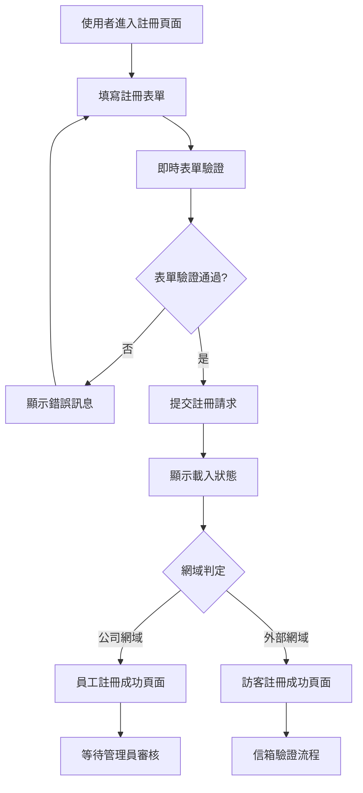
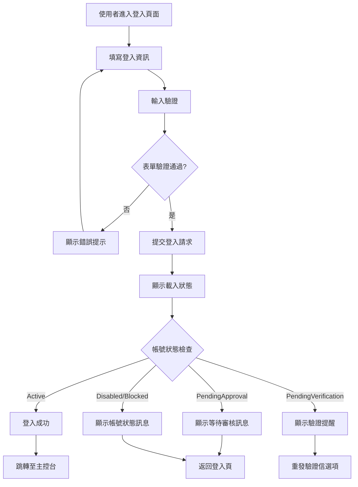
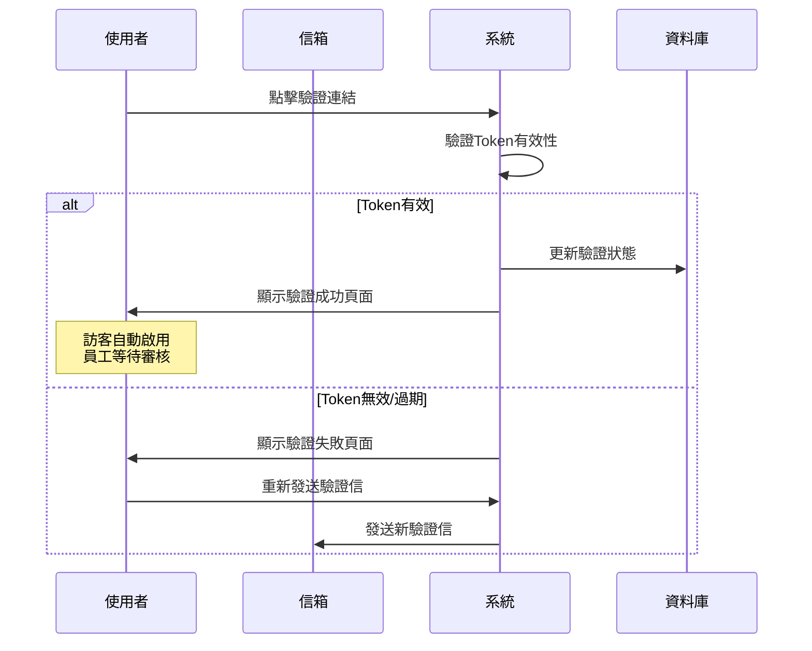
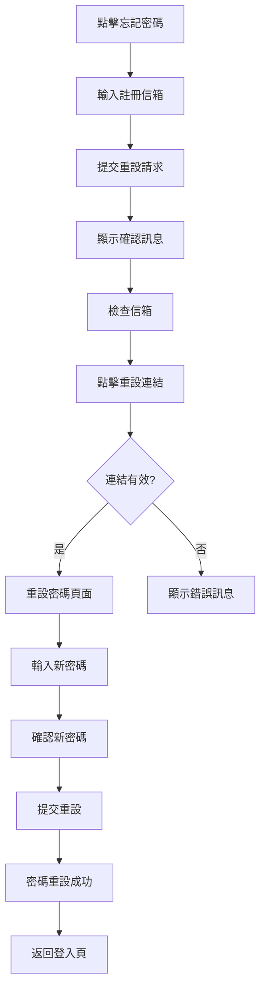

# UI/UX Flow 設計規格書：使用者註冊與登入功能 (階段1.1)

## 版本資訊
- **文檔版本**：1.0
- **建立日期**：2025-09-26
- **負責人**：系統分析師
- **審核狀態**：待審核
- **相關專案**：SoftwareDevelopment.API

---

## 1. UI/UX Flow 總覽

### 1.1 主要用戶流程

本階段設計了三個主要用戶流程：
1. **訪客註冊流程** - 外部使用者註冊帳號
2. **員工註冊流程** - 公司員工註冊帳號
3. **使用者登入流程** - 已註冊使用者登入系統

### 1.2 設計原則

- **簡潔性**：介面簡潔直觀，避免不必要的複雜性
- **一致性**：整個系統保持視覺和互動的一致性
- **回饋性**：提供即時的狀態回饋和錯誤提示
- **可及性**：符合無障礙設計標準 (WCAG 2.1 AA)
- **響應式**：支援桌面、平板和手機等多種裝置

---

## 2. 頁面架構設計

### 2.1 整體版面架構

```
┌─────────────────────────────────────────┐
│                Header                   │
│  [Logo] 軟體開發專案管理平台    [註冊] [登入] │
├─────────────────────────────────────────┤
│                                         │
│                Main Content             │
│            (各頁面內容區域)                │
│                                         │
├─────────────────────────────────────────┤
│                Footer                   │
│           © 2025 版權資訊                │
└─────────────────────────────────────────┘
```

### 2.2 色彩系統

- **主要顏色**：
  - 品牌藍 `#3b82f6` (Primary Blue)
  - 深藍 `#2563eb` (Dark Blue)
  - 成功綠 `#10b981` (Success Green)
  - 警告橙 `#f59e0b` (Warning Orange)
  - 錯誤紅 `#ef4444` (Error Red)

- **中性顏色**：
  - 文字深灰 `#374151`
  - 文字中灰 `#6b7280`
  - 邊框灰 `#d1d5db`
  - 背景灰 `#f9fafb`
  - 純白 `#ffffff`

### 2.3 字體系統

```css
/* 主標題 */
.heading-1 { font-size: 2rem; font-weight: 600; }
/* 副標題 */
.heading-2 { font-size: 1.5rem; font-weight: 600; }
/* 表單標題 */
.heading-3 { font-size: 1.25rem; font-weight: 500; }
/* 正文 */
.body-text { font-size: 1rem; font-weight: 400; }
/* 小字 */
.small-text { font-size: 0.875rem; font-weight: 400; }
```

---

## 3. 註冊流程 UI/UX Flow

### 3.1 註冊頁面整體流程



### 3.2 註冊頁面設計規格

#### 3.2.1 版面配置
```
┌─────────────────────────────────────────┐
│                Header                   │
├─────────────────────────────────────────┤
│                                         │
│  ┌─────────────────────────────────┐    │
│  │           註冊表單容器            │    │
│  │  ┌─────────────────────────┐    │    │
│  │  │       註冊新帳號         │    │    │
│  │  ├─────────────────────────┤    │    │
│  │  │   [使用者名稱輸入框]      │    │    │
│  │  │   [電子信箱輸入框]        │    │    │
│  │  │   [名字] [姓氏]          │    │    │
│  │  │   [密碼輸入框]           │    │    │
│  │  │   [確認密碼輸入框]        │    │    │
│  │  │   [服務條款同意]         │    │    │
│  │  │       [註冊按鈕]         │    │    │
│  │  └─────────────────────────┘    │    │
│  └─────────────────────────────────┘    │
│                                         │
├─────────────────────────────────────────┤
│                Footer                   │
└─────────────────────────────────────────┘
```

#### 3.2.2 表單欄位規格

| 欄位名稱 | 輸入類型 | 驗證規則 | 提示訊息 |
|---------|---------|---------|---------|
| 使用者名稱 | text | 3-50字元，英數字底線 | "請輸入使用者名稱" |
| 電子信箱 | email | RFC 5322 格式 | "請輸入有效的電子信箱" |
| 名字 | text | 1-50字元，必填 | "請輸入名字" |
| 姓氏 | text | 1-50字元，必填 | "請輸入姓氏" |
| 密碼 | password | 8字元+，含大小寫數字 | "密碼至少8字元，需包含大小寫字母和數字" |
| 確認密碼 | password | 與密碼相符 | "請再次輸入密碼" |

#### 3.2.3 即時驗證行為

```javascript
// 驗證觸發時機
- onBlur: 失去焦點時驗證
- onChange: 密碼強度即時檢查
- onSubmit: 提交前完整驗證

// 視覺回饋
- 成功: 綠色邊框 + 勾選圖示
- 錯誤: 紅色邊框 + 錯誤訊息
- 載入: 按鈕顯示旋轉動畫
```

### 3.3 密碼強度指示器設計

```
密碼強度：[████████░░] 強
條件檢查：
✓ 至少8個字元
✓ 包含大寫字母
✓ 包含小寫字母
✓ 包含數字
✗ 包含特殊符號 (建議)
```

### 3.4 註冊成功頁面設計

#### 3.4.1 員工註冊成功頁面
```
┌─────────────────────────────────────────┐
│              ✓ 註冊成功！                │
│                                         │
│  感謝您註冊軟體開發專案管理平台！          │
│                                         │
│  由於您使用的是公司信箱，您的帳號需要      │
│  等待管理員審核才能啟用。                │
│                                         │
│  📧 我們已發送確認信至：                │
│  john@company.com                       │
│                                         │
│  📋 審核狀態：待審核                     │
│  ⏰ 預計審核時間：1-2個工作日             │
│                                         │
│  [返回首頁] [重新發送確認信]              │
└─────────────────────────────────────────┘
```

#### 3.4.2 訪客註冊成功頁面
```
┌─────────────────────────────────────────┐
│              ✓ 註冊成功！                │
│                                         │
│  感謝您註冊軟體開發專案管理平台！          │
│                                         │
│  📧 我們已發送驗證信至：                │
│  user@example.com                       │
│                                         │
│  請點擊信中的連結以完成帳號驗證。          │
│                                         │
│  ⏰ 驗證連結有效期：24小時               │
│                                         │
│  [返回首頁] [重新發送驗證信]              │
└─────────────────────────────────────────┘
```

---

## 4. 登入流程 UI/UX Flow

### 4.1 登入頁面整體流程



### 4.2 登入頁面設計規格

#### 4.2.1 版面配置
```
┌─────────────────────────────────────────┐
│                Header                   │
├─────────────────────────────────────────┤
│                                         │
│  ┌─────────────────────────────────┐    │
│  │           登入表單容器            │    │
│  │  ┌─────────────────────────┐    │    │
│  │  │        歡迎回來！         │    │    │
│  │  ├─────────────────────────┤    │    │
│  │  │  [帳號/信箱輸入框]       │    │    │
│  │  │  [密碼輸入框] [👁]        │    │    │
│  │  │  ☐ 記住我    忘記密碼?    │    │    │
│  │  │      [登入按鈕]          │    │    │
│  │  │  ──────────────────────  │    │    │
│  │  │     還沒有帳號？註冊      │    │    │
│  │  └─────────────────────────┘    │    │
│  └─────────────────────────────────┘    │
│                                         │
├─────────────────────────────────────────┤
│                Footer                   │
└─────────────────────────────────────────┘
```

#### 4.2.2 登入表單欄位

| 欄位名稱 | 輸入類型 | 驗證規則 | 提示訊息 |
|---------|---------|---------|---------|
| 帳號/信箱 | text | 非空，支援使用者名稱或信箱 | "請輸入使用者名稱或信箱" |
| 密碼 | password | 非空 | "請輸入密碼" |
| 記住我 | checkbox | 可選 | "延長登入狀態至30天" |

#### 4.2.3 登入狀態處理

```javascript
// 登入狀態回應處理
switch(userStatus) {
    case 'Active':
        // 登入成功，跳轉至主控台
        redirectToDashboard();
        break;
    case 'PendingApproval':
        showModal({
            title: '帳號待審核',
            message: '您的帳號正在等待管理員審核，請耐心等待。',
            type: 'info'
        });
        break;
    case 'PendingVerification':
        showModal({
            title: '請驗證信箱',
            message: '請先驗證您的信箱再進行登入。',
            actions: ['重新發送驗證信', '確定']
        });
        break;
    case 'Disabled':
        showModal({
            title: '帳號已停用',
            message: '您的帳號已被停用，請聯絡管理員。',
            type: 'warning'
        });
        break;
}
```

---

## 5. 信箱驗證流程 UI/UX

### 5.1 信箱驗證流程



### 5.2 驗證成功頁面設計

```
┌─────────────────────────────────────────┐
│              ✓ 信箱驗證成功！             │
│                                         │
│  🎉 恭喜！您的信箱已成功驗證。            │
│                                         │
│  📧 驗證信箱：user@example.com          │
│  ⏰ 驗證時間：2025-09-26 14:30:00       │
│                                         │
│  您現在可以使用完整的系統功能。            │
│                                         │
│  [立即登入] [返回首頁]                   │
└─────────────────────────────────────────┘
```

### 5.3 驗證失敗頁面設計

```
┌─────────────────────────────────────────┐
│              ❌ 驗證連結無效               │
│                                         │
│  很抱歉，此驗證連結可能已過期或無效。      │
│                                         │
│  可能的原因：                           │
│  • 連結已過期（有效期24小時）             │
│  • 連結格式不正確                       │
│  • 此信箱已完成驗證                     │
│                                         │
│  [重新發送驗證信] [聯絡客服]              │
└─────────────────────────────────────────┘
```

---

## 6. 忘記密碼流程 UI/UX

### 6.1 忘記密碼流程



### 6.2 忘記密碼頁面設計

```
┌─────────────────────────────────────────┐
│                忘記密碼                  │
│                                         │
│  請輸入您註冊時使用的電子信箱，            │
│  我們將發送重設連結給您。                 │
│                                         │
│  ┌─────────────────────────────────┐    │
│  │  [電子信箱輸入框]                │    │
│  │      [發送重設連結]              │    │
│  └─────────────────────────────────┘    │
│                                         │
│  記起密碼了？[返回登入]                   │
└─────────────────────────────────────────┘
```

### 6.3 密碼重設頁面設計

```
┌─────────────────────────────────────────┐
│                設定新密碼                 │
│                                         │
│  請設定您的新密碼                        │
│                                         │
│  ┌─────────────────────────────────┐    │
│  │  [新密碼輸入框]                  │    │
│  │  [確認新密碼輸入框]              │    │
│  │  ──────────────────────────     │    │
│  │  密碼強度：[████████░░] 強       │    │
│  │      [確認重設密碼]              │    │
│  └─────────────────────────────────┘    │
│                                         │
└─────────────────────────────────────────┘
```

---

## 7. 狀態與錯誤處理 UI/UX

### 7.1 載入狀態設計

#### 7.1.1 按鈕載入狀態
```css
.loading-button {
    position: relative;
    pointer-events: none;
    opacity: 0.8;
}

.loading-button::after {
    content: '';
    position: absolute;
    width: 16px;
    height: 16px;
    border: 2px solid transparent;
    border-top-color: #ffffff;
    border-radius: 50%;
    animation: spin 1s linear infinite;
}
```

#### 7.1.2 頁面載入狀態
```
┌─────────────────────────────────────────┐
│                                         │
│              ⏳ 處理中...               │
│                                         │
│         [旋轉載入圖示]                   │
│                                         │
│          請稍候，系統正在處理您的請求...    │
│                                         │
└─────────────────────────────────────────┘
```

### 7.2 錯誤訊息設計

#### 7.2.1 表單錯誤訊息
```css
.error-message {
    color: #ef4444;
    font-size: 0.875rem;
    margin-top: 0.25rem;
    display: flex;
    align-items: center;
    gap: 0.25rem;
}

.error-message::before {
    content: '⚠️';
    font-size: 0.75rem;
}
```

#### 7.2.2 系統錯誤對話框
```
┌─────────────────────────────────────────┐
│  ❌ 錯誤                                │
│  ─────────────────────────────────────── │
│                                         │
│  很抱歉，系統發生錯誤：                   │
│                                         │
│  • 網路連線異常，請檢查網路設定            │
│  • 或稍後再試                           │
│                                         │
│  錯誤代碼：NET_001                      │
│                                         │
│              [確定] [重試]                │
└─────────────────────────────────────────┘
```

### 7.3 成功訊息設計

#### 7.3.1 Toast 通知
```css
.toast-success {
    background: #10b981;
    color: white;
    padding: 1rem 1.5rem;
    border-radius: 8px;
    box-shadow: 0 4px 12px rgba(0, 0, 0, 0.15);
    display: flex;
    align-items: center;
    gap: 0.75rem;
}

.toast-success::before {
    content: '✓';
    font-size: 1.25rem;
}
```

---

## 8. 響應式設計規範

### 8.1 斷點設計

```css
/* 手機版 */
@media (max-width: 640px) {
    .form-container {
        margin: 1rem;
        padding: 1.5rem;
    }

    .form-row {
        grid-template-columns: 1fr;
    }
}

/* 平板版 */
@media (min-width: 641px) and (max-width: 1024px) {
    .form-container {
        max-width: 500px;
        margin: 2rem auto;
    }
}

/* 桌面版 */
@media (min-width: 1025px) {
    .form-container {
        max-width: 600px;
        margin: 3rem auto;
    }
}
```

### 8.2 手機版特殊適配

#### 8.2.1 表單欄位調整
- 輸入框高度增加至 48px 以符合觸控標準
- 按鈕最小觸控區域 44px × 44px
- 文字大小最小 16px 避免自動縮放

#### 8.2.2 導航調整
```
手機版 Header：
┌─────────────────────────────────────────┐
│  [☰] 軟體開發專案管理平台        [👤]    │
└─────────────────────────────────────────┘

展開選單：
┌─────────────────────────────────────────┐
│  [✕] 選單                               │
├─────────────────────────────────────────┤
│  📝 註冊                                │
│  🔐 登入                                │
│  ❓ 說明                                │
│  📞 聯絡我們                            │
└─────────────────────────────────────────┘
```

---

## 9. 無障礙設計 (Accessibility)

### 9.1 鍵盤導航

```javascript
// Tab 順序設定
tabindex="0" // 正常順序
tabindex="-1" // 可程式化聚焦但不在 Tab 順序中

// 鍵盤快捷鍵
Alt + R: 跳至註冊表單
Alt + L: 跳至登入表單
Enter: 提交表單
Escape: 關閉對話框
```

### 9.2 螢幕閱讀器支援

```html
<!-- ARIA 標籤 -->
<form role="form" aria-labelledby="register-title">
    <h2 id="register-title">註冊新帳號</h2>

    <input
        type="text"
        id="username"
        aria-required="true"
        aria-describedby="username-error"
        aria-invalid="false"
    />

    <div
        id="username-error"
        role="alert"
        aria-live="polite"
    >
        使用者名稱為必填欄位
    </div>
</form>
```

### 9.3 對比度和顏色

```css
/* 確保 WCAG AA 標準 4.5:1 對比度 */
.text-primary { color: #374151; } /* 對白色背景 11.9:1 */
.text-secondary { color: #6b7280; } /* 對白色背景 7.6:1 */
.error-text { color: #dc2626; } /* 對白色背景 7.7:1 */
.success-text { color: #059669; } /* 對白色背景 6.6:1 */
```

---

## 10. 效能最佳化

### 10.1 載入優化

```javascript
// 懶載入非關鍵組件
const LazyRegisterForm = React.lazy(() =>
    import('./components/RegisterForm')
);

// 預載入關鍵資源
<link rel="preload" href="/fonts/Inter-Regular.woff2" as="font" type="font/woff2" crossorigin>

// 圖片最佳化

```

### 10.2 表單效能

```javascript
// 防抖驗證
const debouncedValidation = useMemo(
    () => debounce(validateField, 300),
    []
);

// 避免不必要的重渲染
const MemoizedInput = React.memo(FormInput);
```

---

## 11. 安全性 UX 考量

### 11.1 密碼安全提示

```
密碼安全提示：
┌─────────────────────────────────────────┐
│  🔒 建立安全密碼                         │
│  ─────────────────────────────────────── │
│  ✓ 至少8個字元                          │
│  ✓ 包含大寫字母 (A-Z)                   │
│  ✓ 包含小寫字母 (a-z)                   │
│  ✓ 包含數字 (0-9)                       │
│  ✓ 包含特殊符號 (!@#$%^&*)              │
│  ✓ 避免使用個人資訊                      │
│  ✓ 不要重複使用舊密碼                    │
└─────────────────────────────────────────┘
```

### 11.2 帳號安全狀態顯示

```javascript
// 帳號狀態指示器
const SecurityStatusIndicator = ({ status }) => {
    const indicators = {
        'verified': { icon: '✅', text: '已驗證', color: 'green' },
        'pending': { icon: '⏳', text: '待驗證', color: 'orange' },
        'blocked': { icon: '🚫', text: '已封鎖', color: 'red' }
    };

    return (
        <span className={`status-${indicators[status].color}`}>
            {indicators[status].icon} {indicators[status].text}
        </span>
    );
};
```

---

## 12. 測試與驗證

### 12.1 可用性測試清單

- [ ] 註冊流程完整測試（訪客 & 員工）
- [ ] 登入流程各種狀態測試
- [ ] 表單驗證即時回饋測試
- [ ] 錯誤處理和恢復測試
- [ ] 響應式設計多裝置測試
- [ ] 無障礙功能測試
- [ ] 效能載入時間測試

### 12.2 A/B 測試計劃

```javascript
// 測試變體
const testVariants = {
    'registerButtonText': ['註冊', '建立帳號', '加入我們'],
    'formLayout': ['single-column', 'two-column'],
    'colorScheme': ['blue-theme', 'green-theme']
};

// 成功指標
const metrics = {
    'registrationCompletion': '註冊完成率',
    'formAbandonmentRate': '表單放棄率',
    'timeToComplete': '完成時間',
    'errorRate': '錯誤率'
};
```

---

## 13. 實作指引

### 13.1 技術棧選擇

- **前端框架**：React 18 + TypeScript
- **樣式方案**：Styled-jsx (已實作) / Tailwind CSS (推薦)
- **表單處理**：React Hook Form + Yup
- **狀態管理**：React Context / Zustand
- **HTTP 客戶端**：Axios
- **通知系統**：React Hot Toast

### 13.2 元件分割建議

```
components/
├── forms/
│   ├── RegisterForm.tsx       # 註冊表單 ✅
│   ├── LoginForm.tsx          # 登入表單
│   ├── ForgotPasswordForm.tsx # 忘記密碼表單
│   └── ResetPasswordForm.tsx  # 重設密碼表單
├── ui/
│   ├── Button.tsx             # 按鈕元件
│   ├── Input.tsx              # 輸入框元件
│   ├── Modal.tsx              # 對話框元件
│   ├── Toast.tsx              # 通知元件
│   └── LoadingSpinner.tsx     # 載入指示器
└── layout/
    ├── Header.tsx             # 頁面標頭
    ├── Footer.tsx             # 頁面頁尾
    └── MainLayout.tsx         # 主要版面
```

---

## 14. 後續改進建議

### 14.1 第二階段規劃

1. **社群登入**：Google、GitHub OAuth 整合
2. **雙因素驗證**：SMS 或 TOTP 支援
3. **個人資料管理**：使用者設定頁面
4. **進階安全設定**：登入裝置管理

### 14.2 UX 最佳化

1. **智能表單填寫**：自動完成建議
2. **漸進式表單**：分步驟註冊流程
3. **個人化體驗**：根據用戶類型調整介面
4. **進階動畫**：微互動和轉場效果

---

## 文檔版本資訊
- **文檔版本**：1.0
- **建立日期**：2025-09-26
- **最後更新**：2025-09-26
- **負責人**：系統分析師
- **審核狀態**：待審核
- **下一次檢討日期**：2025-10-26

## 參考文檔
- [使用者需求分析書](/docs/phase-1-1-user-authentication-requirements.md)
- [系統設計規格書](/docs/phase-1-1-system-design-specification.md)
- [C# 編程規範](/docs/CSharp-Coding-Guidelines.md)

---

*本 UI/UX Flow 規格書將隨專案進展持續更新，所有變更都將記錄在版本控制系統中。*