# 軟體開發專案管理平台 - 第2階段序列圖設計

## 版本資訊
- **文檔版本**：1.0
- **建立日期**：2025-09-27
- **負責人**：系統設計師
- **審核狀態**：待審核
- **相關專案**：SoftwareDevelopment.API - Phase 2

---

## 1. 序列圖設計概覽

### 1.1 設計原則
基於第2階段的系統架構和用例分析，序列圖設計遵循以下原則：

- **完整性**：涵蓋所有關鍵業務流程
- **準確性**：反映真實的系統互動行為
- **清晰性**：易於理解的時序邏輯
- **技術對應**：與類別圖和架構設計一致
- **異常處理**：包含錯誤和異常場景

### 1.2 序列圖分類

**核心業務流程**：
1. 專案模板生成流程
2. 任務管理生命週期
3. AI程式碼品質檢查流程
4. 工作流程執行流程

**整合流程**：
5. GitLab同步流程
6. 跨系統事件處理流程
7. 通知處理流程

**協作流程**：
8. 團隊協作流程
9. 審核流程
10. 報表生成流程

---

## 2. 專案模板生成序列圖

### 2.1 完整專案生成流程

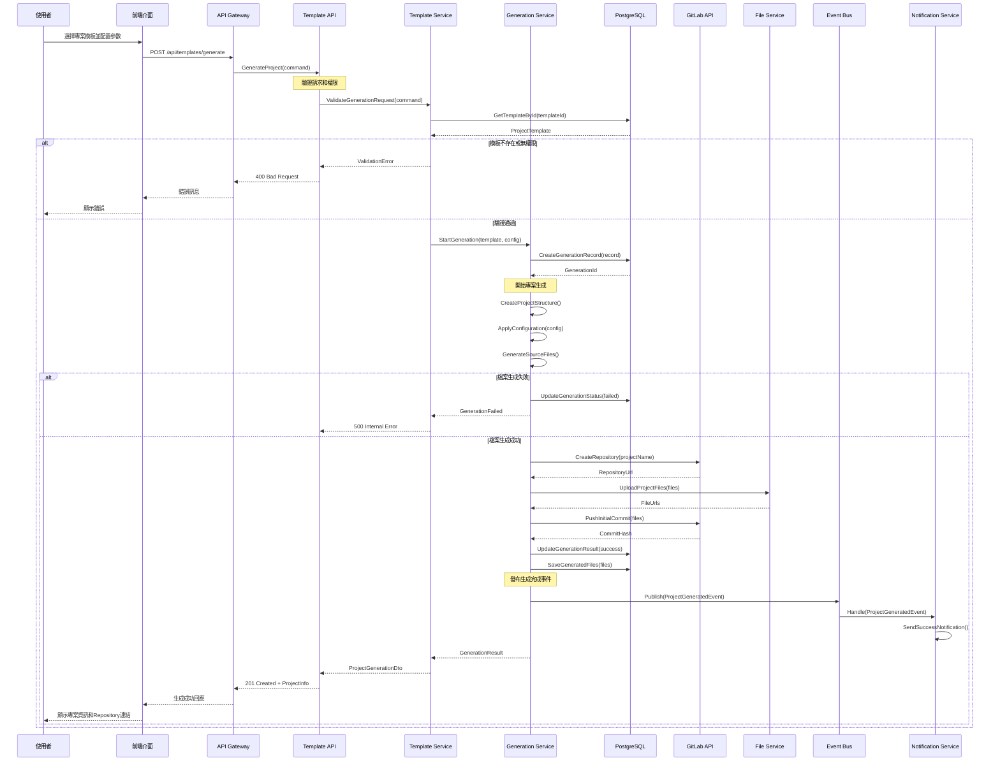
```mermaid
sequenceDiagram
    participant User as 使用者
    participant UI as 前端介面
    participant Gateway as API Gateway
    participant TemplateAPI as Template API
    participant TemplateService as Template Service
    participant GenerationService as Generation Service
    participant Database as PostgreSQL
    participant GitLab as GitLab API
    participant FileService as File Service
    participant EventBus as Event Bus
    participant NotificationService as Notification Service

    User->>UI: 選擇專案模板並配置參數
    UI->>Gateway: POST /api/templates/generate
    Gateway->>TemplateAPI: GenerateProject(command)

    Note over TemplateAPI: 驗證請求和權限
    TemplateAPI->>TemplateService: ValidateGenerationRequest(command)
    TemplateService->>Database: GetTemplateById(templateId)
    Database-->>TemplateService: ProjectTemplate

    alt 模板不存在或無權限
        TemplateService-->>TemplateAPI: ValidationError
        TemplateAPI-->>Gateway: 400 Bad Request
        Gateway-->>UI: 錯誤訊息
        UI-->>User: 顯示錯誤
    else 驗證通過
        TemplateService->>GenerationService: StartGeneration(template, config)
        GenerationService->>Database: CreateGenerationRecord(record)
        Database-->>GenerationService: GenerationId

        Note over GenerationService: 開始專案生成
        GenerationService->>GenerationService: CreateProjectStructure()
        GenerationService->>GenerationService: ApplyConfiguration(config)
        GenerationService->>GenerationService: GenerateSourceFiles()

        alt 檔案生成失敗
            GenerationService->>Database: UpdateGenerationStatus(failed)
            GenerationService-->>TemplateService: GenerationFailed
            TemplateService-->>TemplateAPI: 500 Internal Error
        else 檔案生成成功
            GenerationService->>GitLab: CreateRepository(projectName)
            GitLab-->>GenerationService: RepositoryUrl

            GenerationService->>FileService: UploadProjectFiles(files)
            FileService-->>GenerationService: FileUrls

            GenerationService->>GitLab: PushInitialCommit(files)
            GitLab-->>GenerationService: CommitHash

            GenerationService->>Database: UpdateGenerationResult(success)
            GenerationService->>Database: SaveGeneratedFiles(files)

            Note over GenerationService: 發布生成完成事件
            GenerationService->>EventBus: Publish(ProjectGeneratedEvent)
            EventBus->>NotificationService: Handle(ProjectGeneratedEvent)
            NotificationService->>NotificationService: SendSuccessNotification()

            GenerationService-->>TemplateService: GenerationResult
            TemplateService-->>TemplateAPI: ProjectGenerationDto
            TemplateAPI-->>Gateway: 201 Created + ProjectInfo
            Gateway-->>UI: 生成成功回應
            UI-->>User: 顯示專案資訊和Repository連結
        end
    end
```

### 2.2 模板配置驗證流程

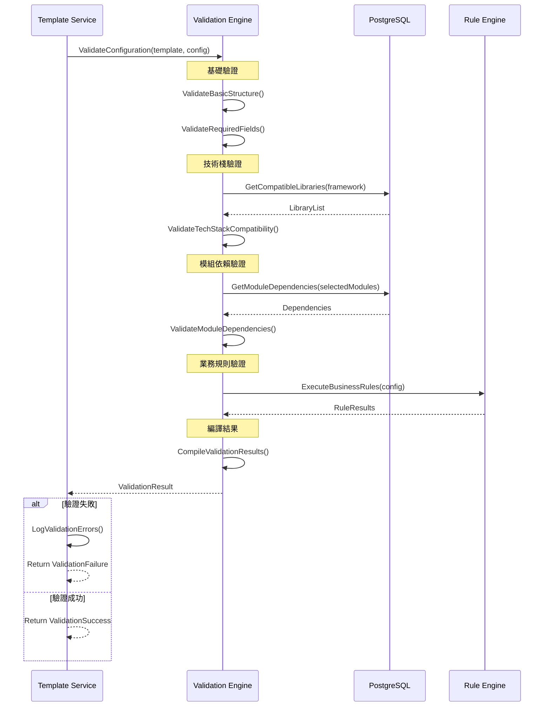
```mermaid
sequenceDiagram
    participant TemplateService as Template Service
    participant ValidationEngine as Validation Engine
    participant Database as PostgreSQL
    participant RuleEngine as Rule Engine

    TemplateService->>ValidationEngine: ValidateConfiguration(template, config)

    Note over ValidationEngine: 基礎驗證
    ValidationEngine->>ValidationEngine: ValidateBasicStructure()
    ValidationEngine->>ValidationEngine: ValidateRequiredFields()

    Note over ValidationEngine: 技術棧驗證
    ValidationEngine->>Database: GetCompatibleLibraries(framework)
    Database-->>ValidationEngine: LibraryList
    ValidationEngine->>ValidationEngine: ValidateTechStackCompatibility()

    Note over ValidationEngine: 模組依賴驗證
    ValidationEngine->>Database: GetModuleDependencies(selectedModules)
    Database-->>ValidationEngine: Dependencies
    ValidationEngine->>ValidationEngine: ValidateModuleDependencies()

    Note over ValidationEngine: 業務規則驗證
    ValidationEngine->>RuleEngine: ExecuteBusinessRules(config)
    RuleEngine-->>ValidationEngine: RuleResults

    Note over ValidationEngine: 編譯結果
    ValidationEngine->>ValidationEngine: CompileValidationResults()
    ValidationEngine-->>TemplateService: ValidationResult

    alt 驗證失敗
        TemplateService->>TemplateService: LogValidationErrors()
        TemplateService-->>TemplateService: Return ValidationFailure
    else 驗證成功
        TemplateService-->>TemplateService: Return ValidationSuccess
    end
```

---

## 3. 任務管理生命週期序列圖

### 3.1 任務建立和指派流程

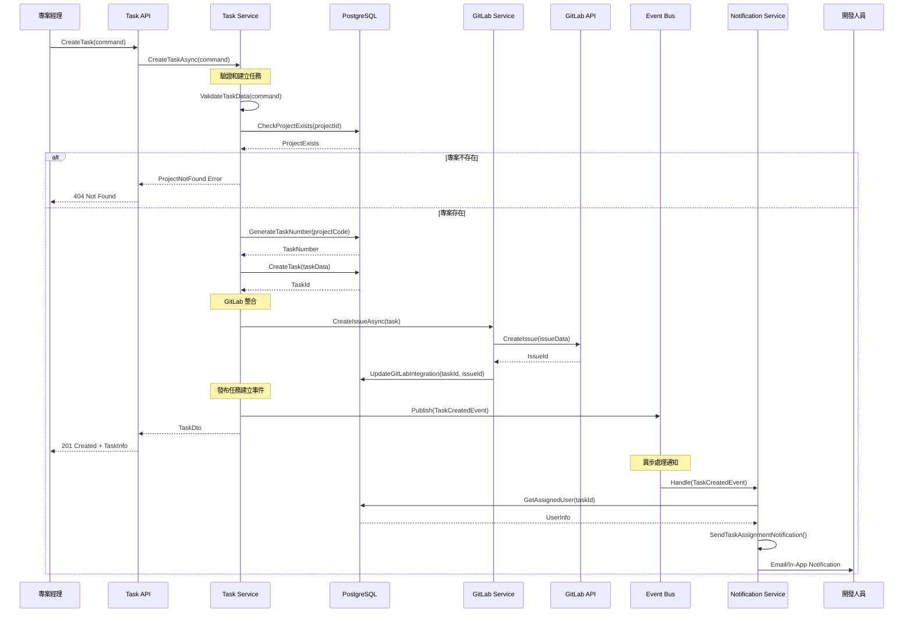
```mermaid
sequenceDiagram
    participant PM as 專案經理
    participant TaskAPI as Task API
    participant TaskService as Task Service
    participant Database as PostgreSQL
    participant GitLabService as GitLab Service
    participant GitLab as GitLab API
    participant EventBus as Event Bus
    participant NotificationService as Notification Service
    participant Developer as 開發人員

    PM->>TaskAPI: CreateTask(command)
    TaskAPI->>TaskService: CreateTaskAsync(command)

    Note over TaskService: 驗證和建立任務
    TaskService->>TaskService: ValidateTaskData(command)
    TaskService->>Database: CheckProjectExists(projectId)
    Database-->>TaskService: ProjectExists

    alt 專案不存在
        TaskService-->>TaskAPI: ProjectNotFound Error
        TaskAPI-->>PM: 404 Not Found
    else 專案存在
        TaskService->>Database: GenerateTaskNumber(projectCode)
        Database-->>TaskService: TaskNumber

        TaskService->>Database: CreateTask(taskData)
        Database-->>TaskService: TaskId

        Note over TaskService: GitLab 整合
        TaskService->>GitLabService: CreateIssueAsync(task)
        GitLabService->>GitLab: CreateIssue(issueData)
        GitLab-->>GitLabService: IssueId
        GitLabService->>Database: UpdateGitLabIntegration(taskId, issueId)

        Note over TaskService: 發布任務建立事件
        TaskService->>EventBus: Publish(TaskCreatedEvent)

        TaskService-->>TaskAPI: TaskDto
        TaskAPI-->>PM: 201 Created + TaskInfo

        Note over EventBus: 異步處理通知
        EventBus->>NotificationService: Handle(TaskCreatedEvent)
        NotificationService->>Database: GetAssignedUser(taskId)
        Database-->>NotificationService: UserInfo
        NotificationService->>NotificationService: SendTaskAssignmentNotification()
        NotificationService->>Developer: Email/In-App Notification
    end
```

### 3.2 任務狀態更新與進度追蹤流程

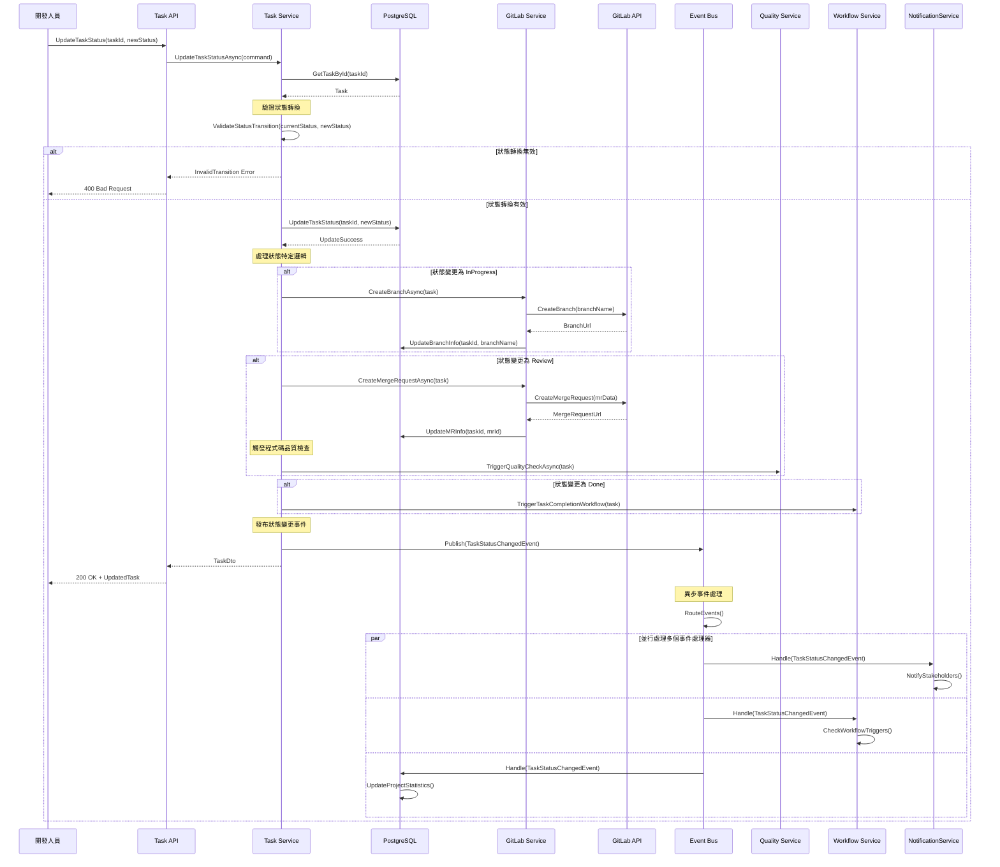
```mermaid
sequenceDiagram
    participant Developer as 開發人員
    participant TaskAPI as Task API
    participant TaskService as Task Service
    participant Database as PostgreSQL
    participant GitLabService as GitLab Service
    participant GitLab as GitLab API
    participant EventBus as Event Bus
    participant QualityService as Quality Service
    participant WorkflowService as Workflow Service

    Developer->>TaskAPI: UpdateTaskStatus(taskId, newStatus)
    TaskAPI->>TaskService: UpdateTaskStatusAsync(command)

    TaskService->>Database: GetTaskById(taskId)
    Database-->>TaskService: Task

    Note over TaskService: 驗證狀態轉換
    TaskService->>TaskService: ValidateStatusTransition(currentStatus, newStatus)

    alt 狀態轉換無效
        TaskService-->>TaskAPI: InvalidTransition Error
        TaskAPI-->>Developer: 400 Bad Request
    else 狀態轉換有效
        TaskService->>Database: UpdateTaskStatus(taskId, newStatus)
        Database-->>TaskService: UpdateSuccess

        Note over TaskService: 處理狀態特定邏輯
        alt 狀態變更為 InProgress
            TaskService->>GitLabService: CreateBranchAsync(task)
            GitLabService->>GitLab: CreateBranch(branchName)
            GitLab-->>GitLabService: BranchUrl
            GitLabService->>Database: UpdateBranchInfo(taskId, branchName)
        end

        alt 狀態變更為 Review
            TaskService->>GitLabService: CreateMergeRequestAsync(task)
            GitLabService->>GitLab: CreateMergeRequest(mrData)
            GitLab-->>GitLabService: MergeRequestUrl
            GitLabService->>Database: UpdateMRInfo(taskId, mrId)

            Note over TaskService: 觸發程式碼品質檢查
            TaskService->>QualityService: TriggerQualityCheckAsync(task)
        end

        alt 狀態變更為 Done
            TaskService->>WorkflowService: TriggerTaskCompletionWorkflow(task)
        end

        Note over TaskService: 發布狀態變更事件
        TaskService->>EventBus: Publish(TaskStatusChangedEvent)

        TaskService-->>TaskAPI: TaskDto
        TaskAPI-->>Developer: 200 OK + UpdatedTask

        Note over EventBus: 異步事件處理
        EventBus->>EventBus: RouteEvents()

        par 並行處理多個事件處理器
            EventBus->>NotificationService: Handle(TaskStatusChangedEvent)
            NotificationService->>NotificationService: NotifyStakeholders()
        and
            EventBus->>WorkflowService: Handle(TaskStatusChangedEvent)
            WorkflowService->>WorkflowService: CheckWorkflowTriggers()
        and
            EventBus->>Database: Handle(TaskStatusChangedEvent)
            Database->>Database: UpdateProjectStatistics()
        end
    end
```

### 3.3 任務依賴管理流程

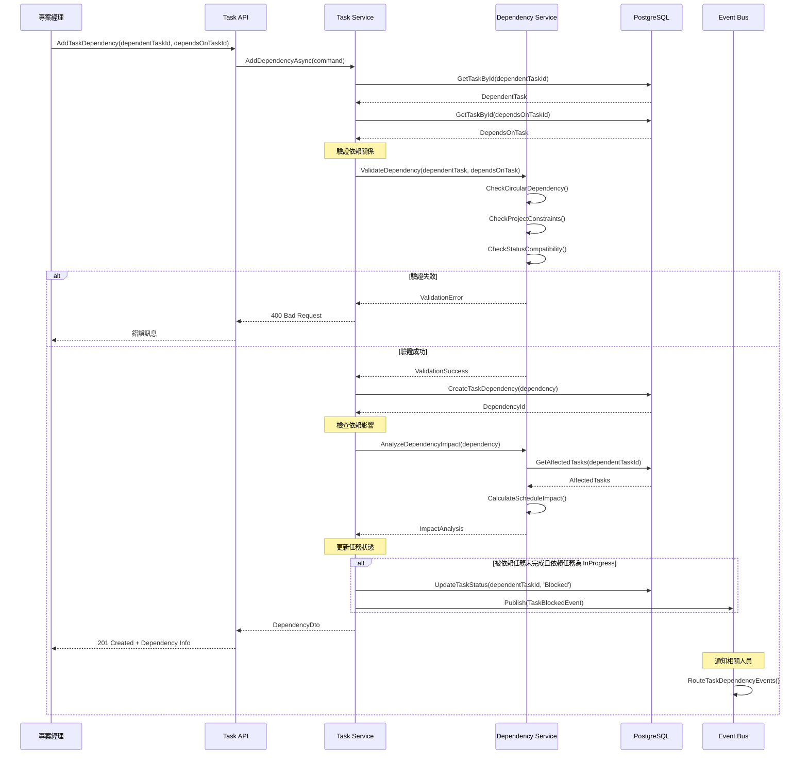
```mermaid
sequenceDiagram
    participant PM as 專案經理
    participant TaskAPI as Task API
    participant TaskService as Task Service
    participant DependencyService as Dependency Service
    participant Database as PostgreSQL
    participant EventBus as Event Bus

    PM->>TaskAPI: AddTaskDependency(dependentTaskId, dependsOnTaskId)
    TaskAPI->>TaskService: AddDependencyAsync(command)

    TaskService->>Database: GetTaskById(dependentTaskId)
    Database-->>TaskService: DependentTask

    TaskService->>Database: GetTaskById(dependsOnTaskId)
    Database-->>TaskService: DependsOnTask

    Note over TaskService: 驗證依賴關係
    TaskService->>DependencyService: ValidateDependency(dependentTask, dependsOnTask)

    DependencyService->>DependencyService: CheckCircularDependency()
    DependencyService->>DependencyService: CheckProjectConstraints()
    DependencyService->>DependencyService: CheckStatusCompatibility()

    alt 驗證失敗
        DependencyService-->>TaskService: ValidationError
        TaskService-->>TaskAPI: 400 Bad Request
        TaskAPI-->>PM: 錯誤訊息
    else 驗證成功
        DependencyService-->>TaskService: ValidationSuccess

        TaskService->>Database: CreateTaskDependency(dependency)
        Database-->>TaskService: DependencyId

        Note over TaskService: 檢查依賴影響
        TaskService->>DependencyService: AnalyzeDependencyImpact(dependency)
        DependencyService->>Database: GetAffectedTasks(dependentTaskId)
        Database-->>DependencyService: AffectedTasks

        DependencyService->>DependencyService: CalculateScheduleImpact()
        DependencyService-->>TaskService: ImpactAnalysis

        Note over TaskService: 更新任務狀態
        alt 被依賴任務未完成且依賴任務為 InProgress
            TaskService->>Database: UpdateTaskStatus(dependentTaskId, 'Blocked')
            TaskService->>EventBus: Publish(TaskBlockedEvent)
        end

        TaskService-->>TaskAPI: DependencyDto
        TaskAPI-->>PM: 201 Created + Dependency Info

        Note over EventBus: 通知相關人員
        EventBus->>EventBus: RouteTaskDependencyEvents()
    end
```

---

## 4. AI程式碼品質檢查序列圖

### 4.1 自動觸發品質檢查流程

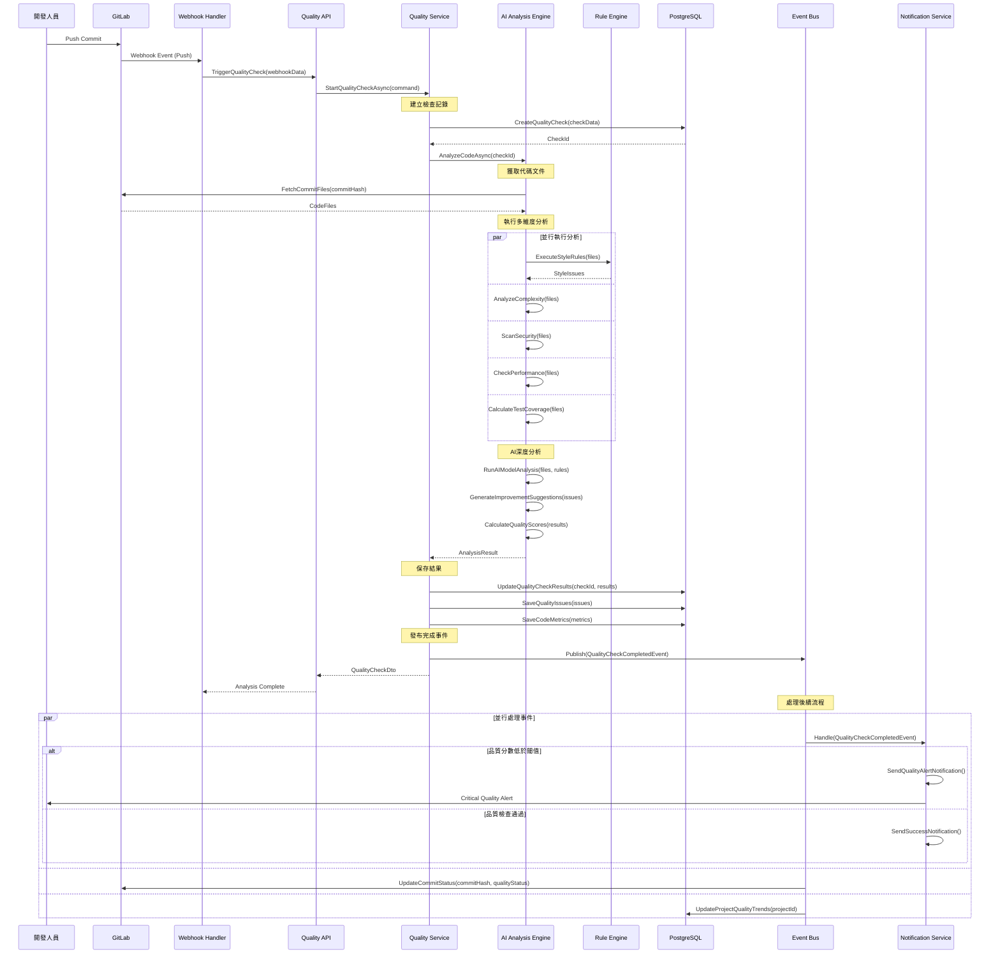
```mermaid
sequenceDiagram
    participant Developer as 開發人員
    participant GitLab as GitLab
    participant WebhookHandler as Webhook Handler
    participant QualityAPI as Quality API
    participant QualityService as Quality Service
    participant AIEngine as AI Analysis Engine
    participant RuleEngine as Rule Engine
    participant Database as PostgreSQL
    participant EventBus as Event Bus
    participant NotificationService as Notification Service

    Developer->>GitLab: Push Commit
    GitLab->>WebhookHandler: Webhook Event (Push)

    WebhookHandler->>QualityAPI: TriggerQualityCheck(webhookData)
    QualityAPI->>QualityService: StartQualityCheckAsync(command)

    Note over QualityService: 建立檢查記錄
    QualityService->>Database: CreateQualityCheck(checkData)
    Database-->>QualityService: CheckId

    QualityService->>AIEngine: AnalyzeCodeAsync(checkId)

    Note over AIEngine: 獲取代碼文件
    AIEngine->>GitLab: FetchCommitFiles(commitHash)
    GitLab-->>AIEngine: CodeFiles

    Note over AIEngine: 執行多維度分析
    par 並行執行分析
        AIEngine->>RuleEngine: ExecuteStyleRules(files)
        RuleEngine-->>AIEngine: StyleIssues
    and
        AIEngine->>AIEngine: AnalyzeComplexity(files)
    and
        AIEngine->>AIEngine: ScanSecurity(files)
    and
        AIEngine->>AIEngine: CheckPerformance(files)
    and
        AIEngine->>AIEngine: CalculateTestCoverage(files)
    end

    Note over AIEngine: AI深度分析
    AIEngine->>AIEngine: RunAIModelAnalysis(files, rules)
    AIEngine->>AIEngine: GenerateImprovementSuggestions(issues)
    AIEngine->>AIEngine: CalculateQualityScores(results)

    AIEngine-->>QualityService: AnalysisResult

    Note over QualityService: 保存結果
    QualityService->>Database: UpdateQualityCheckResults(checkId, results)
    QualityService->>Database: SaveQualityIssues(issues)
    QualityService->>Database: SaveCodeMetrics(metrics)

    Note over QualityService: 發布完成事件
    QualityService->>EventBus: Publish(QualityCheckCompletedEvent)

    QualityService-->>QualityAPI: QualityCheckDto
    QualityAPI-->>WebhookHandler: Analysis Complete

    Note over EventBus: 處理後續流程
    par 並行處理事件
        EventBus->>NotificationService: Handle(QualityCheckCompletedEvent)
        alt 品質分數低於閾值
            NotificationService->>NotificationService: SendQualityAlertNotification()
            NotificationService->>Developer: Critical Quality Alert
        else 品質檢查通過
            NotificationService->>NotificationService: SendSuccessNotification()
        end
    and
        EventBus->>GitLab: UpdateCommitStatus(commitHash, qualityStatus)
    and
        EventBus->>Database: UpdateProjectQualityTrends(projectId)
    end
```

### 4.2 手動品質檢查流程

```mermaid
sequenceDiagram
    participant TechLead as 技術主管
    participant QualityAPI as Quality API
    participant QualityService as Quality Service
    participant ConfigService as Configuration Service
    parameter Database as PostgreSQL
    participant AIEngine as AI Analysis Engine

    TechLead->>QualityAPI: ManualQualityCheck(projectId, configuration)
    QualityAPI->>QualityService: StartManualCheckAsync(command)

    Note over QualityService: 獲取項目配置
    QualityService->>ConfigService: GetProjectQualityConfig(projectId)
    ConfigService->>Database: GetQualityConfiguration(projectId)
    Database-->>ConfigService: QualityConfig
    ConfigService-->>QualityService: Configuration

    Note over QualityService: 驗證檢查權限
    QualityService->>QualityService: ValidateCheckPermissions(userId, projectId)

    alt 無檢查權限
        QualityService-->>QualityAPI: UnauthorizedError
        QualityAPI-->>TechLead: 403 Forbidden
    else 有檢查權限
        QualityService->>Database: CreateQualityCheck(manualCheck)
        Database-->>QualityService: CheckId

        Note over QualityService: 自訂規則檢查
        QualityService->>ConfigService: GetCustomRules(projectId)
        ConfigService->>Database: GetProjectRules(projectId)
        Database-->>ConfigService: CustomRules
        ConfigService-->>QualityService: RuleSet

        QualityService->>AIEngine: AnalyzeWithCustomRules(projectId, ruleSet)
        AIEngine->>AIEngine: ExecuteCustomAnalysis()
        AIEngine-->>QualityService: DetailedResults

        QualityService->>Database: SaveDetailedResults(results)
        QualityService-->>QualityAPI: ComprehensiveReport

        QualityAPI-->>TechLead: 200 OK + Detailed Quality Report
    end
```

### 4.3 品質規則管理流程

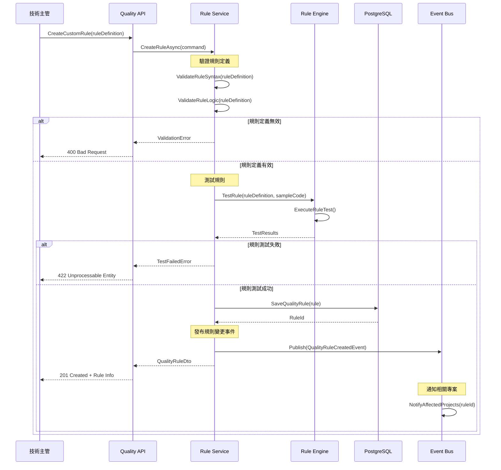
```mermaid
sequenceDiagram
    participant TechLead as 技術主管
    participant QualityAPI as Quality API
    participant RuleService as Rule Service
    participant RuleEngine as Rule Engine
    participant Database as PostgreSQL
    participant EventBus as Event Bus

    TechLead->>QualityAPI: CreateCustomRule(ruleDefinition)
    QualityAPI->>RuleService: CreateRuleAsync(command)

    Note over RuleService: 驗證規則定義
    RuleService->>RuleService: ValidateRuleSyntax(ruleDefinition)
    RuleService->>RuleService: ValidateRuleLogic(ruleDefinition)

    alt 規則定義無效
        RuleService-->>QualityAPI: ValidationError
        QualityAPI-->>TechLead: 400 Bad Request
    else 規則定義有效
        Note over RuleService: 測試規則
        RuleService->>RuleEngine: TestRule(ruleDefinition, sampleCode)
        RuleEngine->>RuleEngine: ExecuteRuleTest()
        RuleEngine-->>RuleService: TestResults

        alt 規則測試失敗
            RuleService-->>QualityAPI: TestFailedError
            QualityAPI-->>TechLead: 422 Unprocessable Entity
        else 規則測試成功
            RuleService->>Database: SaveQualityRule(rule)
            Database-->>RuleService: RuleId

            Note over RuleService: 發布規則變更事件
            RuleService->>EventBus: Publish(QualityRuleCreatedEvent)

            RuleService-->>QualityAPI: QualityRuleDto
            QualityAPI-->>TechLead: 201 Created + Rule Info

            Note over EventBus: 通知相關專案
            EventBus->>EventBus: NotifyAffectedProjects(ruleId)
        end
    end
```

---

## 5. 工作流程執行序列圖

### 5.1 工作流程啟動和執行流程

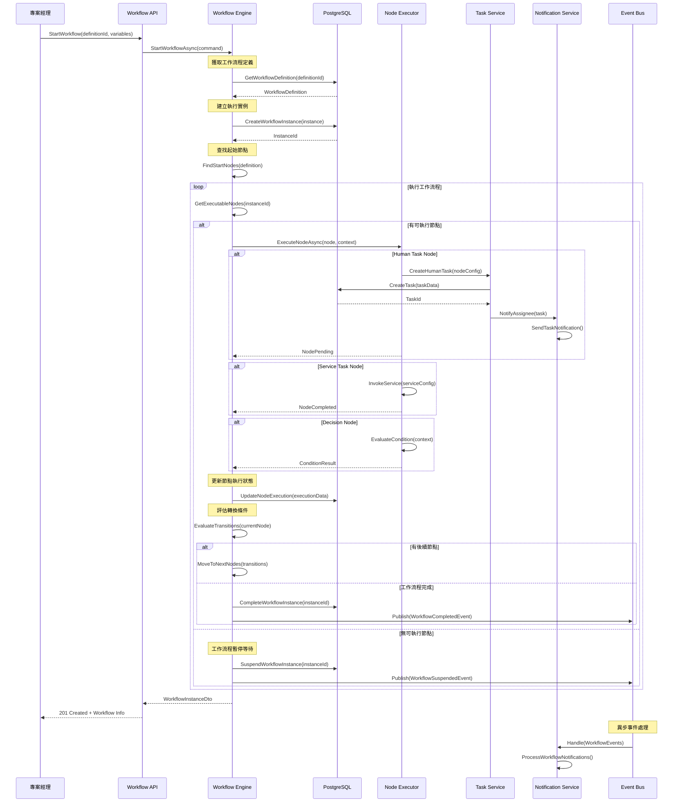
```mermaid
sequenceDiagram
    participant PM as 專案經理
    participant WorkflowAPI as Workflow API
    participant WorkflowEngine as Workflow Engine
    participant Database as PostgreSQL
    participant NodeExecutor as Node Executor
    participant TaskService as Task Service
    participant NotificationService as Notification Service
    participant EventBus as Event Bus

    PM->>WorkflowAPI: StartWorkflow(definitionId, variables)
    WorkflowAPI->>WorkflowEngine: StartWorkflowAsync(command)

    Note over WorkflowEngine: 獲取工作流程定義
    WorkflowEngine->>Database: GetWorkflowDefinition(definitionId)
    Database-->>WorkflowEngine: WorkflowDefinition

    Note over WorkflowEngine: 建立執行實例
    WorkflowEngine->>Database: CreateWorkflowInstance(instance)
    Database-->>WorkflowEngine: InstanceId

    Note over WorkflowEngine: 查找起始節點
    WorkflowEngine->>WorkflowEngine: FindStartNodes(definition)

    loop 執行工作流程
        WorkflowEngine->>WorkflowEngine: GetExecutableNodes(instanceId)

        alt 有可執行節點
            WorkflowEngine->>NodeExecutor: ExecuteNodeAsync(node, context)

            alt Human Task Node
                NodeExecutor->>TaskService: CreateHumanTask(nodeConfig)
                TaskService->>Database: CreateTask(taskData)
                Database-->>TaskService: TaskId
                TaskService->>NotificationService: NotifyAssignee(task)
                NotificationService->>NotificationService: SendTaskNotification()
                NodeExecutor-->>WorkflowEngine: NodePending
            end

            alt Service Task Node
                NodeExecutor->>NodeExecutor: InvokeService(serviceConfig)
                NodeExecutor-->>WorkflowEngine: NodeCompleted
            end

            alt Decision Node
                NodeExecutor->>NodeExecutor: EvaluateCondition(context)
                NodeExecutor-->>WorkflowEngine: ConditionResult
            end

            Note over WorkflowEngine: 更新節點執行狀態
            WorkflowEngine->>Database: UpdateNodeExecution(executionData)

            Note over WorkflowEngine: 評估轉換條件
            WorkflowEngine->>WorkflowEngine: EvaluateTransitions(currentNode)

            alt 有後續節點
                WorkflowEngine->>WorkflowEngine: MoveToNextNodes(transitions)
            else 工作流程完成
                WorkflowEngine->>Database: CompleteWorkflowInstance(instanceId)
                WorkflowEngine->>EventBus: Publish(WorkflowCompletedEvent)
            end

        else 無可執行節點
            Note over WorkflowEngine: 工作流程暫停等待
            WorkflowEngine->>Database: SuspendWorkflowInstance(instanceId)
            WorkflowEngine->>EventBus: Publish(WorkflowSuspendedEvent)
        end
    end

    WorkflowEngine-->>WorkflowAPI: WorkflowInstanceDto
    WorkflowAPI-->>PM: 201 Created + Workflow Info

    Note over EventBus: 異步事件處理
    EventBus->>NotificationService: Handle(WorkflowEvents)
    NotificationService->>NotificationService: ProcessWorkflowNotifications()
```

### 5.2 人工任務節點執行流程

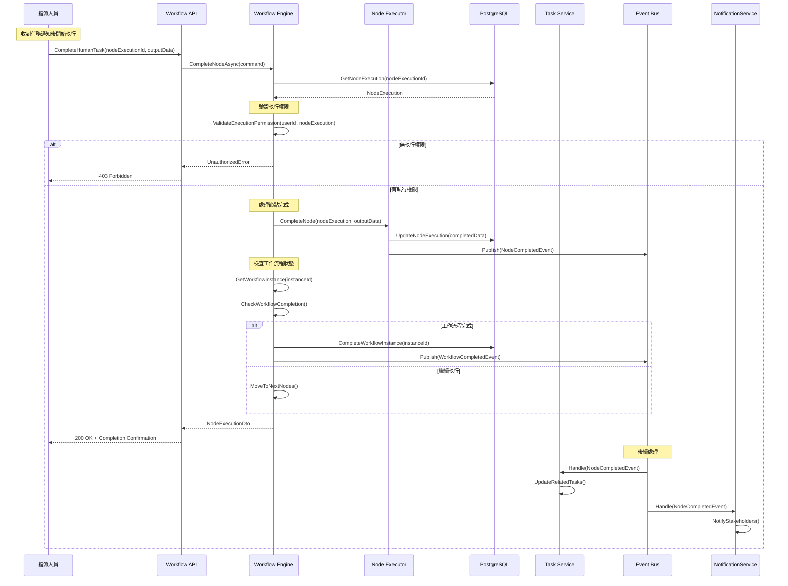
```mermaid
sequenceDiagram
    participant Assignee as 指派人員
    participant WorkflowAPI as Workflow API
    participant WorkflowEngine as Workflow Engine
    participant NodeExecutor as Node Executor
    participant Database as PostgreSQL
    participant TaskService as Task Service
    participant EventBus as Event Bus

    Note over Assignee: 收到任務通知後開始執行
    Assignee->>WorkflowAPI: CompleteHumanTask(nodeExecutionId, outputData)
    WorkflowAPI->>WorkflowEngine: CompleteNodeAsync(command)

    WorkflowEngine->>Database: GetNodeExecution(nodeExecutionId)
    Database-->>WorkflowEngine: NodeExecution

    Note over WorkflowEngine: 驗證執行權限
    WorkflowEngine->>WorkflowEngine: ValidateExecutionPermission(userId, nodeExecution)

    alt 無執行權限
        WorkflowEngine-->>WorkflowAPI: UnauthorizedError
        WorkflowAPI-->>Assignee: 403 Forbidden
    else 有執行權限
        Note over WorkflowEngine: 處理節點完成
        WorkflowEngine->>NodeExecutor: CompleteNode(nodeExecution, outputData)
        NodeExecutor->>Database: UpdateNodeExecution(completedData)
        NodeExecutor->>EventBus: Publish(NodeCompletedEvent)

        Note over WorkflowEngine: 檢查工作流程狀態
        WorkflowEngine->>WorkflowEngine: GetWorkflowInstance(instanceId)
        WorkflowEngine->>WorkflowEngine: CheckWorkflowCompletion()

        alt 工作流程完成
            WorkflowEngine->>Database: CompleteWorkflowInstance(instanceId)
            WorkflowEngine->>EventBus: Publish(WorkflowCompletedEvent)
        else 繼續執行
            WorkflowEngine->>WorkflowEngine: MoveToNextNodes()
        end

        WorkflowEngine-->>WorkflowAPI: NodeExecutionDto
        WorkflowAPI-->>Assignee: 200 OK + Completion Confirmation

        Note over EventBus: 後續處理
        EventBus->>TaskService: Handle(NodeCompletedEvent)
        TaskService->>TaskService: UpdateRelatedTasks()

        EventBus->>NotificationService: Handle(NodeCompletedEvent)
        NotificationService->>NotificationService: NotifyStakeholders()
    end
```

### 5.3 工作流程異常處理流程

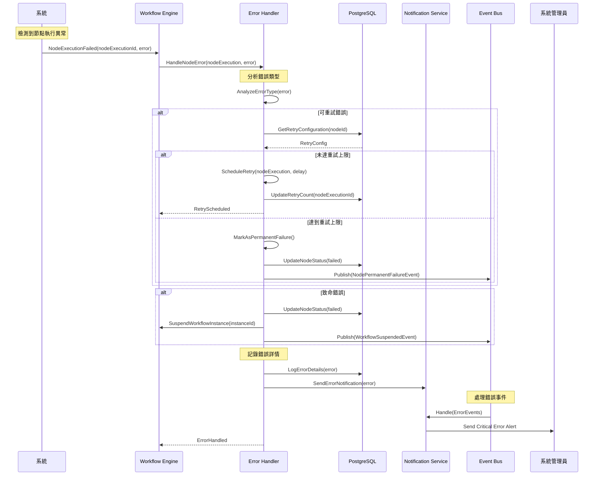
```mermaid
sequenceDiagram
    participant System as 系統
    participant WorkflowEngine as Workflow Engine
    participant ErrorHandler as Error Handler
    participant Database as PostgreSQL
    participant NotificationService as Notification Service
    participant EventBus as Event Bus
    participant Admin as 系統管理員

    Note over System: 檢測到節點執行異常
    System->>WorkflowEngine: NodeExecutionFailed(nodeExecutionId, error)
    WorkflowEngine->>ErrorHandler: HandleNodeError(nodeExecution, error)

    Note over ErrorHandler: 分析錯誤類型
    ErrorHandler->>ErrorHandler: AnalyzeErrorType(error)

    alt 可重試錯誤
        ErrorHandler->>Database: GetRetryConfiguration(nodeId)
        Database-->>ErrorHandler: RetryConfig

        alt 未達重試上限
            ErrorHandler->>ErrorHandler: ScheduleRetry(nodeExecution, delay)
            ErrorHandler->>Database: UpdateRetryCount(nodeExecutionId)
            ErrorHandler-->>WorkflowEngine: RetryScheduled
        else 達到重試上限
            ErrorHandler->>ErrorHandler: MarkAsPermanentFailure()
            ErrorHandler->>Database: UpdateNodeStatus(failed)
            ErrorHandler->>EventBus: Publish(NodePermanentFailureEvent)
        end
    end

    alt 致命錯誤
        ErrorHandler->>Database: UpdateNodeStatus(failed)
        ErrorHandler->>WorkflowEngine: SuspendWorkflowInstance(instanceId)
        ErrorHandler->>EventBus: Publish(WorkflowSuspendedEvent)
    end

    Note over ErrorHandler: 記錄錯誤詳情
    ErrorHandler->>Database: LogErrorDetails(error)
    ErrorHandler->>NotificationService: SendErrorNotification(error)

    Note over EventBus: 處理錯誤事件
    EventBus->>NotificationService: Handle(ErrorEvents)
    NotificationService->>Admin: Send Critical Error Alert

    ErrorHandler-->>WorkflowEngine: ErrorHandled
```

---

## 6. GitLab整合序列圖

### 6.1 雙向同步流程

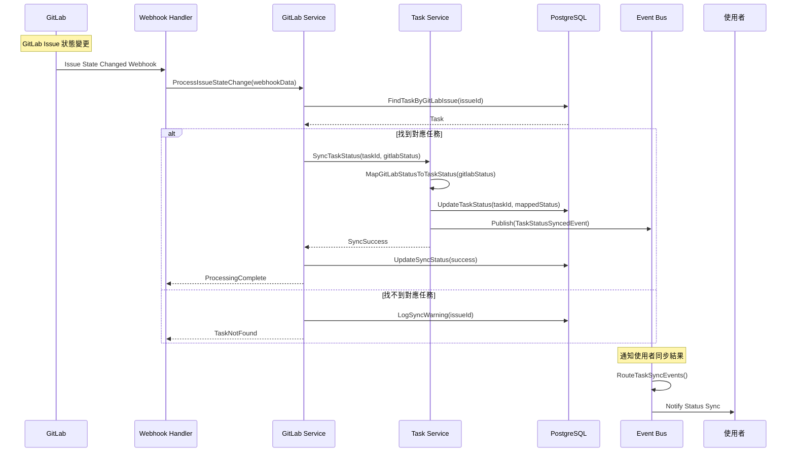
```mermaid
sequenceDiagram
    participant GitLab as GitLab
    participant WebhookHandler as Webhook Handler
    participant GitLabService as GitLab Service
    participant TaskService as Task Service
    participant Database as PostgreSQL
    participant EventBus as Event Bus
    participant User as 使用者

    Note over GitLab: GitLab Issue 狀態變更
    GitLab->>WebhookHandler: Issue State Changed Webhook
    WebhookHandler->>GitLabService: ProcessIssueStateChange(webhookData)

    GitLabService->>Database: FindTaskByGitLabIssue(issueId)
    Database-->>GitLabService: Task

    alt 找到對應任務
        GitLabService->>TaskService: SyncTaskStatus(taskId, gitlabStatus)
        TaskService->>TaskService: MapGitLabStatusToTaskStatus(gitlabStatus)
        TaskService->>Database: UpdateTaskStatus(taskId, mappedStatus)

        TaskService->>EventBus: Publish(TaskStatusSyncedEvent)
        TaskService-->>GitLabService: SyncSuccess

        GitLabService->>Database: UpdateSyncStatus(success)
        GitLabService-->>WebhookHandler: ProcessingComplete
    else 找不到對應任務
        GitLabService->>Database: LogSyncWarning(issueId)
        GitLabService-->>WebhookHandler: TaskNotFound
    end

    Note over EventBus: 通知使用者同步結果
    EventBus->>EventBus: RouteTaskSyncEvents()
    EventBus->>User: Notify Status Sync
```

### 6.2 Merge Request 整合流程

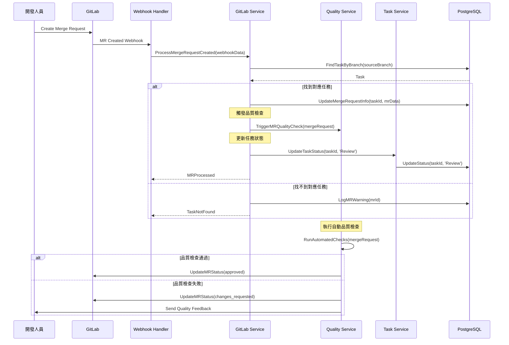
```mermaid
sequenceDiagram
    participant Developer as 開發人員
    participant GitLab as GitLab
    participant WebhookHandler as Webhook Handler
    participant GitLabService as GitLab Service
    participant QualityService as Quality Service
    participant TaskService as Task Service
    participant Database as PostgreSQL

    Developer->>GitLab: Create Merge Request
    GitLab->>WebhookHandler: MR Created Webhook
    WebhookHandler->>GitLabService: ProcessMergeRequestCreated(webhookData)

    GitLabService->>Database: FindTaskByBranch(sourceBranch)
    Database-->>GitLabService: Task

    alt 找到對應任務
        GitLabService->>Database: UpdateMergeRequestInfo(taskId, mrData)

        Note over GitLabService: 觸發品質檢查
        GitLabService->>QualityService: TriggerMRQualityCheck(mergeRequest)

        Note over GitLabService: 更新任務狀態
        GitLabService->>TaskService: UpdateTaskStatus(taskId, 'Review')
        TaskService->>Database: UpdateStatus(taskId, 'Review')

        GitLabService-->>WebhookHandler: MRProcessed
    else 找不到對應任務
        GitLabService->>Database: LogMRWarning(mrId)
        GitLabService-->>WebhookHandler: TaskNotFound
    end

    Note over QualityService: 執行自動品質檢查
    QualityService->>QualityService: RunAutomatedChecks(mergeRequest)

    alt 品質檢查通過
        QualityService->>GitLab: UpdateMRStatus(approved)
    else 品質檢查失敗
        QualityService->>GitLab: UpdateMRStatus(changes_requested)
        QualityService->>Developer: Send Quality Feedback
    end
```

---

## 7. 跨系統協作序列圖

### 7.1 端到端專案交付流程

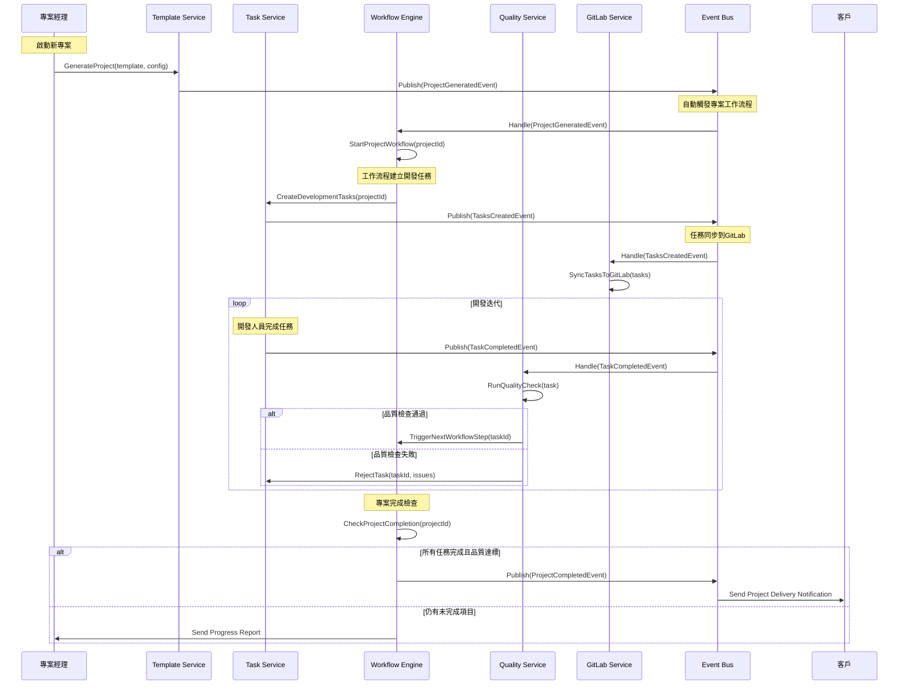
```mermaid
sequenceDiagram
    participant PM as 專案經理
    participant TemplateService as Template Service
    participant TaskService as Task Service
    participant WorkflowEngine as Workflow Engine
    participant QualityService as Quality Service
    participant GitLabService as GitLab Service
    participant EventBus as Event Bus
    participant Client as 客戶

    Note over PM: 啟動新專案
    PM->>TemplateService: GenerateProject(template, config)
    TemplateService->>EventBus: Publish(ProjectGeneratedEvent)

    Note over EventBus: 自動觸發專案工作流程
    EventBus->>WorkflowEngine: Handle(ProjectGeneratedEvent)
    WorkflowEngine->>WorkflowEngine: StartProjectWorkflow(projectId)

    Note over WorkflowEngine: 工作流程建立開發任務
    WorkflowEngine->>TaskService: CreateDevelopmentTasks(projectId)
    TaskService->>EventBus: Publish(TasksCreatedEvent)

    Note over EventBus: 任務同步到GitLab
    EventBus->>GitLabService: Handle(TasksCreatedEvent)
    GitLabService->>GitLabService: SyncTasksToGitLab(tasks)

    loop 開發迭代
        Note over TaskService: 開發人員完成任務
        TaskService->>EventBus: Publish(TaskCompletedEvent)

        EventBus->>QualityService: Handle(TaskCompletedEvent)
        QualityService->>QualityService: RunQualityCheck(task)

        alt 品質檢查通過
            QualityService->>WorkflowEngine: TriggerNextWorkflowStep(taskId)
        else 品質檢查失敗
            QualityService->>TaskService: RejectTask(taskId, issues)
        end
    end

    Note over WorkflowEngine: 專案完成檢查
    WorkflowEngine->>WorkflowEngine: CheckProjectCompletion(projectId)

    alt 所有任務完成且品質達標
        WorkflowEngine->>EventBus: Publish(ProjectCompletedEvent)
        EventBus->>Client: Send Project Delivery Notification
    else 仍有未完成項目
        WorkflowEngine->>PM: Send Progress Report
    end
```

### 7.2 緊急問題處理流程

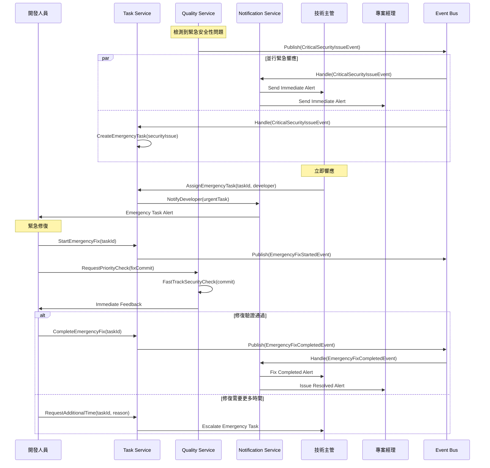
```mermaid
sequenceDiagram
    participant Developer as 開發人員
    participant TaskService as Task Service
    participant QualityService as Quality Service
    participant NotificationService as Notification Service
    participant TechLead as 技術主管
    participant PM as 專案經理
    participant EventBus as Event Bus

    Note over QualityService: 檢測到緊急安全性問題
    QualityService->>EventBus: Publish(CriticalSecurityIssueEvent)

    par 並行緊急響應
        EventBus->>NotificationService: Handle(CriticalSecurityIssueEvent)
        NotificationService->>TechLead: Send Immediate Alert
        NotificationService->>PM: Send Immediate Alert
    and
        EventBus->>TaskService: Handle(CriticalSecurityIssueEvent)
        TaskService->>TaskService: CreateEmergencyTask(securityIssue)
    end

    Note over TechLead: 立即響應
    TechLead->>TaskService: AssignEmergencyTask(taskId, developer)
    TaskService->>NotificationService: NotifyDeveloper(urgentTask)
    NotificationService->>Developer: Emergency Task Alert

    Note over Developer: 緊急修復
    Developer->>TaskService: StartEmergencyFix(taskId)
    TaskService->>EventBus: Publish(EmergencyFixStartedEvent)

    Developer->>QualityService: RequestPriorityCheck(fixCommit)
    QualityService->>QualityService: FastTrackSecurityCheck(commit)
    QualityService->>Developer: Immediate Feedback

    alt 修復驗證通過
        Developer->>TaskService: CompleteEmergencyFix(taskId)
        TaskService->>EventBus: Publish(EmergencyFixCompletedEvent)
        EventBus->>NotificationService: Handle(EmergencyFixCompletedEvent)
        NotificationService->>TechLead: Fix Completed Alert
        NotificationService->>PM: Issue Resolved Alert
    else 修復需要更多時間
        Developer->>TaskService: RequestAdditionalTime(taskId, reason)
        TaskService->>TechLead: Escalate Emergency Task
    end
```

---

## 8. 報表和分析序列圖

### 8.1 即時報表生成流程

```mermaid
sequenceDiagram
    participant Manager as 管理者
    participant ReportAPI as Report API
    parameter ReportService as Report Service
    participant Database as PostgreSQL
    participant CacheService as Cache Service
    participant EventBus as Event Bus

    Manager->>ReportAPI: GenerateProjectReport(projectId, reportType)
    ReportAPI->>ReportService: GenerateReportAsync(command)

    Note over ReportService: 檢查快取
    ReportService->>CacheService: GetCachedReport(reportKey)
    CacheService-->>ReportService: CachedReport

    alt 快取存在且有效
        ReportService-->>ReportAPI: CachedReportDto
        ReportAPI-->>Manager: 200 OK + Report Data
    else 快取不存在或過期
        Note over ReportService: 從資料庫收集數據
        par 並行數據收集
            ReportService->>Database: GetProjectStatistics(projectId)
            Database-->>ReportService: ProjectStats
        and
            ReportService->>Database: GetTaskMetrics(projectId)
            Database-->>ReportService: TaskMetrics
        and
            ReportService->>Database: GetQualityTrends(projectId)
            Database-->>ReportService: QualityTrends
        and
            ReportService->>Database: GetTeamPerformance(projectId)
            Database-->>ReportService: TeamPerformance
        end

        Note over ReportService: 生成報表
        ReportService->>ReportService: ProcessReportData(allData)
        ReportService->>ReportService: GenerateCharts(processedData)
        ReportService->>ReportService: FormatReport(charts, data)

        Note over ReportService: 更新快取
        ReportService->>CacheService: CacheReport(reportKey, report)

        ReportService-->>ReportAPI: GeneratedReportDto
        ReportAPI-->>Manager: 200 OK + Fresh Report Data

        Note over ReportService: 記錄報表生成事件
        ReportService->>EventBus: Publish(ReportGeneratedEvent)
    end
```

### 8.2 排程報表流程

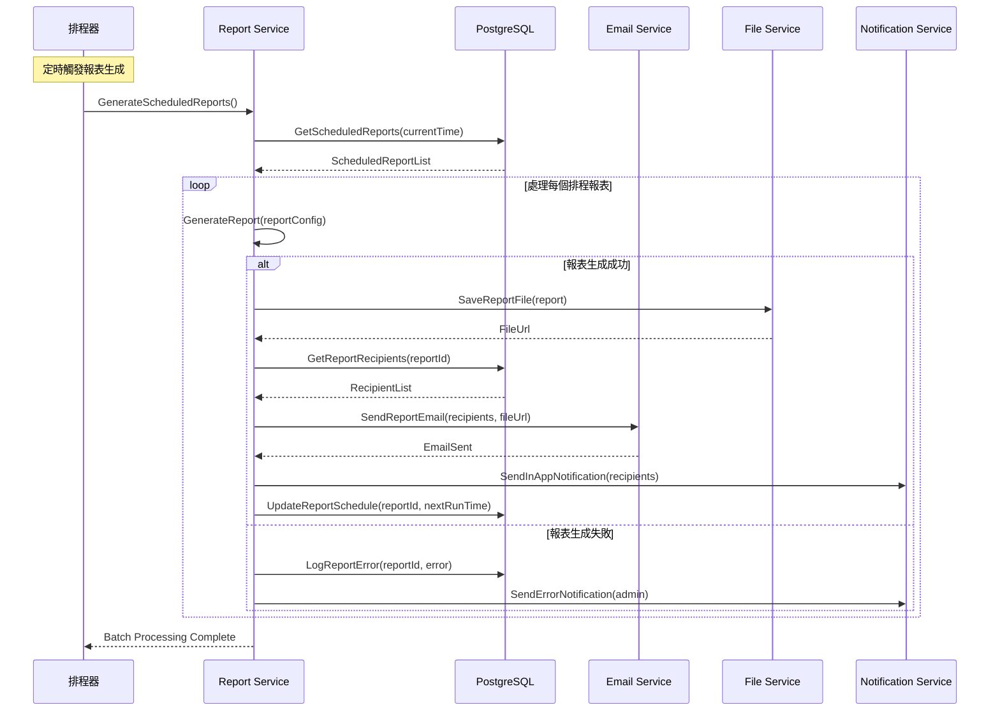
```mermaid
sequenceDiagram
    participant Scheduler as 排程器
    participant ReportService as Report Service
    participant Database as PostgreSQL
    participant EmailService as Email Service
    participant FileService as File Service
    participant NotificationService as Notification Service

    Note over Scheduler: 定時觸發報表生成
    Scheduler->>ReportService: GenerateScheduledReports()

    ReportService->>Database: GetScheduledReports(currentTime)
    Database-->>ReportService: ScheduledReportList

    loop 處理每個排程報表
        ReportService->>ReportService: GenerateReport(reportConfig)

        alt 報表生成成功
            ReportService->>FileService: SaveReportFile(report)
            FileService-->>ReportService: FileUrl

            ReportService->>Database: GetReportRecipients(reportId)
            Database-->>ReportService: RecipientList

            ReportService->>EmailService: SendReportEmail(recipients, fileUrl)
            EmailService-->>ReportService: EmailSent

            ReportService->>NotificationService: SendInAppNotification(recipients)

            ReportService->>Database: UpdateReportSchedule(reportId, nextRunTime)
        else 報表生成失敗
            ReportService->>Database: LogReportError(reportId, error)
            ReportService->>NotificationService: SendErrorNotification(admin)
        end
    end

    ReportService-->>Scheduler: Batch Processing Complete
```

---

## 9. 結論與實作建議

### 9.1 序列圖設計總結

第2階段序列圖設計涵蓋了系統的所有關鍵業務流程：

**設計成果**：
- **10個核心序列圖**：涵蓋主要業務場景
- **完整異常處理**：包含錯誤和異常流程
- **跨系統整合**：展示系統間的協作方式
- **並行處理設計**：體現高效能需求

**設計特色**：
- **真實性**：反映實際系統運作方式
- **完整性**：從開始到結束的完整流程
- **擴展性**：支援未來功能的加入
- **可測試性**：為測試設計提供指引

### 9.2 實作建議

**開發優先順序**：
1. 專案模板生成流程
2. 任務管理核心流程
3. AI品質檢查流程
4. 工作流程引擎
5. 跨系統整合流程

**技術實作要點**：
- 使用MediatR實現CQRS模式
- 應用MassTransit處理事件匯流排
- 實作Circuit Breaker模式處理外部服務
- 使用Polly實現重試機制
- 建立完整的日誌和監控

**測試策略**：
- 針對每個序列圖建立整合測試
- 使用契約測試驗證外部服務整合
- 建立端到端測試覆蓋關鍵業務流程
- 實作負載測試驗證並行處理能力

### 9.3 下一步工作

**立即執行**：
1. 建立開發團隊技術交接文件
2. 準備API規格和介面定義
3. 設定開發環境和工具

**後續開發**：
1. 按序列圖實作各個業務流程
2. 建立完整的測試覆蓋
3. 進行效能調優和監控

這些序列圖為第2階段的開發提供了清晰的實作指引，確保開發團隊能夠準確理解和實現系統的預期行為。

---

*此序列圖設計文件將作為第2階段開發的行為模型指引，並隨開發進展和測試結果持續驗證和完善。*