# 軟體開發專案管理平台 - 第2階段系統設計規格

## 版本資訊
- **文檔版本**：1.0
- **建立日期**：2025-09-27
- **負責人**：系統設計師
- **審核狀態**：待審核
- **相關專案**：SoftwareDevelopment.API - Phase 2

---

## 1. 系統設計概覽

### 1.1 設計原則
基於第1階段的DDD架構基礎，第2階段系統設計遵循以下核心原則：

- **領域驅動**：以業務領域為中心的設計方法
- **分層架構**：清晰的責任分離和依賴管理
- **可擴展性**：支援未來功能模組的平滑擴展
- **整合性**：與第1階段身份管理系統的無縫整合
- **高內聚低耦合**：模組間的鬆散耦合設計

### 1.2 架構概覽
第2階段在第1階段的四層架構基礎上，新增四個核心業務領域：

```
┌─────────────────────────────────────────────────────────────┐
│                    Presentation Layer                       │
│  ┌─────────────┐ ┌─────────────┐ ┌─────────────┐ ┌────────┐ │
│  │ Template    │ │ Task        │ │ Quality     │ │ Workflow│ │
│  │ Controllers │ │ Controllers │ │ Controllers │ │ Controllers│ │
│  └─────────────┘ └─────────────┘ └─────────────┘ └────────┘ │
└─────────────────────────────────────────────────────────────┘
┌─────────────────────────────────────────────────────────────┐
│                   Application Layer                         │
│  ┌─────────────┐ ┌─────────────┐ ┌─────────────┐ ┌────────┐ │
│  │ Template    │ │ Task        │ │ Quality     │ │ Workflow│ │
│  │ Services    │ │ Services    │ │ Services    │ │ Services│ │
│  └─────────────┘ └─────────────┘ └─────────────┘ └────────┘ │
└─────────────────────────────────────────────────────────────┘
┌─────────────────────────────────────────────────────────────┐
│                     Domain Layer                            │
│  ┌─────────────┐ ┌─────────────┐ ┌─────────────┐ ┌────────┐ │
│  │ Template    │ │ Task        │ │ Quality     │ │ Workflow│ │
│  │ Domain      │ │ Domain      │ │ Domain      │ │ Domain  │ │
│  └─────────────┘ └─────────────┘ └─────────────┘ └────────┘ │
└─────────────────────────────────────────────────────────────┘
┌─────────────────────────────────────────────────────────────┐
│                Infrastructure Layer                         │
│  ┌─────────────┐ ┌─────────────┐ ┌─────────────┐ ┌────────┐ │
│  │ Template    │ │ Task        │ │ AI Service  │ │ Workflow│ │
│  │ Repository  │ │ Repository  │ │ Integration │ │ Engine  │ │
│  └─────────────┘ └─────────────┘ └─────────────┘ └────────┘ │
└─────────────────────────────────────────────────────────────┘
```

### 1.3 核心領域模組
1. **專案模板領域 (Project Template Domain)**
2. **任務管理領域 (Task Management Domain)**
3. **AI品質檢查領域 (AI Quality Check Domain)**
4. **工作流程領域 (Workflow Domain)**

---

## 2. 專案模板系統類別圖設計

### 2.1 模板領域核心類別

```mermaid
classDiagram
    class ProjectTemplate {
        <<AggregateRoot>>
        +TemplateId Id
        +string Name
        +string Description
        +TemplateType Type
        +TemplateConfiguration Configuration
        +TemplateMetadata Metadata
        +TemplateStatus Status
        +DateTime CreatedAt
        +UserId CreatedBy
        +DateTime UpdatedAt
        +UserId UpdatedBy

        +Create(name, description, type, configuration) ProjectTemplate
        +UpdateConfiguration(configuration) void
        +Activate() void
        +Deactivate() void
        +UpdateMetadata(downloads, rating) void
        +ValidateConfiguration() ValidationResult
    }

    class TemplateId {
        <<ValueObject>>
        +Guid Value
        +TemplateId(guid)
        +ToString() string
        +Equals(other) bool
    }

    class TemplateConfiguration {
        <<ValueObject>>
        +TechnologyStack TechStack
        +List~TemplateModule~ Modules
        +DatabaseSettings Database
        +AuthenticationSettings Authentication
        +Dictionary~string,object~ CustomSettings

        +AddModule(module) void
        +RemoveModule(moduleId) void
        +UpdateDatabaseSettings(settings) void
        +Validate() ValidationResult
    }

    class TemplateMetadata {
        <<ValueObject>>
        +int DownloadCount
        +decimal AverageRating
        +int ReviewCount
        +DateTime LastUsed
        +string Version
        +List~string~ Tags

        +IncrementDownloads() void
        +UpdateRating(rating) void
        +AddTag(tag) void
    }

    class TemplateModule {
        <<Entity>>
        +ModuleId Id
        +string Name
        +string Description
        +ModuleType Type
        +bool IsRequired
        +List~ModuleDependency~ Dependencies
        +Dictionary~string,object~ Settings

        +AddDependency(dependency) void
        +RemoveDependency(dependencyId) void
        +UpdateSettings(settings) void
    }

    class TechnologyStack {
        <<ValueObject>>
        +string Framework
        +string Version
        +string Database
        +string Runtime
        +List~string~ Libraries

        +AddLibrary(library) void
        +RemoveLibrary(library) void
        +IsCompatibleWith(other) bool
    }

    class TemplateType {
        <<Enumeration>>
        DDD
        CQRS
        CleanArchitecture
        Microservices
        MVC
        Custom
    }

    class TemplateStatus {
        <<Enumeration>>
        Draft
        Active
        Deprecated
        Archived
    }

    ProjectTemplate ||--|| TemplateId : has
    ProjectTemplate ||--|| TemplateConfiguration : contains
    ProjectTemplate ||--|| TemplateMetadata : has
    TemplateConfiguration ||--|| TechnologyStack : includes
    TemplateConfiguration ||--o{ TemplateModule : contains
    ProjectTemplate ||--|| TemplateType : has
    ProjectTemplate ||--|| TemplateStatus : has
```

### 2.2 模板服務和倉儲

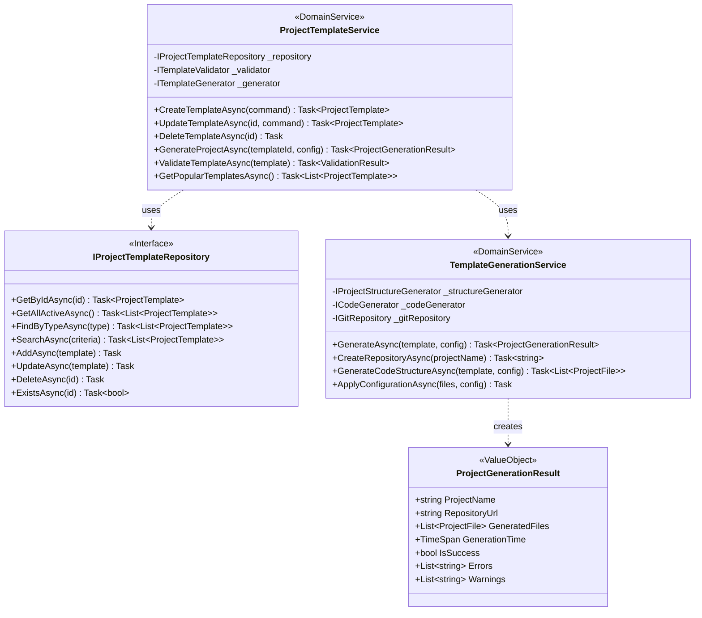

### 2.3 模板應用服務

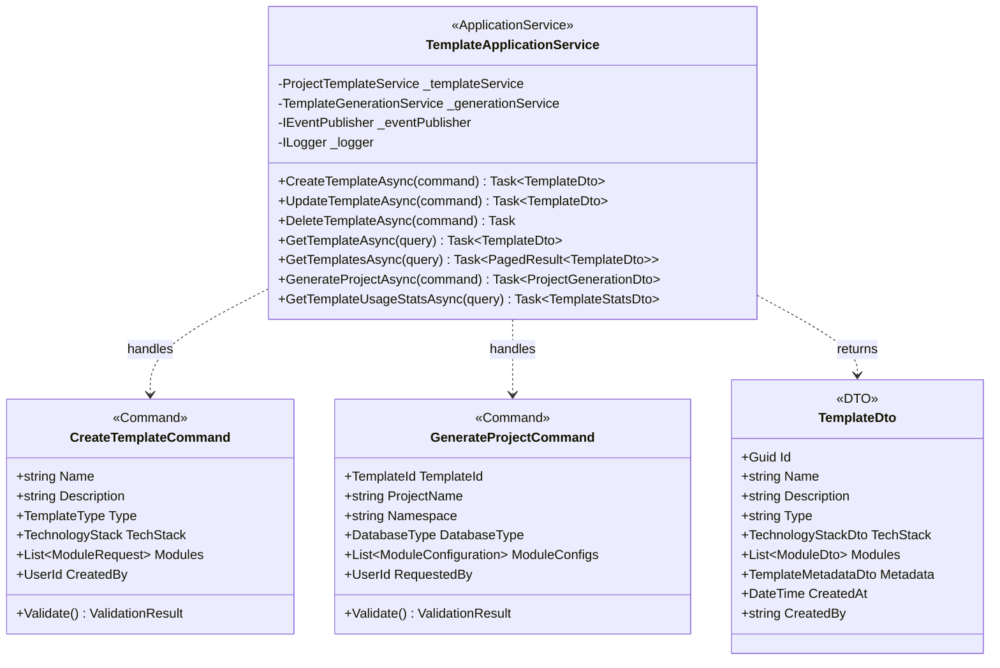

---

## 3. 任務管理系統類別圖設計

### 3.1 任務領域核心類別

```mermaid
classDiagram
    class Task {
        <<AggregateRoot>>
        +TaskId Id
        +string Title
        +string Description
        +TaskType Type
        +Priority Priority
        +TaskStatus Status
        +ProjectId ProjectId
        +UserId AssignedTo
        +UserId CreatedBy
        +DateTime CreatedAt
        +DateTime? DueDate
        +EstimatedHours EstimatedHours
        +ActualHours ActualHours
        +Progress Progress
        +List~TaskComment~ Comments
        +List~TaskAttachment~ Attachments
        +List~TaskDependency~ Dependencies
        +GitLabIntegration GitLabInfo

        +Create(title, description, type, projectId) Task
        +AssignTo(userId) void
        +UpdateStatus(status) void
        +UpdateProgress(progress) void
        +AddComment(comment) void
        +AddAttachment(attachment) void
        +AddDependency(taskId) void
        +UpdateEstimation(hours) void
        +RecordActualHours(hours) void
        +SetDueDate(date) void
        +CanTransitionTo(status) bool
    }

    class TaskId {
        <<ValueObject>>
        +Guid Value
        +string TaskNumber
        +TaskId(guid, number)
        +ToString() string
        +GenerateTaskNumber(projectCode) string
    }

    class Priority {
        <<Enumeration>>
        Critical
        High
        Medium
        Low
    }

    class TaskStatus {
        <<Enumeration>>
        Todo
        InProgress
        Review
        Testing
        Done
        Closed
    }

    class Progress {
        <<ValueObject>>
        +int Percentage
        +DateTime LastUpdated
        +UserId UpdatedBy
        +string Notes

        +Update(percentage, notes, userId) void
        +IsComplete() bool
        +Validate() bool
    }

    class TaskComment {
        <<Entity>>
        +CommentId Id
        +string Content
        +UserId AuthorId
        +DateTime CreatedAt
        +DateTime? UpdatedAt
        +CommentType Type

        +Update(content) void
        +MarkAsEdited() void
    }

    class TaskAttachment {
        <<Entity>>
        +AttachmentId Id
        +string FileName
        +string FileType
        +long FileSize
        +string StoragePath
        +UserId UploadedBy
        +DateTime UploadedAt

        +GetDownloadUrl() string
        +ValidateFileType() bool
    }

    class TaskDependency {
        <<ValueObject>>
        +TaskId DependentTaskId
        +TaskId DependsOnTaskId
        +DependencyType Type
        +DateTime CreatedAt

        +IsBlocking() bool
        +CanBeRemoved() bool
    }

    class GitLabIntegration {
        <<ValueObject>>
        +int? IssueId
        +string IssueUrl
        +int? MergeRequestId
        +string BranchName
        +GitLabSyncStatus SyncStatus
        +DateTime? LastSyncAt

        +UpdateIssueId(issueId) void
        +LinkMergeRequest(mrId) void
        +UpdateSyncStatus(status) void
    }

    Task ||--|| TaskId : has
    Task ||--|| Priority : has
    Task ||--|| TaskStatus : has
    Task ||--|| Progress : has
    Task ||--o{ TaskComment : contains
    Task ||--o{ TaskAttachment : contains
    Task ||--o{ TaskDependency : has
    Task ||--|| GitLabIntegration : has
```

### 3.2 任務服務和倉儲

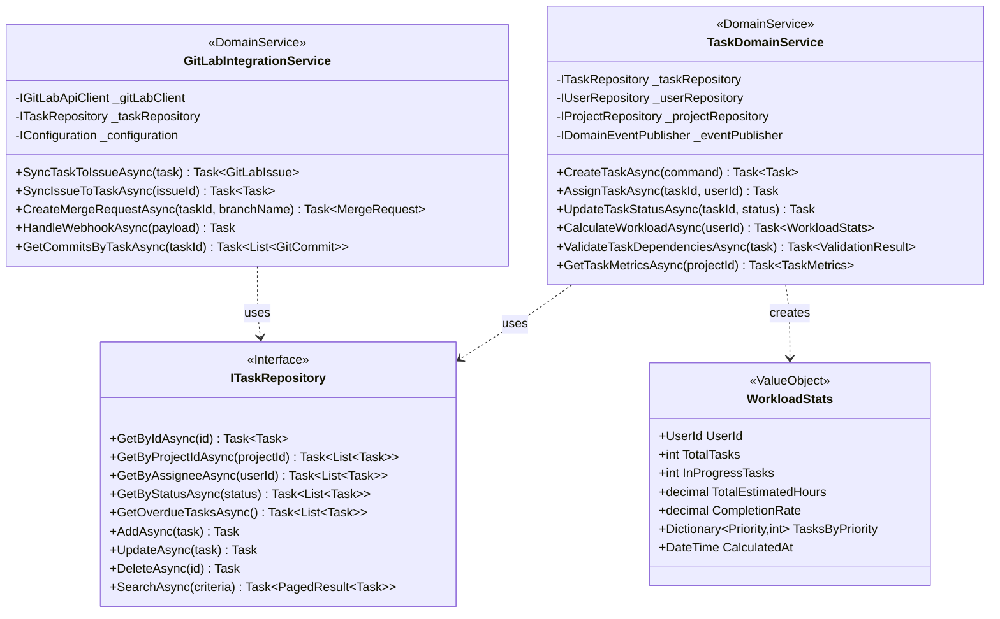

### 3.3 任務應用服務

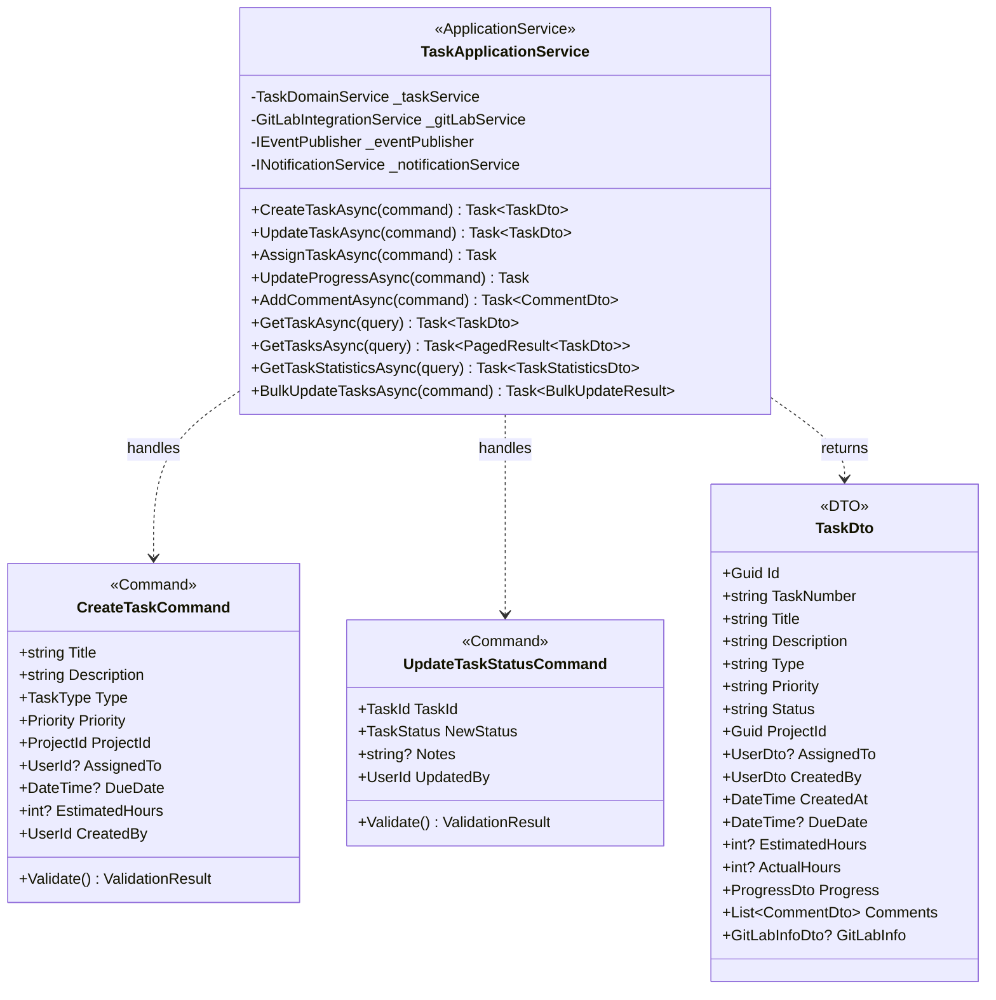

---

## 4. AI程式碼檢查系統類別圖設計

### 4.1 AI品質檢查領域核心類別

```mermaid
classDiagram
    class CodeQualityCheck {
        <<AggregateRoot>>
        +CheckId Id
        +ProjectId ProjectId
        +string CommitHash
        +string BranchName
        +CheckTrigger TriggerType
        +CheckStatus Status
        +DateTime StartedAt
        +DateTime? CompletedAt
        +QualityScore OverallScore
        +List~QualityIssue~ Issues
        +List~CodeMetric~ Metrics
        +CheckConfiguration Configuration
        +UserId RequestedBy

        +Create(projectId, commitHash, trigger) CodeQualityCheck
        +Start() void
        +Complete(score, issues, metrics) void
        +Fail(error) void
        +AddIssue(issue) void
        +CalculateOverallScore() QualityScore
        +GetSummary() CheckSummary
    }

    class CheckId {
        <<ValueObject>>
        +Guid Value
        +CheckId(guid)
        +ToString() string
    }

    class QualityScore {
        <<ValueObject>>
        +decimal OverallScore
        +decimal CodeStyleScore
        +decimal ComplexityScore
        +decimal SecurityScore
        +decimal PerformanceScore
        +decimal TestCoverageScore
        +ScoreGrade Grade

        +CalculateOverall() decimal
        +GetGrade() ScoreGrade
        +CompareTo(other) int
    }

    class QualityIssue {
        <<Entity>>
        +IssueId Id
        +string RuleId
        +IssueSeverity Severity
        +IssueCategory Category
        +string Title
        +string Description
        +string FileName
        +int LineNumber
        +int? ColumnNumber
        +string CodeSnippet
        +string Suggestion
        +bool IsFixed
        +DateTime DetectedAt

        +MarkAsFixed() void
        +UpdateSuggestion(suggestion) void
        +GetLocation() CodeLocation
    }

    class CodeMetric {
        <<ValueObject>>
        +MetricType Type
        +string Name
        +decimal Value
        +string Unit
        +MetricTrend Trend
        +decimal? ThresholdValue
        +bool IsWithinThreshold

        +CheckThreshold() bool
        +GetTrendDirection() TrendDirection
    }

    class CheckConfiguration {
        <<ValueObject>>
        +List~string~ EnabledRules
        +List~string~ DisabledRules
        +Dictionary~string,object~ RuleParameters
        +QualityThresholds Thresholds
        +bool IncludeTestFiles
        +List~string~ ExcludedPaths

        +IsRuleEnabled(ruleId) bool
        +GetRuleParameter(ruleId, paramName) object
        +AddRule(ruleId) void
        +RemoveRule(ruleId) void
    }

    class CheckTrigger {
        <<Enumeration>>
        Manual
        CommitPush
        PullRequest
        Scheduled
        API
    }

    class CheckStatus {
        <<Enumeration>>
        Pending
        Running
        Completed
        Failed
        Cancelled
    }

    class IssueSeverity {
        <<Enumeration>>
        Critical
        High
        Medium
        Low
        Info
    }

    class IssueCategory {
        <<Enumeration>>
        CodeStyle
        Complexity
        Security
        Performance
        Maintainability
        Reliability
        TestCoverage
    }

    CodeQualityCheck ||--|| CheckId : has
    CodeQualityCheck ||--|| QualityScore : has
    CodeQualityCheck ||--o{ QualityIssue : contains
    CodeQualityCheck ||--o{ CodeMetric : contains
    CodeQualityCheck ||--|| CheckConfiguration : has
    CodeQualityCheck ||--|| CheckTrigger : has
    CodeQualityCheck ||--|| CheckStatus : has
    QualityIssue ||--|| IssueSeverity : has
    QualityIssue ||--|| IssueCategory : has
```

### 4.2 AI服務和規則引擎

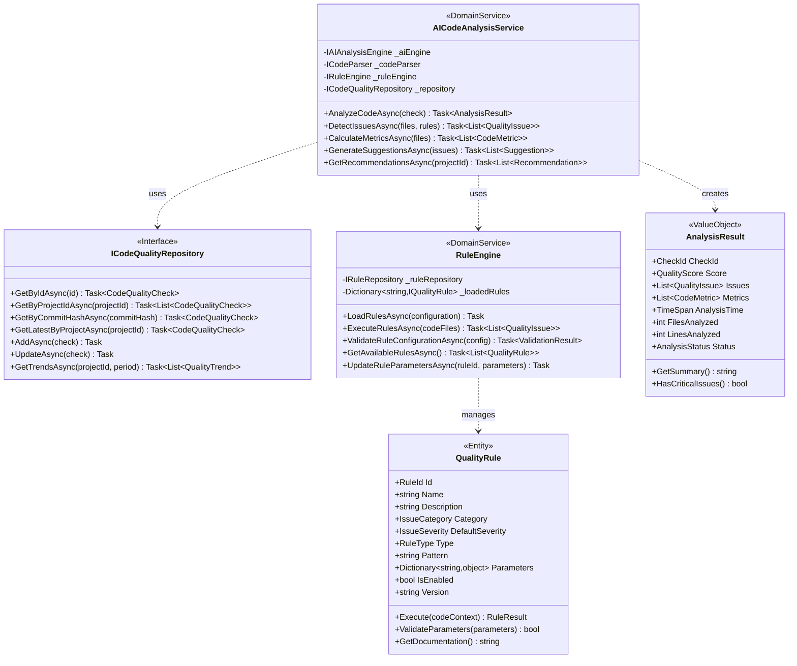

### 4.3 AI品質檢查應用服務

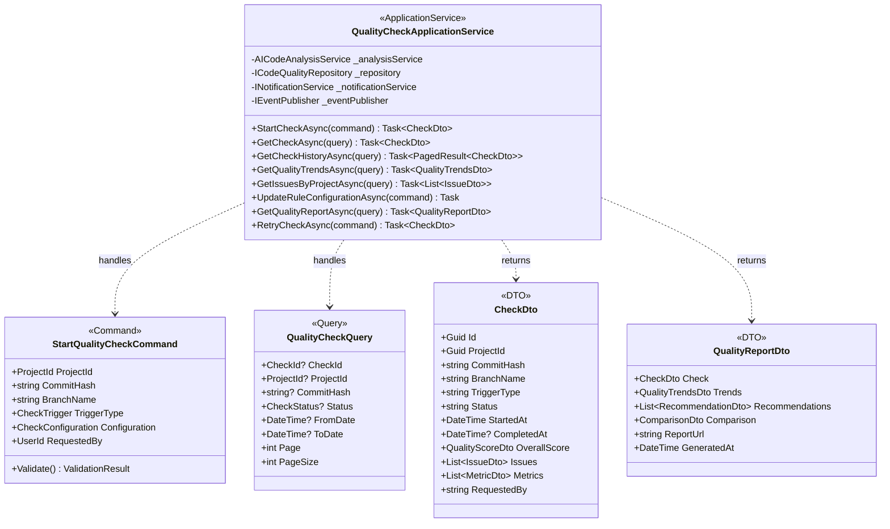

---

## 5. 工作流程引擎系統類別圖設計

### 5.1 工作流程領域核心類別

```mermaid
classDiagram
    class WorkflowDefinition {
        <<AggregateRoot>>
        +WorkflowId Id
        +string Name
        +string Description
        +WorkflowVersion Version
        +WorkflowStatus Status
        +List~WorkflowNode~ Nodes
        +List~WorkflowTransition~ Transitions
        +WorkflowTrigger Trigger
        +WorkflowConfiguration Configuration
        +UserId CreatedBy
        +DateTime CreatedAt
        +DateTime? PublishedAt

        +Create(name, description, trigger) WorkflowDefinition
        +AddNode(node) void
        +RemoveNode(nodeId) void
        +AddTransition(transition) void
        +RemoveTransition(transitionId) void
        +Validate() ValidationResult
        +Publish() void
        +Archive() void
        +CreateInstance() WorkflowInstance
    }

    class WorkflowNode {
        <<Entity>>
        +NodeId Id
        +string Name
        +NodeType Type
        +NodeConfiguration Configuration
        +List~NodeId~ Inputs
        +List~NodeId~ Outputs
        +Position Position
        +bool IsRequired
        +TimeSpan? TimeLimit
        +List~string~ AssignedRoles

        +AddInput(nodeId) void
        +AddOutput(nodeId) void
        +UpdateConfiguration(config) void
        +CanExecute(context) bool
        +Execute(context) NodeResult
    }

    class WorkflowTransition {
        <<Entity>>
        +TransitionId Id
        +NodeId FromNodeId
        +NodeId ToNodeId
        +TransitionCondition Condition
        +string Name
        +TransitionType Type

        +Evaluate(context) bool
        +CanTransition(context) bool
    }

    class WorkflowInstance {
        <<AggregateRoot>>
        +InstanceId Id
        +WorkflowId WorkflowDefinitionId
        +string Title
        +WorkflowInstanceStatus Status
        +Dictionary~string,object~ Variables
        +List~NodeExecution~ NodeExecutions
        +DateTime StartedAt
        +DateTime? CompletedAt
        +UserId StartedBy
        +ProjectId? ProjectId
        +TaskId? TaskId

        +Start(variables) void
        +MoveToNext(nodeId) void
        +Complete() void
        +Cancel() void
        +Suspend() void
        +Resume() void
        +GetCurrentNodes() List~WorkflowNode~
        +CanMoveToNode(nodeId) bool
    }

    class NodeExecution {
        <<Entity>>
        +ExecutionId Id
        +NodeId NodeId
        +NodeExecutionStatus Status
        +DateTime StartedAt
        +DateTime? CompletedAt
        +UserId? AssignedTo
        +UserId? ExecutedBy
        +Dictionary~string,object~ InputData
        +Dictionary~string,object~ OutputData
        +string? Comments
        +List~ExecutionHistory~ History

        +Start(assignedTo) void
        +Complete(outputData, executedBy) void
        +Fail(error) void
        +Reassign(newAssignee) void
        +AddComment(comment) void
    }

    class NodeType {
        <<Enumeration>>
        Start
        End
        Task
        Decision
        Parallel
        Merge
        Timer
        Service
        Human
        Approval
    }

    class WorkflowInstanceStatus {
        <<Enumeration>>
        Created
        Running
        Suspended
        Completed
        Cancelled
        Failed
    }

    WorkflowDefinition ||--o{ WorkflowNode : contains
    WorkflowDefinition ||--o{ WorkflowTransition : contains
    WorkflowInstance ||--o{ NodeExecution : contains
    WorkflowNode ||--|| NodeType : has
    WorkflowInstance ||--|| WorkflowInstanceStatus : has
```

### 5.2 工作流程引擎服務

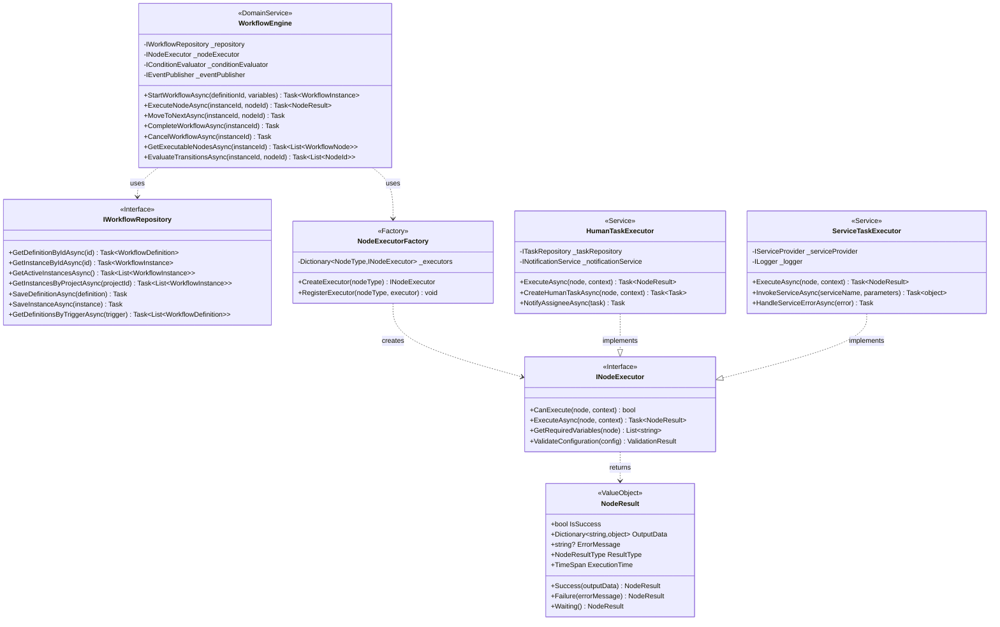

### 5.3 工作流程應用服務

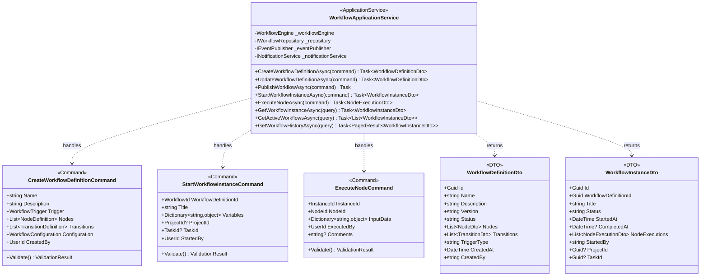

---

## 6. 關鍵序列圖設計

### 6.1 專案模板生成序列圖

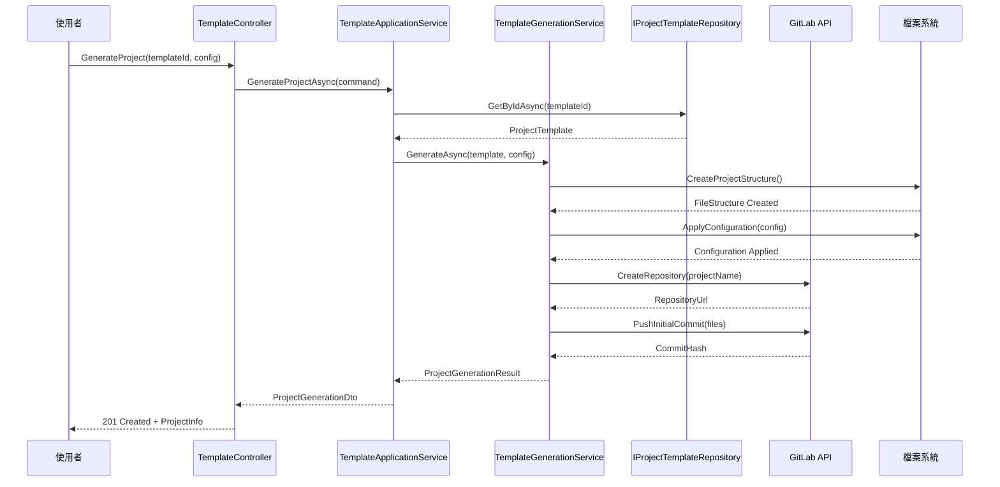

### 6.2 任務狀態更新與GitLab同步序列圖

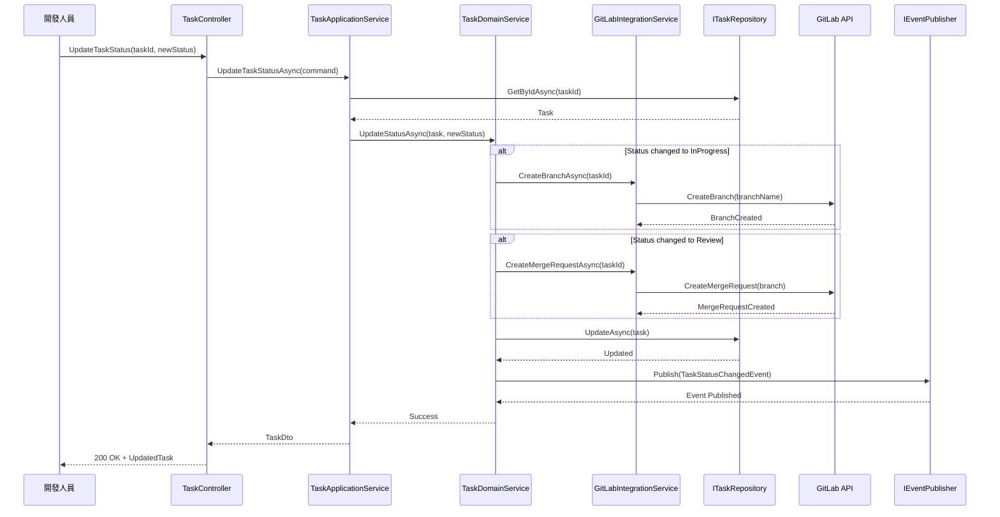

### 6.3 AI程式碼品質檢查序列圖

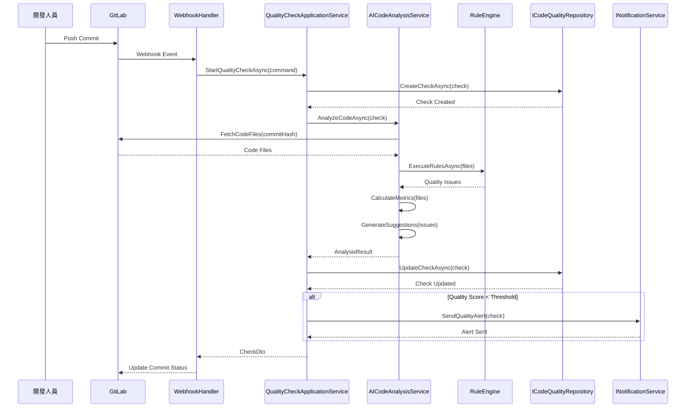

### 6.4 工作流程執行序列圖

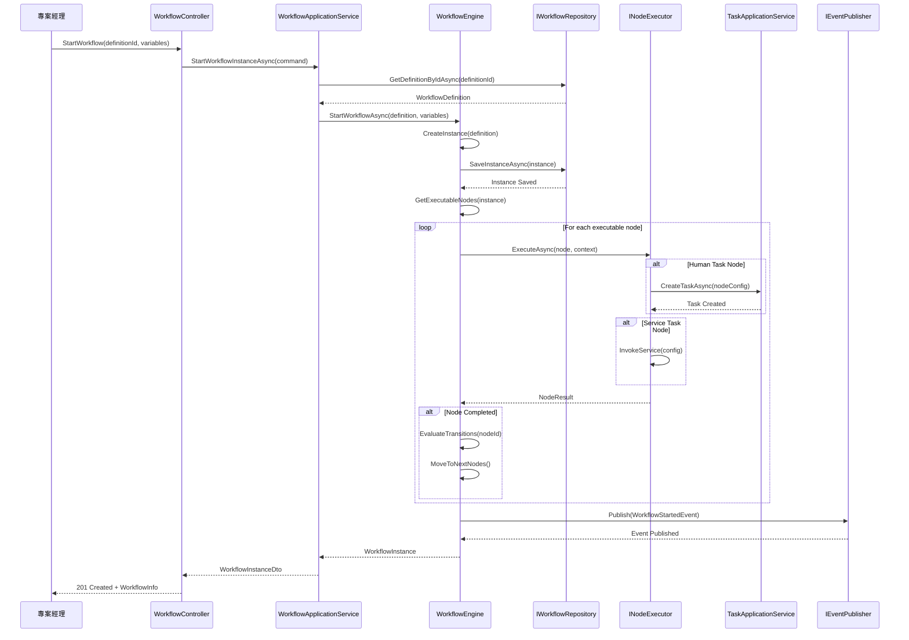

---

## 7. 系統整體架構設計

### 7.1 微服務架構概覽

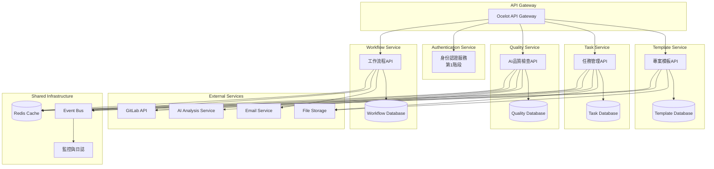

### 7.2 領域模組依賴關係

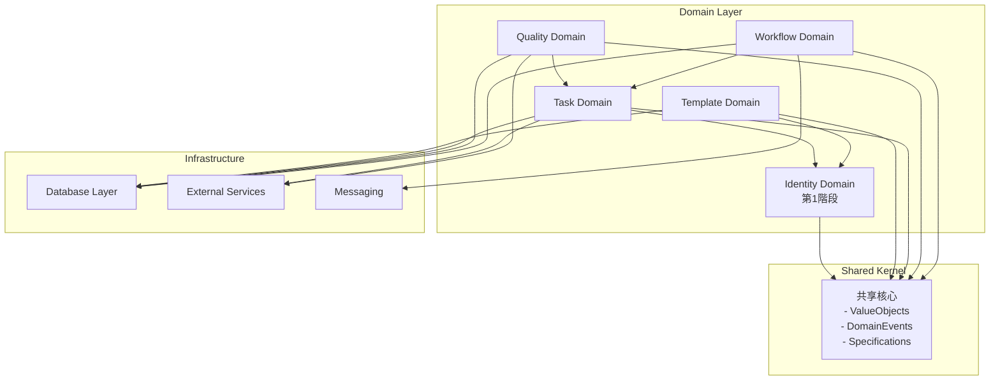

### 7.3 事件驅動架構設計

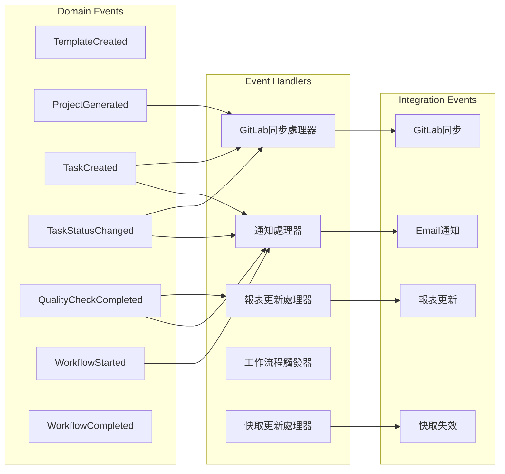

---

## 8. 技術規格與實作建議

### 8.1 技術棧建議

**後端核心技術**：
- **.NET 8**: 主要開發框架
- **Entity Framework Core 8**: ORM映射
- **PostgreSQL 15**: 主要資料庫
- **Redis 7**: 快取和會話管理
- **MassTransit**: 訊息佇列和事件匯流排
- **Serilog**: 結構化日誌記錄

**AI和外部整合**：
- **OpenAI API**: AI程式碼分析
- **GitLab API**: 代碼管理整合
- **SendGrid**: 郵件發送服務
- **Azure Blob Storage**: 檔案存儲

**監控和部署**：
- **Prometheus + Grafana**: 監控和指標
- **ELK Stack**: 日誌分析
- **Docker + Kubernetes**: 容器化部署
- **Helm Charts**: Kubernetes應用管理

### 8.2 開發規範建議

**代碼組織結構**：
```
SoftwareDevelopment.API/
├── src/
│   ├── Core/
│   │   ├── SoftwareDevelopment.Domain/
│   │   │   ├── Templates/
│   │   │   ├── Tasks/
│   │   │   ├── Quality/
│   │   │   └── Workflows/
│   │   └── SoftwareDevelopment.Application/
│   │       ├── Templates/
│   │       ├── Tasks/
│   │       ├── Quality/
│   │       └── Workflows/
│   ├── Infrastructure/
│   │   ├── SoftwareDevelopment.Infrastructure/
│   │   └── SoftwareDevelopment.Persistence/
│   └── Presentation/
│       ├── SoftwareDevelopment.WebAPI/
│       └── SoftwareDevelopment.BackgroundServices/
├── tests/
└── docs/
```

**設計模式應用**：
- **Repository Pattern**: 資料存取抽象
- **Unit of Work**: 事務管理
- **CQRS**: 讀寫分離
- **Mediator Pattern**: 請求處理解耦
- **Strategy Pattern**: AI規則引擎
- **Observer Pattern**: 事件處理
- **Factory Pattern**: 物件創建

### 8.3 效能優化建議

**資料庫優化**：
- 適當的索引設計
- 查詢優化和分頁
- 連接池管理
- 讀寫分離配置

**快取策略**：
- Redis分散式快取
- 查詢結果快取
- 靜態資源CDN
- HTTP快取頭配置

**非同步處理**：
- 背景任務處理
- 訊息佇列應用
- 長時間操作分解
- 批次作業優化

---

## 9. 結論與下一步

### 9.1 設計總結

第2階段系統設計成功建立了四個核心業務領域的完整架構：

**設計成果**：
- **專案模板系統**: 支援多種架構模板的管理和生成
- **任務管理系統**: 完整的任務生命週期管理和GitLab整合
- **AI品質檢查系統**: 智能化的程式碼品質分析和建議
- **工作流程引擎**: 靈活的業務流程定義和執行

**設計特色**：
- **領域驅動**: 清晰的業務邊界和職責分離
- **事件驅動**: 鬆散耦合的模組間通信
- **可擴展性**: 支援未來功能的平滑擴展
- **整合性**: 與第1階段和外部系統的無縫整合

### 9.2 技術可行性評估

**架構優勢**：
- 基於成熟的DDD四層架構
- 使用企業級的技術棧
- 具備良好的擴展性和維護性
- 支援雲端原生部署

**實作複雜度**：
- 中高複雜度，需要經驗豐富的開發團隊
- AI整合部分需要特別關注
- GitLab整合需要仔細的錯誤處理
- 工作流程引擎需要詳細的測試

### 9.3 風險評估與緩解

**技術風險**：
- **AI服務依賴**: 建立後備的靜態分析機制
- **外部API穩定性**: 實作重試和降級機制
- **效能瓶頸**: 建立完善的監控和優化策略

**業務風險**：
- **使用者接受度**: 提供漸進式功能導入
- **資料遷移**: 建立完整的備份和測試程序
- **學習成本**: 準備充分的文件和培訓

### 9.4 下一步工作規劃

**立即執行**：
1. 更新第2階段資料庫架構設計
2. 建立詳細的API規格文件
3. 準備開發團隊技術交接文件

**短期規劃**：
1. 建立開發環境和CI/CD流程
2. 實作核心領域模型
3. 開發關鍵用例功能

**長期規劃**：
1. 完整功能開發和測試
2. 效能優化和安全加固
3. 使用者驗收和功能調整

這個系統設計為第2階段的開發提供了堅實的技術基礎，確保能夠交付一個高品質、可擴展的專案管理平台核心功能。

---

*此系統設計規格文件將作為第2階段開發的核心技術指引，並隨開發進展和需求變化持續更新完善。*