# 軟體開發專案管理平台 - 第2階段UI流程設計規格

## 版本資訊
- **文檔版本**：1.0
- **建立日期**：2025-09-27
- **負責人**：系統分析師
- **審核狀態**：待審核
- **相關專案**：SoftwareDevelopment.API - Phase 2

---

## 1. UI流程設計概覽

### 1.1 設計原則
- **使用者導向**：以不同角色的工作流程為設計核心
- **任務驅動**：每個流程都以完成特定任務為目標
- **無縫整合**：與第1階段的身份管理系統無縫整合
- **響應式設計**：支援桌面和行動裝置
- **直觀操作**：最小化學習成本，提供清晰的操作指引

### 1.2 主要使用者角色流程
1. **專案經理流程**：專案建立、任務管理、進度監控
2. **開發人員流程**：任務執行、代碼提交、品質檢查
3. **技術主管流程**：代碼審查、品質管控、團隊管理
4. **系統分析師流程**：需求管理、流程設計、報表分析

### 1.3 核心UI模組
- **專案模板中心**
- **任務管理介面**
- **AI品質檢查儀表板**
- **工作流程設計器**
- **報表與分析中心**

---

## 2. 專案經理（PM）主要流程

### 2.1 專案建立與模板選擇流程

```mermaid
flowchart TD
    A[登入系統] --> B[進入專案管理]
    B --> C[點擊 "建立新專案"]
    C --> D[填寫專案基本資訊]
    D --> E{驗證資訊}
    E -->|失敗| F[顯示錯誤訊息]
    F --> D
    E -->|成功| G[進入模板選擇頁面]

    G --> H[瀏覽模板類別]
    H --> I[檢視模板詳情]
    I --> J[預覽模板結構]
    J --> K{選擇模板}
    K -->|是| L[配置模板參數]
    K -->|否| H

    L --> M[檢視配置摘要]
    M --> N{確認建立}
    N -->|否| L
    N -->|是| O[系統生成專案結構]
    O --> P[顯示進度條]
    P --> Q[建立GitLab Repository]
    Q --> R[推送初始代碼]
    R --> S[專案建立完成]
    S --> T[自動跳轉到專案儀表板]
```

**關鍵UI元件**：
- **專案資訊表單**：名稱、描述、團隊成員、預計時程
- **模板篩選器**：技術棧、架構類型、複雜度
- **模板預覽器**：檔案樹狀圖、技術說明、使用範例
- **參數配置器**：命名空間、資料庫設定、功能模組選擇
- **進度指示器**：生成步驟進度、預估完成時間

### 2.2 任務管理流程

```mermaid
flowchart TD
    A[進入專案儀表板] --> B[點擊 "任務管理"]
    B --> C[檢視任務列表]
    C --> D{選擇操作}

    D -->|建立任務| E[點擊 "新增任務"]
    E --> F[填寫任務詳情]
    F --> G[設定任務屬性]
    G --> H[選擇指派對象]
    H --> I{確認建立}
    I -->|否| F
    I -->|是| J[儲存任務]
    J --> K[發送通知]
    K --> L[同步到GitLab]
    L --> C

    D -->|編輯任務| M[選擇任務]
    M --> N[開啟任務詳情]
    N --> O[編輯任務資訊]
    O --> P[儲存變更]
    P --> C

    D -->|批次操作| Q[選擇多個任務]
    Q --> R[選擇批次動作]
    R --> S[確認執行]
    S --> C
```

**關鍵UI元件**：
- **任務列表視圖**：表格/卡片/看板切換
- **任務篩選面板**：狀態、指派人、優先級、日期範圍
- **任務詳情面板**：側邊滑出面板、包含完整任務資訊
- **快速操作工具列**：批次選擇、狀態變更、指派變更
- **智能推薦面板**：建議指派人員、相關任務、資源需求

### 2.3 專案監控流程

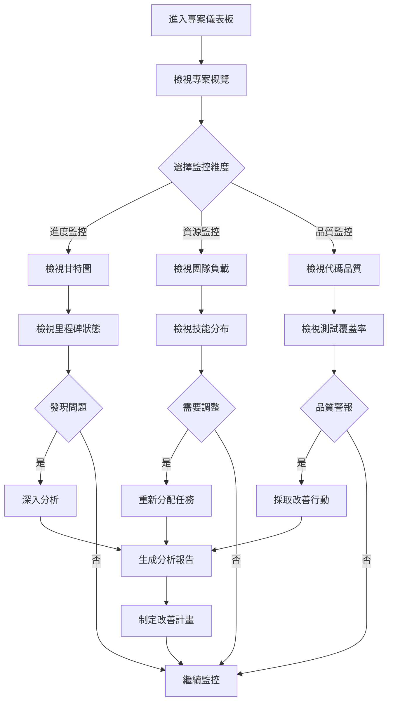

**關鍵UI元件**：
- **多維度儀表板**：進度、資源、品質、風險指標
- **甘特圖視圖**：拖拽式時程調整、相依性視覺化
- **團隊負載熱圖**：色彩編碼的工作負載分布
- **品質趨勢圖**：時間序列的品質指標變化
- **警報通知中心**：即時警報、問題分類、處理建議

---

## 3. 開發人員（Developer）主要流程

### 3.1 任務接收與執行流程

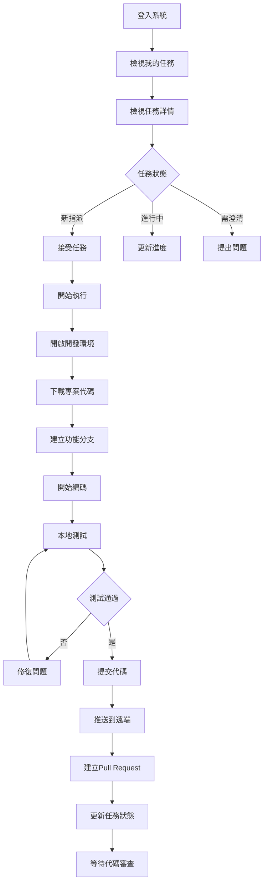

**關鍵UI元件**：
- **個人任務儀表板**：今日任務、本週計劃、逾期提醒
- **任務詳情卡片**：需求描述、驗收標準、相關資源
- **進度更新滑塊**：視覺化進度調整、工時記錄
- **開發環境快速啟動**：一鍵開啟IDE、環境配置
- **代碼提交指引**：commit訊息範本、分支命名建議

### 3.2 代碼品質檢查流程

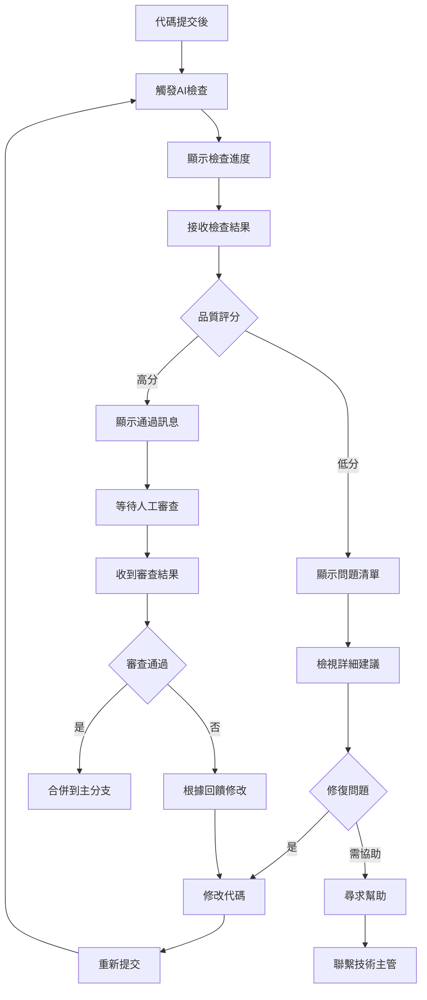

**關鍵UI元件**：
- **AI檢查結果面板**：分類問題、嚴重程度標示
- **問題詳情展開**：代碼位置、問題說明、修復建議
- **對比視圖**：修改前後代碼對比、改善效果
- **學習資源連結**：相關最佳實踐、教學文件
- **協助請求功能**：@技術主管、問題分類、緊急程度

### 3.3 協作與溝通流程

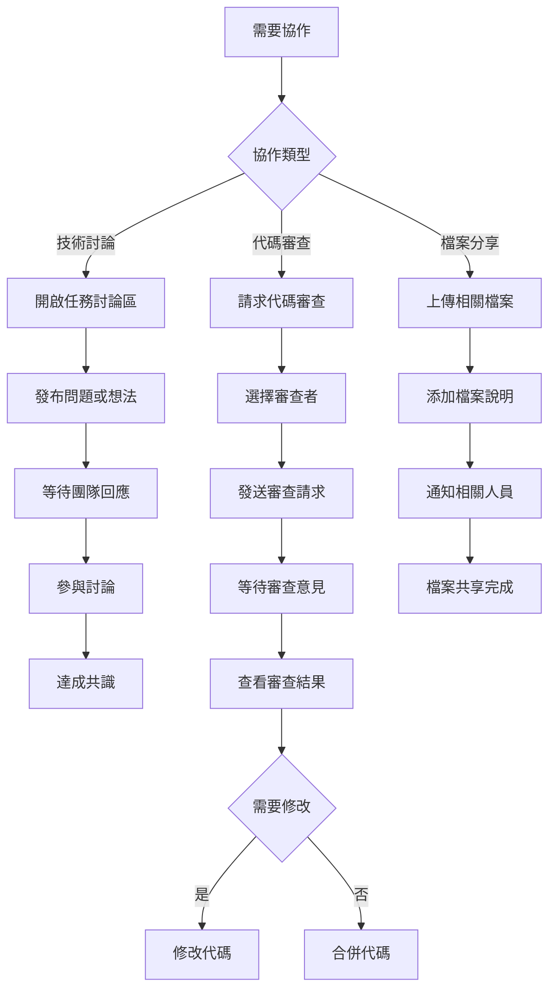

**關鍵UI元件**：
- **即時討論面板**：Slack風格的對話介面
- **代碼註解系統**：行內註釋、建議修改
- **檔案拖拽上傳**：支援多種格式、預覽功能
- **@提及系統**：智能人員建議、即時通知
- **討論歷史記錄**：可搜尋、可分類的歷史對話

---

## 4. 技術主管（Tech Lead）主要流程

### 4.1 代碼審查與品質管控流程

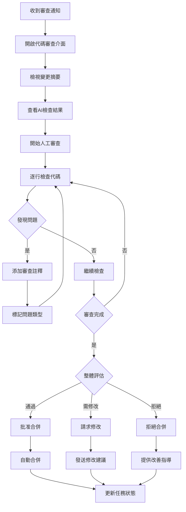

**關鍵UI元件**：
- **代碼差異視圖**：side-by-side或unified視圖
- **AI建議整合面板**：AI檢查結果、人工審查結合
- **註釋工具列**：快速標籤、嚴重程度、類別分類
- **審查checklist**：自訂檢查項目、必檢項目提醒
- **批量操作面板**：多個PR同時處理、批准/拒絕

### 4.2 團隊技術指導流程

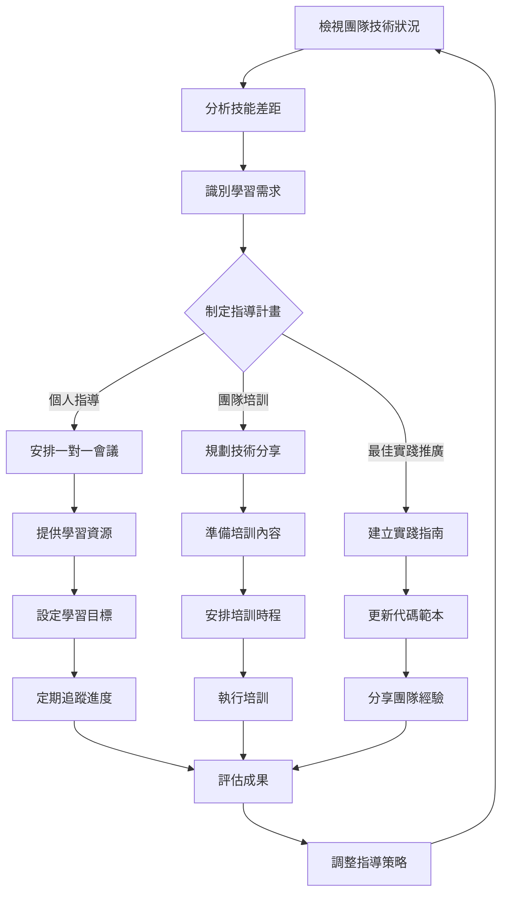

**關鍵UI元件**：
- **技能矩陣視圖**：熱圖式技能分布、差距分析
- **學習路徑設計器**：拖拽式路徑規劃、資源庫整合
- **培訓計畫管理**：行事曆整合、資源預約
- **進度追蹤儀表板**：個人/團隊學習進度可視化
- **知識庫管理**：最佳實踐文件、代碼範例庫

### 4.3 AI檢查規則配置流程

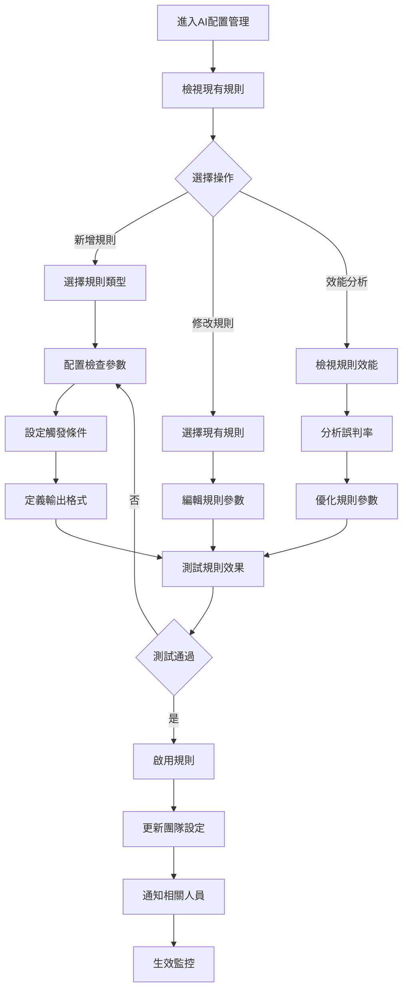

**關鍵UI元件**：
- **規則庫管理面板**：分類瀏覽、搜尋功能
- **視覺化規則編輯器**：拖拽式條件組合
- **即時測試環境**：代碼範例測試、結果預覽
- **效能監控儀表板**：檢查時間、準確率、使用頻率
- **規則模板庫**：常用規則模板、社群分享

---

## 5. 系統分析師（SA）主要流程

### 5.1 工作流程設計流程

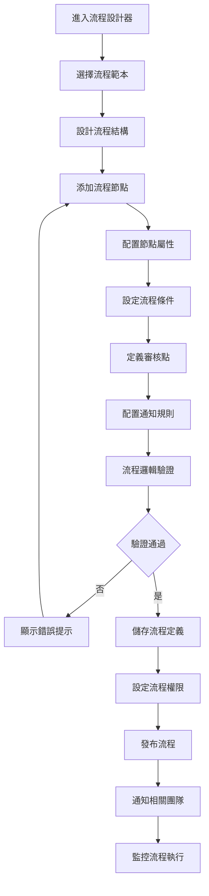

**關鍵UI元件**：
- **拖拽式流程設計器**：節點庫、連接線、分支條件
- **節點屬性面板**：責任人設定、時限配置、表單設計
- **流程模擬器**：測試流程執行、異常情況模擬
- **版本控制面板**：流程版本管理、變更追蹤
- **權限配置矩陣**：角色權限、操作權限的視覺化設定

### 5.2 需求分析與追蹤流程

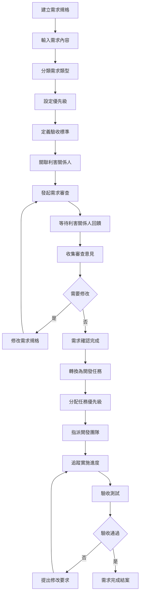

**關鍵UI元件**：
- **需求編輯器**：結構化需求範本、Rich Text編輯
- **利害關係人管理**：角色權重、審查權限、通知設定
- **需求追溯矩陣**：需求-任務-測試案例的關聯視圖
- **變更影響分析**：變更範圍評估、風險等級標示
- **驗收標準checklist**：可檢查的驗收條件清單

### 5.3 系統分析報告生成流程

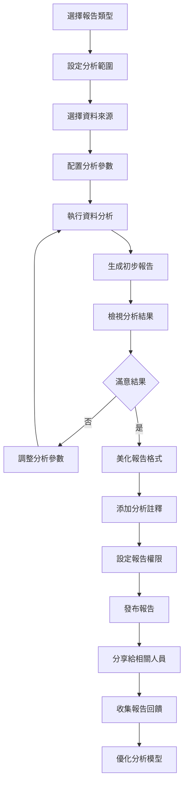

**關鍵UI元件**：
- **報告範本庫**：預設分析範本、自訂範本管理
- **資料選擇器**：多維度資料篩選、時間範圍選擇
- **即時預覽面板**：圖表即時更新、配置調整
- **註釋編輯器**：報告說明、洞察標註、建議事項
- **分享控制面板**：權限設定、連結管理、下載選項

---

## 6. 跨角色協作流程

### 6.1 專案啟動協作流程

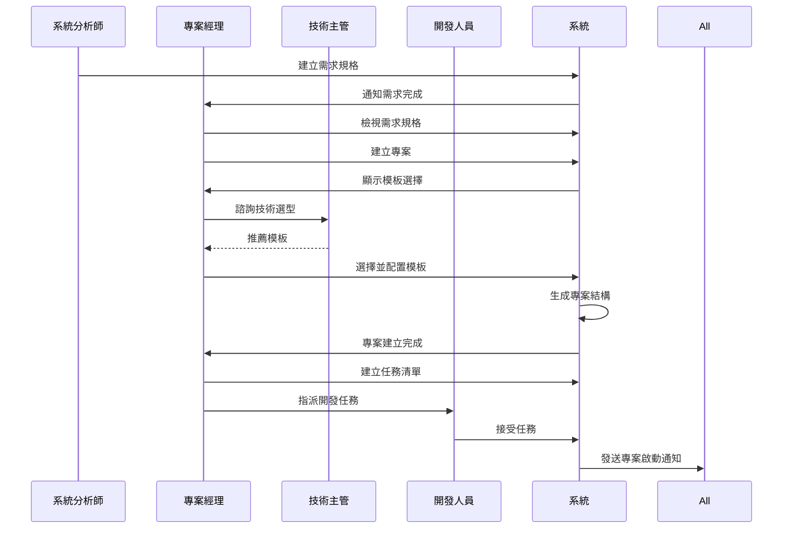

### 6.2 代碼審查協作流程

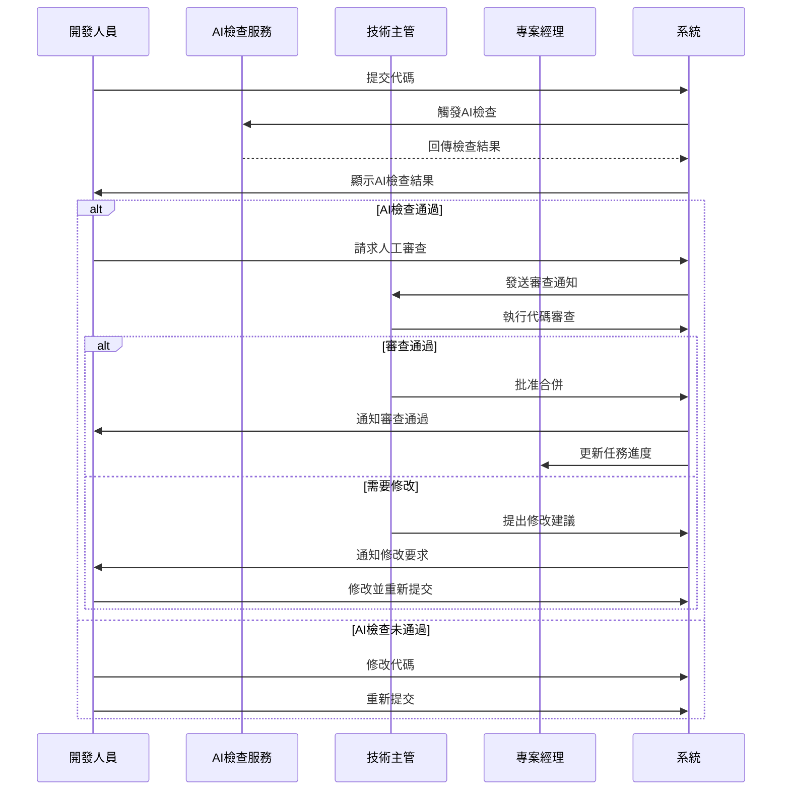

### 6.3 問題升級處理流程

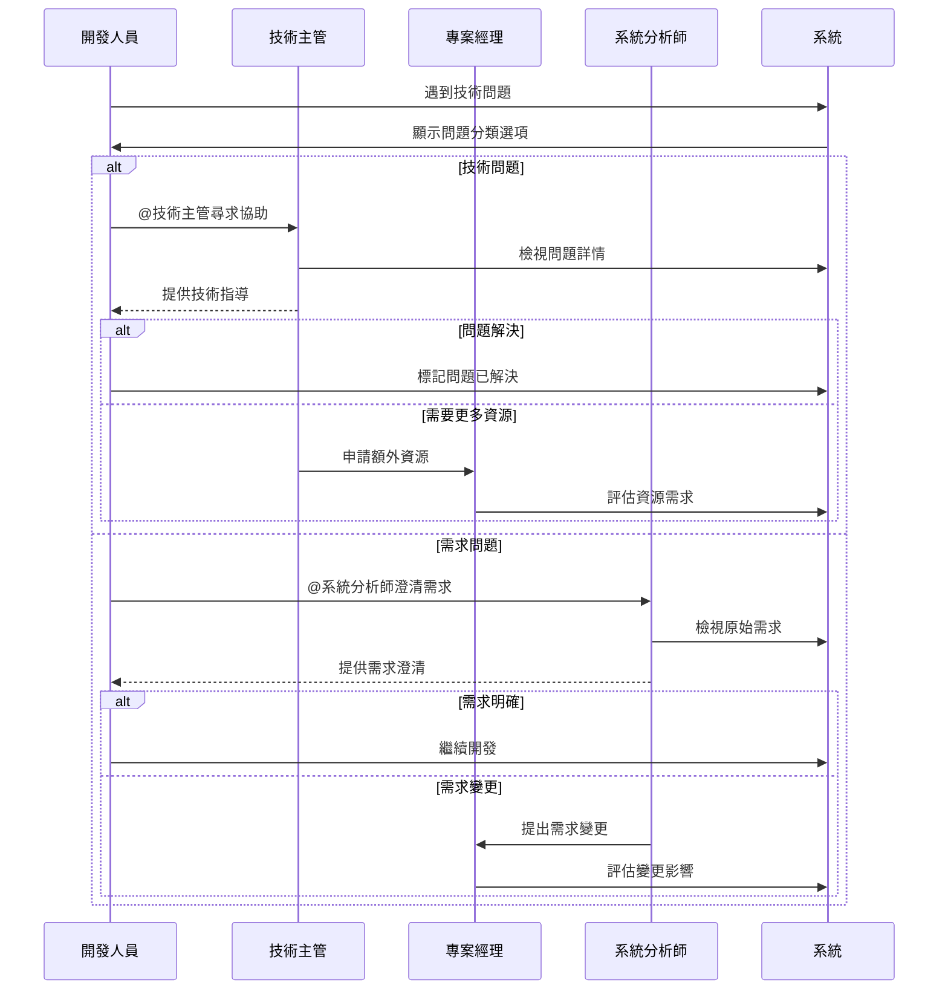

---

## 7. 響應式設計與行動端優化

### 7.1 螢幕適應性設計

**桌面端 (≥1200px)**：
- 完整功能面板並排顯示
- 多欄位資訊同時可見
- 進階操作工具完整展示
- 大型圖表和複雜表格

**平板端 (768px-1199px)**：
- 可摺疊側邊面板
- 主要功能保持可見
- 簡化的操作工具列
- 適中的資訊密度

**手機端 (<768px)**：
- 單欄布局設計
- 關鍵功能優先顯示
- 底部導航選單
- 簡化的操作流程

### 7.2 觸控優化設計

**手勢支援**：
- 左右滑動：切換頁籤、瀏覽項目
- 長按：顯示快速操作選單
- 雙指縮放：圖表放大縮小
- 下拉刷新：更新資料內容

**觸控元件**：
- 按鈕最小尺寸44px×44px
- 適當的元件間距
- 明確的觸控回饋
- 誤觸防護機制

### 7.3 行動端特定功能

**離線支援**：
- 關鍵資料本地快取
- 離線操作暫存
- 網路恢復時同步
- 衝突解決機制

**推播通知**：
- 任務指派通知
- 審查請求提醒
- 緊急問題警報
- 進度里程碑通知

---

## 8. 無障礙設計（Accessibility）

### 8.1 視覺無障礙

**色彩設計**：
- 符合WCAG 2.1 AA對比度標準
- 不僅依賴顏色傳達資訊
- 支援色盲友善色彩方案
- 高對比度模式支援

**文字設計**：
- 可調整字體大小
- 清晰的字體選擇
- 適當的行距設定
- 重要資訊的多種呈現方式

### 8.2 操作無障礙

**鍵盤導航**：
- 完整的Tab順序支援
- 快捷鍵組合
- 焦點指示器清晰可見
- 跳過連結功能

**螢幕閱讀器支援**：
- 語義化HTML結構
- 適當的ARIA標籤
- 替代文字說明
- 狀態變更通知

### 8.3 認知無障礙

**資訊組織**：
- 清晰的資訊層次
- 一致的導航結構
- 明確的操作指引
- 錯誤訊息具體明確

**操作簡化**：
- 多步驟流程的進度指示
- 可撤銷的重要操作
- 自動儲存功能
- 預設值和智能建議

---

## 9. 效能優化設計

### 9.1 載入效能優化

**漸進式載入**：
- 關鍵內容優先載入
- 非關鍵資源延遲載入
- 圖片懶載入
- 代碼分割和按需載入

**快取策略**：
- 瀏覽器快取優化
- CDN靜態資源
- API回應快取
- 離線資料快取

### 9.2 互動效能優化

**即時回饋**：
- 操作立即回應
- 載入狀態指示
- 進度條顯示
- 樂觀更新策略

**資料處理優化**：
- 虛擬滾動技術
- 分頁載入機制
- 搜尋防抖動
- 智能重新整理

### 9.3 網路效能優化

**請求優化**：
- 批量API請求
- GraphQL查詢優化
- 壓縮傳輸資料
- HTTP/2推送

**錯誤處理**：
- 自動重試機制
- 優雅的錯誤降級
- 離線模式支援
- 網路狀況感知

---

## 10. 安全性設計

### 10.1 前端安全

**輸入驗證**：
- 客戶端預驗證
- XSS防護機制
- CSRF保護
- 資料編碼處理

**權限控制**：
- 基於角色的UI顯示
- 敏感操作二次確認
- 會話超時處理
- 自動登出機制

### 10.2 資料安全

**傳輸安全**：
- HTTPS強制使用
- 敏感資料加密
- 安全標頭設定
- 內容安全政策

**隱私保護**：
- 個人資訊遮罩
- 資料最小化原則
- 存取日誌記錄
- 隱私設定控制

---

## 11. 測試與驗證策略

### 11.1 可用性測試

**使用者測試**：
- 任務完成率測試
- 使用者滿意度調查
- A/B測試比較
- 眼動追蹤分析

**專家評估**：
- 啟發式評估
- 認知走查
- 無障礙審查
- 效能評估

### 11.2 功能測試

**自動化測試**：
- 單元測試覆蓋
- 整合測試驗證
- E2E測試場景
- 視覺回歸測試

**手動測試**：
- 跨瀏覽器測試
- 多裝置測試
- 網路環境測試
- 邊界情況測試

---

## 12. 結論與下一步

### 12.1 UI流程設計總結

第2階段的UI流程設計涵蓋了四個主要角色的完整工作流程，包含：

**核心成果**：
- 4個主要角色的詳細工作流程
- 跨角色協作流程設計
- 響應式和無障礙設計規範
- 效能和安全性優化策略

**關鍵特色**：
- **角色導向**：以實際工作流程為設計核心
- **無縫整合**：與第1階段身份管理系統完美整合
- **智能化**：AI輔助決策和自動化流程
- **協作性**：強化團隊協作和溝通效率

### 12.2 設計驗證要點

**功能完整性**：
- 所有用例都有對應的UI流程
- 異常情況和錯誤處理完善
- 跨系統整合流程順暢

**使用者體驗**：
- 符合使用者心智模型
- 操作步驟最小化
- 視覺和互動一致性

**技術可行性**：
- 與後端API設計對齊
- 效能要求可達成
- 安全需求可滿足

### 12.3 後續工作規劃

**立即執行**：
1. 基於UI流程創建詳細的線框圖
2. 設計高保真的互動原型
3. 進行初步的可用性測試

**短期規劃**：
1. 開發前端元件庫
2. 實作關鍵使用者流程
3. 整合後端API介面

**長期優化**：
1. 持續的使用者回饋收集
2. 效能監控和優化
3. 新功能的漸進式發布

這個UI流程設計為第2階段的開發提供了清晰的實現路徑，確保最終產品能夠滿足各類使用者的實際工作需求，並提供優秀的使用體驗。

---

*此UI流程設計文件將作為前端開發和UI/UX設計的重要參考，並隨開發進展和使用者回饋持續優化完善。*