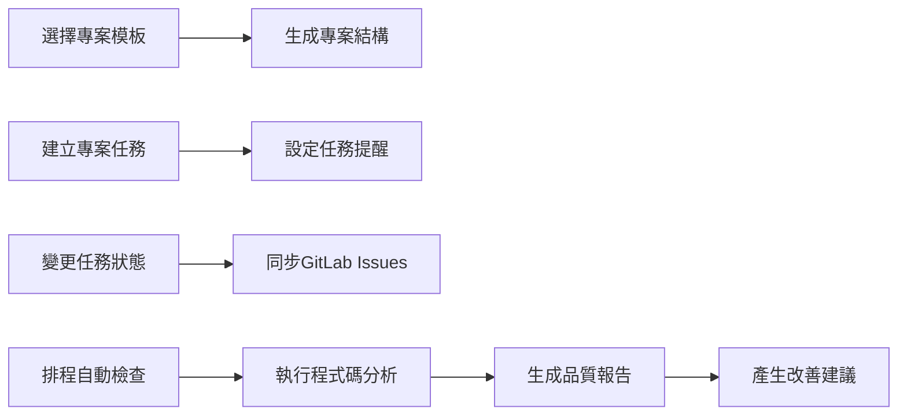
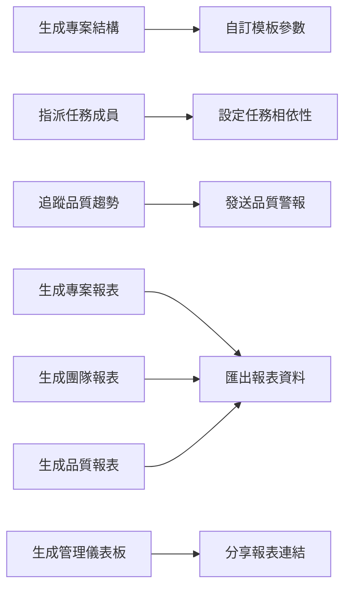
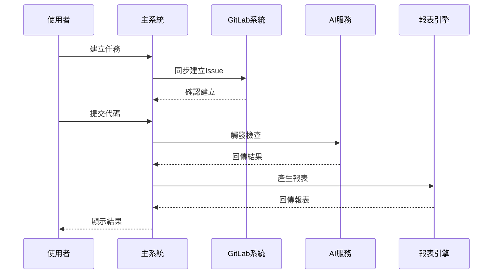

# 軟體開發專案管理平台 - 第2階段用例圖設計

## 版本資訊
- **文檔版本**：1.0
- **建立日期**：2025-09-27
- **負責人**：系統分析師
- **審核狀態**：待審核
- **相關專案**：SoftwareDevelopment.API - Phase 2

---

## 1. 用例圖概覽

### 1.1 系統邊界定義
第2階段的系統邊界包含四個核心子系統：
- **專案模板系統**
- **任務管理系統**
- **AI程式碼檢查系統**
- **工作流程與報表系統**

### 1.2 參與者（Actors）定義

**主要參與者**：
- **系統分析師 (System Analyst, SA)**
- **專案經理 (Project Manager, PM)**
- **開發人員 (Developer, Dev)**
- **技術主管 (Tech Lead, TL)**
- **系統管理員 (System Admin)**

**次要參與者**：
- **GitLab 系統**
- **AI 檢查服務**
- **通知服務**
- **報表引擎**

---

## 2. 核心用例圖

### 2.1 專案模板系統用例圖

```mermaid
graph TB
    subgraph "專案模板系統"
        UC001[建立專案模板]
        UC002[編輯專案模板]
        UC003[刪除專案模板]
        UC004[瀏覽模板庫]
        UC005[選擇專案模板]
        UC006[生成專案結構]
        UC007[自訂模板參數]
        UC008[上傳自訂模板]
        UC009[模板版本管理]
        UC010[模板評價與回饋]
    end

    subgraph "參與者"
        Admin[系統管理員]
        TL[技術主管]
        PM[專案經理]
        Dev[開發人員]
        SA[系統分析師]
    end

    Admin --> UC001
    Admin --> UC002
    Admin --> UC003
    Admin --> UC009

    TL --> UC001
    TL --> UC002
    TL --> UC008
    TL --> UC009

    PM --> UC004
    PM --> UC005
    PM --> UC006
    PM --> UC007

    Dev --> UC004
    Dev --> UC005
    Dev --> UC006
    Dev --> UC007
    Dev --> UC010

    SA --> UC004
    SA --> UC005

    UC005 --> UC006 : "includes"
    UC006 --> UC007 : "extends"
    UC001 --> UC009 : "includes"
    UC002 --> UC009 : "includes"
```

### 2.2 任務管理系統用例圖

```mermaid
graph TB
    subgraph "任務管理系統"
        UC011[建立專案任務]
        UC012[編輯任務資訊]
        UC013[刪除任務]
        UC014[指派任務成員]
        UC015[設定任務優先級]
        UC016[追蹤任務進度]
        UC017[新增任務評論]
        UC018[上傳任務附件]
        UC019[設定任務相依性]
        UC020[變更任務狀態]
        UC021[檢視任務清單]
        UC022[搜尋與篩選任務]
        UC023[匯出任務報表]
        UC024[設定任務提醒]
    end

    subgraph "GitLab整合"
        UC025[同步GitLab Issues]
        UC026[關聯Merge Request]
        UC027[同步代碼提交]
        UC028[更新分支狀態]
    end

    subgraph "參與者"
        PM[專案經理]
        TL[技術主管]
        Dev[開發人員]
        SA[系統分析師]
        GitLab[GitLab系統]
    end

    PM --> UC011
    PM --> UC012
    PM --> UC013
    PM --> UC014
    PM --> UC015
    PM --> UC021
    PM --> UC022
    PM --> UC023

    TL --> UC014
    TL --> UC015
    TL --> UC016
    TL --> UC021
    TL --> UC022

    Dev --> UC016
    Dev --> UC017
    Dev --> UC018
    Dev --> UC020
    Dev --> UC021
    Dev --> UC022

    SA --> UC021
    SA --> UC022
    SA --> UC023

    UC011 --> UC024 : "includes"
    UC014 --> UC019 : "extends"
    UC020 --> UC025 : "includes"

    GitLab --> UC025
    GitLab --> UC026
    GitLab --> UC027
    GitLab --> UC028
```

### 2.3 AI程式碼檢查系統用例圖

```mermaid
graph TB
    subgraph "AI程式碼檢查系統"
        UC029[執行程式碼分析]
        UC030[生成品質報告]
        UC031[設定檢查規則]
        UC032[檢視檢查結果]
        UC033[產生改善建議]
        UC034[追蹤品質趨勢]
        UC035[配置AI檢查參數]
        UC036[手動觸發檢查]
        UC037[排程自動檢查]
        UC038[匯出品質報表]
        UC039[設定品質閾值]
        UC040[發送品質警報]
    end

    subgraph "參與者"
        TL[技術主管]
        Dev[開發人員]
        PM[專案經理]
        Admin[系統管理員]
        AI[AI檢查服務]
    end

    TL --> UC031
    TL --> UC032
    TL --> UC034
    TL --> UC035
    TL --> UC037
    TL --> UC038
    TL --> UC039

    Dev --> UC032
    Dev --> UC033
    Dev --> UC036

    PM --> UC032
    PM --> UC034
    PM --> UC038

    Admin --> UC035
    Admin --> UC037
    Admin --> UC039

    UC029 --> UC030 : "includes"
    UC030 --> UC033 : "includes"
    UC034 --> UC040 : "extends"
    UC037 --> UC029 : "includes"

    AI --> UC029
    AI --> UC030
    AI --> UC033
```

### 2.4 工作流程與報表系統用例圖

```mermaid
graph TB
    subgraph "工作流程系統"
        UC041[設計工作流程]
        UC042[啟動工作流程]
        UC043[監控流程執行]
        UC044[處理流程審核]
        UC045[流程異常處理]
        UC046[配置審核點]
        UC047[設定自動化規則]
    end

    subgraph "報表系統"
        UC048[生成專案報表]
        UC049[生成團隊報表]
        UC050[生成品質報表]
        UC051[生成管理儀表板]
        UC052[自訂報表範本]
        UC053[排程報表產生]
        UC054[分享報表連結]
        UC055[匯出報表資料]
        UC056[設定報表權限]
    end

    subgraph "參與者"
        SA[系統分析師]
        PM[專案經理]
        TL[技術主管]
        Dev[開發人員]
        Admin[系統管理員]
        ReportEngine[報表引擎]
    end

    SA --> UC041
    SA --> UC046
    SA --> UC047

    PM --> UC042
    PM --> UC043
    PM --> UC044
    PM --> UC048
    PM --> UC051
    PM --> UC053

    TL --> UC042
    TL --> UC043
    TL --> UC044
    TL --> UC049
    TL --> UC050

    Dev --> UC043
    Dev --> UC049

    Admin --> UC041
    Admin --> UC046
    Admin --> UC047
    Admin --> UC052
    Admin --> UC056

    UC048 --> UC055 : "extends"
    UC049 --> UC055 : "extends"
    UC050 --> UC055 : "extends"
    UC051 --> UC054 : "extends"

    ReportEngine --> UC048
    ReportEngine --> UC049
    ReportEngine --> UC050
    ReportEngine --> UC051
```

---

## 3. 詳細用例規格

### 3.1 專案模板系統用例

#### UC005: 選擇專案模板

**基本資訊**：
- **用例編號**：UC005
- **用例名稱**：選擇專案模板
- **主要參與者**：專案經理、開發人員
- **前置條件**：使用者已登入系統
- **後置條件**：選定的模板準備用於專案生成

**主要流程**：
1. 使用者進入模板選擇頁面
2. 系統顯示可用模板清單
3. 使用者瀏覽模板詳細資訊
4. 使用者篩選模板（技術棧、架構類型等）
5. 使用者預覽模板結構
6. 使用者選定目標模板
7. 系統記錄選擇並準備生成流程

**替代流程**：
- 3a. 若無適合模板，使用者可請求建立新模板
- 5a. 預覽載入失敗時，顯示基本資訊

**異常流程**：
- 系統錯誤時，提供錯誤訊息並允許重試

#### UC006: 生成專案結構

**基本資訊**：
- **用例編號**：UC006
- **用例名稱**：生成專案結構
- **主要參與者**：專案經理、開發人員
- **前置條件**：已選擇專案模板
- **後置條件**：專案結構成功生成

**主要流程**：
1. 系統提示輸入專案基本資訊
2. 使用者填寫專案名稱、命名空間等
3. 使用者選擇技術選項和相依套件
4. 系統驗證輸入資訊
5. 系統基於模板生成專案結構
6. 系統建立 Git Repository
7. 系統推送初始 Commit
8. 系統回饋生成結果

**替代流程**：
- 4a. 輸入驗證失敗時，要求重新輸入
- 5a. 生成過程中可顯示進度條

### 3.2 任務管理系統用例

#### UC011: 建立專案任務

**基本資訊**：
- **用例編號**：UC011
- **用例名稱**：建立專案任務
- **主要參與者**：專案經理
- **前置條件**：使用者有任務建立權限
- **後置條件**：新任務成功建立

**主要流程**：
1. 專案經理進入任務建立頁面
2. 系統顯示任務建立表單
3. 專案經理填寫任務基本資訊
4. 專案經理設定任務屬性（優先級、預估工時等）
5. 專案經理選擇指派對象
6. 系統驗證任務資訊
7. 系統儲存任務並產生任務編號
8. 系統發送通知給相關人員
9. 系統同步建立 GitLab Issue

**替代流程**：
- 3a. 可從需求規格自動產生任務資訊
- 5a. 可選擇暫不指派，稍後再指派
- 9a. GitLab 同步失敗時記錄錯誤日誌

#### UC025: 同步GitLab Issues

**基本資訊**：
- **用例編號**：UC025
- **用例名稱**：同步GitLab Issues
- **主要參與者**：GitLab系統
- **前置條件**：GitLab整合已配置
- **後置條件**：Issues資訊同步更新

**主要流程**：
1. GitLab 系統觸發 Webhook 事件
2. 系統接收 GitLab 事件通知
3. 系統解析事件資訊
4. 系統查找對應的任務記錄
5. 系統更新任務狀態或資訊
6. 系統記錄同步日誌
7. 系統通知相關使用者

**異常流程**：
- 4a. 找不到對應任務時，記錄警告日誌
- 整個同步過程失敗時，安排重試機制

### 3.3 AI程式碼檢查系統用例

#### UC029: 執行程式碼分析

**基本資訊**：
- **用例編號**：UC029
- **用例名稱**：執行程式碼分析
- **主要參與者**：AI檢查服務
- **前置條件**：有代碼變更或手動觸發
- **後置條件**：分析結果已生成

**主要流程**：
1. 系統接收分析觸發事件
2. 系統取得最新程式碼
3. AI服務執行多維度分析
4. AI服務產生分析結果
5. 系統儲存分析報告
6. 系統更新品質指標
7. 系統通知相關開發人員

**分析維度**：
- 程式碼風格和格式
- 設計模式遵循度
- SOLID 原則檢查
- 效能和安全性分析
- 複雜度評估

### 3.4 工作流程系統用例

#### UC041: 設計工作流程

**基本資訊**：
- **用例編號**：UC041
- **用例名稱**：設計工作流程
- **主要參與者**：系統分析師
- **前置條件**：使用者有流程設計權限
- **後置條件**：工作流程定義完成

**主要流程**：
1. 系統分析師進入流程設計器
2. 系統提供流程設計工具
3. 分析師拖拉建立流程節點
4. 分析師設定節點屬性和條件
5. 分析師定義流程轉換規則
6. 分析師配置審核點和責任人
7. 系統驗證流程邏輯
8. 系統儲存流程定義
9. 系統提供流程測試功能

---

## 4. 用例關聯與相依性

### 4.1 用例間的包含關係 (includes)



### 4.2 用例間的擴展關係 (extends)



### 4.3 跨系統用例協作



---

## 5. 非功能性用例

### 5.1 效能用例

**UC100: 系統效能監控**
- **參與者**：系統管理員、監控系統
- **目標**：確保系統回應時間符合需求
- **成功標準**：95%的操作在2秒內完成

**UC101: 並發處理能力**
- **參與者**：多個使用者、負載平衡器
- **目標**：支援500並發使用者
- **成功標準**：系統在高負載下穩定運行

### 5.2 安全性用例

**UC102: 權限驗證**
- **參與者**：所有使用者、身份驗證系統
- **目標**：確保只有授權使用者能存取功能
- **成功標準**：100%的請求都經過權限檢查

**UC103: 資料加密**
- **參與者**：系統、加密服務
- **目標**：保護敏感資料
- **成功標準**：所有敏感資料都經過加密

### 5.3 可用性用例

**UC104: 系統備份與復原**
- **參與者**：系統管理員、備份系統
- **目標**：確保資料安全和系統可復原
- **成功標準**：24小時內完成系統復原

**UC105: 錯誤處理與回復**
- **參與者**：所有使用者、錯誤處理系統
- **目標**：優雅處理錯誤並提供復原機制
- **成功標準**：所有錯誤都有適當的處理和使用者提示

---

## 6. 用例實施優先級

### 6.1 高優先級用例（P0）
必須在第2階段實現的核心功能：

1. **UC004** - 瀏覽模板庫
2. **UC005** - 選擇專案模板
3. **UC006** - 生成專案結構
4. **UC011** - 建立專案任務
5. **UC014** - 指派任務成員
6. **UC016** - 追蹤任務進度
7. **UC029** - 執行程式碼分析
8. **UC041** - 設計工作流程
9. **UC048** - 生成專案報表

### 6.2 中優先級用例（P1）
建議在第2階段實現的重要功能：

1. **UC025** - 同步GitLab Issues
2. **UC030** - 生成品質報告
3. **UC042** - 啟動工作流程
4. **UC049** - 生成團隊報表
5. **UC051** - 生成管理儀表板

### 6.3 低優先級用例（P2）
可延後到後續階段的功能：

1. **UC008** - 上傳自訂模板
2. **UC033** - 產生改善建議
3. **UC052** - 自訂報表範本
4. **UC053** - 排程報表產生

---

## 7. 驗收測試準則

### 7.1 功能驗收測試

**模板系統驗收**：
- 能成功瀏覽和選擇模板
- 模板生成成功率 > 95%
- 生成時間 < 30秒

**任務管理驗收**：
- 任務CRUD操作正常
- GitLab同步準確率 > 99%
- 任務狀態追蹤即時更新

**AI檢查驗收**：
- 程式碼分析涵蓋率 > 80%
- 分析結果準確性 > 85%
- 檢查時間 < 5分鐘

**工作流程驗收**：
- 流程執行成功率 > 95%
- 審核機制正常運作
- 異常處理機制完善

### 7.2 非功能驗收測試

**效能測試**：
- 系統回應時間 < 2秒
- 支援500並發使用者
- 資源使用率 < 80%

**安全測試**：
- 權限控制100%有效
- 無SQL注入漏洞
- 資料傳輸加密

**可用性測試**：
- 使用者滿意度 > 4.0/5.0
- 錯誤率 < 1%
- 幫助文件完整

---

## 8. 結論

第2階段的用例圖設計涵蓋了專案管理平台的四個核心子系統，共定義了55個主要用例，涉及5個主要參與者和4個外部系統。

**關鍵設計原則**：
1. **模組化設計**：每個子系統相對獨立但互相協作
2. **角色導向**：用例設計符合不同角色的工作流程
3. **整合性**：充分考慮與外部系統的整合需求
4. **擴展性**：為未來功能擴展預留介面

**下一步工作**：
1. 基於用例圖設計UI流程圖
2. 開發詳細的互動原型
3. 建立技術架構設計
4. 制定開發時程規劃

這個用例設計為系統開發提供了清晰的功能邊界和實現路徑，確保第2階段能夠交付一個完整且實用的專案管理平台核心功能。

---

*此用例圖設計文件將作為後續UI設計和系統開發的重要參考，並隨開發進展進行必要的調整和完善。*