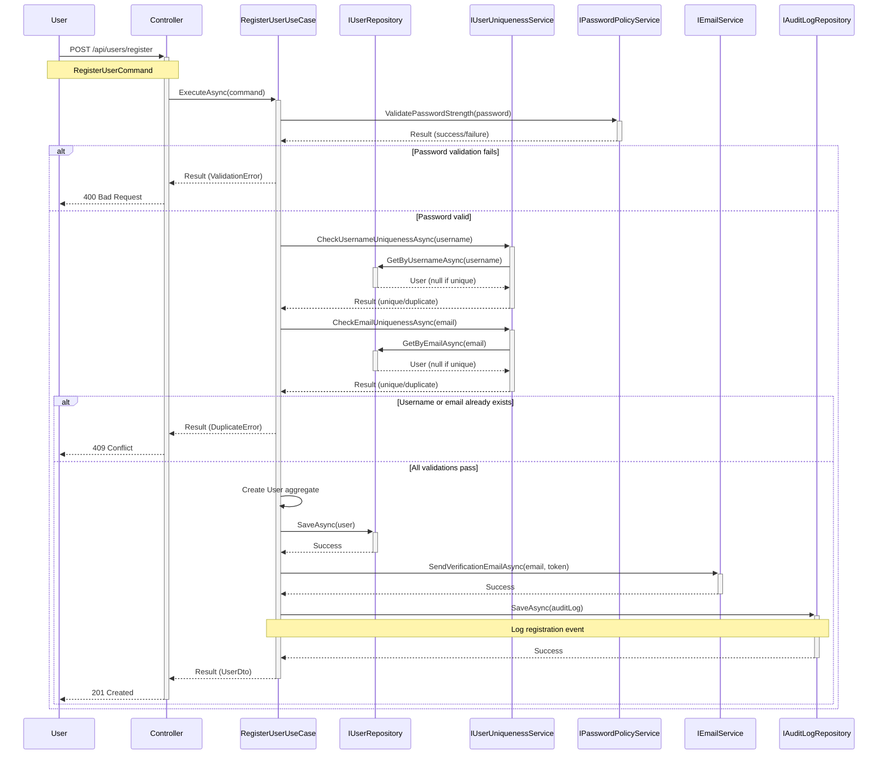
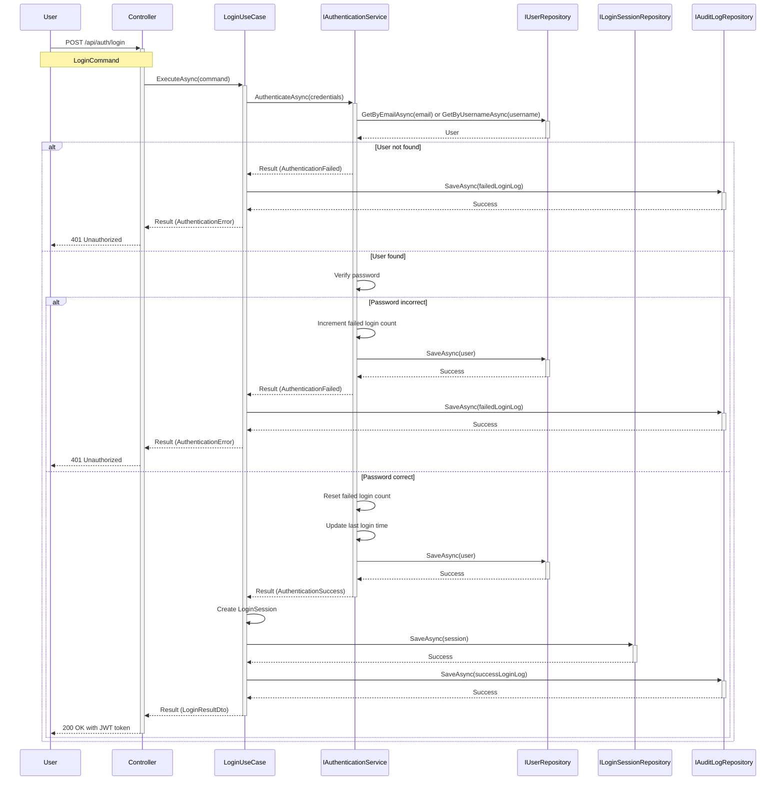
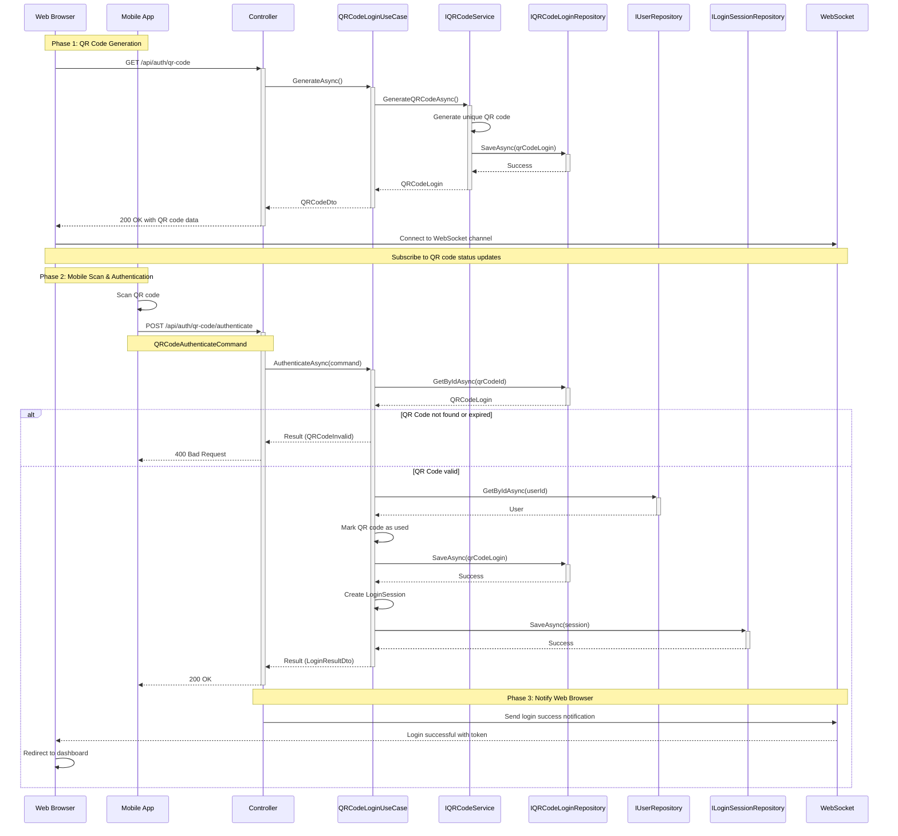
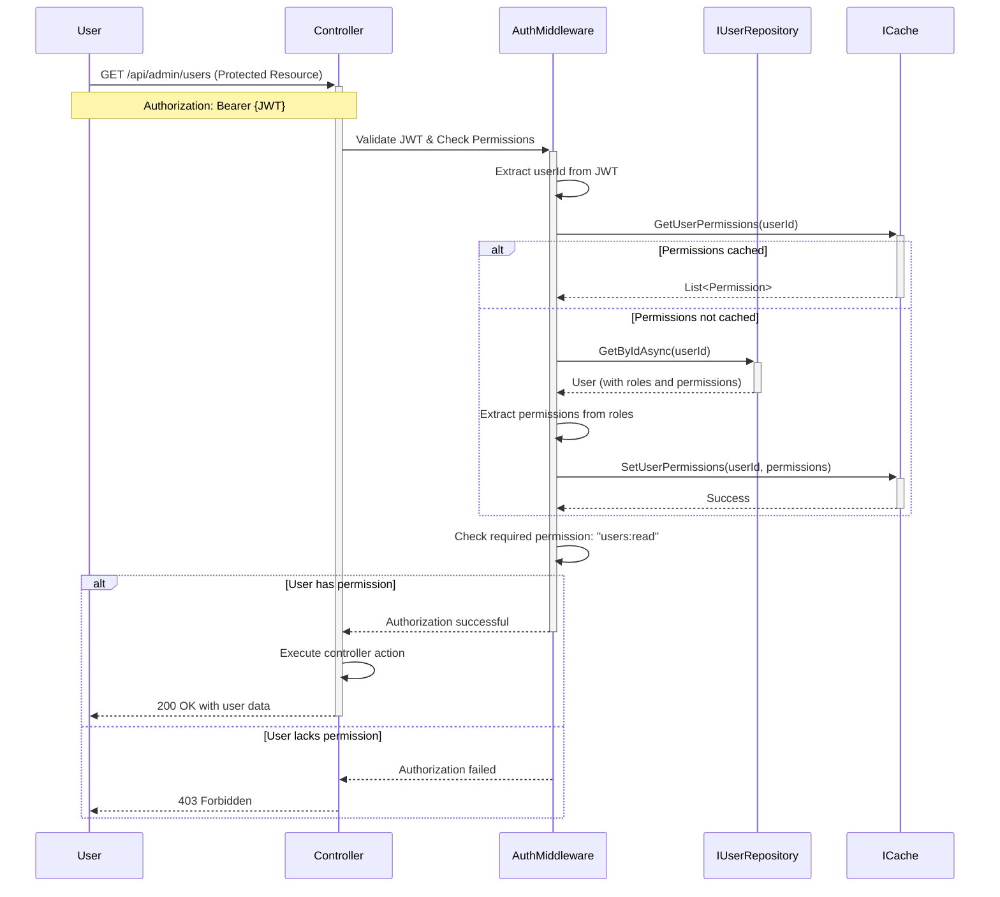

# UML圖表設計 - 使用者登入及註冊系統

本文檔包含基於DDD架構設計的完整UML圖表，包括類別圖、循序圖和使用者案例圖。

## 1. 類別圖 (Class Diagram)

### 1.1 Domain Layer 核心類別圖

```mermaid
classDiagram
    %% 聚合根和實體
    class AggregateRoot {
        <<abstract>>
        +Id: TId
        +CreatedAt: DateTime
        +ModifiedAt: DateTime
        +DomainEvents: List~IDomainEvent~
        +AddDomainEvent(event: IDomainEvent)
        +ClearDomainEvents()
    }

    class User {
        +UserId: UserId
        +Username: Username
        +Email: Email
        +Password: Password
        +UserStatus: UserStatus
        +Profile: UserProfile
        +Roles: List~Role~
        +LastLoginAt: DateTime?
        +FailedLoginCount: int
        +IsLockedOut: bool
        +LockoutEndTime: DateTime?
        +Register(username, email, password): Result
        +Login(password): Result
        +ChangePassword(oldPassword, newPassword): Result
        +LockAccount(): void
        +UnlockAccount(): void
        +AssignRole(role): void
        +HasPermission(permission): bool
    }

    class LoginSession {
        +SessionId: SessionId
        +UserId: UserId
        +SessionToken: SessionToken
        +IpAddress: IpAddress
        +UserAgent: string
        +ExpiresAt: DateTime
        +IsRevoked: bool
        +Create(userId, ipAddress, userAgent): LoginSession
        +Revoke(): void
        +IsExpired(): bool
        +IsValid(): bool
    }

    class QRCodeLogin {
        +QRCodeId: QRCodeId
        +QRCode: QRCode
        +Status: QRStatus
        +CreatedAt: DateTime
        +ExpiresAt: DateTime
        +UsedAt: DateTime?
        +UserId: UserId?
        +Generate(): QRCodeLogin
        +Use(userId): Result
        +IsExpired(): bool
        +IsUsed(): bool
    }

    class Role {
        +RoleId: RoleId
        +Name: RoleName
        +Description: string
        +Permissions: List~Permission~
        +IsActive: bool
        +AddPermission(permission): void
        +RemovePermission(permission): void
        +HasPermission(permissionName): bool
    }

    class Permission {
        +PermissionId: PermissionId
        +Name: PermissionName
        +Description: string
        +Resource: string
        +Action: string
    }

    class AuditLog {
        +LogId: LogId
        +UserId: UserId?
        +Action: LogAction
        +Resource: string
        +Details: string
        +IpAddress: IpAddress
        +UserAgent: string
        +Timestamp: DateTime
        +LogLevel: LogLevel
        +Create(userId, action, resource, details): AuditLog
    }

    %% 值物件
    class Email {
        <<ValueObject>>
        +Value: string
        +Create(email): Result~Email~
        +IsValid(): bool
    }

    class Username {
        <<ValueObject>>
        +Value: string
        +Create(username): Result~Username~
        +IsValid(): bool
    }

    class Password {
        <<ValueObject>>
        +HashedValue: string
        +Salt: string
        +Create(plainPassword): Result~Password~
        +Verify(plainPassword): bool
    }

    class SessionToken {
        <<ValueObject>>
        +Value: string
        +Generate(): SessionToken
        +IsValid(): bool
    }

    class QRCode {
        <<ValueObject>>
        +Value: string
        +ImageData: byte[]
        +Generate(): QRCode
    }

    %% 領域服務介面
    class IAuthenticationService {
        <<interface>>
        +AuthenticateAsync(credentials): Task~Result~AuthenticationResult~~
        +ValidatePasswordAsync(password): Task~Result~
    }

    class IQRCodeService {
        <<interface>>
        +GenerateQRCodeAsync(): Task~QRCodeLogin~
        +ValidateQRCodeAsync(qrCodeId, userId): Task~Result~
    }

    class IPasswordPolicyService {
        <<interface>>
        +ValidatePasswordStrength(password): Result
        +IsPasswordCompromised(password): Task~bool~
    }

    %% Repository介面
    class IUserRepository {
        <<interface>>
        +GetByIdAsync(id): Task~User~
        +GetByEmailAsync(email): Task~User~
        +GetByUsernameAsync(username): Task~User~
        +SaveAsync(user): Task
        +DeleteAsync(id): Task
    }

    class ILoginSessionRepository {
        <<interface>>
        +GetByIdAsync(id): Task~LoginSession~
        +GetByTokenAsync(token): Task~LoginSession~
        +GetActiveSessionsAsync(userId): Task~List~LoginSession~~
        +SaveAsync(session): Task
        +RevokeAllAsync(userId): Task
    }

    class IQRCodeLoginRepository {
        <<interface>>
        +GetByIdAsync(id): Task~QRCodeLogin~
        +GetByCodeAsync(code): Task~QRCodeLogin~
        +SaveAsync(qrLogin): Task
        +DeleteExpiredAsync(): Task
    }

    class IRoleRepository {
        <<interface>>
        +GetByIdAsync(id): Task~Role~
        +GetByNameAsync(name): Task~Role~
        +GetAllAsync(): Task~List~Role~~
        +SaveAsync(role): Task
    }

    class IAuditLogRepository {
        <<interface>>
        +SaveAsync(auditLog): Task
        +GetByUserIdAsync(userId, pageSize, pageNumber): Task~List~AuditLog~~
        +SearchAsync(criteria): Task~List~AuditLog~~
    }

    %% 繼承關係
    User --|> AggregateRoot
    LoginSession --|> AggregateRoot
    QRCodeLogin --|> AggregateRoot
    Role --|> AggregateRoot
    AuditLog --|> AggregateRoot
    Permission --|> Entity

    %% 組合關係
    User *-- Email
    User *-- Username
    User *-- Password
    User *-- UserProfile
    User o-- Role : "many-to-many"
    Role o-- Permission : "many-to-many"
    LoginSession *-- SessionToken
    QRCodeLogin *-- QRCode

    %% 依賴關係
    User ..> IPasswordPolicyService
    LoginSession ..> IUserRepository
    QRCodeLogin ..> IUserRepository
```

### 1.2 Application Layer 類別圖

```mermaid
classDiagram
    %% Use Cases
    class RegisterUserUseCase {
        -userRepository: IUserRepository
        -emailService: IEmailService
        -passwordPolicyService: IPasswordPolicyService
        -userUniquenessService: IUserUniquenessService
        +ExecuteAsync(command): Task~Result~UserDto~~
    }

    class LoginUseCase {
        -userRepository: IUserRepository
        -sessionRepository: ILoginSessionRepository
        -authenticationService: IAuthenticationService
        -auditLogRepository: IAuditLogRepository
        +ExecuteAsync(command): Task~Result~LoginResultDto~~
    }

    class QRCodeLoginUseCase {
        -qrCodeRepository: IQRCodeLoginRepository
        -userRepository: IUserRepository
        -sessionRepository: ILoginSessionRepository
        -qrCodeService: IQRCodeService
        +GenerateAsync(): Task~Result~QRCodeDto~~
        +AuthenticateAsync(command): Task~Result~LoginResultDto~~
    }

    class UserManagementUseCase {
        -userRepository: IUserRepository
        -roleRepository: IRoleRepository
        -auditLogRepository: IAuditLogRepository
        +GetUserAsync(userId): Task~Result~UserDto~~
        +UpdateUserAsync(command): Task~Result~UserDto~~
        +AssignRoleAsync(command): Task~Result~
        +DeactivateUserAsync(userId): Task~Result~
    }

    %% Commands
    class RegisterUserCommand {
        +Username: string
        +Email: string
        +Password: string
        +FirstName: string
        +LastName: string
    }

    class LoginCommand {
        +Identifier: string
        +Password: string
        +IpAddress: string
        +UserAgent: string
        +RememberMe: bool
    }

    class QRCodeAuthenticateCommand {
        +QRCodeId: string
        +UserId: string
        +IpAddress: string
        +UserAgent: string
    }

    %% DTOs
    class UserDto {
        +Id: string
        +Username: string
        +Email: string
        +FirstName: string
        +LastName: string
        +Status: string
        +Roles: List~RoleDto~
        +LastLoginAt: DateTime?
    }

    class LoginResultDto {
        +Token: string
        +User: UserDto
        +ExpiresAt: DateTime
        +RefreshToken: string?
    }

    class QRCodeDto {
        +Id: string
        +Code: string
        +ImageData: byte[]
        +ExpiresAt: DateTime
    }

    class RoleDto {
        +Id: string
        +Name: string
        +Description: string
        +Permissions: List~PermissionDto~
    }

    %% Application Services
    class IUserApplicationService {
        <<interface>>
        +RegisterAsync(command): Task~Result~UserDto~~
        +LoginAsync(command): Task~Result~LoginResultDto~~
        +GetUserAsync(userId): Task~Result~UserDto~~
        +UpdateUserAsync(command): Task~Result~UserDto~~
    }

    class IQRCodeApplicationService {
        <<interface>>
        +GenerateQRCodeAsync(): Task~Result~QRCodeDto~~
        +AuthenticateWithQRCodeAsync(command): Task~Result~LoginResultDto~~
    }

    %% 依賴關係
    RegisterUserUseCase ..> RegisterUserCommand
    RegisterUserUseCase ..> UserDto
    LoginUseCase ..> LoginCommand
    LoginUseCase ..> LoginResultDto
    QRCodeLoginUseCase ..> QRCodeAuthenticateCommand
    QRCodeLoginUseCase ..> QRCodeDto
    QRCodeLoginUseCase ..> LoginResultDto
```

### 1.3 Infrastructure Layer 類別圖

```mermaid
classDiagram
    %% Repository實作
    class UserRepository {
        -dbContext: IDbContext
        -logger: ILogger
        +GetByIdAsync(id): Task~User~
        +GetByEmailAsync(email): Task~User~
        +GetByUsernameAsync(username): Task~User~
        +SaveAsync(user): Task
        +DeleteAsync(id): Task
    }

    class LoginSessionRepository {
        -dbContext: IDbContext
        -logger: ILogger
        +GetByIdAsync(id): Task~LoginSession~
        +GetByTokenAsync(token): Task~LoginSession~
        +GetActiveSessionsAsync(userId): Task~List~LoginSession~~
        +SaveAsync(session): Task
        +RevokeAllAsync(userId): Task
    }

    %% Domain Service實作
    class AuthenticationService {
        -passwordService: IPasswordService
        -userRepository: IUserRepository
        -auditLogRepository: IAuditLogRepository
        +AuthenticateAsync(credentials): Task~Result~AuthenticationResult~~
        +ValidatePasswordAsync(password): Task~Result~
    }

    class QRCodeService {
        -qrGenerator: IQRGenerator
        -cryptoService: ICryptoService
        +GenerateQRCodeAsync(): Task~QRCodeLogin~
        +ValidateQRCodeAsync(qrCodeId, userId): Task~Result~
    }

    %% 外部服務實作
    class EmailService {
        -smtpClient: ISmtpClient
        -configuration: EmailConfiguration
        +SendVerificationEmailAsync(email, token): Task
        +SendPasswordResetEmailAsync(email, token): Task
        +SendLoginNotificationAsync(email, loginInfo): Task
    }

    class EncryptionService {
        -configuration: SecurityConfiguration
        +HashPasswordAsync(password): Task~string~
        +VerifyPasswordAsync(password, hash): Task~bool~
        +GenerateSecureTokenAsync(): Task~string~
        +EncryptDataAsync(data): Task~string~
        +DecryptDataAsync(encryptedData): Task~string~
    }

    %% 實作介面關係
    UserRepository ..|> IUserRepository
    LoginSessionRepository ..|> ILoginSessionRepository
    AuthenticationService ..|> IAuthenticationService
    QRCodeService ..|> IQRCodeService
    EmailService ..|> IEmailService
    EncryptionService ..|> IEncryptionService
```

## 2. 循序圖 (Sequence Diagram)

### 2.1 使用者註冊流程

### 2.2 傳統登入流程

### 2.3 QR Code登入流程

### 2.4 角色權限檢查流程

## 3. 使用者案例圖 (Use Case Diagram)

```mermaid
graph TB
    %% Actors
    Guest[訪客 Guest]
    User[一般使用者 User]
    Employee[員工 Employee]
    Manager[主管 Manager]
    Admin[系統管理員 Admin]
    System[系統 System]

    %% Use Cases - Authentication
    subgraph "身份認證 Authentication"
        UC1[註冊帳戶 Register Account]
        UC2[電子郵件驗證 Email Verification]
        UC3[傳統登入 Traditional Login]
        UC4[QR Code登入 QR Code Login]
        UC5[忘記密碼 Forgot Password]
        UC6[重設密碼 Reset Password]
        UC7[登出 Logout]
    end

    %% Use Cases - User Management
    subgraph "使用者管理 User Management"
        UC8[查看個人資料 View Profile]
        UC9[更新個人資料 Update Profile]
        UC10[變更密碼 Change Password]
        UC11[檢視登入歷史 View Login History]
        UC12[管理活躍會話 Manage Active Sessions]
    end

    %% Use Cases - Role & Permission Management
    subgraph "角色權限管理 Role & Permission Management"
        UC13[管理使用者角色 Manage User Roles]
        UC14[建立角色 Create Role]
        UC15[修改角色權限 Modify Role Permissions]
        UC16[檢視權限報表 View Permission Report]
        UC17[稽核使用者權限 Audit User Permissions]
    end

    %% Use Cases - Security & Audit
    subgraph "安全稽核 Security & Audit"
        UC18[檢視稽核日誌 View Audit Logs]
        UC19[監控安全事件 Monitor Security Events]
        UC20[產生安全報表 Generate Security Reports]
        UC21[帳戶鎖定管理 Account Lockout Management]
        UC22[異常登入偵測 Anomaly Login Detection]
    end

    %% Use Cases - System Administration
    subgraph "系統管理 System Administration"
        UC23[系統設定管理 System Configuration]
        UC24[使用者帳戶管理 User Account Management]
        UC25[資料備份復原 Data Backup & Restore]
        UC26[系統監控 System Monitoring]
    end

    %% Guest relationships
    Guest --> UC1
    Guest --> UC3
    Guest --> UC4
    Guest --> UC5

    %% User relationships (inherits from Guest)
    User --> UC1
    User --> UC2
    User --> UC3
    User --> UC4
    User --> UC5
    User --> UC6
    User --> UC7
    User --> UC8
    User --> UC9
    User --> UC10
    User --> UC11
    User --> UC12

    %% Employee relationships (inherits from User)
    Employee --> UC1
    Employee --> UC2
    Employee --> UC3
    Employee --> UC4
    Employee --> UC5
    Employee --> UC6
    Employee --> UC7
    Employee --> UC8
    Employee --> UC9
    Employee --> UC10
    Employee --> UC11
    Employee --> UC12
    Employee --> UC18

    %% Manager relationships (inherits from Employee)
    Manager --> UC1
    Manager --> UC2
    Manager --> UC3
    Manager --> UC4
    Manager --> UC5
    Manager --> UC6
    Manager --> UC7
    Manager --> UC8
    Manager --> UC9
    Manager --> UC10
    Manager --> UC11
    Manager --> UC12
    Manager --> UC13
    Manager --> UC16
    Manager --> UC17
    Manager --> UC18
    Manager --> UC19
    Manager --> UC20

    %% Admin relationships (all use cases)
    Admin --> UC1
    Admin --> UC2
    Admin --> UC3
    Admin --> UC4
    Admin --> UC5
    Admin --> UC6
    Admin --> UC7
    Admin --> UC8
    Admin --> UC9
    Admin --> UC10
    Admin --> UC11
    Admin --> UC12
    Admin --> UC13
    Admin --> UC14
    Admin --> UC15
    Admin --> UC16
    Admin --> UC17
    Admin --> UC18
    Admin --> UC19
    Admin --> UC20
    Admin --> UC21
    Admin --> UC22
    Admin --> UC23
    Admin --> UC24
    Admin --> UC25
    Admin --> UC26

    %% System automated use cases
    System --> UC2
    System --> UC21
    System --> UC22
    System --> UC26

    %% Include relationships
    UC1 -.->|include| UC2
    UC5 -.->|include| UC6
    UC3 -.->|include| UC18
    UC4 -.->|include| UC18
    UC13 -.->|include| UC17

    %% Extend relationships
    UC22 -.->|extend| UC3
    UC21 -.->|extend| UC3
    UC19 -.->|extend| UC18
```

### 使用者案例詳細說明

#### 3.1 主要參與者 (Primary Actors)

1. **訪客 (Guest)**
   - 未註冊或未登入的使用者
   - 可進行註冊和登入操作

2. **一般使用者 (User)**
   - 已註冊並完成驗證的使用者
   - 具有基本的個人資料管理權限

3. **員工 (Employee)**
   - 企業內部使用者
   - 繼承一般使用者權限，額外具有查看部分稽核資料的權限

4. **主管 (Manager)**
   - 具有管理職責的使用者
   - 可管理下屬使用者的角色權限，檢視安全報表

5. **系統管理員 (Admin)**
   - 具有最高權限的使用者
   - 可執行所有系統管理和安全管理功能

6. **系統 (System)**
   - 自動化系統程序
   - 負責執行自動化任務如異常偵測、帳戶鎖定等

#### 3.2 使用者案例關係

- **包含關係 (Include)**：必要的相依功能
  - 註冊帳戶 包含 電子郵件驗證
  - 忘記密碼 包含 重設密碼
  - 登入功能 包含 記錄稽核日誌

- **擴展關係 (Extend)**：可選的擴充功能
  - 異常登入偵測 擴展 傳統登入
  - 帳戶鎖定管理 擴展 傳統登入
  - 安全事件監控 擴展 稽核日誌檢視

#### 3.3 權限矩陣

| 使用者案例 | Guest | User | Employee | Manager | Admin |
|-----------|-------|------|----------|---------|-------|
| 註冊帳戶 | ✓ | ✓ | ✓ | ✓ | ✓ |
| 傳統登入 | ✓ | ✓ | ✓ | ✓ | ✓ |
| QR Code登入 | ✓ | ✓ | ✓ | ✓ | ✓ |
| 檢視個人資料 | - | ✓ | ✓ | ✓ | ✓ |
| 檢視稽核日誌 | - | - | ✓ | ✓ | ✓ |
| 管理使用者角色 | - | - | - | ✓ | ✓ |
| 系統設定管理 | - | - | - | - | ✓ |

這些UML圖表提供了完整的系統視覺化表示，有助於理解系統架構、互動流程和功能範圍。