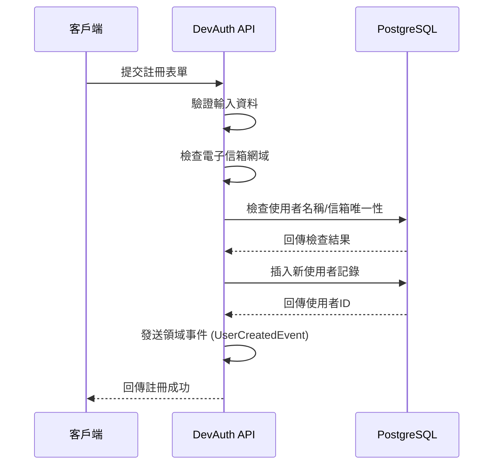
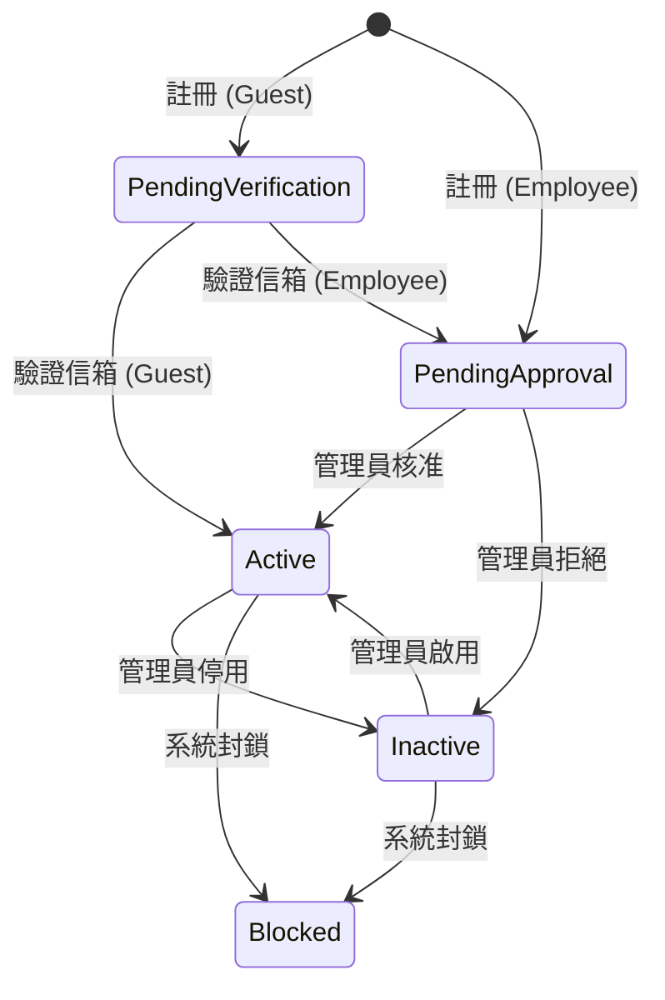

# DevAuth 資料庫架構文件

## 概述

本文件詳細說明 DevAuth 系統的資料庫架構設計。DevAuth 是一個適用於軟體開發團隊的身份驗證與授權系統，採用 Domain-Driven Design (DDD) 架構模式，使用 PostgreSQL 作為主要資料庫。

### 資料庫連線資訊
- **資料庫類型**: PostgreSQL
- **伺服器**: 192.168.76.202
- **埠號**: 5432
- **資料庫名稱**: codingManager
- **使用者**: postgres

## 系統架構概念

### 設計原則
- **Domain-Driven Design**: 以領域模型為核心的設計方法
- **Aggregate Root**: 使用聚合根管理實體的一致性
- **Value Objects**: 使用值物件封裝業務概念
- **Event Sourcing**: 透過領域事件記錄狀態變化

### 資料完整性策略
- 強制外鍵約束確保參照完整性
- 唯一約束防止資料重複
- 檢查約束確保業務規則
- 索引優化查詢效能

## 資料表結構

### 1. Users (使用者主表)

使用者聚合根的主要實體，儲存使用者的核心資訊。

#### 欄位結構

| 欄位名稱 | 資料類型 | 長度限制 | 約束 | 說明 |
|---------|----------|----------|------|------|
| Id | uuid | - | PRIMARY KEY, NOT NULL | 使用者唯一識別碼 |
| Username | varchar | 20 | UNIQUE, NOT NULL | 使用者名稱 |
| Email | varchar | 255 | UNIQUE, NOT NULL | 電子信箱地址 |
| FirstName | varchar | 50 | NOT NULL | 使用者名字 |
| LastName | varchar | 50 | NOT NULL | 使用者姓氏 |
| RoleType | text | - | NOT NULL | 角色類型 (Guest, Employee, Manager, SystemAdmin) |
| RoleAssignedAt | timestamptz | - | NOT NULL | 角色指派時間 |
| RoleAssignedBy | uuid | - | NULLABLE | 角色指派者ID |
| Status | text | - | NOT NULL | 使用者狀態 (PendingVerification, PendingApproval, Active, Inactive, Blocked) |
| PasswordHash | varchar | 500 | NULLABLE | 密碼雜湊值 |
| LastLoginAt | timestamptz | - | NULLABLE | 最後登入時間 |
| CreatedAt | timestamptz | - | NOT NULL | 建立時間 |
| LastModifiedAt | timestamptz | - | NOT NULL | 最後修改時間 |

#### 索引設計

```sql
-- 主鍵索引 (自動建立)
CREATE UNIQUE INDEX PK_Users ON Users (Id);

-- 唯一約束索引
CREATE UNIQUE INDEX IX_Users_Username ON Users (Username);
CREATE UNIQUE INDEX IX_Users_Email ON Users (Email);

-- 查詢優化索引建議
CREATE INDEX IX_Users_Status ON Users (Status);
CREATE INDEX IX_Users_RoleType ON Users (RoleType);
CREATE INDEX IX_Users_CreatedAt ON Users (CreatedAt);
CREATE INDEX IX_Users_LastLoginAt ON Users (LastLoginAt) WHERE LastLoginAt IS NOT NULL;
```

#### 業務規則約束

```sql
-- 使用者狀態檢查約束
ALTER TABLE Users
ADD CONSTRAINT CK_Users_Status
CHECK (Status IN ('PendingVerification', 'PendingApproval', 'Active', 'Inactive', 'Blocked'));

-- 角色類型檢查約束
ALTER TABLE Users
ADD CONSTRAINT CK_Users_RoleType
CHECK (RoleType IN ('Guest', 'Employee', 'Manager', 'SystemAdmin'));

-- 電子信箱格式檢查
ALTER TABLE Users
ADD CONSTRAINT CK_Users_Email_Format
CHECK (Email ~* '^[A-Za-z0-9._%+-]+@[A-Za-z0-9.-]+\.[A-Za-z]{2,}$');
```

### 2. UserTeamMemberships (使用者團隊成員關係)

管理使用者與團隊的關係，支援多對多關係。

#### 欄位結構

| 欄位名稱 | 資料類型 | 約束 | 說明 |
|---------|----------|------|------|
| Id | int | PRIMARY KEY, IDENTITY | 自增主鍵 |
| UserId | uuid | NOT NULL, FK | 使用者ID (外鍵至 Users.Id) |
| TeamId | uuid | NOT NULL | 團隊ID |
| Role | text | NOT NULL | 團隊角色 (Member, Lead, Senior, Junior) |
| JoinedAt | timestamptz | NOT NULL | 加入時間 |

#### 約束與索引

```sql
-- 外鍵約束
ALTER TABLE UserTeamMemberships
ADD CONSTRAINT FK_UserTeamMemberships_Users
FOREIGN KEY (UserId) REFERENCES Users(Id) ON DELETE CASCADE;

-- 唯一約束 (一個使用者在同一團隊只能有一個角色)
CREATE UNIQUE INDEX IX_UserTeamMemberships_UserId_TeamId
ON UserTeamMemberships (UserId, TeamId);

-- 角色檢查約束
ALTER TABLE UserTeamMemberships
ADD CONSTRAINT CK_UserTeamMemberships_Role
CHECK (Role IN ('Member', 'Lead', 'Senior', 'Junior'));
```

### 3. UserProjectMemberships (使用者專案成員關係)

管理使用者與專案的關係，包含分配比例資訊。

#### 欄位結構

| 欄位名稱 | 資料類型 | 精度 | 約束 | 說明 |
|---------|----------|------|------|------|
| Id | int | - | PRIMARY KEY, IDENTITY | 自增主鍵 |
| UserId | uuid | - | NOT NULL, FK | 使用者ID (外鍵至 Users.Id) |
| ProjectId | uuid | - | NOT NULL | 專案ID |
| Role | text | - | NOT NULL | 專案角色 (Developer, TechLead, ProjectManager, Tester, Designer) |
| JoinedAt | timestamptz | - | NOT NULL | 加入時間 |
| AllocationPercentage | numeric | 5,2 | NOT NULL | 分配比例 (0.00-100.00) |

#### 約束與索引

```sql
-- 外鍵約束
ALTER TABLE UserProjectMemberships
ADD CONSTRAINT FK_UserProjectMemberships_Users
FOREIGN KEY (UserId) REFERENCES Users(Id) ON DELETE CASCADE;

-- 唯一約束 (一個使用者在同一專案只能有一個角色)
CREATE UNIQUE INDEX IX_UserProjectMemberships_UserId_ProjectId
ON UserProjectMemberships (UserId, ProjectId);

-- 角色檢查約束
ALTER TABLE UserProjectMemberships
ADD CONSTRAINT CK_UserProjectMemberships_Role
CHECK (Role IN ('Developer', 'TechLead', 'ProjectManager', 'Tester', 'Designer'));

-- 分配比例檢查約束
ALTER TABLE UserProjectMemberships
ADD CONSTRAINT CK_UserProjectMemberships_AllocationPercentage
CHECK (AllocationPercentage >= 0.00 AND AllocationPercentage <= 100.00);
```

## 關聯性設計

### 實體關聯圖

```
Users (1) ----< UserTeamMemberships (M)
  |
  |
Users (1) ----< UserProjectMemberships (M)
```

### 關聯性說明

1. **Users ↔ UserTeamMemberships**: 一對多關係
   - 一個使用者可以屬於多個團隊
   - 每個團隊成員關係記錄包含角色和加入時間
   - 支援串聯刪除 (CASCADE DELETE)

2. **Users ↔ UserProjectMemberships**: 一對多關係
   - 一個使用者可以參與多個專案
   - 每個專案成員關係記錄包含角色、加入時間和分配比例
   - 支援串聯刪除 (CASCADE DELETE)

## 資料流程說明

### 使用者註冊流程



### 使用者狀態轉換



### 角色權限對應

| 角色類型 | 權限範圍 | 典型使用情境 |
|---------|----------|-------------|
| **Guest** | 基本權限 | 外部合作夥伴、試用使用者 |
| **Employee** | 員工權限 + 基本權限 | 一般開發人員、內部員工 |
| **Manager** | 主管權限 + 員工權限 + 基本權限 | 團隊主管、專案經理 |
| **SystemAdmin** | 所有權限 | 系統管理員、IT 人員 |

## 效能優化策略

### 查詢優化

1. **索引策略**
   ```sql
   -- 經常查詢的欄位建立索引
   CREATE INDEX CONCURRENTLY IX_Users_Status_RoleType ON Users (Status, RoleType);

   -- 部分索引優化特定查詢
   CREATE INDEX IX_Users_Active_LastLogin ON Users (LastLoginAt DESC)
   WHERE Status = 'Active';
   ```

2. **查詢分析建議**
   ```sql
   -- 分析查詢計畫
   EXPLAIN (ANALYZE, BUFFERS)
   SELECT u.*, tm.*, pm.*
   FROM Users u
   LEFT JOIN UserTeamMemberships tm ON u.Id = tm.UserId
   LEFT JOIN UserProjectMemberships pm ON u.Id = pm.UserId
   WHERE u.Status = 'Active';
   ```

### 資料分割策略 (未來考慮)

```sql
-- 按建立時間分割使用者表 (當資料量增大時)
CREATE TABLE Users_2024 PARTITION OF Users
FOR VALUES FROM ('2024-01-01') TO ('2025-01-01');

CREATE TABLE Users_2025 PARTITION OF Users
FOR VALUES FROM ('2025-01-01') TO ('2026-01-01');
```

## 備份與維護策略

### 備份計畫

1. **每日完整備份**
   ```bash
   pg_dump -h 192.168.76.202 -U postgres -d codingManager \
           --verbose --clean --if-exists --create \
           --file="/backup/devauth_$(date +%Y%m%d).sql"
   ```

2. **WAL 連續歸檔**
   ```sql
   -- 設定 WAL 歸檔
   ALTER SYSTEM SET wal_level = 'replica';
   ALTER SYSTEM SET archive_mode = 'on';
   ALTER SYSTEM SET archive_command = 'cp %p /archive/%f';
   ```

### 維護作業

1. **統計資訊更新**
   ```sql
   -- 定期更新表統計資訊
   ANALYZE Users;
   ANALYZE UserTeamMemberships;
   ANALYZE UserProjectMemberships;
   ```

2. **索引重建**
   ```sql
   -- 重建碎片化索引
   REINDEX INDEX CONCURRENTLY IX_Users_Username;
   REINDEX INDEX CONCURRENTLY IX_Users_Email;
   ```

## 監控與警報

### 關鍵指標監控

1. **效能指標**
   - 平均查詢回應時間
   - 同時連線數量
   - 索引使用率
   - 表掃描頻率

2. **業務指標**
   - 每日新增使用者數
   - 使用者狀態分佈
   - 登入活躍度

### 警報設定

```sql
-- 監控長時間執行的查詢
SELECT pid, state, query_start, query
FROM pg_stat_activity
WHERE state = 'active'
AND query_start < NOW() - INTERVAL '5 minutes';

-- 監控表大小增長
SELECT schemaname, tablename, pg_size_pretty(pg_total_relation_size(schemaname||'.'||tablename)) as size
FROM pg_tables
WHERE schemaname = 'public'
ORDER BY pg_total_relation_size(schemaname||'.'||tablename) DESC;
```

## 未來擴展建議

### 短期擴展 (3-6個月)

1. **新增稽核表**
   ```sql
   CREATE TABLE UserAuditLogs (
       Id SERIAL PRIMARY KEY,
       UserId UUID NOT NULL,
       Action VARCHAR(50) NOT NULL,
       OldValues JSONB,
       NewValues JSONB,
       ChangedBy UUID,
       ChangedAt TIMESTAMPTZ NOT NULL DEFAULT NOW(),
       IpAddress INET,
       UserAgent TEXT
   );
   ```

2. **會話管理表**
   ```sql
   CREATE TABLE UserSessions (
       Id UUID PRIMARY KEY DEFAULT gen_random_uuid(),
       UserId UUID NOT NULL REFERENCES Users(Id),
       Token VARCHAR(500) NOT NULL,
       RefreshToken VARCHAR(500),
       ExpiresAt TIMESTAMPTZ NOT NULL,
       CreatedAt TIMESTAMPTZ NOT NULL DEFAULT NOW(),
       LastAccessedAt TIMESTAMPTZ,
       IpAddress INET,
       UserAgent TEXT
   );
   ```

### 中期擴展 (6-12個月)

1. **多租戶支援**
   - 新增 Organizations 表
   - 修改現有表結構支援組織隔離
   - 實作資料列級安全性 (Row Level Security)

2. **整合第三方身份提供者**
   - 新增 ExternalProviders 表
   - 支援 OAuth/SAML 整合
   - 使用者身份聯合機制

### 長期擴展 (12個月以上)

1. **微服務架構**
   - 分離使用者管理服務
   - 獨立的身份驗證服務
   - 事件驅動的資料同步

2. **資料倉儲整合**
   - ETL 流程設計
   - 分析型資料庫
   - 商業智慧報表

## 結論

DevAuth 資料庫架構採用現代化的設計原則，確保系統的可擴展性、可維護性和效能。透過嚴謹的約束設計和索引策略，系統能夠支援軟體開發團隊的各種身份驗證和授權需求。

定期的維護和監控將確保系統持續運行在最佳狀態，而詳細的擴展規劃也為未來的成長需求提供了清晰的路線圖。