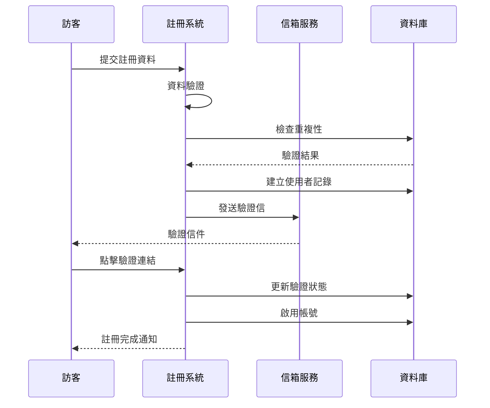
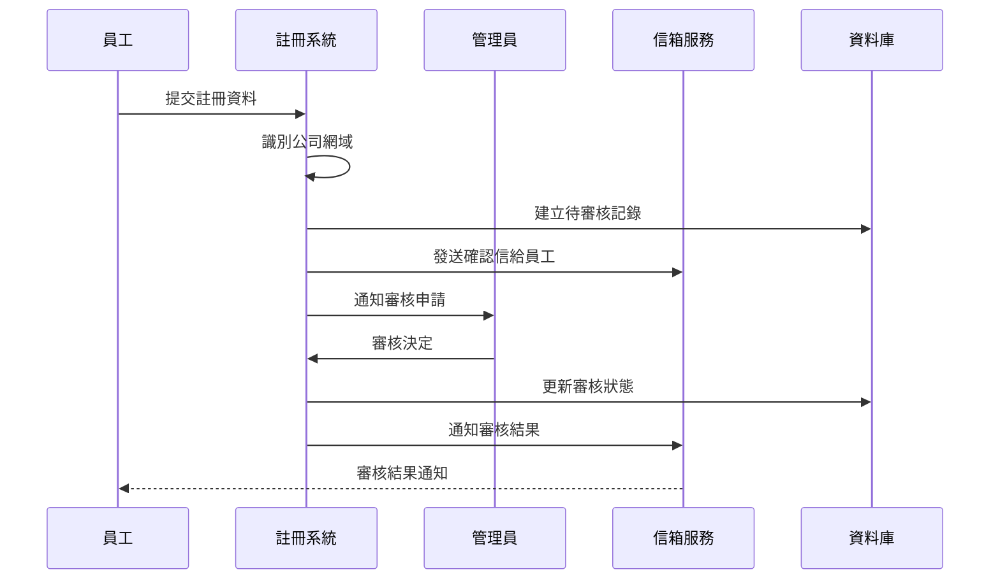
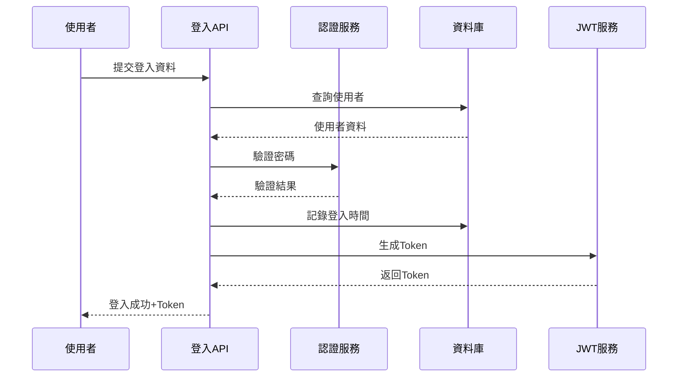
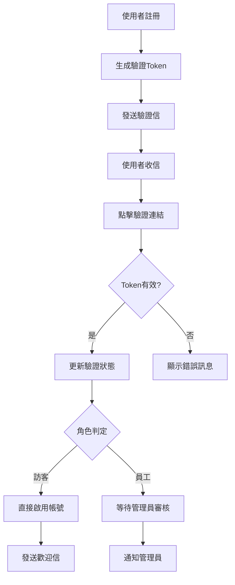
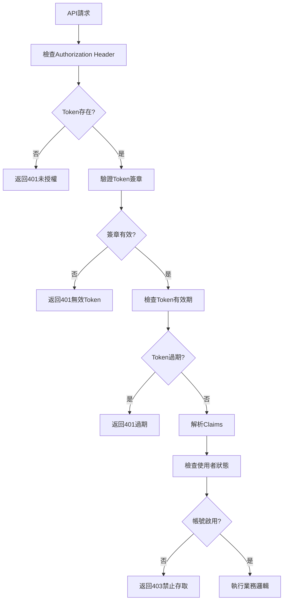

# 需求分析書：使用者註冊與登入功能 (階段1.1)

## 1. 專案背景與目標

### 1.1 專案概述
SoftwareDevelopment.API 是一個基於 .NET 8 和 DDD 架構的軟體開發專案管理平台。本專案採用四層架構設計，旨在為軟體開發團隊提供完整的專案管理解決方案，簡化 Asana 複雜架構，創建專為軟體開發設計的一站式平台。

### 1.2 業務目標
- **主要目標**：建立安全可靠的使用者身份驗證與權限管理系統
- **業務價值**：為整個軟體開發平台提供基礎的身份管理功能
- **戰略意義**：作為平台基礎模組，支撐後續專案管理、協作工具等進階功能
- **使用者體驗**：提供簡單、直覺的註冊登入流程，降低使用門檻

### 1.3 技術目標
- 實現基於 DDD 架構的身份驗證系統
- 建立可擴展的權限管理機制
- 確保高水準的資料安全性與隱私保護
- 提供 RESTful API 介面供前端系統整合
- 支援多角色使用者管理（訪客、員工、主管、管理員）

## 2. 功能需求分析

### 2.1 使用者註冊功能

#### 2.1.1 基本註冊流程
- **功能描述**：使用者可透過提供基本資訊完成帳號註冊
- **輸入資料**：
  - 使用者名稱 (Username) - 唯一識別，3-50字元
  - 電子信箱 (Email) - 唯一識別，需符合 RFC 5322 標準
  - 名字 (FirstName) - 1-100字元
  - 姓氏 (LastName) - 1-100字元
  - 密碼 (Password) - 8-100字元，需包含大小寫字母、數字、特殊符號
  - 確認密碼 (ConfirmPassword) - 必須與密碼相符

#### 2.1.2 角色自動判定機制
- **公司員工識別**：
  - 系統根據電子信箱網域自動判定使用者角色
  - 公司網域清單可透過設定檔配置 (appsettings.json)
  - 公司網域 (@company.com, @devauth.com) → 員工角色
  - 外部網域 → 訪客角色

- **狀態設定邏輯**：
  - 員工角色：初始狀態為「待審核」(PendingApproval)
  - 訪客角色：初始狀態為「待驗證」(PendingVerification)

#### 2.1.3 資料驗證規則
- **使用者名稱**：
  - 長度：3-50字元
  - 格式：英數字及底線，不可重複
  - 特殊規則：不可包含敏感詞彙

- **電子信箱**：
  - 格式驗證：RFC 5322 標準
  - 唯一性檢查：系統內不可重複
  - 長度限制：最大254字元

- **密碼安全性**：
  - 最小長度：8字元
  - 複雜度要求：至少包含大寫、小寫、數字、特殊符號各一個
  - 常見密碼檢查：不可使用常見弱密碼
  - 雜湊演算法：BCrypt (工作因子 12)

### 2.2 使用者登入功能

#### 2.2.1 登入方式
- **主要登入**：使用者名稱或電子信箱 + 密碼
- **身份驗證**：JWT Token 機制
- **記住登入**：可選擇延長 Token 有效期

#### 2.2.2 登入流程控制
- **狀態檢查**：
  - 僅啟用狀態 (Active) 使用者可登入
  - 待審核、待驗證、已停用使用者無法登入
  - 封鎖狀態使用者永久無法登入

- **安全措施**：
  - 密碼錯誤次數限制 (5次鎖定30分鐘)
  - 異常登入地點檢測
  - 登入日誌記錄

#### 2.2.3 會話管理
- **Token 管理**：
  - Access Token：短期有效 (15分鐘)
  - Refresh Token：長期有效 (7天)
  - Token 自動刷新機制

### 2.3 JWT 身份驗證

#### 2.3.1 Token 結構設計
```json
{
  "sub": "使用者ID",
  "email": "使用者信箱",
  "role": "使用者角色",
  "permissions": ["權限清單"],
  "iat": "發行時間",
  "exp": "過期時間",
  "jti": "Token唯一識別碼"
}
```

#### 2.3.2 安全機制
- **數位簽章**：使用 RS256 演算法
- **Token 撤銷**：支援 Token 黑名單機制
- **定期輪換**：Token 密鑰定期更換
- **跨域保護**：CORS 政策設定

### 2.4 電子信箱驗證

#### 2.4.1 驗證流程
1. 註冊完成後自動發送驗證信
2. 使用者點擊驗證連結
3. 系統驗證 Token 有效性
4. 更新使用者狀態為已驗證
5. 若為訪客角色，直接啟用帳號

#### 2.4.2 驗證機制設計
- **驗證 Token**：
  - 生成：UUID + 時間戳記 + 雜湊
  - 有效期：24小時
  - 單次使用：驗證後立即失效

- **信件內容**：
  - 多語系支援 (中文/英文)
  - 企業品牌設計
  - 安全提示說明

### 2.5 密碼重設功能

#### 2.5.1 重設流程
1. 使用者輸入電子信箱申請重設
2. 系統發送重設連結至信箱
3. 使用者點擊連結進入重設頁面
4. 輸入新密碼並確認
5. 系統更新密碼雜湊

#### 2.5.2 安全控制
- **重設限制**：每小時最多3次申請
- **Token 安全**：加密傳輸、單次使用
- **有效期限**：重設連結30分鐘有效
- **通知機制**：密碼變更後發送確認信

## 3. 非功能需求

### 3.1 安全性要求

#### 3.1.1 資料保護
- **密碼儲存**：使用 BCrypt 雜湊，工作因子 12
- **敏感資料加密**：AES-256 加密儲存
- **傳輸安全**：強制 HTTPS，TLS 1.2+
- **輸入驗證**：防止 SQL 注入、XSS 攻擊

#### 3.1.2 隱私保護
- **個資處理**：符合 GDPR 規範
- **資料最小化**：僅收集必要資訊
- **存取記錄**：完整的稽核軌跡
- **資料保留**：定期清理過期資料

#### 3.1.3 威脅防護
- **暴力破解防護**：帳號鎖定機制
- **CSRF 保護**：Anti-forgery Token
- **Rate Limiting**：API 呼叫頻率限制
- **安全標頭**：設定適當的 HTTP Security Headers

### 3.2 效能要求

#### 3.2.1 回應時間
- **API 回應時間**：95% 請求在 200ms 內完成
- **資料庫查詢**：單一查詢 < 50ms
- **JWT 生成**：< 10ms
- **密碼驗證**：< 100ms

#### 3.2.2 並行處理
- **併發使用者**：支援 1000 併發登入
- **TPS 要求**：每秒處理 500 筆交易
- **資源使用**：CPU 使用率 < 70%、記憶體使用率 < 80%

#### 3.2.3 擴展性
- **水平擴展**：支援多實例部署
- **負載均衡**：支援 Load Balancer
- **快取機制**：Redis 分散式快取
- **資料庫最佳化**：索引最佳化、連線池管理

### 3.3 可用性要求

#### 3.3.1 系統可用性
- **服務等級**：99.9% 系統可用性 (SLA)
- **停機時間**：每月計畫停機 < 4小時
- **錯誤處理**：友善的錯誤訊息，不洩漏系統資訊
- **降級機制**：關鍵功能故障時的備用方案

#### 3.3.2 使用者體驗
- **介面友善**：直覺的使用者介面設計
- **回饋機制**：即時的操作狀態回饋
- **多裝置支援**：響應式設計，支援桌面/行動裝置
- **無障礙設計**：符合 WCAG 2.1 AA 標準

## 4. 使用者故事與用例

### 4.1 訪客使用者故事

#### 故事 1：訪客註冊
```
作為一個外部訪客
我想要註冊一個帳號
以便能夠查看專案資訊和參與基本溝通

驗收標準：
- 可使用非公司信箱註冊
- 註冊後收到驗證信
- 驗證信箱後帳號立即啟用
- 擁有基本查看權限
```

#### 故事 2：訪客登入查看
```
作為已註冊的訪客
我想要登入系統
以便查看被授權的專案資訊

驗收標準：
- 可使用信箱或使用者名稱登入
- 登入後僅能查看被授權的內容
- 無法存取內部開發資料
- 會話管理正常運作
```

### 4.2 員工使用者故事

#### 故事 1：員工註冊申請
```
作為一個新進員工
我想要使用公司信箱註冊
以便申請系統存取權限

驗收標準：
- 使用公司網域信箱自動識別為員工
- 註冊後狀態為「待審核」
- 收到註冊確認信
- 通知管理員有新的審核申請
```

#### 故事 2：員工帳號啟用後登入
```
作為被核准的員工
我想要登入系統
以便開始使用開發相關功能

驗收標準：
- 帳號被核准後可正常登入
- 擁有開發相關權限
- 可加入團隊和專案
- 存取內部開發工具
```

### 4.3 管理員使用者故事

#### 故事 1：審核員工申請
```
作為系統管理員
我想要審核員工的註冊申請
以便控制系統存取權限

驗收標準：
- 收到新申請的通知
- 可查看申請者的基本資訊
- 可核准或拒絕申請
- 決定後通知申請者
```

#### 故事 2：使用者權限管理
```
作為系統管理員
我想要管理使用者的角色和權限
以便確保適當的存取控制

驗收標準：
- 可變更使用者角色
- 可停用/啟用使用者帳號
- 可重置使用者密碼
- 所有操作都有稽核記錄
```

## 5. 業務流程分析

### 5.1 註冊流程

#### 5.1.1 訪客註冊流程


#### 5.1.2 員工註冊流程


### 5.2 登入流程

#### 5.2.1 標準登入流程


### 5.3 驗證流程

#### 5.3.1 電子信箱驗證流程


#### 5.3.2 JWT Token 驗證流程


## 6. 資料需求分析

### 6.1 使用者資料結構

#### 6.1.1 使用者主檔 (Users)
| 欄位名稱 | 資料型別 | 長度 | 限制條件 | 說明 |
|---------|---------|------|----------|------|
| Id | uniqueidentifier | - | Primary Key, Not Null | 使用者唯一識別碼 |
| Username | nvarchar | 50 | Unique, Not Null | 使用者名稱 |
| Email | nvarchar | 254 | Unique, Not Null | 電子信箱 |
| FirstName | nvarchar | 100 | Not Null | 名字 |
| LastName | nvarchar | 100 | Not Null | 姓氏 |
| PasswordHash | nvarchar | 255 | Not Null | 密碼雜湊值 |
| Role | nvarchar | 50 | Not Null | 使用者角色 |
| Status | nvarchar | 50 | Not Null | 帳號狀態 |
| LastLoginAt | datetime2 | - | Nullable | 最後登入時間 |
| CreatedAt | datetime2 | - | Not Null | 建立時間 |
| LastModifiedAt | datetime2 | - | Not Null | 最後修改時間 |

#### 6.1.2 角色權限對照表
| 角色 | 角色代碼 | 權限描述 | 預設狀態 |
|------|---------|----------|----------|
| 訪客 | Guest | 基本查看權限 | PendingVerification |
| 員工 | Employee | 開發相關權限 | PendingApproval |
| 主管 | Manager | 管理與審核權限 | PendingApproval |
| 系統管理員 | SystemAdmin | 完整系統權限 | Active |

### 6.2 認證相關資料

#### 6.2.1 驗證Token表 (VerificationTokens)
| 欄位名稱 | 資料型別 | 長度 | 限制條件 | 說明 |
|---------|---------|------|----------|------|
| Id | uniqueidentifier | - | Primary Key | Token識別碼 |
| UserId | uniqueidentifier | - | Foreign Key | 關聯使用者 |
| TokenType | nvarchar | 50 | Not Null | Token類型 |
| TokenValue | nvarchar | 500 | Not Null | Token值 |
| ExpiryAt | datetime2 | - | Not Null | 過期時間 |
| IsUsed | bit | - | Default(0) | 是否已使用 |
| CreatedAt | datetime2 | - | Not Null | 建立時間 |

#### 6.2.2 登入記錄表 (LoginLogs)
| 欄位名稱 | 資料型別 | 長度 | 限制條件 | 說明 |
|---------|---------|------|----------|------|
| Id | bigint | - | Primary Key, Identity | 記錄識別碼 |
| UserId | uniqueidentifier | - | Foreign Key | 使用者識別碼 |
| IPAddress | nvarchar | 45 | Not Null | IP位址 |
| UserAgent | nvarchar | 500 | Nullable | 瀏覽器資訊 |
| LoginResult | nvarchar | 50 | Not Null | 登入結果 |
| LoginAt | datetime2 | - | Not Null | 登入時間 |

### 6.3 系統設定資料

#### 6.3.1 應用程式設定 (AppSettings)
```json
{
  "ConnectionStrings": {
    "DefaultConnection": "Server=localhost;Database=SoftwareDevelopmentDb;Trusted_Connection=true"
  },
  "CompanySettings": {
    "Domains": ["company.com", "devauth.com"],
    "RequireApprovalForEmployees": true
  },
  "JwtSettings": {
    "Issuer": "SoftwareDevelopment.API",
    "Audience": "SoftwareDevelopment.Client",
    "SecretKey": "Your-256-bit-secret-key-here",
    "AccessTokenExpiryMinutes": 15,
    "RefreshTokenExpiryDays": 7
  },
  "EmailSettings": {
    "SmtpHost": "smtp.example.com",
    "SmtpPort": 587,
    "Username": "noreply@company.com",
    "Password": "smtp-password",
    "EnableSsl": true,
    "From": "SoftwareDevelopment Platform <noreply@company.com>"
  }
}
```

## 7. 介面需求

### 7.1 API 介面需求

#### 7.1.1 註冊API
```http
POST /api/users/register
Content-Type: application/json

{
    "username": "johndoe",
    "email": "john@company.com",
    "firstName": "John",
    "lastName": "Doe",
    "password": "SecurePassword123!",
    "confirmPassword": "SecurePassword123!"
}
```

**成功回應 (201 Created)**:
```json
{
    "userId": "123e4567-e89b-12d3-a456-426614174000",
    "username": "johndoe",
    "email": "john@company.com",
    "fullName": "John Doe",
    "role": "Employee",
    "status": "PendingApproval",
    "requiresApproval": true,
    "createdAt": "2024-01-15T10:30:00Z"
}
```

#### 7.1.2 登入API
```http
POST /api/auth/login
Content-Type: application/json

{
    "usernameOrEmail": "johndoe",
    "password": "SecurePassword123!",
    "rememberMe": false
}
```

**成功回應 (200 OK)**:
```json
{
    "accessToken": "eyJhbGciOiJSUzI1NiIsInR5cCI6IkpXVCJ9...",
    "refreshToken": "def50200...",
    "tokenType": "Bearer",
    "expiresIn": 900,
    "user": {
        "userId": "123e4567-e89b-12d3-a456-426614174000",
        "username": "johndoe",
        "email": "john@company.com",
        "fullName": "John Doe",
        "role": "Employee",
        "permissions": ["READ_PROJECTS", "WRITE_CODE", "REVIEW_CODE"]
    }
}
```

#### 7.1.3 電子信箱驗證API
```http
GET /api/auth/verify-email?token={verification-token}
```

#### 7.1.4 密碼重設API
```http
POST /api/auth/forgot-password
Content-Type: application/json

{
    "email": "john@company.com"
}
```

### 7.2 前端介面需求

#### 7.2.1 註冊頁面需求
- **版面配置**：響應式設計，支援桌面與行動裝置
- **表單欄位**：
  - 使用者名稱輸入框（即時可用性檢查）
  - 電子信箱輸入框（格式驗證）
  - 姓名輸入框（名字、姓氏）
  - 密碼輸入框（強度指示器）
  - 確認密碼輸入框（即時比對）
  - 服務條款同意核取方塊

- **互動功能**：
  - 即時表單驗證
  - 密碼強度視覺化指示器
  - 友善的錯誤訊息提示
  - 提交後的載入狀態顯示

#### 7.2.2 登入頁面需求
- **版面配置**：簡潔的中央登入表單
- **功能要素**：
  - 帳號輸入框（支援使用者名稱或信箱）
  - 密碼輸入框（顯示/隱藏切換）
  - 記住我核取方塊
  - 登入按鈕
  - 忘記密碼連結
  - 註冊帳號連結

#### 7.2.3 管理後台需求
- **使用者管理介面**：
  - 使用者清單（分頁、搜尋、篩選）
  - 使用者詳細資訊查看
  - 帳號狀態管理（啟用/停用）
  - 角色變更功能
  - 密碼重置功能

- **審核管理介面**：
  - 待審核使用者清單
  - 審核決定按鈕（核准/拒絕）
  - 審核歷史記錄
  - 批次操作功能

## 8. 整合需求

### 8.1 第三方服務整合

#### 8.1.1 電子信箱服務整合
- **SMTP 服務**：支援多種 SMTP 服務商
  - Gmail SMTP
  - Outlook SMTP
  - SendGrid
  - AWS SES

- **信件模板**：
  - 多語系支援（中文繁體、英文）
  - 企業品牌視覺設計
  - 響應式信件版型
  - 變數替換功能

#### 8.1.2 記錄與監控整合
- **日誌服務**：
  - Serilog 結構化日誌
  - 支援多種輸出目標（檔案、資料庫、雲端）
  - 敏感資料遮罩處理

- **監控服務**：
  - Application Insights (Azure)
  - 效能計數器監控
  - 錯誤率追蹤
  - 使用者行為分析

### 8.2 內部系統整合

#### 8.2.1 資料庫整合
- **Entity Framework Core**：
  - Code First 開發模式
  - 資料庫遷移管理
  - 連線池最佳化
  - 查詢效能監控

#### 8.2.2 快取系統整合
- **記憶體快取**：
  - IMemoryCache 用於短期快取
  - 使用者會話資料快取
  - 設定資料快取

- **分散式快取**：
  - Redis 用於多實例環境
  - JWT Token 黑名單
  - 使用者權限快取
  - 登入失敗計數器

#### 8.2.3 背景工作整合
- **背景服務**：
  - 電子信箱發送佇列
  - 過期 Token 清理
  - 使用者活動統計
  - 系統健康檢查

## 9. 風險分析與假設

### 9.1 技術風險

#### 9.1.1 高風險項目
| 風險項目 | 風險等級 | 機率 | 影響 | 風險描述 |
|---------|---------|------|------|----------|
| 密碼安全性漏洞 | 高 | 低 | 高 | 密碼雜湊演算法被破解或實作錯誤 |
| JWT Token 洩漏 | 高 | 中 | 高 | Token 被竊取導致身份冒用 |
| SQL 注入攻擊 | 高 | 低 | 高 | 輸入驗證不當導致資料庫被攻擊 |
| 第三方服務中斷 | 中 | 中 | 中 | SMTP 服務不可用影響信箱驗證 |

#### 9.1.2 中等風險項目
| 風險項目 | 風險等級 | 機率 | 影響 | 風險描述 |
|---------|---------|------|------|----------|
| 效能瓶頸 | 中 | 中 | 中 | 高併發時資料庫查詢效能下降 |
| 記憶體洩漏 | 中 | 低 | 中 | 長時間運行導致記憶體使用異常 |
| 第三方套件漏洞 | 中 | 中 | 中 | 依賴的 NuGet 套件存在安全漏洞 |

### 9.2 業務風險

#### 9.2.1 使用者體驗風險
- **註冊流程複雜**：過多的驗證步驟可能降低註冊完成率
- **信箱驗證失敗**：垃圾信件過濾可能導致驗證信收不到
- **密碼政策過嚴**：過於複雜的密碼要求可能影響使用者體驗

#### 9.2.2 營運風險
- **管理員工作負荷**：員工審核流程可能造成管理員負擔
- **法規合規風險**：個資法規變更可能需要調整系統設計
- **擴展性風險**：用戶數成長可能超出系統負載能力

### 9.3 緩解策略

#### 9.3.1 技術風險緩解
- **安全性強化**：
  - 定期安全審計
  - 滲透測試
  - 依賴套件漏洞掃描
  - 程式碼安全審查

- **效能最佳化**：
  - 負載測試
  - 資料庫索引最佳化
  - 快取策略實施
  - 監控與告警機制

#### 9.3.2 業務風險緩解
- **使用者體驗優化**：
  - A/B 測試不同的流程設計
  - 使用者回饋收集
  - 多管道信件發送備援
  - 漸進式表單驗證

- **營運流程優化**：
  - 自動化審核規則
  - 批次處理功能
  - 委派審核權限
  - 定期流程檢討

### 9.4 假設條件

#### 9.4.1 技術假設
- **.NET 8 穩定性**：假設 .NET 8 平台穩定且持續獲得支援
- **PostgreSQL 效能**：假設 PostgreSQL 能滿足預期的效能需求
- **Azure 服務可用性**：假設 Azure 雲端服務維持高可用性
- **第三方套件支援**：假設使用的 NuGet 套件持續維護更新

#### 9.4.2 業務假設
- **使用者接受度**：假設使用者能接受當前的註冊登入流程
- **管理資源充足**：假設有足夠的管理人員處理審核工作
- **網路環境穩定**：假設使用者網路環境能正常存取系統
- **法規環境穩定**：假設相關法規在短期內不會有重大變更

## 10. 驗收標準

### 10.1 功能驗收標準

#### 10.1.1 使用者註冊功能
**基本註冊流程**：
- ✅ 使用者可使用有效資料完成註冊
- ✅ 系統正確驗證所有輸入欄位
- ✅ 重複的使用者名稱或信箱會被拒絕
- ✅ 註冊成功後發送驗證信
- ✅ 公司網域自動識別為員工角色
- ✅ 外部網域自動識別為訪客角色

**資料驗證**：
- ✅ 使用者名稱格式與唯一性檢查
- ✅ 電子信箱格式與唯一性檢查
- ✅ 密碼複雜度要求驗證
- ✅ 確認密碼匹配檢查
- ✅ 必填欄位完整性檢查

#### 10.1.2 使用者登入功能
**登入驗證**：
- ✅ 使用有效帳號密碼可成功登入
- ✅ 無效帳號密碼登入失敗
- ✅ 支援使用者名稱或信箱登入
- ✅ 非啟用狀態帳號無法登入
- ✅ 登入成功後返回有效 JWT Token

**會話管理**：
- ✅ JWT Token 包含正確的使用者資訊
- ✅ Token 過期時間設定正確
- ✅ Token 驗證機制運作正常
- ✅ 登入時間正確記錄

#### 10.1.3 電子信箱驗證功能
**驗證流程**：
- ✅ 註冊後自動發送驗證信
- ✅ 驗證連結點擊後正確驗證
- ✅ 無效或過期 Token 正確拒絕
- ✅ 驗證完成後狀態正確更新
- ✅ 訪客驗證後自動啟用帳號

### 10.2 效能驗收標準

#### 10.2.1 回應時間標準
- **註冊 API**：90% 請求在 300ms 內完成
- **登入 API**：95% 請求在 200ms 內完成
- **Token 驗證**：99% 請求在 50ms 內完成
- **資料庫查詢**：單一查詢平均 < 50ms

#### 10.2.2 並發處理標準
- **併發註冊**：支援 100 併發註冊請求
- **併發登入**：支援 500 併發登入請求
- **資源使用**：
  - CPU 使用率保持在 70% 以下
  - 記憶體使用率保持在 80% 以下
  - 資料庫連線數保持在限制的 80% 以下

#### 10.2.3 負載測試標準
**測試場景**：
- 100 併發使用者持續 10 分鐘
- 峰值 500 併發使用者持續 5 分鐘
- 長時間運行 24 小時無記憶體洩漏

**通過標準**：
- 錯誤率 < 0.1%
- 平均回應時間增長 < 50%
- 無系統崩潰或服務中斷

### 10.3 安全性驗收標準

#### 10.3.1 密碼安全標準
- ✅ 密碼使用 BCrypt 雜湊，工作因子 ≥ 12
- ✅ 明碼密碼不會儲存在資料庫
- ✅ 密碼不會出現在日誌檔案中
- ✅ 密碼複雜度要求正確實施
- ✅ 暴力破解防護機制有效

#### 10.3.2 JWT 安全標準
- ✅ Token 使用強加密演算法簽名
- ✅ Token 包含適當的過期時間
- ✅ 敏感資訊不會包含在 Token 中
- ✅ Token 撤銷機制運作正常
- ✅ Token 在傳輸中使用 HTTPS 保護

#### 10.3.3 輸入驗證標準
- ✅ 所有使用者輸入都經過驗證和淨化
- ✅ SQL 注入攻擊測試通過
- ✅ XSS 攻擊測試通過
- ✅ CSRF 保護機制有效
- ✅ 惡意檔案上傳測試通過

### 10.4 可用性驗收標準

#### 10.4.1 錯誤處理標準
- ✅ 所有錯誤都返回友善的錯誤訊息
- ✅ 錯誤訊息不洩漏系統內部資訊
- ✅ 系統異常時有適當的降級處理
- ✅ 關鍵錯誤有告警機制

#### 10.4.2 使用者體驗標準
- ✅ 註冊流程步驟清晰明確
- ✅ 表單驗證回饋即時準確
- ✅ 載入狀態有適當的視覺回饋
- ✅ 多裝置瀏覽器相容性良好

#### 10.4.3 監控與日誌標準
- ✅ 所有關鍵操作都有日誌記錄
- ✅ 系統效能指標持續監控
- ✅ 異常狀況自動告警
- ✅ 日誌分析和查詢功能正常

### 10.5 整合驗收標準

#### 10.5.1 資料庫整合
- ✅ Entity Framework 遷移正確執行
- ✅ 資料庫約束條件正確建立
- ✅ 索引效能符合預期
- ✅ 資料完整性檢查通過

#### 10.5.2 第三方服務整合
- ✅ SMTP 信件發送功能正常
- ✅ 信件模板正確渲染
- ✅ 服務中斷時有適當的錯誤處理
- ✅ 重試機制運作正常

---

## 文檔版本資訊
- **文檔版本**：1.0
- **建立日期**：2025-09-25
- **最後更新**：2025-09-25
- **負責人**：系統分析師
- **審核狀態**：待審核
- **下一次檢討日期**：2025-10-25

## 參考文檔
- [專案整體需求分析](/docs/complete-requirements-analysis.md)
- [DDD 架構文檔](/docs/DDD_Architecture_Overview.md)
- [C# 編程規範](/docs/CSharp-Coding-Guidelines.md)
- [代理協作流程指南](/docs/Agent-Collaboration-Guide.md)

---

*本需求分析書將隨專案進展持續更新，所有變更都將記錄在版本控制系統中。*