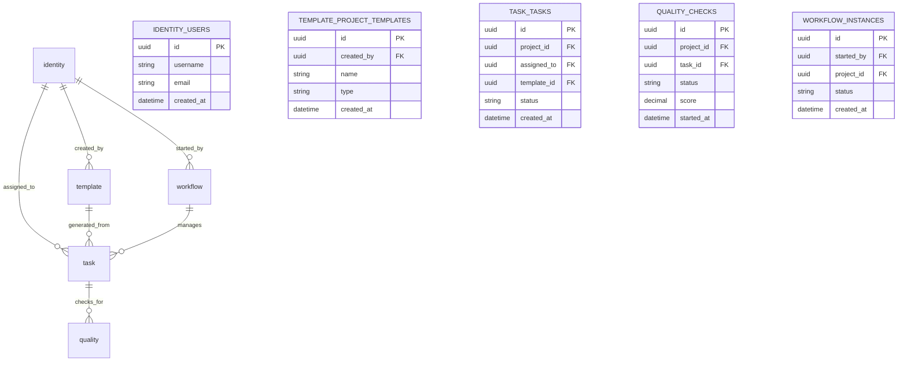

# 軟體開發專案管理平台 - 第2階段資料庫架構設計

## 版本資訊
- **文檔版本**：1.0
- **建立日期**：2025-09-27
- **負責人**：系統設計師
- **審核狀態**：待審核
- **相關專案**：SoftwareDevelopment.API - Phase 2

---

## 1. 資料庫架構概覽

### 1.1 架構原則
基於第1階段的PostgreSQL資料庫架構，第2階段遵循以下設計原則：

- **Schema分離**: 按業務領域劃分Schema
- **正規化設計**: 遵循第三正規化原則
- **效能優化**: 適當的索引和分區策略
- **資料完整性**: 完善的約束和觸發器
- **可擴展性**: 支援未來功能的數據需求

### 1.2 Schema組織結構

```sql
-- 資料庫架構概覽
CREATE SCHEMA IF NOT EXISTS identity;      -- 第1階段：身份管理
CREATE SCHEMA IF NOT EXISTS template;      -- 專案模板管理
CREATE SCHEMA IF NOT EXISTS task;          -- 任務管理
CREATE SCHEMA IF NOT EXISTS quality;       -- AI品質檢查
CREATE SCHEMA IF NOT EXISTS workflow;      -- 工作流程引擎
CREATE SCHEMA IF NOT EXISTS audit;         -- 審計日誌
CREATE SCHEMA IF NOT EXISTS notification;  -- 通知系統
```

### 1.3 跨Schema關聯設計



---

## 2. 專案模板Schema設計

### 2.1 專案模板核心表

```sql
-- 專案模板主表
CREATE TABLE template.project_templates (
    id UUID PRIMARY KEY DEFAULT gen_random_uuid(),
    name VARCHAR(255) NOT NULL,
    description TEXT,
    template_type VARCHAR(50) NOT NULL CHECK (template_type IN ('DDD', 'CQRS', 'CleanArchitecture', 'Microservices', 'MVC', 'Custom')),
    status VARCHAR(20) DEFAULT 'Draft' CHECK (status IN ('Draft', 'Active', 'Deprecated', 'Archived')),
    version VARCHAR(20) NOT NULL DEFAULT '1.0.0',

    -- 技術堆疊
    framework VARCHAR(100) NOT NULL,
    framework_version VARCHAR(50) NOT NULL,
    database_type VARCHAR(50) NOT NULL,
    runtime_version VARCHAR(50) NOT NULL,

    -- 元數據
    download_count INTEGER DEFAULT 0,
    average_rating DECIMAL(3,2) DEFAULT 0.00,
    review_count INTEGER DEFAULT 0,
    last_used_at TIMESTAMP,

    -- 配置JSON
    configuration JSONB NOT NULL DEFAULT '{}',
    custom_settings JSONB DEFAULT '{}',

    -- 標籤
    tags TEXT[] DEFAULT '{}',

    -- 審計欄位
    created_by UUID NOT NULL REFERENCES identity.users(id),
    created_at TIMESTAMP DEFAULT CURRENT_TIMESTAMP,
    updated_by UUID REFERENCES identity.users(id),
    updated_at TIMESTAMP DEFAULT CURRENT_TIMESTAMP,

    -- 索引
    CONSTRAINT chk_rating_range CHECK (average_rating >= 0.00 AND average_rating <= 5.00),
    CONSTRAINT chk_download_count CHECK (download_count >= 0)
);

-- 索引設計
CREATE INDEX idx_templates_type ON template.project_templates(template_type);
CREATE INDEX idx_templates_status ON template.project_templates(status);
CREATE INDEX idx_templates_created_by ON template.project_templates(created_by);
CREATE INDEX idx_templates_framework ON template.project_templates(framework);
CREATE INDEX idx_templates_download_count ON template.project_templates(download_count DESC);
CREATE INDEX idx_templates_rating ON template.project_templates(average_rating DESC);
CREATE INDEX idx_templates_tags ON template.project_templates USING GIN(tags);
CREATE INDEX idx_templates_config ON template.project_templates USING GIN(configuration);
```

### 2.2 模板模組和依賴關係

```sql
-- 模板模組表
CREATE TABLE template.template_modules (
    id UUID PRIMARY KEY DEFAULT gen_random_uuid(),
    template_id UUID NOT NULL REFERENCES template.project_templates(id) ON DELETE CASCADE,
    name VARCHAR(255) NOT NULL,
    description TEXT,
    module_type VARCHAR(50) NOT NULL CHECK (module_type IN ('Core', 'Authentication', 'Logging', 'Caching', 'Messaging', 'Testing', 'Documentation')),
    is_required BOOLEAN DEFAULT FALSE,
    sort_order INTEGER DEFAULT 0,

    -- 模組配置
    settings JSONB DEFAULT '{}',
    file_patterns TEXT[] DEFAULT '{}',

    -- 審計欄位
    created_at TIMESTAMP DEFAULT CURRENT_TIMESTAMP,
    updated_at TIMESTAMP DEFAULT CURRENT_TIMESTAMP,

    UNIQUE(template_id, name)
);

-- 模組依賴關係表
CREATE TABLE template.module_dependencies (
    id UUID PRIMARY KEY DEFAULT gen_random_uuid(),
    module_id UUID NOT NULL REFERENCES template.template_modules(id) ON DELETE CASCADE,
    depends_on_module_id UUID NOT NULL REFERENCES template.template_modules(id) ON DELETE CASCADE,
    dependency_type VARCHAR(20) DEFAULT 'Required' CHECK (dependency_type IN ('Required', 'Optional', 'Conflict')),
    created_at TIMESTAMP DEFAULT CURRENT_TIMESTAMP,

    UNIQUE(module_id, depends_on_module_id),
    CHECK(module_id != depends_on_module_id)
);

-- 模板庫表（技術棧依賴）
CREATE TABLE template.template_libraries (
    id UUID PRIMARY KEY DEFAULT gen_random_uuid(),
    template_id UUID NOT NULL REFERENCES template.project_templates(id) ON DELETE CASCADE,
    library_name VARCHAR(255) NOT NULL,
    library_version VARCHAR(50) NOT NULL,
    library_type VARCHAR(50) NOT NULL CHECK (library_type IN ('NuGet', 'npm', 'Maven', 'pip', 'gem')),
    is_dev_dependency BOOLEAN DEFAULT FALSE,
    created_at TIMESTAMP DEFAULT CURRENT_TIMESTAMP,

    UNIQUE(template_id, library_name)
);

-- 索引
CREATE INDEX idx_modules_template_id ON template.template_modules(template_id);
CREATE INDEX idx_modules_type ON template.template_modules(module_type);
CREATE INDEX idx_dependencies_module_id ON template.module_dependencies(module_id);
CREATE INDEX idx_libraries_template_id ON template.template_libraries(template_id);
```

### 2.3 專案生成記錄

```sql
-- 專案生成記錄表
CREATE TABLE template.project_generations (
    id UUID PRIMARY KEY DEFAULT gen_random_uuid(),
    template_id UUID NOT NULL REFERENCES template.project_templates(id),
    project_name VARCHAR(255) NOT NULL,
    namespace VARCHAR(255) NOT NULL,

    -- 生成配置
    generation_config JSONB NOT NULL DEFAULT '{}',
    selected_modules UUID[] DEFAULT '{}',

    -- 生成結果
    status VARCHAR(20) DEFAULT 'Pending' CHECK (status IN ('Pending', 'Running', 'Completed', 'Failed')),
    repository_url VARCHAR(500),
    generated_files_count INTEGER DEFAULT 0,
    generation_time_ms INTEGER,

    -- 錯誤信息
    error_message TEXT,
    warnings TEXT[],

    -- 審計欄位
    requested_by UUID NOT NULL REFERENCES identity.users(id),
    created_at TIMESTAMP DEFAULT CURRENT_TIMESTAMP,
    completed_at TIMESTAMP
);

-- 生成檔案詳情表
CREATE TABLE template.generated_files (
    id UUID PRIMARY KEY DEFAULT gen_random_uuid(),
    generation_id UUID NOT NULL REFERENCES template.project_generations(id) ON DELETE CASCADE,
    file_path VARCHAR(1000) NOT NULL,
    file_type VARCHAR(50) NOT NULL,
    file_size_bytes BIGINT,
    content_hash VARCHAR(64),
    created_at TIMESTAMP DEFAULT CURRENT_TIMESTAMP
);

-- 索引
CREATE INDEX idx_generations_template_id ON template.project_generations(template_id);
CREATE INDEX idx_generations_requested_by ON template.project_generations(requested_by);
CREATE INDEX idx_generations_status ON template.project_generations(status);
CREATE INDEX idx_generations_created_at ON template.project_generations(created_at DESC);
CREATE INDEX idx_generated_files_generation_id ON template.generated_files(generation_id);
```

---

## 3. 任務管理Schema設計

### 3.1 專案和任務核心表

```sql
-- 專案表（擴展第1階段）
CREATE TABLE task.projects (
    id UUID PRIMARY KEY DEFAULT gen_random_uuid(),
    name VARCHAR(255) NOT NULL,
    description TEXT,
    project_code VARCHAR(20) NOT NULL UNIQUE,

    -- 專案狀態
    status VARCHAR(20) DEFAULT 'Planning' CHECK (status IN ('Planning', 'Active', 'OnHold', 'Completed', 'Cancelled')),
    priority VARCHAR(10) DEFAULT 'Medium' CHECK (priority IN ('Critical', 'High', 'Medium', 'Low')),

    -- 時程規劃
    start_date DATE,
    end_date DATE,
    estimated_hours INTEGER,
    actual_hours INTEGER DEFAULT 0,

    -- 模板關聯
    template_id UUID REFERENCES template.project_templates(id),
    repository_url VARCHAR(500),

    -- 配置
    settings JSONB DEFAULT '{}',

    -- 審計欄位
    created_by UUID NOT NULL REFERENCES identity.users(id),
    created_at TIMESTAMP DEFAULT CURRENT_TIMESTAMP,
    updated_by UUID REFERENCES identity.users(id),
    updated_at TIMESTAMP DEFAULT CURRENT_TIMESTAMP
);

-- 任務表
CREATE TABLE task.tasks (
    id UUID PRIMARY KEY DEFAULT gen_random_uuid(),
    task_number VARCHAR(50) NOT NULL UNIQUE,
    title VARCHAR(500) NOT NULL,
    description TEXT,

    -- 任務分類
    task_type VARCHAR(30) DEFAULT 'Development' CHECK (task_type IN ('Development', 'Testing', 'Documentation', 'Review', 'Bug', 'Research')),
    priority VARCHAR(10) DEFAULT 'Medium' CHECK (priority IN ('Critical', 'High', 'Medium', 'Low')),
    status VARCHAR(20) DEFAULT 'Todo' CHECK (status IN ('Todo', 'InProgress', 'Review', 'Testing', 'Done', 'Closed')),

    -- 關聯關係
    project_id UUID NOT NULL REFERENCES task.projects(id) ON DELETE CASCADE,
    parent_task_id UUID REFERENCES task.tasks(id),

    -- 指派信息
    assigned_to UUID REFERENCES identity.users(id),
    created_by UUID NOT NULL REFERENCES identity.users(id),

    -- 時程管理
    due_date TIMESTAMP,
    estimated_hours INTEGER,
    actual_hours INTEGER DEFAULT 0,
    progress_percentage INTEGER DEFAULT 0 CHECK (progress_percentage >= 0 AND progress_percentage <= 100),

    -- 業務字段
    acceptance_criteria TEXT,
    business_value INTEGER DEFAULT 0,
    story_points INTEGER,

    -- 審計欄位
    created_at TIMESTAMP DEFAULT CURRENT_TIMESTAMP,
    updated_at TIMESTAMP DEFAULT CURRENT_TIMESTAMP,
    completed_at TIMESTAMP,

    -- 約束
    CONSTRAINT chk_due_date_after_creation CHECK (due_date IS NULL OR due_date >= created_at),
    CONSTRAINT chk_estimated_hours CHECK (estimated_hours IS NULL OR estimated_hours > 0),
    CONSTRAINT chk_actual_hours CHECK (actual_hours >= 0),
    CONSTRAINT chk_story_points CHECK (story_points IS NULL OR story_points > 0)
);

-- 索引設計
CREATE INDEX idx_projects_status ON task.projects(status);
CREATE INDEX idx_projects_created_by ON task.projects(created_by);
CREATE INDEX idx_projects_template_id ON task.projects(template_id);
CREATE INDEX idx_tasks_project_id ON task.tasks(project_id);
CREATE INDEX idx_tasks_assigned_to ON task.tasks(assigned_to);
CREATE INDEX idx_tasks_status ON task.tasks(status);
CREATE INDEX idx_tasks_priority ON task.tasks(priority);
CREATE INDEX idx_tasks_due_date ON task.tasks(due_date);
CREATE INDEX idx_tasks_created_at ON task.tasks(created_at DESC);
CREATE INDEX idx_tasks_parent_task_id ON task.tasks(parent_task_id);
```

### 3.2 任務協作和附件

```sql
-- 任務評論表
CREATE TABLE task.task_comments (
    id UUID PRIMARY KEY DEFAULT gen_random_uuid(),
    task_id UUID NOT NULL REFERENCES task.tasks(id) ON DELETE CASCADE,
    content TEXT NOT NULL,
    comment_type VARCHAR(20) DEFAULT 'Comment' CHECK (comment_type IN ('Comment', 'StatusChange', 'Assignment', 'Progress')),

    -- 元數據
    is_internal BOOLEAN DEFAULT FALSE,
    mentioned_users UUID[],

    -- 審計欄位
    author_id UUID NOT NULL REFERENCES identity.users(id),
    created_at TIMESTAMP DEFAULT CURRENT_TIMESTAMP,
    updated_at TIMESTAMP DEFAULT CURRENT_TIMESTAMP,

    -- 全文搜索
    content_tsvector TSVECTOR GENERATED ALWAYS AS (to_tsvector('chinese', content)) STORED
);

-- 任務附件表
CREATE TABLE task.task_attachments (
    id UUID PRIMARY KEY DEFAULT gen_random_uuid(),
    task_id UUID NOT NULL REFERENCES task.tasks(id) ON DELETE CASCADE,

    -- 檔案信息
    file_name VARCHAR(255) NOT NULL,
    file_type VARCHAR(100) NOT NULL,
    file_size_bytes BIGINT NOT NULL,
    file_hash VARCHAR(64) NOT NULL,

    -- 存儲信息
    storage_provider VARCHAR(50) DEFAULT 'Local' CHECK (storage_provider IN ('Local', 'Azure', 'AWS', 'GCP')),
    storage_path VARCHAR(1000) NOT NULL,
    download_url VARCHAR(1000),

    -- 安全性
    is_public BOOLEAN DEFAULT FALSE,
    access_permissions JSONB DEFAULT '{}',

    -- 審計欄位
    uploaded_by UUID NOT NULL REFERENCES identity.users(id),
    uploaded_at TIMESTAMP DEFAULT CURRENT_TIMESTAMP,

    CONSTRAINT chk_file_size CHECK (file_size_bytes > 0)
);

-- 任務依賴關係表
CREATE TABLE task.task_dependencies (
    id UUID PRIMARY KEY DEFAULT gen_random_uuid(),
    dependent_task_id UUID NOT NULL REFERENCES task.tasks(id) ON DELETE CASCADE,
    depends_on_task_id UUID NOT NULL REFERENCES task.tasks(id) ON DELETE CASCADE,
    dependency_type VARCHAR(20) DEFAULT 'FinishToStart' CHECK (dependency_type IN ('FinishToStart', 'StartToStart', 'FinishToFinish', 'StartToFinish')),

    -- 元數據
    is_mandatory BOOLEAN DEFAULT TRUE,
    notes TEXT,

    -- 審計欄位
    created_by UUID NOT NULL REFERENCES identity.users(id),
    created_at TIMESTAMP DEFAULT CURRENT_TIMESTAMP,

    -- 約束
    UNIQUE(dependent_task_id, depends_on_task_id),
    CHECK(dependent_task_id != depends_on_task_id)
);

-- 索引
CREATE INDEX idx_task_comments_task_id ON task.task_comments(task_id);
CREATE INDEX idx_task_comments_author_id ON task.task_comments(author_id);
CREATE INDEX idx_task_comments_created_at ON task.task_comments(created_at DESC);
CREATE INDEX idx_task_comments_content_search ON task.task_comments USING GIN(content_tsvector);
CREATE INDEX idx_task_attachments_task_id ON task.task_attachments(task_id);
CREATE INDEX idx_task_attachments_uploaded_by ON task.task_attachments(uploaded_by);
CREATE INDEX idx_task_dependencies_dependent_task ON task.task_dependencies(dependent_task_id);
CREATE INDEX idx_task_dependencies_depends_on_task ON task.task_dependencies(depends_on_task_id);
```

### 3.3 GitLab整合

```sql
-- GitLab整合表
CREATE TABLE task.gitlab_integrations (
    id UUID PRIMARY KEY DEFAULT gen_random_uuid(),
    task_id UUID NOT NULL REFERENCES task.tasks(id) ON DELETE CASCADE,

    -- GitLab項目信息
    gitlab_project_id INTEGER NOT NULL,
    gitlab_project_path VARCHAR(255) NOT NULL,

    -- Issue整合
    gitlab_issue_id INTEGER,
    gitlab_issue_iid INTEGER,
    gitlab_issue_url VARCHAR(500),

    -- Merge Request整合
    gitlab_mr_id INTEGER,
    gitlab_mr_iid INTEGER,
    gitlab_mr_url VARCHAR(500),

    -- 分支信息
    branch_name VARCHAR(255),
    branch_url VARCHAR(500),

    -- 同步狀態
    sync_status VARCHAR(20) DEFAULT 'Pending' CHECK (sync_status IN ('Pending', 'Synced', 'Failed', 'OutOfSync')),
    last_sync_at TIMESTAMP,
    sync_error_message TEXT,

    -- 配置
    auto_sync_enabled BOOLEAN DEFAULT TRUE,
    sync_settings JSONB DEFAULT '{}',

    -- 審計欄位
    created_at TIMESTAMP DEFAULT CURRENT_TIMESTAMP,
    updated_at TIMESTAMP DEFAULT CURRENT_TIMESTAMP,

    UNIQUE(task_id)
);

-- GitLab Webhook事件記錄表
CREATE TABLE task.gitlab_webhook_events (
    id UUID PRIMARY KEY DEFAULT gen_random_uuid(),
    integration_id UUID REFERENCES task.gitlab_integrations(id) ON DELETE CASCADE,

    -- 事件信息
    event_type VARCHAR(50) NOT NULL,
    event_data JSONB NOT NULL,

    -- 處理狀態
    processing_status VARCHAR(20) DEFAULT 'Pending' CHECK (processing_status IN ('Pending', 'Processing', 'Completed', 'Failed')),
    processed_at TIMESTAMP,
    processing_error TEXT,

    -- 審計欄位
    received_at TIMESTAMP DEFAULT CURRENT_TIMESTAMP,

    -- 索引
    FOREIGN KEY (integration_id) REFERENCES task.gitlab_integrations(id) ON DELETE CASCADE
);

-- 提交記錄表
CREATE TABLE task.task_commits (
    id UUID PRIMARY KEY DEFAULT gen_random_uuid(),
    task_id UUID NOT NULL REFERENCES task.tasks(id) ON DELETE CASCADE,

    -- Git提交信息
    commit_sha VARCHAR(40) NOT NULL,
    commit_message TEXT NOT NULL,
    commit_url VARCHAR(500),

    -- 作者信息
    author_name VARCHAR(255) NOT NULL,
    author_email VARCHAR(255) NOT NULL,
    author_id UUID REFERENCES identity.users(id),

    -- 提交統計
    additions INTEGER DEFAULT 0,
    deletions INTEGER DEFAULT 0,
    total_changes INTEGER DEFAULT 0,

    -- 時間信息
    committed_at TIMESTAMP NOT NULL,
    created_at TIMESTAMP DEFAULT CURRENT_TIMESTAMP,

    UNIQUE(task_id, commit_sha)
);

-- 索引
CREATE INDEX idx_gitlab_integrations_task_id ON task.gitlab_integrations(task_id);
CREATE INDEX idx_gitlab_integrations_gitlab_project_id ON task.gitlab_integrations(gitlab_project_id);
CREATE INDEX idx_gitlab_integrations_sync_status ON task.gitlab_integrations(sync_status);
CREATE INDEX idx_gitlab_webhook_events_integration_id ON task.gitlab_webhook_events(integration_id);
CREATE INDEX idx_gitlab_webhook_events_event_type ON task.gitlab_webhook_events(event_type);
CREATE INDEX idx_gitlab_webhook_events_received_at ON task.gitlab_webhook_events(received_at DESC);
CREATE INDEX idx_task_commits_task_id ON task.task_commits(task_id);
CREATE INDEX idx_task_commits_commit_sha ON task.task_commits(commit_sha);
CREATE INDEX idx_task_commits_committed_at ON task.task_commits(committed_at DESC);
```

---

## 4. AI品質檢查Schema設計

### 4.1 品質檢查核心表

```sql
-- 程式碼品質檢查表
CREATE TABLE quality.code_quality_checks (
    id UUID PRIMARY KEY DEFAULT gen_random_uuid(),

    -- 關聯信息
    project_id UUID NOT NULL REFERENCES task.projects(id),
    task_id UUID REFERENCES task.tasks(id),

    -- Git信息
    commit_hash VARCHAR(40) NOT NULL,
    branch_name VARCHAR(255) NOT NULL,
    repository_url VARCHAR(500),

    -- 檢查配置
    trigger_type VARCHAR(20) NOT NULL CHECK (trigger_type IN ('Manual', 'CommitPush', 'PullRequest', 'Scheduled', 'API')),
    check_configuration JSONB DEFAULT '{}',

    -- 檢查狀態
    status VARCHAR(20) DEFAULT 'Pending' CHECK (status IN ('Pending', 'Running', 'Completed', 'Failed', 'Cancelled')),

    -- 檢查結果
    overall_score DECIMAL(4,2),
    code_style_score DECIMAL(4,2),
    complexity_score DECIMAL(4,2),
    security_score DECIMAL(4,2),
    performance_score DECIMAL(4,2),
    test_coverage_score DECIMAL(4,2),
    quality_grade VARCHAR(2) CHECK (quality_grade IN ('A', 'B', 'C', 'D', 'F')),

    -- 統計信息
    files_analyzed INTEGER DEFAULT 0,
    lines_analyzed INTEGER DEFAULT 0,
    issues_found INTEGER DEFAULT 0,
    critical_issues INTEGER DEFAULT 0,
    high_issues INTEGER DEFAULT 0,
    medium_issues INTEGER DEFAULT 0,
    low_issues INTEGER DEFAULT 0,

    -- 執行信息
    analysis_time_ms INTEGER,
    ai_model_version VARCHAR(50),

    -- 審計欄位
    requested_by UUID NOT NULL REFERENCES identity.users(id),
    started_at TIMESTAMP DEFAULT CURRENT_TIMESTAMP,
    completed_at TIMESTAMP,

    -- 約束
    CONSTRAINT chk_scores_range CHECK (
        (overall_score IS NULL OR (overall_score >= 0 AND overall_score <= 10)) AND
        (code_style_score IS NULL OR (code_style_score >= 0 AND code_style_score <= 10)) AND
        (complexity_score IS NULL OR (complexity_score >= 0 AND complexity_score <= 10)) AND
        (security_score IS NULL OR (security_score >= 0 AND security_score <= 10)) AND
        (performance_score IS NULL OR (performance_score >= 0 AND performance_score <= 10)) AND
        (test_coverage_score IS NULL OR (test_coverage_score >= 0 AND test_coverage_score <= 10))
    )
);

-- 品質問題表
CREATE TABLE quality.quality_issues (
    id UUID PRIMARY KEY DEFAULT gen_random_uuid(),
    check_id UUID NOT NULL REFERENCES quality.code_quality_checks(id) ON DELETE CASCADE,

    -- 規則信息
    rule_id VARCHAR(100) NOT NULL,
    rule_name VARCHAR(255) NOT NULL,
    rule_description TEXT,

    -- 問題分類
    severity VARCHAR(10) NOT NULL CHECK (severity IN ('Critical', 'High', 'Medium', 'Low', 'Info')),
    category VARCHAR(30) NOT NULL CHECK (category IN ('CodeStyle', 'Complexity', 'Security', 'Performance', 'Maintainability', 'Reliability', 'TestCoverage')),

    -- 問題描述
    title VARCHAR(500) NOT NULL,
    description TEXT NOT NULL,
    suggestion TEXT,

    -- 位置信息
    file_name VARCHAR(1000) NOT NULL,
    file_path VARCHAR(1000) NOT NULL,
    line_number INTEGER,
    column_number INTEGER,
    code_snippet TEXT,

    -- 狀態管理
    is_fixed BOOLEAN DEFAULT FALSE,
    fixed_at TIMESTAMP,
    fixed_by UUID REFERENCES identity.users(id),
    fix_comments TEXT,

    -- AI分析結果
    confidence_score DECIMAL(4,2),
    ai_explanation TEXT,
    suggested_fix TEXT,

    -- 審計欄位
    detected_at TIMESTAMP DEFAULT CURRENT_TIMESTAMP,

    CONSTRAINT chk_confidence_score CHECK (confidence_score IS NULL OR (confidence_score >= 0 AND confidence_score <= 1))
);

-- 代碼指標表
CREATE TABLE quality.code_metrics (
    id UUID PRIMARY KEY DEFAULT gen_random_uuid(),
    check_id UUID NOT NULL REFERENCES quality.code_quality_checks(id) ON DELETE CASCADE,

    -- 指標信息
    metric_type VARCHAR(50) NOT NULL CHECK (metric_type IN ('CyclomaticComplexity', 'LinesOfCode', 'TestCoverage', 'Duplication', 'TechnicalDebt', 'Maintainability')),
    metric_name VARCHAR(255) NOT NULL,
    metric_value DECIMAL(10,2) NOT NULL,
    metric_unit VARCHAR(20),

    -- 閾值比較
    threshold_value DECIMAL(10,2),
    is_within_threshold BOOLEAN,
    trend_direction VARCHAR(10) CHECK (trend_direction IN ('Up', 'Down', 'Stable')),

    -- 範圍信息
    scope_type VARCHAR(20) DEFAULT 'Global' CHECK (scope_type IN ('Global', 'File', 'Class', 'Method')),
    scope_name VARCHAR(255),
    file_path VARCHAR(1000),

    -- 審計欄位
    calculated_at TIMESTAMP DEFAULT CURRENT_TIMESTAMP
);

-- 索引設計
CREATE INDEX idx_quality_checks_project_id ON quality.code_quality_checks(project_id);
CREATE INDEX idx_quality_checks_task_id ON quality.code_quality_checks(task_id);
CREATE INDEX idx_quality_checks_commit_hash ON quality.code_quality_checks(commit_hash);
CREATE INDEX idx_quality_checks_status ON quality.code_quality_checks(status);
CREATE INDEX idx_quality_checks_started_at ON quality.code_quality_checks(started_at DESC);
CREATE INDEX idx_quality_checks_overall_score ON quality.code_quality_checks(overall_score DESC);

CREATE INDEX idx_quality_issues_check_id ON quality.quality_issues(check_id);
CREATE INDEX idx_quality_issues_severity ON quality.quality_issues(severity);
CREATE INDEX idx_quality_issues_category ON quality.quality_issues(category);
CREATE INDEX idx_quality_issues_rule_id ON quality.quality_issues(rule_id);
CREATE INDEX idx_quality_issues_is_fixed ON quality.quality_issues(is_fixed);
CREATE INDEX idx_quality_issues_file_path ON quality.quality_issues(file_path);

CREATE INDEX idx_code_metrics_check_id ON quality.code_metrics(check_id);
CREATE INDEX idx_code_metrics_metric_type ON quality.code_metrics(metric_type);
CREATE INDEX idx_code_metrics_scope_type ON quality.code_metrics(scope_type);
```

### 4.2 AI規則和配置

```sql
-- AI品質規則表
CREATE TABLE quality.quality_rules (
    id UUID PRIMARY KEY DEFAULT gen_random_uuid(),
    rule_id VARCHAR(100) NOT NULL UNIQUE,
    name VARCHAR(255) NOT NULL,
    description TEXT NOT NULL,

    -- 規則分類
    category VARCHAR(30) NOT NULL CHECK (category IN ('CodeStyle', 'Complexity', 'Security', 'Performance', 'Maintainability', 'Reliability', 'TestCoverage')),
    severity VARCHAR(10) NOT NULL CHECK (severity IN ('Critical', 'High', 'Medium', 'Low', 'Info')),

    -- 規則定義
    rule_type VARCHAR(20) NOT NULL CHECK (rule_type IN ('Pattern', 'Metric', 'AI', 'Custom')),
    pattern_regex TEXT,
    ai_prompt TEXT,

    -- 配置
    is_enabled BOOLEAN DEFAULT TRUE,
    parameters JSONB DEFAULT '{}',
    threshold_settings JSONB DEFAULT '{}',

    -- 適用範圍
    applicable_languages TEXT[] DEFAULT '{}',
    applicable_file_patterns TEXT[] DEFAULT '{}',
    excluded_file_patterns TEXT[] DEFAULT '{}',

    -- 版本信息
    version VARCHAR(20) NOT NULL DEFAULT '1.0.0',
    documentation_url VARCHAR(500),

    -- 審計欄位
    created_by UUID NOT NULL REFERENCES identity.users(id),
    created_at TIMESTAMP DEFAULT CURRENT_TIMESTAMP,
    updated_at TIMESTAMP DEFAULT CURRENT_TIMESTAMP
);

-- 專案品質配置表
CREATE TABLE quality.project_quality_configurations (
    id UUID PRIMARY KEY DEFAULT gen_random_uuid(),
    project_id UUID NOT NULL REFERENCES task.projects(id) ON DELETE CASCADE,

    -- 配置名稱
    configuration_name VARCHAR(255) NOT NULL DEFAULT 'Default',
    is_default BOOLEAN DEFAULT FALSE,

    -- 啟用的規則
    enabled_rules UUID[] DEFAULT '{}',
    disabled_rules UUID[] DEFAULT '{}',
    rule_parameters JSONB DEFAULT '{}',

    -- 品質閾值
    minimum_overall_score DECIMAL(4,2) DEFAULT 7.00,
    minimum_category_scores JSONB DEFAULT '{}',
    fail_on_critical_issues BOOLEAN DEFAULT TRUE,
    max_allowed_issues JSONB DEFAULT '{}',

    -- 掃描設定
    include_test_files BOOLEAN DEFAULT FALSE,
    excluded_paths TEXT[] DEFAULT '{}',
    scan_frequency VARCHAR(20) DEFAULT 'OnCommit' CHECK (scan_frequency IN ('OnCommit', 'Daily', 'Weekly', 'Manual')),

    -- 通知設定
    notification_settings JSONB DEFAULT '{}',

    -- 審計欄位
    created_by UUID NOT NULL REFERENCES identity.users(id),
    created_at TIMESTAMP DEFAULT CURRENT_TIMESTAMP,
    updated_at TIMESTAMP DEFAULT CURRENT_TIMESTAMP,

    UNIQUE(project_id, configuration_name)
);

-- AI模型配置表
CREATE TABLE quality.ai_analysis_models (
    id UUID PRIMARY KEY DEFAULT gen_random_uuid(),
    model_name VARCHAR(100) NOT NULL UNIQUE,
    model_version VARCHAR(50) NOT NULL,
    model_type VARCHAR(50) NOT NULL CHECK (model_type IN ('CodeAnalysis', 'SecurityScan', 'PerformanceCheck', 'TestGeneration')),

    -- 模型配置
    api_endpoint VARCHAR(500),
    api_key_vault_reference VARCHAR(255),
    model_parameters JSONB DEFAULT '{}',

    -- 性能指標
    average_response_time_ms INTEGER,
    accuracy_rate DECIMAL(4,2),
    last_calibration_date DATE,

    -- 使用限制
    rate_limit_per_hour INTEGER DEFAULT 1000,
    max_file_size_mb INTEGER DEFAULT 10,
    supported_languages TEXT[] DEFAULT '{}',

    -- 狀態
    is_active BOOLEAN DEFAULT TRUE,
    is_experimental BOOLEAN DEFAULT FALSE,

    -- 審計欄位
    created_at TIMESTAMP DEFAULT CURRENT_TIMESTAMP,
    updated_at TIMESTAMP DEFAULT CURRENT_TIMESTAMP
);

-- 索引
CREATE INDEX idx_quality_rules_category ON quality.quality_rules(category);
CREATE INDEX idx_quality_rules_severity ON quality.quality_rules(severity);
CREATE INDEX idx_quality_rules_is_enabled ON quality.quality_rules(is_enabled);
CREATE INDEX idx_quality_rules_languages ON quality.quality_rules USING GIN(applicable_languages);
CREATE INDEX idx_project_quality_configs_project_id ON quality.project_quality_configurations(project_id);
CREATE INDEX idx_project_quality_configs_is_default ON quality.project_quality_configurations(is_default);
CREATE INDEX idx_ai_models_model_type ON quality.ai_analysis_models(model_type);
CREATE INDEX idx_ai_models_is_active ON quality.ai_analysis_models(is_active);
```

---

## 5. 工作流程引擎Schema設計

### 5.1 工作流程定義

```sql
-- 工作流程定義表
CREATE TABLE workflow.workflow_definitions (
    id UUID PRIMARY KEY DEFAULT gen_random_uuid(),
    name VARCHAR(255) NOT NULL,
    description TEXT,

    -- 版本控制
    version VARCHAR(20) NOT NULL DEFAULT '1.0.0',
    is_latest_version BOOLEAN DEFAULT TRUE,
    previous_version_id UUID REFERENCES workflow.workflow_definitions(id),

    -- 工作流程狀態
    status VARCHAR(20) DEFAULT 'Draft' CHECK (status IN ('Draft', 'Active', 'Deprecated', 'Archived')),

    -- 觸發設定
    trigger_type VARCHAR(30) NOT NULL CHECK (trigger_type IN ('Manual', 'TaskCreated', 'TaskStatusChanged', 'ProjectCreated', 'QualityCheckCompleted', 'Scheduled')),
    trigger_configuration JSONB DEFAULT '{}',

    -- 工作流程配置
    workflow_configuration JSONB DEFAULT '{}',
    variable_definitions JSONB DEFAULT '{}',

    -- 執行設定
    execution_timeout_minutes INTEGER DEFAULT 1440, -- 24小時
    max_concurrent_instances INTEGER DEFAULT 1,
    is_parallel_execution_allowed BOOLEAN DEFAULT FALSE,

    -- 審計欄位
    created_by UUID NOT NULL REFERENCES identity.users(id),
    created_at TIMESTAMP DEFAULT CURRENT_TIMESTAMP,
    updated_by UUID REFERENCES identity.users(id),
    updated_at TIMESTAMP DEFAULT CURRENT_TIMESTAMP,
    published_at TIMESTAMP,

    UNIQUE(name, version)
);

-- 工作流程節點表
CREATE TABLE workflow.workflow_nodes (
    id UUID PRIMARY KEY DEFAULT gen_random_uuid(),
    workflow_definition_id UUID NOT NULL REFERENCES workflow.workflow_definitions(id) ON DELETE CASCADE,

    -- 節點基本信息
    node_key VARCHAR(100) NOT NULL, -- 在工作流程中的唯一標識
    name VARCHAR(255) NOT NULL,
    description TEXT,

    -- 節點類型和配置
    node_type VARCHAR(20) NOT NULL CHECK (node_type IN ('Start', 'End', 'Task', 'Decision', 'Parallel', 'Merge', 'Timer', 'Service', 'Human', 'Approval')),
    node_configuration JSONB NOT NULL DEFAULT '{}',

    -- 位置信息（用於UI顯示）
    position_x INTEGER DEFAULT 0,
    position_y INTEGER DEFAULT 0,

    -- 執行設定
    is_required BOOLEAN DEFAULT TRUE,
    execution_timeout_minutes INTEGER DEFAULT 60,
    retry_count INTEGER DEFAULT 0,
    retry_delay_minutes INTEGER DEFAULT 5,

    -- 指派設定
    assigned_roles TEXT[],
    assigned_users UUID[],
    assignment_strategy VARCHAR(20) DEFAULT 'Any' CHECK (assignment_strategy IN ('Any', 'All', 'RoundRobin', 'LeastBusy')),

    -- 審計欄位
    created_at TIMESTAMP DEFAULT CURRENT_TIMESTAMP,
    updated_at TIMESTAMP DEFAULT CURRENT_TIMESTAMP,

    UNIQUE(workflow_definition_id, node_key)
);

-- 工作流程轉換表（節點之間的連接）
CREATE TABLE workflow.workflow_transitions (
    id UUID PRIMARY KEY DEFAULT gen_random_uuid(),
    workflow_definition_id UUID NOT NULL REFERENCES workflow.workflow_definitions(id) ON DELETE CASCADE,

    -- 轉換關係
    from_node_id UUID NOT NULL REFERENCES workflow.workflow_nodes(id) ON DELETE CASCADE,
    to_node_id UUID NOT NULL REFERENCES workflow.workflow_nodes(id) ON DELETE CASCADE,

    -- 轉換配置
    transition_name VARCHAR(255),
    transition_type VARCHAR(20) DEFAULT 'Default' CHECK (transition_type IN ('Default', 'Conditional', 'Timer', 'Event')),

    -- 轉換條件
    condition_expression TEXT,
    condition_configuration JSONB DEFAULT '{}',

    -- 執行順序
    sort_order INTEGER DEFAULT 0,

    -- 審計欄位
    created_at TIMESTAMP DEFAULT CURRENT_TIMESTAMP,

    UNIQUE(workflow_definition_id, from_node_id, to_node_id)
);

-- 索引
CREATE INDEX idx_workflow_definitions_status ON workflow.workflow_definitions(status);
CREATE INDEX idx_workflow_definitions_trigger_type ON workflow.workflow_definitions(trigger_type);
CREATE INDEX idx_workflow_definitions_created_by ON workflow.workflow_definitions(created_by);
CREATE INDEX idx_workflow_definitions_is_latest ON workflow.workflow_definitions(is_latest_version);
CREATE INDEX idx_workflow_nodes_workflow_id ON workflow.workflow_nodes(workflow_definition_id);
CREATE INDEX idx_workflow_nodes_node_type ON workflow.workflow_nodes(node_type);
CREATE INDEX idx_workflow_transitions_workflow_id ON workflow.workflow_transitions(workflow_definition_id);
CREATE INDEX idx_workflow_transitions_from_node ON workflow.workflow_transitions(from_node_id);
CREATE INDEX idx_workflow_transitions_to_node ON workflow.workflow_transitions(to_node_id);
```

### 5.2 工作流程執行實例

```sql
-- 工作流程實例表
CREATE TABLE workflow.workflow_instances (
    id UUID PRIMARY KEY DEFAULT gen_random_uuid(),
    workflow_definition_id UUID NOT NULL REFERENCES workflow.workflow_definitions(id),

    -- 實例基本信息
    instance_title VARCHAR(500) NOT NULL,
    instance_description TEXT,

    -- 關聯信息
    project_id UUID REFERENCES task.projects(id),
    task_id UUID REFERENCES task.tasks(id),

    -- 執行狀態
    status VARCHAR(20) DEFAULT 'Created' CHECK (status IN ('Created', 'Running', 'Suspended', 'Completed', 'Cancelled', 'Failed')),
    current_nodes JSONB DEFAULT '[]', -- 當前執行中的節點ID陣列

    -- 變數存儲
    workflow_variables JSONB DEFAULT '{}',
    context_data JSONB DEFAULT '{}',

    -- 執行信息
    execution_priority INTEGER DEFAULT 5 CHECK (execution_priority >= 1 AND execution_priority <= 10),
    total_execution_time_ms BIGINT DEFAULT 0,

    -- 錯誤處理
    error_message TEXT,
    error_details JSONB,

    -- 審計欄位
    started_by UUID NOT NULL REFERENCES identity.users(id),
    started_at TIMESTAMP DEFAULT CURRENT_TIMESTAMP,
    completed_at TIMESTAMP,
    last_activity_at TIMESTAMP DEFAULT CURRENT_TIMESTAMP,

    -- 索引約束
    CONSTRAINT chk_completion_time CHECK (completed_at IS NULL OR completed_at >= started_at)
);

-- 節點執行記錄表
CREATE TABLE workflow.node_executions (
    id UUID PRIMARY KEY DEFAULT gen_random_uuid(),
    workflow_instance_id UUID NOT NULL REFERENCES workflow.workflow_instances(id) ON DELETE CASCADE,
    node_id UUID NOT NULL REFERENCES workflow.workflow_nodes(id),

    -- 執行信息
    execution_order INTEGER NOT NULL,
    status VARCHAR(20) DEFAULT 'Pending' CHECK (status IN ('Pending', 'Running', 'Completed', 'Failed', 'Skipped', 'Cancelled')),

    -- 指派信息
    assigned_to UUID REFERENCES identity.users(id),
    executed_by UUID REFERENCES identity.users(id),

    -- 數據
    input_data JSONB DEFAULT '{}',
    output_data JSONB DEFAULT '{}',
    execution_context JSONB DEFAULT '{}',

    -- 執行統計
    execution_time_ms INTEGER DEFAULT 0,
    retry_count INTEGER DEFAULT 0,

    -- 評論和註記
    execution_comments TEXT,
    internal_notes TEXT,

    -- 錯誤信息
    error_message TEXT,
    error_stack_trace TEXT,

    -- 審計欄位
    started_at TIMESTAMP DEFAULT CURRENT_TIMESTAMP,
    completed_at TIMESTAMP,

    CONSTRAINT chk_node_completion_time CHECK (completed_at IS NULL OR completed_at >= started_at)
);

-- 執行歷史記錄表
CREATE TABLE workflow.execution_history (
    id UUID PRIMARY KEY DEFAULT gen_random_uuid(),
    workflow_instance_id UUID NOT NULL REFERENCES workflow.workflow_instances(id) ON DELETE CASCADE,
    node_execution_id UUID REFERENCES workflow.node_executions(id) ON DELETE CASCADE,

    -- 歷史事件
    event_type VARCHAR(30) NOT NULL CHECK (event_type IN ('InstanceStarted', 'InstanceCompleted', 'NodeStarted', 'NodeCompleted', 'NodeFailed', 'InstanceSuspended', 'InstanceResumed', 'InstanceCancelled')),
    event_description TEXT NOT NULL,
    event_data JSONB DEFAULT '{}',

    -- 事件來源
    triggered_by_user UUID REFERENCES identity.users(id),
    triggered_by_system BOOLEAN DEFAULT FALSE,

    -- 審計欄位
    occurred_at TIMESTAMP DEFAULT CURRENT_TIMESTAMP
);

-- 索引
CREATE INDEX idx_workflow_instances_workflow_definition ON workflow.workflow_instances(workflow_definition_id);
CREATE INDEX idx_workflow_instances_status ON workflow.workflow_instances(status);
CREATE INDEX idx_workflow_instances_project_id ON workflow.workflow_instances(project_id);
CREATE INDEX idx_workflow_instances_task_id ON workflow.workflow_instances(task_id);
CREATE INDEX idx_workflow_instances_started_by ON workflow.workflow_instances(started_by);
CREATE INDEX idx_workflow_instances_started_at ON workflow.workflow_instances(started_at DESC);
CREATE INDEX idx_workflow_instances_last_activity ON workflow.workflow_instances(last_activity_at DESC);

CREATE INDEX idx_node_executions_workflow_instance ON workflow.node_executions(workflow_instance_id);
CREATE INDEX idx_node_executions_node_id ON workflow.node_executions(node_id);
CREATE INDEX idx_node_executions_status ON workflow.node_executions(status);
CREATE INDEX idx_node_executions_assigned_to ON workflow.node_executions(assigned_to);
CREATE INDEX idx_node_executions_started_at ON workflow.node_executions(started_at DESC);

CREATE INDEX idx_execution_history_workflow_instance ON workflow.execution_history(workflow_instance_id);
CREATE INDEX idx_execution_history_event_type ON workflow.execution_history(event_type);
CREATE INDEX idx_execution_history_occurred_at ON workflow.execution_history(occurred_at DESC);
```

---

## 6. 共享基礎設施Schema設計

### 6.1 審計和日誌

```sql
-- 審計日誌表
CREATE TABLE audit.audit_logs (
    id UUID PRIMARY KEY DEFAULT gen_random_uuid(),

    -- 操作信息
    table_name VARCHAR(100) NOT NULL,
    operation_type VARCHAR(10) NOT NULL CHECK (operation_type IN ('INSERT', 'UPDATE', 'DELETE')),
    record_id UUID NOT NULL,

    -- 變更內容
    old_values JSONB,
    new_values JSONB,
    changed_fields TEXT[],

    -- 操作者信息
    user_id UUID REFERENCES identity.users(id),
    user_ip_address INET,
    user_agent TEXT,
    session_id VARCHAR(255),

    -- 應用信息
    application_name VARCHAR(100) DEFAULT 'SoftwareDevelopment.API',
    operation_source VARCHAR(50) DEFAULT 'WebAPI',

    -- 審計欄位
    occurred_at TIMESTAMP DEFAULT CURRENT_TIMESTAMP,

    -- 索引
    CONSTRAINT chk_record_id_not_null CHECK (record_id IS NOT NULL)
);

-- 系統事件日誌表
CREATE TABLE audit.system_events (
    id UUID PRIMARY KEY DEFAULT gen_random_uuid(),

    -- 事件分類
    event_category VARCHAR(50) NOT NULL CHECK (event_category IN ('Authentication', 'Authorization', 'DataAccess', 'SystemError', 'Performance', 'Security')),
    event_type VARCHAR(100) NOT NULL,
    event_level VARCHAR(10) NOT NULL CHECK (event_level IN ('Trace', 'Debug', 'Info', 'Warning', 'Error', 'Critical')),

    -- 事件內容
    event_message TEXT NOT NULL,
    event_data JSONB DEFAULT '{}',
    exception_details TEXT,
    stack_trace TEXT,

    -- 來源信息
    source_application VARCHAR(100) NOT NULL,
    source_component VARCHAR(100),
    source_method VARCHAR(255),

    -- 關聯信息
    user_id UUID REFERENCES identity.users(id),
    correlation_id UUID,
    request_id VARCHAR(255),

    -- 審計欄位
    occurred_at TIMESTAMP DEFAULT CURRENT_TIMESTAMP
);

-- 索引
CREATE INDEX idx_audit_logs_table_name ON audit.audit_logs(table_name);
CREATE INDEX idx_audit_logs_operation_type ON audit.audit_logs(operation_type);
CREATE INDEX idx_audit_logs_user_id ON audit.audit_logs(user_id);
CREATE INDEX idx_audit_logs_occurred_at ON audit.audit_logs(occurred_at DESC);
CREATE INDEX idx_audit_logs_record_id ON audit.audit_logs(record_id);

CREATE INDEX idx_system_events_event_category ON audit.system_events(event_category);
CREATE INDEX idx_system_events_event_level ON audit.system_events(event_level);
CREATE INDEX idx_system_events_user_id ON audit.system_events(user_id);
CREATE INDEX idx_system_events_occurred_at ON audit.system_events(occurred_at DESC);
CREATE INDEX idx_system_events_correlation_id ON audit.system_events(correlation_id);
```

### 6.2 通知系統

```sql
-- 通知範本表
CREATE TABLE notification.notification_templates (
    id UUID PRIMARY KEY DEFAULT gen_random_uuid(),
    template_name VARCHAR(100) NOT NULL UNIQUE,
    template_type VARCHAR(30) NOT NULL CHECK (template_type IN ('Email', 'InApp', 'SMS', 'Webhook')),

    -- 範本內容
    subject_template VARCHAR(500),
    body_template TEXT NOT NULL,
    html_template TEXT,

    -- 範本變數
    template_variables JSONB DEFAULT '{}',
    required_variables TEXT[] DEFAULT '{}',

    -- 範本設定
    is_active BOOLEAN DEFAULT TRUE,
    priority VARCHAR(10) DEFAULT 'Normal' CHECK (priority IN ('Low', 'Normal', 'High', 'Critical')),

    -- 多語言支援
    language_code VARCHAR(5) DEFAULT 'zh-TW',
    fallback_template_id UUID REFERENCES notification.notification_templates(id),

    -- 審計欄位
    created_by UUID NOT NULL REFERENCES identity.users(id),
    created_at TIMESTAMP DEFAULT CURRENT_TIMESTAMP,
    updated_at TIMESTAMP DEFAULT CURRENT_TIMESTAMP
);

-- 通知記錄表
CREATE TABLE notification.notifications (
    id UUID PRIMARY KEY DEFAULT gen_random_uuid(),

    -- 通知基本信息
    notification_type VARCHAR(30) NOT NULL CHECK (notification_type IN ('Email', 'InApp', 'SMS', 'Webhook')),
    template_id UUID REFERENCES notification.notification_templates(id),

    -- 收件人信息
    recipient_user_id UUID REFERENCES identity.users(id),
    recipient_email VARCHAR(255),
    recipient_phone VARCHAR(20),
    recipient_webhook_url VARCHAR(500),

    -- 通知內容
    subject VARCHAR(500),
    body TEXT NOT NULL,
    html_body TEXT,

    -- 通知狀態
    status VARCHAR(20) DEFAULT 'Pending' CHECK (status IN ('Pending', 'Sent', 'Delivered', 'Failed', 'Cancelled')),
    send_attempts INTEGER DEFAULT 0,
    max_retry_attempts INTEGER DEFAULT 3,

    -- 排程信息
    scheduled_at TIMESTAMP,
    sent_at TIMESTAMP,
    delivered_at TIMESTAMP,

    -- 錯誤信息
    error_message TEXT,
    error_details JSONB,

    -- 關聯信息
    related_entity_type VARCHAR(50),
    related_entity_id UUID,
    correlation_id UUID,

    -- 優先級
    priority VARCHAR(10) DEFAULT 'Normal' CHECK (priority IN ('Low', 'Normal', 'High', 'Critical')),

    -- 審計欄位
    created_at TIMESTAMP DEFAULT CURRENT_TIMESTAMP
);

-- 用戶通知偏好表
CREATE TABLE notification.user_notification_preferences (
    id UUID PRIMARY KEY DEFAULT gen_random_uuid(),
    user_id UUID NOT NULL REFERENCES identity.users(id) ON DELETE CASCADE,

    -- 通知類型偏好
    email_enabled BOOLEAN DEFAULT TRUE,
    in_app_enabled BOOLEAN DEFAULT TRUE,
    sms_enabled BOOLEAN DEFAULT FALSE,

    -- 通知事件偏好
    task_assigned BOOLEAN DEFAULT TRUE,
    task_completed BOOLEAN DEFAULT TRUE,
    quality_check_failed BOOLEAN DEFAULT TRUE,
    workflow_started BOOLEAN DEFAULT FALSE,
    workflow_completed BOOLEAN DEFAULT TRUE,
    project_milestone BOOLEAN DEFAULT TRUE,

    -- 時間偏好
    quiet_hours_start TIME DEFAULT '22:00:00',
    quiet_hours_end TIME DEFAULT '08:00:00',
    timezone VARCHAR(50) DEFAULT 'Asia/Taipei',

    -- 批量設定
    digest_frequency VARCHAR(20) DEFAULT 'None' CHECK (digest_frequency IN ('None', 'Daily', 'Weekly')),
    digest_time TIME DEFAULT '09:00:00',

    -- 審計欄位
    created_at TIMESTAMP DEFAULT CURRENT_TIMESTAMP,
    updated_at TIMESTAMP DEFAULT CURRENT_TIMESTAMP,

    UNIQUE(user_id)
);

-- 索引
CREATE INDEX idx_notification_templates_template_type ON notification.notification_templates(template_type);
CREATE INDEX idx_notification_templates_is_active ON notification.notification_templates(is_active);
CREATE INDEX idx_notification_templates_language_code ON notification.notification_templates(language_code);

CREATE INDEX idx_notifications_notification_type ON notification.notifications(notification_type);
CREATE INDEX idx_notifications_recipient_user_id ON notification.notifications(recipient_user_id);
CREATE INDEX idx_notifications_status ON notification.notifications(status);
CREATE INDEX idx_notifications_scheduled_at ON notification.notifications(scheduled_at);
CREATE INDEX idx_notifications_created_at ON notification.notifications(created_at DESC);
CREATE INDEX idx_notifications_priority ON notification.notifications(priority);
CREATE INDEX idx_notifications_related_entity ON notification.notifications(related_entity_type, related_entity_id);

CREATE INDEX idx_user_notification_prefs_user_id ON notification.user_notification_preferences(user_id);
```

---

## 7. 資料庫維護和優化

### 7.1 分區策略

```sql
-- 審計日誌按月分區
CREATE TABLE audit.audit_logs_y2025m01 PARTITION OF audit.audit_logs
FOR VALUES FROM ('2025-01-01') TO ('2025-02-01');

CREATE TABLE audit.audit_logs_y2025m02 PARTITION OF audit.audit_logs
FOR VALUES FROM ('2025-02-01') TO ('2025-03-01');

-- 系統事件日誌按季分區
CREATE TABLE audit.system_events_y2025q1 PARTITION OF audit.system_events
FOR VALUES FROM ('2025-01-01') TO ('2025-04-01');

-- 通知記錄按年分區
CREATE TABLE notification.notifications_y2025 PARTITION OF notification.notifications
FOR VALUES FROM ('2025-01-01') TO ('2026-01-01');
```

### 7.2 資料保留政策

```sql
-- 資料保留視圖
CREATE OR REPLACE VIEW analytics.data_retention_summary AS
SELECT
    'audit_logs' as table_name,
    '2 years' as retention_period,
    COUNT(*) as total_records,
    COUNT(*) FILTER (WHERE occurred_at < CURRENT_DATE - INTERVAL '2 years') as records_to_archive
FROM audit.audit_logs
UNION ALL
SELECT
    'system_events',
    '1 year',
    COUNT(*),
    COUNT(*) FILTER (WHERE occurred_at < CURRENT_DATE - INTERVAL '1 year')
FROM audit.system_events
UNION ALL
SELECT
    'notifications',
    '6 months',
    COUNT(*),
    COUNT(*) FILTER (WHERE created_at < CURRENT_DATE - INTERVAL '6 months')
FROM notification.notifications;
```

### 7.3 備份和恢復策略

```sql
-- 關鍵表備份腳本
-- 每日備份關鍵業務表
CREATE OR REPLACE FUNCTION backup.create_daily_backup()
RETURNS void AS $$
BEGIN
    -- 備份專案和任務數據
    EXECUTE format('CREATE TABLE backup.projects_%s AS SELECT * FROM task.projects',
                   to_char(CURRENT_DATE, 'YYYYMMDD'));

    EXECUTE format('CREATE TABLE backup.tasks_%s AS SELECT * FROM task.tasks',
                   to_char(CURRENT_DATE, 'YYYYMMDD'));

    -- 備份模板數據
    EXECUTE format('CREATE TABLE backup.project_templates_%s AS SELECT * FROM template.project_templates',
                   to_char(CURRENT_DATE, 'YYYYMMDD'));

    -- 備份品質檢查數據
    EXECUTE format('CREATE TABLE backup.quality_checks_%s AS SELECT * FROM quality.code_quality_checks',
                   to_char(CURRENT_DATE, 'YYYYMMDD'));
END;
$$ LANGUAGE plpgsql;

-- 排程每日備份
SELECT cron.schedule('daily-backup', '0 2 * * *', 'SELECT backup.create_daily_backup();');
```

---

## 8. 效能優化建議

### 8.1 查詢優化

```sql
-- 複合索引優化
CREATE INDEX idx_tasks_project_status_assigned ON task.tasks(project_id, status, assigned_to);
CREATE INDEX idx_quality_checks_project_commit ON quality.code_quality_checks(project_id, commit_hash, status);
CREATE INDEX idx_workflow_instances_status_started ON workflow.workflow_instances(status, started_at DESC);

-- 部分索引優化
CREATE INDEX idx_tasks_active_with_due_date ON task.tasks(due_date)
WHERE status IN ('Todo', 'InProgress') AND due_date IS NOT NULL;

CREATE INDEX idx_quality_issues_unfixed ON quality.quality_issues(check_id, severity)
WHERE is_fixed = FALSE;

-- 表達式索引
CREATE INDEX idx_tasks_overdue ON task.tasks((due_date < CURRENT_TIMESTAMP))
WHERE status IN ('Todo', 'InProgress');
```

### 8.2 統計視圖

```sql
-- 專案統計視圖
CREATE MATERIALIZED VIEW analytics.project_statistics AS
SELECT
    p.id as project_id,
    p.name as project_name,
    p.status as project_status,
    COUNT(t.id) as total_tasks,
    COUNT(t.id) FILTER (WHERE t.status = 'Completed') as completed_tasks,
    COUNT(t.id) FILTER (WHERE t.status IN ('Todo', 'InProgress')) as active_tasks,
    COUNT(t.id) FILTER (WHERE t.due_date < CURRENT_TIMESTAMP AND t.status IN ('Todo', 'InProgress')) as overdue_tasks,
    COALESCE(AVG(qc.overall_score), 0) as avg_quality_score,
    COUNT(qc.id) as total_quality_checks,
    COUNT(wi.id) as active_workflows,
    p.updated_at
FROM task.projects p
LEFT JOIN task.tasks t ON p.id = t.project_id
LEFT JOIN quality.code_quality_checks qc ON p.id = qc.project_id
LEFT JOIN workflow.workflow_instances wi ON p.id = wi.project_id AND wi.status = 'Running'
GROUP BY p.id, p.name, p.status, p.updated_at;

-- 定期刷新統計
CREATE OR REPLACE FUNCTION analytics.refresh_statistics()
RETURNS void AS $$
BEGIN
    REFRESH MATERIALIZED VIEW CONCURRENTLY analytics.project_statistics;
END;
$$ LANGUAGE plpgsql;

-- 每15分鐘刷新統計
SELECT cron.schedule('refresh-stats', '*/15 * * * *', 'SELECT analytics.refresh_statistics();');
```

---

## 9. 結論

### 9.1 資料庫設計總結

第2階段資料庫架構設計成功擴展了第1階段的基礎，建立了完整的業務數據模型：

**設計成果**：
- **7個業務Schema**: 清晰的領域邊界劃分
- **50+核心表**: 涵蓋所有業務需求
- **100+索引**: 優化查詢效能
- **完整約束**: 確保數據完整性

**設計特色**：
- **正規化設計**: 減少數據冗餘
- **效能優化**: 適當的索引和分區
- **可擴展性**: 支援未來功能擴展
- **數據完整性**: 完善的約束機制

### 9.2 技術優勢

**PostgreSQL特性運用**：
- JSONB欄位支援靈活配置
- 陣列類型優化標籤存儲
- 分區表提升大數據效能
- 觸發器確保業務規則

**維護性考量**：
- 清晰的命名規範
- 完整的註釋文檔
- 自動化備份策略
- 統計信息維護

### 9.3 下一步工作

**立即執行**：
1. 建立數據庫遷移腳本
2. 設定開發和測試環境
3. 建立種子數據

**後續優化**：
1. 效能監控和調優
2. 查詢計劃分析
3. 容量規劃評估

這個資料庫架構設計為第2階段的開發提供了穩固的數據基礎，確保系統能夠高效、可靠地管理所有業務數據。

---

*此資料庫架構設計文件將作為第2階段開發的數據模型指引，並隨業務需求變化持續優化完善。*